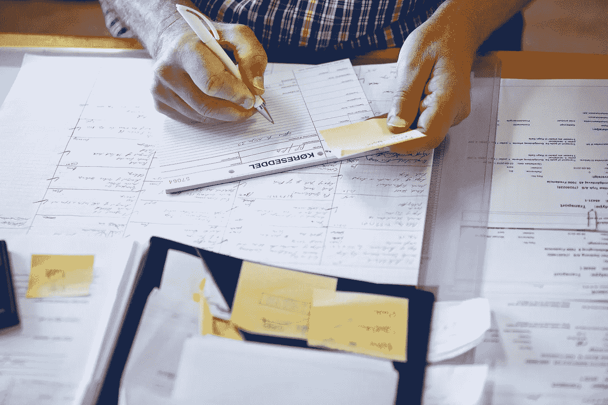
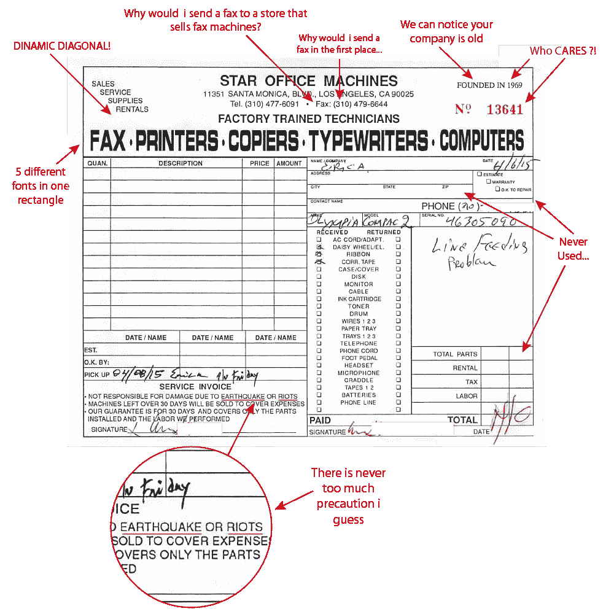
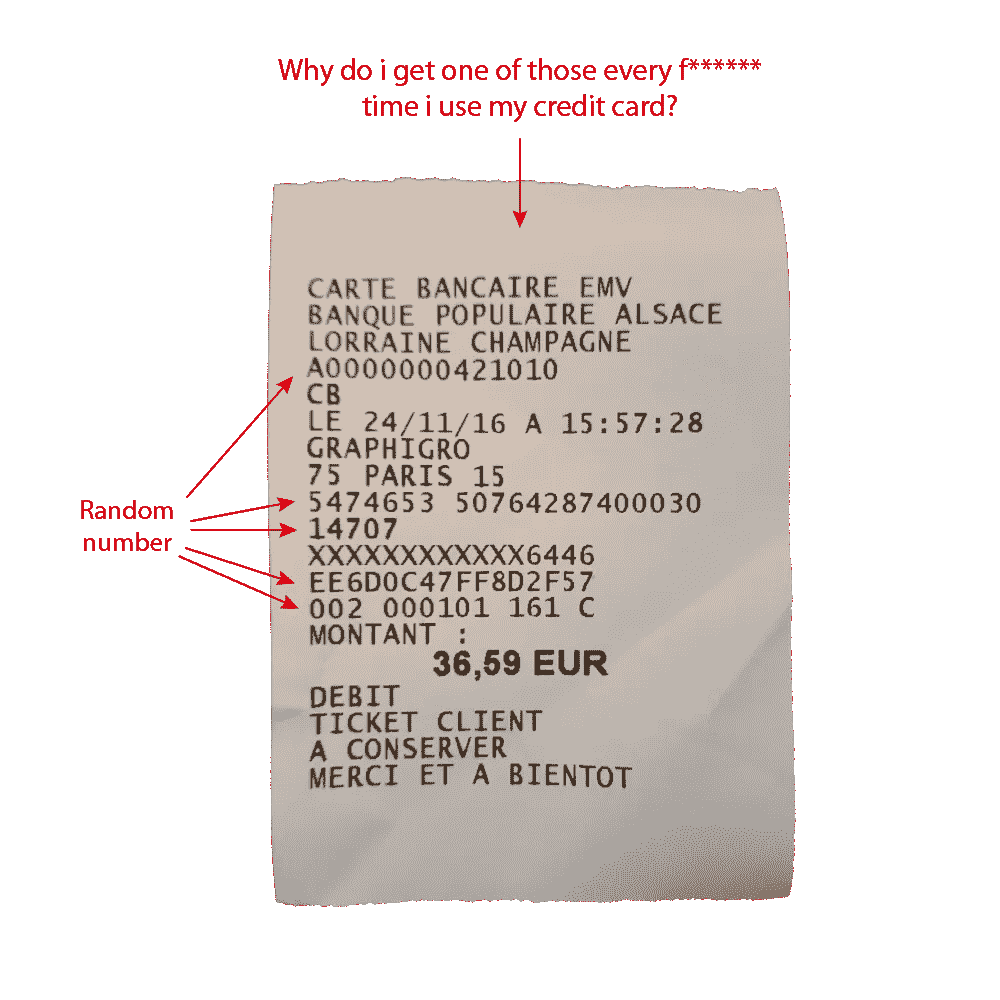
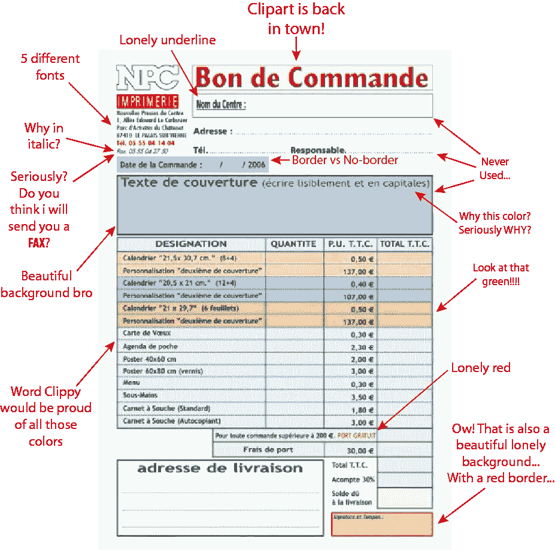

# 日常用品的糟糕设计——第一——发票

> 原文：<https://medium.com/swlh/the-bad-design-of-everyday-things-1-invoices-b18531dbf465>

受到令人敬畏的播客 [99%不可见](http://99percentinvisible.org/)和[麦克豪宅地狱](http://www.mcmansionhell.com/)的搞笑帖子的启发，我决定开始我自己的一系列糟糕设计的物体和地方。让我很困扰的产品。因为让我一个人受苦是不公平的，所以我邀请你一起受苦。

我们都知道有一大堆东西根本不能按照它们应该的方式工作。不符合人体工程学的劣质产品，或者尺寸刚好不适合你的腿但仍然会让你背痛的糟糕的汽车驾驶舱，我们甚至没有开始谈论飞机内部或银行机构的等候室。

好吧，我不是产品设计方面的专家，但如果我卑微的知识足以注意到有些不对劲，也许我并不孤单。让我们开始吧，对于这个第一版，我将从**发票**开始。

发票是一个非常有趣的东西。它代表了商店、顾客和税务部门之间的财政承诺。但同时也代表了一段关系的结束。商店与顾客建立的关系从非常诱人的广告开始，以性感的展示和包装发展到高潮，在结账时结束。然后他们递给我们那张发票。

就像性爱会议一样，被引诱到这个不可思议的时刻，以我们的伴侣转身离去而结束，感觉有点冒犯。真的吗？在所有这些设计精美的包装和视觉形象之后，你给我这个？

即使他们的产品变成垃圾，我还保留了多少包装？只是因为它们设计得很漂亮，我不能把它们扔掉。也许是时候重新考虑一下**发票了。也许我们与商店的关系不必就此结束。**

喜欢吗？在推特[上关注我](https://twitter.com/fafaschiavo)，这样你就能收到每一篇新帖子！ **@fafaschiavo**