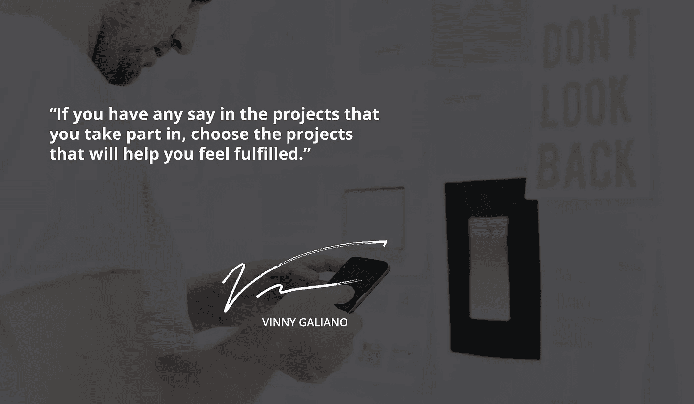

# 过度工作和充实的职业生涯之间的平衡

> 原文：<https://medium.com/swlh/the-balance-between-overworked-and-a-fulfilling-career-a1ac25efc760>

平衡通常被认为是生活的关键，无论是你吃的食物，你如何度过你的时间，以及你每天所做的选择。你的职业生涯也包括在内，因为大多数人都在寻找一种平衡，在这种平衡中，他们对每天所做的事情感到满足，而不会像过度劳累的人那样感受到持续的压力。这可能是一个很难平衡的尺度，但是如果你能够每天带着成就感和满足感离开工作，而不是沉在永无止境的工作弹幕下，你就处于一个令人满意的职业生涯中。

当然，这听起来很好，但实际上实现不会一蹴而就，甚至可能需要一点经典的反复试验。那么，一个人如何找到这个甜蜜点呢？在这个甜蜜点上，时间过得很快，而且不会因为过度工作的压力而减少十年的寿命。

**找到一个有发展空间的工作场所**

有些职业和工作场所给你的灵活性空间很小，如果你想掌控自己的工作场所，那么找到一个能提供成长空间的地方是至关重要的。如果你选择为一家小公司工作，你可能不会有太多的机会晋升到一个让你满意的职位。更大的公司可以有许多不同的角色和部门，给你机会从内部转移到一个能让你感到满意的地方。

这并不是说小工作场所不会给你成长的机会或找到你的利基，但当有成长空间时，成长就容易得多。当你在寻找一个地方开始一个充实的职业生涯时，记住你的目标，帮助你找到合适的地方。

**控制自己的工作流程**

这并不总是可能的，但在某种程度上，尝试控制你自己的工作流程。如果你是负责人，你可以决定你想承担什么工作和任务。当接受一项任务时，为你自己和任何将与你一起参与一个项目的人设定合理而现实的截止日期。如果你从一开始就开诚布公，那么在最后期限之前，你会有很多压力。

太多的人对工作流程以及他们能多快生产出最终产品不切实际。有很多压力伴随着几乎不可能完成的最后期限，无论是内部还是外部。没有人想告诉客户他们的项目会延期。很有可能，他们也必须与那些和他们一起工作的人交流。保持对工作流程的控制，你的截止日期将保持现实。

**学习如何对某些任务说不**

虽然这类似于控制你的工作流程，但有时，不幸的是，你必须学会对某些任务说不。如果你经常超负荷工作，以满足同事给你设定的不切实际的最后期限，他们会逐渐习惯你扭转局面的能力。如果他们知道到了紧要关头，你会比他们更有压力，他们就不会控制自己。

如果你对拒绝某些任务感到不舒服，不要害怕提供一个替代方案。如果有人要求你在一个不切实际的时间框架内完成一项工作，提出一个还价。问他们是否可以提前一天或一周把任务交给你，或者你是否可以延长截止日期以适应你的日程安排。有时人们很难听到，但是如果他们意识到他们糟糕的计划会给他们带来负面影响，他们可能会改变他们的习惯。

需要时寻求帮助，接受帮助

太多的人认为需要帮助是一种弱点。它不是。你的同事可能会按照不同的时间表为你工作，他们愿意花一点时间来帮助你。也许他们不会那么容易感到压力，或者也许他们更愿意在一个大项目中分而治之。不管是什么情况，如果人们愿意帮忙，就让他们帮吧。你会觉得不那么不知所措，你甚至可以帮助他们在工作中感到充实，这听起来很像一个双赢的局面。

这种方法既适用于暂时不知所措的时候，也适用于长期。如果你已经做了两个人的工作一年了，雇佣一个帮手来承担你的一些琐碎工作可能不会有什么坏处。如果没有人知道你工作过度，他们就无法帮助你。

**承担你热爱的项目**

如果你对你参加的项目有任何发言权，选择那些会让你有成就感的项目。当有选择的时候，做你喜欢的事情和你有激情的事情才是合理的。甚至不一定要充满激情；可以是你感兴趣的东西，也可以是你想了解更多的东西。你能做的事情越多，在一天工作结束时你会感觉越好。即使你最终感觉工作过度，做一些有成就感的事情可以平衡这种感觉，让一切都变得值得。

最终，找到平衡会让你保持低压力，并为完成一整天的工作提供一种自豪感。一天一事无成真的不值得花时间，但是如果你能忙到让自己有成就感，没有过度工作的压力，你就找到了职业生涯的金鹅。

## 查看 vinnygaliano.com 的[原文！](http://vinnygaliano.com/blog/the-balance-between-overworked-and-a-fulfilling-career)

## 关于作者

我是来自纽约的企业家、商业顾问、投资者和开发商。我创造品牌&帮助别人建立他们的品牌。你可以在 [Twitter](http://twitter.com/vinnygaliano) 或者 [Instagram](http://instagram.com/vinnygaliano) 上和我联系。

[注册我的周一早间简讯！](http://vinnygaliano.com)

## 如果你喜欢这篇文章，请推荐给其他人看！

## 这篇文章发表在 [The Startup](https://medium.com/swlh) 上，这是 Medium 最大的创业刊物，有 325，521+人关注。

## 订阅接收[我们的头条新闻](http://growthsupply.com/the-startup-newsletter/)。

