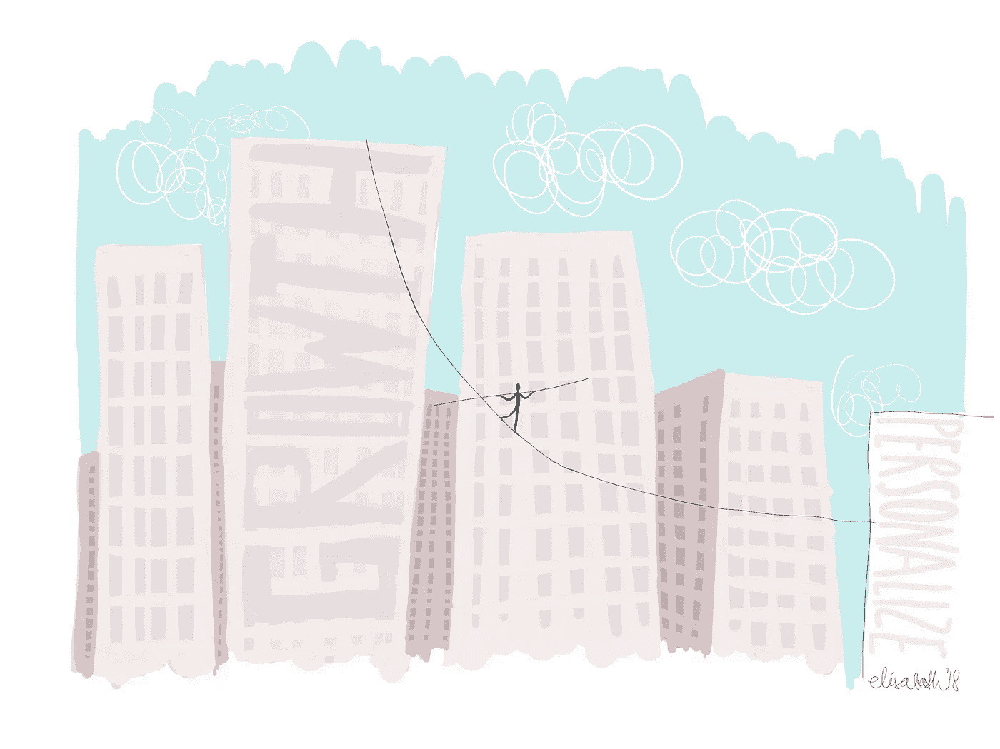

# 走钢丝领导的平衡之举

> 原文：<https://medium.com/swlh/the-balancing-act-of-tightrope-leadership-ce6df3d2b954>

阿尔伯特·爱因斯坦曾经说过:“我们无法用创造问题的思维水平来解决问题。”他是对的！我们生活在一个追求结果的压力与日俱增的社会中。当今世界的领导者每天都在重新定义商业平衡。能够预测和适应市场的速度需要一种不同于以往的领导力，它需要“走钢丝的领导力”。虽然有效实施众所周知的战略曾经奏效，但我们现在必须在各个层面上不断创新。当你的想法或产品还在开发阶段，你的竞争对手就在不断地破坏你。我们似乎发现自己在适应市场速度和不断交付高质量、个性化的产品之间不断走钢丝。

在今天的商业中，最大的挑战就是平衡。在短期内成功发展您的公司，同时创造长期优势，使您的努力可持续发展的平衡。让事情变得复杂的是，你必须在一个模糊的环境中工作，在这个环境中你有绝对的责任，但控制能力却有问题。

即使在 10 级风的情况下，你也必须始终保持顺风。即使你找到了一个平衡点，你也不能原地踏步，作为一个企业你必须一直向前！我们倾向于感觉到改变的需要，但是经常害怕用成长的心态来处理这个问题。

你会问成长心态？我说的是一种心态，在这种心态下，你相信变化，理解大局，做出一致的决定。在那里你敢于志存高远，超越自己的认知。你感到恐惧，但还是去做了。你需要掌握我所说的“走钢丝领导力”。这个原则让你利用“悖论桥接”的力量来充分发挥你的潜力。只有使用创造性的成长思维，你才能在现实和未来之间架起一座坚固的桥梁…

## 这篇文章发表在《初创企业》杂志上，这是 Medium 最大的创业刊物，有 343，876 人关注。

## 订阅接收[我们的头条新闻](http://growthsupply.com/the-startup-newsletter/)。

