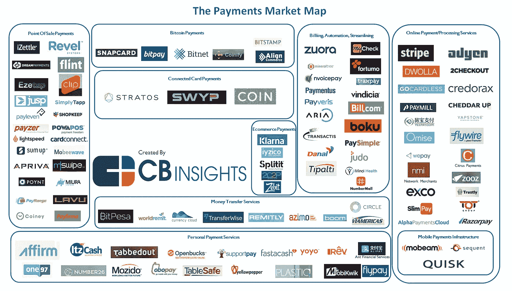
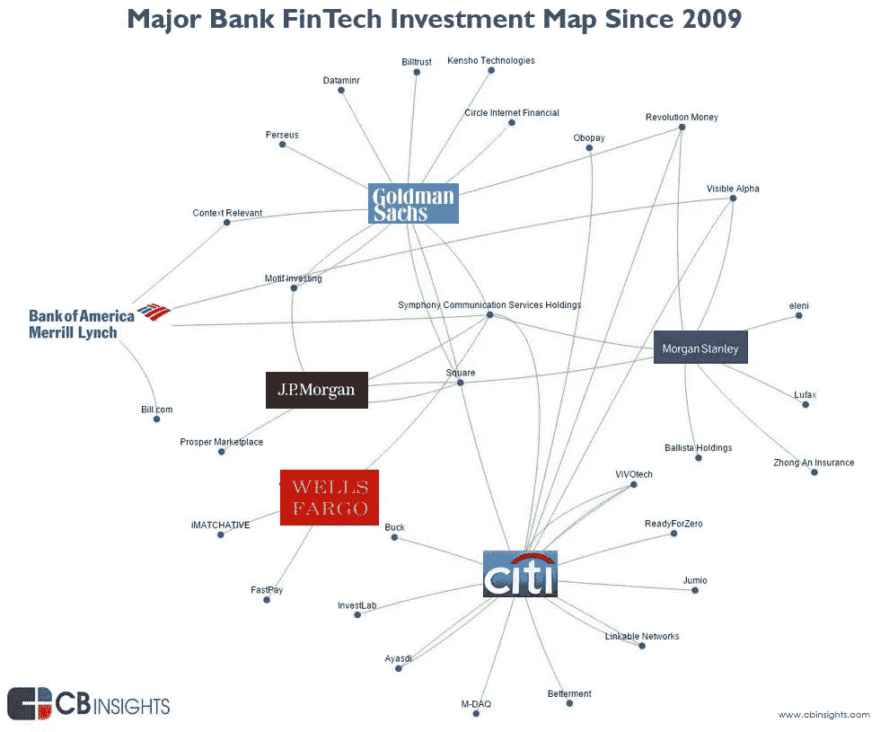

# 支付行业初创企业和现有企业之间的战争

> 原文：<https://medium.com/swlh/the-battle-between-startups-and-incumbents-in-the-payments-industry-618a626825ab>

经典的创新与分销故事

Will Bitcoin be the future of Payments?

直到 20 世纪 90 年代中期，支付领域几乎没有创新。从古代开始，金属被用作一种价值手段来鼓励互不相识的个人之间的交易，我们已经看到货币的演变只迈出了很小的步伐。从金属到纸张，再到塑料，现在我们处于一个数字世界，在这个世界中，受监管的货币只不过是大型金融机构总账中的零和一，或者是使用区块链技术取代这些金融机构的加密货币的兴起。然而，这不是一篇我想讨论加密货币的帖子，而是支付行业正在进行的一场战争，这场战争旨在主导接受和处理受监管货币和商业的数字世界。

## **互联网改变了一切**

从纸张到塑料的转变让人们花了很长时间来适应，至少三十年，互联网，尤其是电子商务再次改变了我们的支付方式。大多数在线交易仍然涉及信用卡/借记卡，您需要输入 PAN(主要账号，也称为支付卡号或卡号)、CVC(卡验证码，也称为卡验证值)和卡到期日期，但随着我们越来越习惯于使用建立在当前技术(银行转账、信用卡)基础上的支付功能(PayPal、ApplePay、WePay ),将会有进一步的发展，通过使用改善结账过程的服务(通过用户名和密码、两步验证)来取代卡

## **支付行业的历史**

正如任何新技术一样，总会有新公司想要利用新技术取代现有公司。在支付领域，尤其是在线支付领域，过去二十年来，我们已经看到了挑战现状的新技术的兴起，我们终于认识到替代支付方式的数量正在产生重大影响。

传统银行的主要收入来源是提供存放现金和银行账户的基础设施，而塑料的引入导致新公司能够接受主要通过 Diners/Discover、American Express、Visa 和 Mastercard 处理的销售点交易。POS 技术背后的收单银行主要由传统银行所有，包括富国银行、美国银行和花旗银行。随着塑料市场的增长，新的收购者出现了，他们只专注于提供收购服务。

电子商务的引入导致新公司抓住机会创建一种新型公司，即在线支付服务提供商，并与现有的收单银行进行整合。随着互联网的快速发展，电子商务支出也紧随其后，这使得这些新的在线 PSP 非常有利可图，导致其中一些人冒险拥有更多的支付堆栈。新的支付公司将为电子商务公司提供整合其服务的能力，并在此基础上增加收单服务，减少碎片化并改善整体性能、定价和功能。

正如一个行业的任何变化一样，在位者很少关注新技术，直到他们收到投资者提出的令人不安的问题，不得不开始关注。大型金融机构认识到支付可能非常有利可图，并拥有资金，他们正迅速试图通过收购支付公司或成立能够为其商户组合提供支付处理能力的新公司来占领市场份额。

## **初创公司构建支付功能与初创公司构建支付管道**

不仅银行意识到支付是一个非常有趣的行业，年轻企业家或经验丰富的专业人士创建的新创业公司也意识到支付行业的低效率。这导致了两种不同类型的公司被创建，专注于建立“支付功能”的初创公司和专注于建立“支付管道”的初创公司。

建立 ***支付功能*** 的初创公司，是一家利用当前基础设施，发现利用商家支付产生的数据的低效或机会的公司。像 Square、iZettle 或 Revel 这样的销售点公司，像 Transferwise、WorldRemit 或 CurrencyCloud 这样的汇款服务，像 Zuora、[Bill.com](http://Bill.com)或 Judo Payments 这样的自动结算公司，或者像 ApplePay、AndroidPay 或 SamsungPay 这样最知名的公司，都是通过在传统的卡和银行转账支付基础设施上进行开发来提供服务，为其客户提供价值的公司。

另一边是公司，他们提供 ***支付管道*** 。一家支付管道公司，是一家与卡方案和替代支付方法有直接关系的公司，它建立了大多数支付功能所依赖的处理能力。因为整合万事达卡、维萨卡、美国运通或 200 多种替代支付方式中的任何一种都需要大量的投资和资源，这绝非易事。这样的公司有，Stripe，Adyen 和 Checkout.com 的。在过去的五到十年中，他们构建了分散支付体系的各个部分，现在提供了完整的支付解决方案，包括网关、收单处理、欺诈防范、计费和数据分析。另一个有趣的发展是 Dimebox，一家全栈支付处理公司，它建立了支付管道并将其作为平台即服务出售给新的 PSP 和收购者，他们希望通过内包技术来缩短上市时间。

## **现任者创新与现任者利用资产和内包**

另一方面，美国银行(Bank of America)、富国银行(Wells Fargo)和花旗银行(Citi)等现有银行正在改变一些战略，从核心银行业务转向构建 360 度金融服务，包括一个商户服务部门，该部门能够为目前正在处理其他公司支付业务的大型商户组合提供服务。

由于支付从来都不是核心业务，许多大型企业已经将网关和处理能力外包给 First Data 的 Omni-Pay 或 Pay-On 等公司。现在，他们想要与 Stripe 和 Adyen 等初创公司竞争，他们正在经历由于这些支付处理器所基于的传统技术而带来的困难。这创造了一个有趣的动态，因为他们现在被迫审查旧系统并重新设计他们的流程，以提供与新竞争对手相同的全渠道支付能力。这导致了像美国银行、富国银行和花旗银行这样的银行对冲他们的赌注，通过投资那些在未来将成为伟大的收购候选人的初创公司，Square、[Bill.com](http://Bill.com)和 Transactis，同时与 Dimebox 这样的公司合作提供竞争服务。

## **创业公司还是现任，谁会赢？**

这将是非常有趣的，看看这将如何在未来几年发挥出来。随着支付越来越成为在线公司的战略资产。Stripe、Adyen 和[Checkout.com](http://Checkout.com)等公司认识到，建立一家伟大的支付公司所需的专业知识，以及拥有利用它所需的管道的必要性，将使他们能够创造唯一的真实来源(支付)，这是在此基础上建立所有其他服务所必需的，包括会计、银行、汇款、报税、保理和计费。他们还明白，随着支付变得越来越多样化，不仅包括信用卡，在亚洲、南美或非洲等当地地区也有替代支付方式，帮助商家增加收入的能力变得更加重要，以区别于现有商家，后者需要大量资金来支持其营销和投资。

另一方面，大多数大型银行在一些最困难的经济体中存在了数百年的原因是，它们有能力应对新的监管和政策，也有能力获得对它们威胁最大的东西。随着支付的不断商品化，竞争的加剧导致成本利润率大幅下降，银行将处于理想的位置，以亏损领导者的身份出售支付，并出售其他银行服务来弥补亏损。

## 感谢阅读；)，如果你喜欢它，请点击下面的掌声按钮，这对我意义重大，也有助于其他人了解这个故事。通过在[推特](https://twitter.com/dwaynegefferie)或 [Linkedin](https://www.linkedin.com/in/dwaynegefferie/) 上联系让我知道你的想法。或者关注我，阅读我关于数据科学、支付和产品管理的每周帖子。

## 这篇文章发表在 [The Startup](https://medium.com/swlh) 上，这是 Medium 最大的创业刊物，有 308，589 人关注。

## 订阅接收[我们的头条新闻](http://growthsupply.com/the-startup-newsletter/)。

