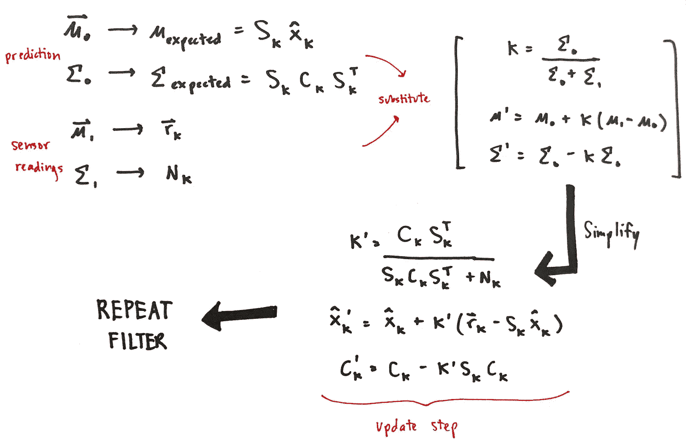

# 美女与卡尔曼滤波器

> 原文：<https://medium.com/swlh/the-beauty-and-the-kalman-filter-397143589985>

## 工程巨兽

如果你像我一样，你可能会经历这样的阶段，你会突然对某个特定的话题着迷，或者对某个主题着迷。

你想做的就是阅读关于 ket 和 bras 和 ket-bras 和 brackets，所有量子物理学的有趣词汇。或者，web 开发突然成了您的新宠，W3Schools 现在是您访问量最大的页面。

然而，我不会称它们为阶段，而是被写入我们知识文库的章节。因为尽管它们可能转瞬即逝，但它们现在已经改变了我们对新旧信息的感知方式。

最近在我实习的时候，我偶然发现了一个*非常*酷*非常*复杂的工程话题。看到它的应用范围和力量，我忍不住拿起笔开始新的篇章。

有趣的是，除了卡尔曼滤波器本身，它还涉及到广泛的受众。

在科学和工程领域，有些人听说过这个概念，但不太清楚它到底是什么。有些科学家和工程师见过并应用过卡尔曼滤波器，非常熟悉它的深层理论基础。也有科学家和工程师不知道它的存在。

对于那些可能从来没有真正需要实现卡尔曼滤波器或不知道它是什么的人来说，这仍然是一个非常有趣的话题，可以让你更接近理解那些花哨的自动车辆是如何工作的。

但是，不管你的背景如何，你应该深入了解卡尔曼滤波器的最重要的原因就是它很酷。

# 那么卡尔曼滤波器到底是什么？

如果你谷歌一下卡尔曼滤波器是什么，你会看到很多很多试图用“直观”的方式解释它的论文、演示和文章。然而，这些来源的一个共同趋势是，数学变得令人讨厌和不可避免。

但是，我相信，通过保持一个高层次的视角，用数学来提醒物理意义，混乱的数学层可以被抽象出来。

> 本质上，卡尔曼滤波器是一种算法，它利用系统的所有已知信息，对系统的未来状态做出**最佳猜测**。

这是一个非常笼统的说法，希望随着我们在这一过程中的进展，这一说法会有更多的含义。

## 关于过滤器的一些要点

*   最优(数学证明…你可以相信或理解它最小化估计值和实际值之间的均方误差)
*   递归(将最后一组结果作为下一次计算的输入)
*   内存灯亮(仅保存最近即时状态的数据)
*   快速(实时系统实施)

## 我们系统的定义

把我们的系统想象成一个流浪的孩子，我们试图猜测他/她下一步会去哪里。我们为这个系统建立的**模型**(很可能不完全准确)可能是一个典型的 7 岁孩子的思维框架。儿童的进化/成熟状态和古怪行为导致了系统的动态性和不确定性。

一个更受欢迎的实现系统将是在伯克利街道上漫游送餐的小 T2 猕猴桃机器人。我们想知道机器人的下一个位置和状态，以确保它自己导航到正确的地方和客户。

更酷的例子是美国国家航空航天局的应用:漫游者在太空中的自主运动或对飞机的监控。

*系统属性:*

*   线性的
*   动态的
*   具有不确定性
*   选择的模型(例如:运动学方程。在物理学中，7 岁的心智框架)

## 其他常用过滤器

卡尔曼滤波器也是其他滤波器的基础(没有林。alg。一语双关)。还有其他过滤器从它螺旋上升，如…

*   **扩展卡尔曼滤波器(EKF)** -用于非线性系统
*   **无迹卡尔曼滤波器(UKF)** -针对高度非线性系统的扩展改进

## 开始前停下来欣赏线性代数

向量和矩阵功能强大，因为它们能够以一种紧凑的方式保存关于系统的信息。这些表示使得对数据进行数学运算变得容易。

# 意识:存在两个数据集

有两个数据仓库*我们最终会合并。每个都有自己包含物理意义的均值向量和协方差矩阵。*

1.  **预测-** 根据我们系统的选定模型进行计算

例如:基于物理学的运动学方程

*   **均值向量**:包含我们关心测量的系统变量(例如:位置、动量)，变量为高斯分布
*   **协方差矩阵**:描述变量之间的相关性

**2。传感器读数-** 从我们的传感器获取实时数据

例如:儿童或机器人上的 GPS 追踪器

*   **均值向量:**传感器变量的读数
*   **协方差矩阵:**包含传感器的*噪声*

> 预测+传感器数据=最佳猜测

# 数学工具

包括上面讨论的均值向量和协方差矩阵，这些是我们在开始之前需要的向量和矩阵:

me and Word

## 可视化平均向量..

等高线图表明变量不仅仅是点估计，而是高斯分布。

## 了解协方差矩阵..

*属性*:对称

对角线元素:差异

非对角元素:协方差

# 该算法

1.  预测

## 林。alg。复习(对于第二个等式。)

d:沿对角线的特征值

p:它的列是属于矩阵 D 的相应列的特征值的特征向量

2.正确的预测

3.转换校正预测(使用与传感器相同的语言)

4.拉进传感器读数

5.合并数据集/高斯分布

6.找到**卡尔曼增益**

**卡尔曼增益** -基本上你需要改变你的估计 aka 多少。需要做多少更新

7.更新-获得新的均值向量和协方差矩阵

# **综上所述，**

1.  预测
2.  正确的预测
3.  变换校正预测
4.  拉进传感器读数
5.  合并数据集/高斯分布
6.  找到**卡尔曼增益**
7.  更新

希望通过这篇文章，你能够对卡尔曼滤波器有一个直观的了解。

最优性的推导和证明可以留给那些求知欲强的人和一些谷歌搜索。也许这就是那些在咖啡馆黑暗角落里的人在做的事情…

# 一些有用的资源

[在线非线性/非高斯贝叶斯跟踪的粒子滤波器指南](http://www.irisa.fr/aspi/legland/ref/arulampalam02a.pdf)

[卡尔曼滤波器如何工作，见图片](http://www.bzarg.com/p/how-a-kalman-filter-works-in-pictures/)

## 这个故事发表在 [The Startup](https://medium.com/swlh) 上，这是 Medium 最大的企业家出版物，拥有 343，876+人。

## 在此订阅接收[我们的头条新闻](http://growthsupply.com/the-startup-newsletter/)。

