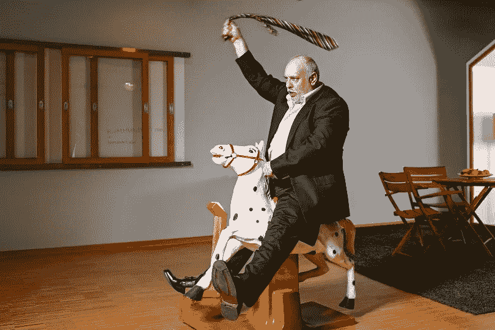

# 不在乎同时掌控自己生活的美妙之处在于

> 原文：<https://medium.com/swlh/the-beauty-that-lies-in-not-giving-a-fuck-and-simultaneously-mastering-your-life-4268c3aa1484>

Image Credit: [Beeld © EPA](https://www.rtlnieuws.nl/buitenland/artikel/2119251/kiev-staat-weer-een-roerige-dag-te-wachten)

我们周围发生了太多无聊的事情。

有一天，我和一个女孩聊天，她真的情绪崩溃了，因为她每天都在 Twitter 上阅读美国政治。

她对所有的事情都很生气，而且不准备做任何事情。另一个国家的问题毁了她的一天。

接下来的部分让我震惊:第二周她就辞职了。

她为政治付出了太多，这实际上破坏了她的生活，让她相信这个世界真的很糟糕。

不是的。这个世界是一个非常美好的地方。这是生活的最好时机。

# 精通在于少管闲事。

我也曾经什么都不在乎。

如果有人偷了我的车位，我会很生气。如果我看到公共交通检票员，我会骂他们。如果我的衣服没干好，我会发疯的。

有一天我坐下来，心想*“这一切意味着什么？把我的衣服晾干真的能改变世界，创造世界和平吗？我漂亮的干衣服能让世界摆脱癌症吗？”*

显然不是。

Image Credit: Getty Images

## 所以，我什么都不在乎了。我做了以下工作:

1.无耻地向大家承认我的错误

2.不管人们如何评价我，我分享了精神疾病的战斗伤疤

3.认为金钱比其他一切都重要

4.休息了一段时间，度过了一个假期

令人震惊的是变化不大。人们(不太)评价我。

> 去了欧洲，抽出时间，我的世界并没有崩塌。

我不是因为新的金钱观突然变穷的。如果说有什么不同的话，那就是我变得更富有、更快乐、更脆弱，对别人的评价更少了，也更清楚自己需要努力的方向。

不在乎帮助我掌握了我一开始太在乎的东西。

# **关心生活中的每一件小事都是浪费你的宝贵时间。**

你想要终极生产力黑客？很简单:不要对任何事都漠不关心。

给一个他妈的吸干你的宝贵时间，它充满了你的头脑与精神垃圾，很难清除。

花时间去关心你为什么不帮助别人。

花时间去尝试解决现实世界的问题，而不是抱怨它们(这个世界不需要更多的抱怨者…谢谢！)

你浪费时间去关心为什么你的白色内衣因为你用你的红色套头衫洗过而有点发白，这些时间可以用来帮助人们了解你是如何掌握销售的。或者开了一家公司。或者战胜了癌症。

我希望你能有所作为，因为那会让你的生活变得有价值。这就是你如何活到 80 岁，坐在疗养院里，手臂上打着点滴，即将进入死亡之地，而不会有无数的后悔刺在你的脸上，让你觉得你没有真正活过。

> “把钱存起来，用你省下来的时间去旅行，生孩子，和你生命中的爱人结婚，给你的父母买房子，或者通过你创造的事业改变世界”

# 变得不可战胜。

这就是我想说的，朋友。

不可战胜是保护你的思想不受无关紧要的事情的影响，这样你就可以保留精力。

> 变得不可战胜是建立韧性，不让外部世界污染你的内心世界。

Image Credit: Atlantic / [R. KIKUO JOHNSON](https://www.rkikuojohnson.com/)

这是关于你创造你想要的生活，而不是让性交像雪崩一样堆积在你身上。

# **一点都不在乎导致不行**

所有的播客采访者都会因为这个讨厌我。

不在乎意味着对播客采访、咖啡说不，加入我的标签活动，为我自己出版的书写推荐，来看我在你从未听说过的 X 大会上发言…等等，等等。

当你看到不在乎的好处时，你会发现十倍——一百万倍——更容易对不重要的事情说不。

你全力以赴，为你的目标而努力，因为你在努力做一些对你来说有意义、有成就感的事情。

> “不在乎，你就不会因为拒绝那些你日历上的事情而感到内疚”

我们都经历过。就像你答应去的那个研讨会，那是在三个月后，你现在发现它和你想预订的假期冲突了。

就我而言，我答应了一堆废话，然后在同一个月里搬家、换工作、去欧洲。

三个月前我答应的那些看起来“没什么大不了”的事情最终变成了一个巨大的负担，就像《宿醉》电影一样，只是查理·西恩扮演了主角，可乐而不是酒精作为庆祝活动的兴奋剂。

你自己的问题已经够多了。

没有空间去关心你遇到的每一个问题，因为你自己的问题已经够多了。

## 让我来列举一下这些问题，以防你忘记了:

*-你会有孩子吗？*

*-你会结婚吗？*

你会找到你梦想的工作吗？

你能负担得起一个离工作地点不超过 6 小时的家吗？

*-你会过健康的生活吗？*

*-你什么时候会死？*

你会留下什么样的遗产？

如果这还不足以整你，那我就不知道什么才是了。当你看那份名单的时候，已经没有太多的空间去在乎了。

这个列表也不是你独有的。埃隆·马斯克，你的朋友扎克，甚至比尔·盖茨男孩都有同样的名单。尽管他们有这么多钱，他们有同样的问题。

# **美就在于此。**

我说的一些话听起来可能非常自私。

我在所有这些事情中发现的美妙之处(你也会发现的)是，通过不在乎和处处自私，你实际上会变得更加慷慨，帮助更多的人。

这是反直觉的，这就是为什么它惊人的美丽。

专注、时间和影响力都有助于你帮助我们所有人。

对我们任何人都没有帮助的是，你像一个压力球一样走来走去，关心别人把车停在哪里，他们晚餐吃了什么，他们有多重，或者他们周五晚上穿什么去了俱乐部。

别在乎了。

Image Credit: Unsplash

在我们为自己创造的这个该死的给予生命的选择中看到美，并通过少关心不重要的事情来把自己从那个洞里挖出来。

# **诚实是关键。**

诚实是你自己的。

承认你给的太多了。没事的。

> **要足够脆弱和勇敢，去拥抱自你出生起就触手可及的非性交给予生命。**

掌控你的生活不仅仅是什么都不在乎，而是首先要对自己诚实，对你目前正在做的一切。

这是一种在没有人质疑自己的时候质疑自己的能力。

能够和自己进行这样艰难的对话:*“嘿，蒂姆，你表现得像个混蛋，太担心别人在做什么了。你自己在做什么，伙计？”*

这就是我和自己的对话，它把我从这个让我上瘾的该死的梦里唤醒。

Image Credit: [R. KIKUO JOHNSON](https://www.rkikuojohnson.com/)

# **欢呼大耳。**

为如此关心无关紧要的事情干杯。为你粉碎目标干杯。为你有时间做酷事干杯。

你是美丽的，不可征服的生活的主人。

停止这么多性交。

# 行动呼吁

如果你想提高你的工作效率，学习一些有价值的生活窍门，那就订阅我的私人邮件列表吧。你还将获得我的免费电子书，它将帮助你成为改变游戏规则的在线影响者。

[**点击这里马上订阅！**](http://timdenning.net/free-ebook)

## 这篇文章发表在 [The Startup](https://medium.com/swlh) 上，这是 Medium 最大的创业刊物，拥有+ 372，747 名读者。

## 在这里订阅接收[我们的头条新闻](http://growthsupply.com/the-startup-newsletter/)。

