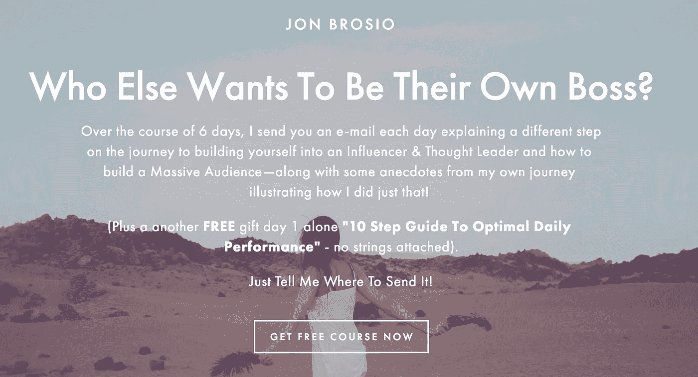
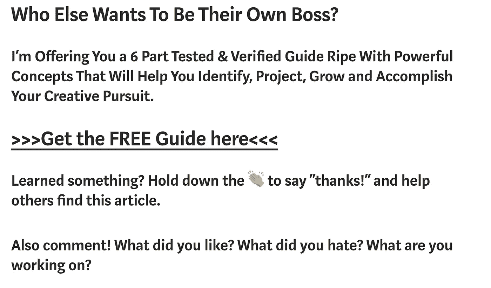
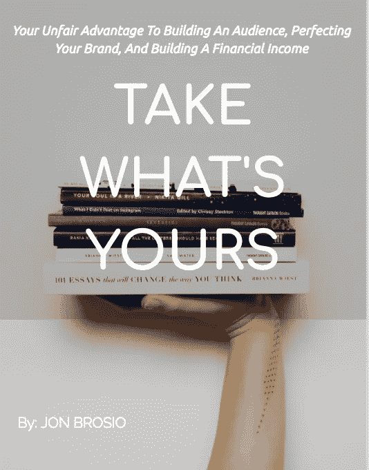
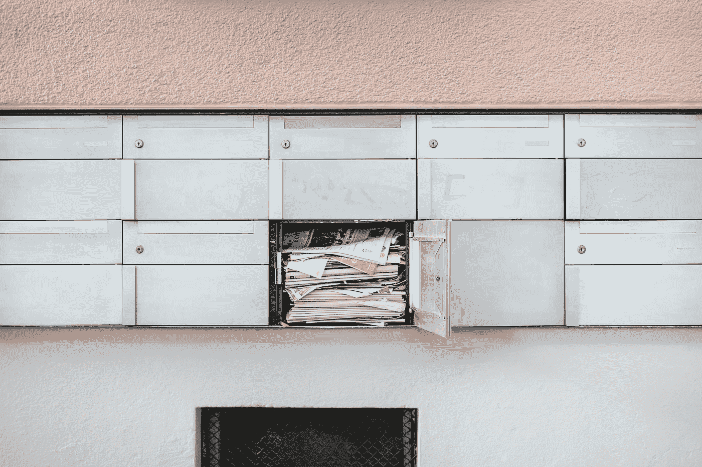

# 博客新手出售第一本电子书指南。

> 原文：<https://medium.com/swlh/the-beginner-bloggers-guide-to-selling-their-first-ebook-e42c14a9fda1>

## 技巧和策略，如果应用正确，可以转化为你自己的成功，通过写作赚到$美元

Photo by [Dmitry Ratushny](https://unsplash.com/photos/O33IVNPb0RI?utm_source=unsplash&utm_medium=referral&utm_content=creditCopyText) on [Unsplash](https://unsplash.com/search/photos/creative?utm_source=unsplash&utm_medium=referral&utm_content=creditCopyText)

我终于做到了…

我通过写博客卖电子书赚了第一笔 100 美元。

这个成就——虽然在很多人眼里可能很小，但在我看来却是巨大的。事情的真相是，你不知道为了让这一切发生，我经历了怎样的磕头、敲击键盘、撕扯拥抱。

但是我跑题了..

这与我为了让梦想成为现实而经历的精神和精神压力无关。

**这是关于分享我采取的策略、技术和步骤，你可以用它们来建立和实现你自己的梦想。**

我想让大家知道，虽然我完全相信，如果遵循这些策略，你可以和我一样成功——如果不是更多，但是，要达到这一点需要付出极大的努力。

*   你将需要做出许多你可能认为不需要做出的牺牲。
*   你将会度过很多孤独的时光。
*   你将研究博客的技术层面，这可能会让你头晕目眩。

然而，最终，这不仅仅是值得的——而是热爱这个过程。

下面是我通过写博客的经历问自己的各种问题。

我问这些问题是因为我发现自己处于十字路口，这让我在深层次上思考我在做什么——这真的是一个障碍的发现。

在提出这个问题并试图剖析它之后，我提供了一个我采取的**行动步骤**，你也可以采取这个步骤来将这个技术部分落实到位，以帮助提高你博客的盈利能力。

所以让我们开始吧…

# 你写博客到底是为了什么？

Photo by [Ashley Batz](https://unsplash.com/photos/betmVWGYcLY?utm_source=unsplash&utm_medium=referral&utm_content=creditCopyText) on [Unsplash](https://unsplash.com/search/photos/thinking?utm_source=unsplash&utm_medium=referral&utm_content=creditCopyText)

这是一个我刚开始写博客时从未问过自己的问题，自从我变得非常认真以来，我一遍又一遍地完善这个问题。

直接摘自我的博客:

> 我来这里有一个任务:
> 
> 帮助你不再满足于平庸的生活和职业，帮助你开始为你的梦想而行动

这一开始吓了我一跳——主要是因为我知道我是在自言自语…

我厌倦了我的工作。我没有从中找到太多的意义，也没有成就感。

所以我抓住了机会，开始在网上写作。

当我开始写作时，我写的都是一些有趣的想法和主意。然而，我意识到我没有给潜在的观众提供任何类型的价值。

> *这是在经济上实现你的博客的一个关键方面:* ***你提供了什么样的切实而有价值的信息？***

自从明白了这一点，我就努力写下并分享让自己在身体、心理和精神上变得更好的方法。此外，我在博客/写作(比如这篇文章)中加入了一些切实可行的技术方法来提高你的创业努力。

这是弄清楚你的电子书将要涵盖什么的重要的第一步。你可以涉足很多领域，分享你的专业知识:

*   你想教育人们如何用六块腹肌打造“希腊神”身材。
*   你是视频编辑方面的专家，想与 Youtube 上崭露头角的一代创作者分享你的方法。
*   你是饮食和营养方面的专家，想要分享旧石器时代或纯素食时代的激进食谱。

你可以选择的可能性和方向几乎是无穷无尽的。

## 行动步骤 1:考虑你的受众，以及你将为他们提供什么价值和行动步骤

从我自己的经历来看，我的电子书— [*《拿走你的:你的不公平优势来发展受众，完善你的品牌，并建立财务收入*](https://www.tribeloyal.com/take-whats-yours-store/) *，*是一个教练工具，以实现它所承诺的目标。

我知道我可以说明这一点并分享这类信息，因为我经历了这样做的挑战:

*   我在 3 个月的时间里让我的观众从 0 增长到超过 100 万。
*   在同一时期，我建立了一个超过 1100 名订户的电子邮件列表。
*   最后，我利用这些收获，将我的影响力和知识转化为财务收益。

对你来说，这也应该反映出你博客的首要使命或信息。如果你写的是关于构建和销售 iOS 应用程序的博客，然后你的电子书介绍了如何投资有股息收入的股票，那我就没有意义了。

# 你如何建立一个直接的沟通渠道来销售你的电子书？

Photo by [Willian Justen de Vasconcellos](https://unsplash.com/photos/0yQPd95ScSc?utm_source=unsplash&utm_medium=referral&utm_content=creditCopyText) on [Unsplash](https://unsplash.com/search/photos/kayak?utm_source=unsplash&utm_medium=referral&utm_content=creditCopyText)

这是问自己的一个重要问题。

你的沟通渠道在哪里？

你写博客的真相是你可能不为人知。没有人真正关心你的电子书，除非你首先向他们展示它的存在，其次你向你的读者传达了这本书的价值。

最好的方法是通过电子邮件订阅列表。

那么，如何着手做这件事呢？

如果你只是谷歌一下，有很多关于如何建立邮件列表的信息(如果你需要更深入的阅读)。

我做这件事的方法如下。

 [## 6 步课程，建立受众并获得财务收入

### 一个由实干家、思想家、创意者和坏蛋组成的社区。优化你的生活。利用黑客解锁生产力技巧…

www.tribeloyal.com](https://www.tribeloyal.com/free-6-step-course) 

(screenshot of the above link)

花点时间盘点一下这个登录页面上发生了什么…

首先，我为潜在的观众成员提供了一个明确的激励来注册——我让他们知道他们应该注册的免费和有价值的理由(我的 6 天迷你课程和免费的 10 步指南)。

我经常通过电话和电子邮件指导人们，以至于他们需要将注册从“加入我的时事通讯并接收引人注目的内容”(或类似的东西)改为“注册并获得我的免费(用有价值的赠品填充空白)。”

这对你成功建立电子书市场至关重要。

电子邮件列表是联系潜在受众的直接沟通渠道，您可以利用自己的专业知识提供帮助。

如果人们被迫加入这个课程，他们会被添加到我的 Mailchimp 列表中(我推荐使用 Mailchimp，因为它在你的前 2k 订户之前是免费的)。

## 行动步骤 2:使用免费服务建立您的登录页面

在这里，建立一些有价值的东西以及实现你的任何承诺是非常重要的。

**如果你打算长期参与博客游戏，任何欺骗未来读者的行为都会导致你灾难性的灭亡。人们在一英里外就能嗅出骗局。**

你在这个游戏中是为了帮助别人——所以要经历这一切。

[Mailchimp 提供免费的登陆页面构建](https://mailchimp.com/features/marketing-automation/)。它们使用起来相对简单，Mailchimp 提供了丰富的指南来改变格式、构建等。(不，我在这里没有任何附属业务——我真的袖手旁观他们做什么，他们如何帮助我)。

# 我如何“漏斗”并让潜在观众成为实际观众？

Photo by [Cédric Servay](https://unsplash.com/photos/ULKzOZ4I5IM?utm_source=unsplash&utm_medium=referral&utm_content=creditCopyText) on [Unsplash](https://unsplash.com/search/photos/funnel?utm_source=unsplash&utm_medium=referral&utm_content=creditCopyText)

当谈到在线商务和博客时，我不能 100%肯定 Russel Brunson 是否创造了“漏斗”一词，但就本文而言，我要给他荣誉。

上面列出的教训和行动要点对于让人们出现在你的列表上是很重要的，但是让我们先退一步，考虑一下如何让人们出现在你的实际登录页面上…

通过你的博客，不断地发布有价值的内容，你应该会得到一些曝光。曝光率很高——事实上，当你试图在最初阶段让自己出名时，曝光率是最重要的。

**当你获得曝光率(此时主要是浏览量)时，如果你不能通过某人的电子邮件吸引受众，你就在你的销售渠道中极大地浪费了潜在的未来销售。**

在这种情况下，无论文章是写在你的博客、媒体、Quora 或任何其他出版物上(如果出版物允许的话)，都有必要在文章底部应用“行动号召”。

以我的 CTA 为例(下面是截图，实际的 CTA 在我页面的底部。

(Scroll to bottom and see how link goes to landing page)

**我们来扒开这到底是怎么回事:**

实际的 *CTA* 是被提出的问题:*“还有谁想自己当老板？”*我现在想做的是引起某人的好奇心，让他点击进入我的登陆页面。

**现在，我完全支持我目前在市场上推出的产品。我完全相信我花在写作和传递有价值内容上的时间应该得到补偿——你也应该得到补偿。**

最后两段是为了与我的文章产生对话——这也是我坚信的事情。这篇博客是关于社区的。我什么都不是，但是在一起，我们都很重要。这对于销售电子书来说是不可或缺的。

**行动步骤 3:撰写一份有说服力的 CTA。**

考虑你的定位——你打算向你的观众展示什么样的吸引力？

*   如果你在健康和健身领域，你有一个鲜为人知的秘密锻炼方法，可以比传统方法更快地帮助减肥/增肌吗？
*   如果你在进行人际关系辅导，你有心理和人际关系工具来帮助你的听众在他们的人际关系中繁荣昌盛吗？

这将会出现在你文章的末尾，你将会嵌入你的 Mailchimp 登陆页面的链接。通过各种常见问题和培训模块，您将看到您的电子邮件如何被添加到您的 Mailchimp 中的各种列表中(**所有这些可能会有点让人不知所措，如果是这样，请随时直接联系我**

# 所以我的邮件列表越来越多…现在呢？

Photo by [Riccardo Annandale](https://unsplash.com/photos/7e2pe9wjL9M?utm_source=unsplash&utm_medium=referral&utm_content=creditCopyText) on [Unsplash](https://unsplash.com/search/photos/lightbulb?utm_source=unsplash&utm_medium=referral&utm_content=creditCopyText)

当我第一次开始增加我的邮件列表时，我非常兴奋，但同时也非常害怕。

当我开始与这些新观众交流时，我不知道我应该做什么。

我不断地进入我的脑海，一遍又一遍地写电子邮件。

我担心我会显得很愚蠢，被认为是一个骗子(我的感觉是，这些追随者可能会看到我可能是在我的头上)。

所以我开始和这些人交谈。

我开始让他们知道我在写什么类型的文章，我对什么样的想法感到兴奋。

我发了这些新文章的链接。

我问了一些问题，关于观众在努力奋斗什么。

通过这些问题，我与人们进行了大量的直接交流，了解了他们遇到的困难和成功。

> 在我看来，博客是关于关系的。是关于社区的。这是为了确保每个人都站起来，实现他们设定的目标。

这个对话让那些在我身上冒险的人知道我到底是谁。他们如此慷慨地让我进入他们的世界，帮助他们是我的责任，因为这是我的使命。

所以我就这么做了。

## 行动步骤 4:开始对话

当你开始建立你的邮件列表时，也要开始一段对话。

*   你是谁？
*   是什么原因让你开始写作，开始写博客？
*   你的博客的使命是什么(有时人们偶然发现你，但不太了解你)
*   你的兴趣是什么？
*   你在做什么？
*   你兴奋什么？
*   你在看什么书？
*   同样，向你的听众提出这些问题——这也是关于建立一个社区。

# 什么时候开始卖我的电子书比较合适？

Photo by [Sean Paul Kinnear](https://unsplash.com/photos/lspHbhJkQ30?utm_source=unsplash&utm_medium=referral&utm_content=creditCopyText) on [Unsplash](https://unsplash.com/search/photos/wristwatch?utm_source=unsplash&utm_medium=referral&utm_content=creditCopyText)

我一直认为，在制造和销售任何产品之前，我需要有大约 2 万名电子邮件订户。

我想，如果我没有一大群追随者的信任，没人会在我身上冒险。

然而这不是事实——我知道我的价值，也知道我能提供什么价值。

这应该是你的情况…

你是一个作家和博主，这里的部分业务是无情地写作。

永远不会有一个“正确”的时间来开始和完成你的电子书，并随后开始销售。

我发现，一旦你有了用 Word 或 GoogleDocs 编写的电子书，你可以在 [Fiverr](https://www.fiverr.com/) 上找人添加一些风格上的修饰。

**(Cover of my ebook that I designed using unsplash and GoogleSlides)**

经过大量的研究，我发现了如何通过谷歌幻灯片免费设置自己的风格(抱歉，我不会在这里包括如何做到这一点——深入的方式，并将在未来建立一个如何做到这一点的视频……敬请关注)。

你的电子书应该经过深思熟虑，并在解决特定问题时提供极高的价值。

这不能和你登陆页面上的赠品相比。

我自己的电子书花了几个月的时间来写作，并被重写了无数次(现在我有了一个反馈样本，我打算做一个修改，以增加更多的价值)。

在这一点上，从我自己的经验来看，我不能说什么*你*应该写你的电子书。在这个节骨眼上，你想分享的故事与*你有很大关系。*

你有一定的经验和技能可以贡献给这个世界。

当谈到你的电子书的结构、组成和内容时，你需要发现你到底要写什么。

## 行动步骤 5:写你的电子书

我知道我知道…这可能看起来过于简单。

我花了几个月的时间思考我要写什么，然后花了几个月的时间写和重写我自己的电子书。

这是我自己旅程的一部分。

我知道建立一个销售电子书的渠道所需的步骤和技术方面，但我不能说你需要写什么，这是你的责任。

我相信你知道…

我相信你脑海中有一个声音告诉你，你是/可以成为[blank]领域的专家。

对此采取行动是你的责任。

我会让你知道我的电子书超过 40 页的内容。

它非常深入。

有个人经验，也有技术方面。

这是我用来实现封面上的承诺的一步一步的方法。

## 行动步骤 5.5:营销你的电子书

Photo by [Samuel Zeller](https://unsplash.com/photos/G_xJrvHN9nk?utm_source=unsplash&utm_medium=referral&utm_content=creditCopyText) on [Unsplash](https://unsplash.com/search/photos/mailbox?utm_source=unsplash&utm_medium=referral&utm_content=creditCopyText)

我非常害怕这一步。

我花了几周时间为我的电子书起草了一个营销活动。

最终，通过 MailChimp，我构建了一个为期一周的有价值的电子邮件活动，强调某些方面，并利用*为什么*我的电子书有价值以及为什么应该购买它。

在这次电子邮件活动中，我也以 1/3 的价格提供了它。

**结果如何？**

首先，我失去了一群订户。一周之内，我失去了 30 多个电子邮件订户。

这很痛。

但是我也卖了一把！

我开始明白，我失去的那些人还没到给自己一个机会的时候——没关系。

其他人，那些冒险的人直接联系了我，我们展开了更多的交流。

> 对我来说，这就是一切——人们实现并开始他们梦想成真的生活。

这是我认为你可以用自己的旅程做到的。

我认为，如果这些步骤被仔细地应用，你可以为真正的赚钱和把你的博客变成一个可行的生意打下基础。

同样，你将要投入的工作有时会是漫长而艰巨的。

*   这些课程不适合内心脆弱的人。
*   这些课程不是给那些将此作为爱好的博客作者的。

> **这些教训是给那些想改变自己生活的人的！**

因此，如果这个人听起来像你，尝试这些行动要点！

如果这里还有什么需要澄清的，请联系我。我很乐意在这篇文章中阐述我的观点(一篇文章只能表达这么多)。

## 我完全相信任何人都可以做到这一点，甚至更多。

# 还有谁想自己当老板？

## 我提供给你一个经过测试和验证的 6 部分指南，它包含了强大的概念，可以帮助你识别、规划、成长和完成你的创造性追求。

# [> > >在这里获得免费指南< < <](https://mailchi.mp/4b982beed325/free-6-step-course)

## 学到了什么？按住👏说“谢谢！”并帮助他人找到这篇文章。

## 还评论！你喜欢什么？你讨厌什么？你在做什么？

## 这篇文章发表在 [The Startup](https://medium.com/swlh) 上，这是 Medium 最大的创业刊物，有 344，974+人关注。

## 在这里订阅接收[我们的头条新闻](http://growthsupply.com/the-startup-newsletter/)。

