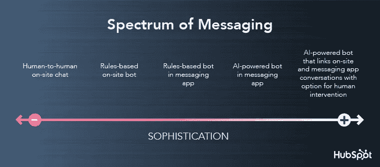
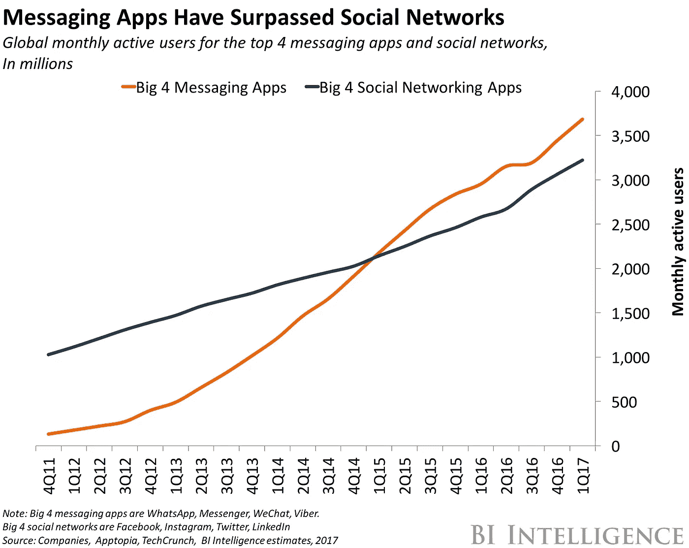
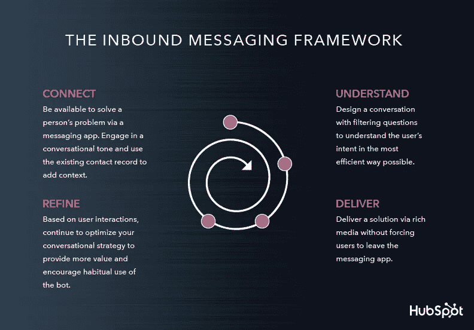
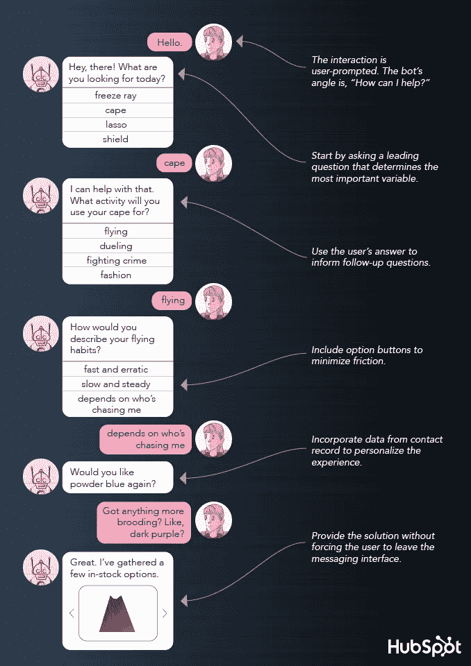

# 商务会话入门指南

> 原文：<https://medium.com/swlh/the-beginners-guide-to-conversational-commerce-96f9c7dbaefb>

你的蔬菜水果商做的。那个在沙滩上卖太阳镜的人也是。这就是为什么街角那家有趣的法国面包店已经经营了 15 年。

对话式营销。一个流行语，一个脚注，一个启示。每个人都在谈论它，但它是什么？

最简单地说，这是一种与客户交谈的行为，更重要的是，倾听客户的心声:他们的问题、他们的故事、他们的成功。打造真正的联系，并利用这种联系来为你的营销决策提供信息。

在最复杂的情况下，对话式营销已经成为基于计算机的对话处理的尖端技术的同义词。

品牌一直都知道一对一的对话是有价值的；但直到最近，实时大规模个性化这些对话还是不可能的。

不再是了。聊天机器人已经成为数字营销的中流砥柱，它们的底层人工智能每天都变得更加复杂。高德纳[预测](https://www.gartner.com/doc/3021226/market-trends-voice-ui-consumer)到 2020 年，我们与科技互动的 30%将通过与智能机器的“对话”来实现。

大卫·温伯格在他 1999 年的《T4 宣言》中提醒我们

> “市场只不过是对话”；

这在今天更是千真万确。

一个成功的对话式营销策略会将真实对话中的真实性火花与未来的新兴技术结合起来。

## 什么是会话式商务？

在 2016 年的[文章](/chris-messina/2016-will-be-the-year-of-conversational-commerce-1586e85e3991#.6q6d9kw5v)中，克里斯·梅西纳提炼了这个概念:

> “对话式商务(如我所见)在很大程度上与利用聊天、消息或其他自然语言界面(即语音)与人、品牌或服务和机器人进行交互有关，迄今为止，这些在双向、异步消息传递环境中没有真正的位置。”

对话式交谈是与客户或销售线索进行实时、一对一交谈的过程。这是一种直接、个性化、对话驱动的方法，用于培养长期关系、收集数据和增加销售。

与传统的数字营销不同，它“吸引”用户，而不是向他们“推送”内容。这是一种论述，而不是讲座。

# 会话式商务的历史

尽管最近速度加快，对话式营销并不新鲜。

这个概念第一次出现是在 2007 年，约瑟夫·贾菲的《加入对话》中。Jaffe 希望教会营销人员通过社区、伙伴关系和对话重新吸引客户:

> “现在，你周围有数百万个活生生的、有缺陷的、有人情味的、充满激情的、有影响力的、真实的对话:难道不是你加入进来的时候了吗？通过社区、对话和伙伴关系的力量，营销可以成为一种对话；我们消费者的家庭、体验和生活中的一位受欢迎的客人。”

*   **首先是“外向”营销:**通过印刷和电视等媒体向受众传播信息。
*   **接下来是“******”营销:**通过博客、社交媒体和电子邮件活动创造有趣的内容，为用户提供价值；[内容营销](https://blog.growthbot.org/8-strategies-to-embrace-the-future-of-content-marketing)属于同一个子集。**
*   **今天，对话式营销标志着营销发展的下一步。**

# **为什么？**

**在过去，品牌能够通过电子邮件、网站互动和社交媒体与他们的客户进行对话，而不是通过 T21 与他们进行对话。**

**品牌一直在努力捕捉、保持注意力，并将其转化为销售额、注册人数和长期忠诚度。参与是被动的，结果是肤浅的。**

**客户服务被降级为公式化的问答场景，每个参与者都不满意。摘自领先的对话式营销平台 Drift 的出色报告:**

> **“[……]大多数公司提供的购买体验已经变得冷酷无情。对于许多营销和销售团队来说，他们的销售线索已经变成了只存在于电子表格中的不知名的实体——他们不像真正的人一样被对待。在某种程度上，数据驱动开始变得比客户驱动更重要。”**
> 
> **推销电话的转化率正在直线下降。冷邮件有 [1%](https://blog.clearbit.com/the-4-rules-for-sending-cold-email-that-converts-in-2018/) 的打开率。**
> 
> **[81%](https://www.saleshacker.com/account-based-sales-strategy-ai/) 遇到封闭内容的技术买家不会填写表格。**
> 
> **但是私信的打开率呢？ [92%](https://www.unstoppablemomma.com/messenger-bots-take-over-email-marketing-with-92-open-rates/) 。**

**今天，消息应用拥有超过[50 亿](https://research.hubspot.com/charts/messaging-apps-have-over-4b-monthly-active-users)月活跃用户，使用率第一次超过了[社交网络](http://www.businessinsider.com/the-messaging-app-report-2015-11)。无论是在 WhatsApp 上与朋友聊天，还是在 Slack 上与同事交流想法，短信已经成为我们生活中不可或缺的一部分。**

****

**尽管应用程序极度饱和，但平均每个人只经常使用五个应用程序，你猜对了——消息应用程序占据这些位置，其打开率比下一个领先的数字渠道高出 10 倍。这些消息平台拥有庞大的受众:前三大消息应用的月活跃用户超过 40 亿。**

**就像过去十年互联网或应用经济的兴起一样，对话式营销诞生于当前的欲望:实时联系和真正的价值。**

# **它是如何工作的？**

**对话式营销是一个总括术语，涵盖了从选择加入电子邮件营销到客户反馈的所有对话驱动策略。**

**但推动最近发展的引擎是人工智能(AI)。聊天机器人代表了对话营销的新时代:**可扩展**、**个性化**、**实时**和**数据驱动**。**

**当然，这些机器人并不打算取代人与人之间的互动；他们在那里支持和增强他们:帮助用户在正确的时间与正确的人进行正确的对话。**

**(暂且不论，反正。根据 Gartner 的研究，到 2020 年，聊天机器人将占所有客户服务的 85%。**

**聊天机器人是一张空白的画布，有可能被塑造和注入反映公司价值观的角色——就像我们自己的 [GrowthBot](https://www.growthbot.org) (又名迷你 [Dharmesh Shah](https://blog.growthbot.org/how-we-are-getting-105k-people-to-use-our-chatbot) )。**

****

**这项技术仍处于起步阶段，因此大多数机器人都遵循一套由人类通过机器人构建平台编程的规则。区别在于聊天机器人使用自然语言与用户进行对话。**

**AI 使用第一人称数据来了解每个客户的更多信息，并提供超个性化的体验。然后，代表和机器人可以联合起来大规模管理这些对话。**

# **实践中的对话营销**

****

**想象一下，我要去参加一个豪华派对。今晚。这是最后一分钟，我刚刚收到消息，这是黑色领带；但是我没有合适的鞋子。我需要迅速找到一双合适的；我的尺寸；与我服装的其余部分协调一致；好价钱等。**

**我通常会在谷歌上搜索我所在地区的商店，然后去他们的网站上浏览，找到一双我喜欢的。但其他问题很快就会出现:他们有我的尺寸吗？鞋子够智能吗？它们有货吗？**

**我可以在网站的联系表上填写一个问题，或者给他们打电话，但是他们会回答吗？如果他们没有合适的鞋子，他们也不太可能提出一系列的选择。整个过程既耗时又低效。**

**但是假设我喜欢的品牌有很强的对话式营销文化。我可以用手机在几秒钟内进行对话，而不是求助于电子邮件；很快，我就知道了库存的颜色、尺寸和款式。我只要按一下按钮就能买到合适的鞋子。**

****

**对话式营销使用户无需拿起电话或与人接触就能立即获得他们需要的信息。这不是懒惰的问题；是关于安逸。**

**[克里斯·梅西纳](/@chrismessina)总结道，**

> **“创新品牌正在意识到，信息传递提供了推动参与的便利，以及激发深度客户忠诚度的亲密关系。”**

# **制定战略**

**Reply.ai 的联合创始人克拉拉·德索托告诉 [VentureBeat](https://venturebeat.com/2017/07/12/why-building-an-ai-company-should-not-remind-you-of-a-blind-date) ，**

> **“你永远不会只是‘建造一个机器人’,而是启动一个‘对话策略’——一个根据用户实际互动方式不断进化和优化的策略。”**

**如果用户被迫在各种应用程序和平台之间切换，以获得他们需要的答案，那么机器人的价值就没有意义:它需要是他们花费最多时间的地方的本地产品，无论是 Slack、Messenger 还是现场聊天。**

**但是对于品牌来说，在一个地方整合他们所有的对话是很棘手的。这就是为什么 [HubSpot](https://www.hubspot.com) 创建了 [Conversations](https://blog.hubspot.com/customers/what-is-inbound-conversation) ，这是一个免费的多渠道工具，可以让企业进行大规模的一对一对话。**

> **“无论是两个人之间，还是一个人和一个机器人之间，一对一的消息传递是通信的未来。信息更简单、更智能，并且对于创造令人惊叹的客户体验来说是必不可少的。**
> 
> **通过对话，我们超越了单一的解决方案，如网站聊天，以建立一个将企业与客户和潜在客户的所有通信集中到一个协作环境中的东西。"**

**[HubSpot](https://www.hubspot.com) 的联合创始人兼首席技术官 Dharmesh Shah 说。**

# **机会在哪里？**

****

*   ****更多销售**:对话推动转化。每个客户都希望从他们的问题到解决方案有一条最直接的路径，这条路径就是对话。研究表明，在第一次接触新线索后的五分钟内做出回应至关重要。10 分钟后，你取得领先的几率会下降 400%。采用对话式营销可以确保用户永远不需要等待。**
*   **投资回报:当然，你必须投资建立和维护一个机器人。但是想想这个:聊天机器人给你的品牌提供了与人一对一交谈的机会，而不需要雇佣一大群客服代表；一个机器人一年 365 天 24 小时都在工作。Juniper Research [发现](https://www.ibm.com/blogs/watson/2017/05/chatbots-customer-service-will-help-businesses-save-8-billion-per-year/)到 2022 年，机器人将帮助企业每年节省 80 亿美元。今天，这个数字只有 2000 万美元。**
*   ****数据驱动:**对话式营销提供了一个全新的知识、集体智慧网络。聊天机器人的吸引力很大一部分来自第一方数据。营销人员通常依靠像素跟踪和预测分析来收集目标受众的详细信息。因此，他们最终只能依靠猜测。但是，机器人和你的客户之间的对话日志将为你提供更多关于客户反应的数据，并告知你他们的偏好和关注，从而提供大量量化的可能性。对话越好，数据就越好。**
*   ****个性化:**通过将您的机器人集成到多渠道客户支持解决方案中，您的企业将获得巨大成功。利用存储在 CRM 中的数据，机器人可以更智能地向客户提供选项。例如，航空公司的对话式人工智能不仅可以帮助客户改乘更早的航班，还可以告诉她她最喜欢的门到门班车服务什么时候会来接她，甚至可能为她预订座位。**
*   ****客户主导:**利用谈话式营销，客户可以主动出击；在适合他们的时候，按照他们的方式联系一个品牌。这意味着企业可能会从已经对其品牌感兴趣并准备跟进的客户那里获得参与。**

# **有哪些危险？**

> **“这是信息传递的双刃剑。机器人提供了一种与买家一对一互动的可扩展方式。然而，当他们无法提供人们习惯于在即时通讯应用上与他人进行复杂、多层对话的高效和愉快体验时，他们就会失败。”**

**与人类相比，我们对机器错误的容忍度要低得多:73%的人表示，在一次负面体验后，他们[不会再与机器人](https://venturebeat.com/2017/06/17/the-good-the-bad-and-the-ugly-of-chatbots/)互动。如果一个机器人似乎能够用英语交谈，我们很容易高估它的能力。**

**这就是为什么恰当地管理客户的期望至关重要。机器人远非自主，人们也不容易被愚弄；试图将你的机器人呈现为人类代理可能会弄巧成拙。机器人不理解由前面的文本创建的上下文，会话中的细微差别很容易影响它们的回答能力。**

> **用户:下一趟去芝加哥的航班是什么时候？**
> 
> **系统:上午 9:30**
> 
> **用户: **it** 什么时候到？**
> 
> **系统:我不懂“它”。**

**由于机器人存在于消息应用程序中，它们有可能侵入高度私人的空间，这使得正确处理的风险更高。**

**根据调查，人们使用信息应用程序来帮助客户实现一个关键目标:快速解决他们的问题。机器人应该很好地服务于一个简单的目的，而不是纠结于更好地留给人类的复杂对话。**

# **最后的想法**

****

**品牌和用户互动的方式正在经历巨大的转变。客户比以往任何时候都更加聪明，消息更加灵通。他们期望个性化和透明度作为先决条件。他们觉得自己的选择赋予了他们力量。愚弄他们很难，获得他们的忠诚更难。**

**最重要的是，他们希望一年 365 天每天 24 小时都是即时的:被倾听，被帮助，就在现在；半小时后不行，明天也不行。这就是为什么对话式营销不仅代表了营销的新基石，也代表了客户服务和体验、品牌和销售的新基石。**

**为了赶时髦而造一个 bot 是不够的；它需要成为一个更大战略的一部分，每个对话都有一个目的。作为一项旨在促进持久关系的长期战略，它需要朝着一个长期目标前进。**

**有效的对话式营销是品牌价值、用户参与和有价值的对话的交集。首先是建立你的观众群，最后才是销售。**

**感谢阅读。**

> **如果你喜欢这篇文章，请随意点击那个按钮👏帮助其他人找到它。**

***最初发表于*[*【blog.growthbot.org】*](https://blog.growthbot.org/the-beginners-guide-to-conversational-commerce)*。***