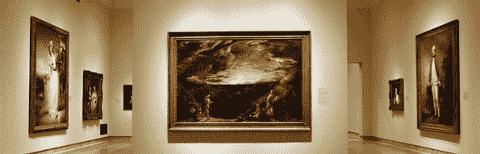

# 艺术品投资入门指南

> 原文：<https://medium.com/swlh/the-beginners-guide-to-investing-in-art-8a4933211187>

## 在深入研究蓬勃发展的实物投资行业时，需要考虑的一系列基本观点。

像所有投资领域一样，在投资艺术品时需要考虑一些基本的理念。这些主要的指导方针并不详尽，也不包罗万象。他们旨在为潜在投资者提供一个在行业中立足的地方，同时也让他们了解影响艺术市场的各种因素。

# 1.艺术应该是艺术家的代表

就风格而言，独创性是所有艺术家特有的特征。如果一位受欢迎的艺术家创作了一件并不代表其独特风格的作品，它可能会以低价出售，但很难转售。虽然转售的可能性总是存在的(不管多小)，但你希望通过投资满足两个条件——首先，最高的回报率，其次，同时给你的房子增加一笔可观的收入。

# 2.比较是关键

如果你欣赏某个艺术家的作品，你可能会对他们的其他作品或其他艺术家的类似作品产生同样的情感。因此，在选定一件艺术品之前，最好先考虑一系列的艺术品。特别是在不确定的情况下——如果你没有爱上一件作品，不确定它是否是你想要的——花时间探索你的选择是明智的，以便做出明智的决定。

为了便于比较，参观展览和直接观看作品是感受艺术品的有效方式。然而，现在是 2018 年，即使是艺术也可以在你舒适的家中欣赏。**通过各种可信的零售商、拍卖机构和艺术品投资网站，你可以远程对你的投资做出自信的决定。**

# **3。相信你的直觉，但要用研究来支持它**

投资时，意识是非常重要的。通过研究，你可以了解艺术家的背景，他们作品的价值，他们风格的受欢迎程度，与他们作品相似的艺术家，他们的音乐品味，甚至他们最喜欢的食物。然而，仅仅彻底的研究不会帮助你区分什么是你想买的，什么是你应该买的；研究和直觉的结合。

新手收藏家往往会被艺术顾问和画廊馆长吓倒，他们会把自己的真知灼见告诉收藏家，而不是让收藏家自己决定。因此，对新手收藏家来说，在网上投资艺术品是一个更明智的选择，因为这让他们对自己的投资有一个不受影响的、本能的决定。

因此，收集尽可能多的信息是明智的，但也要相信你对艺术品的本能反应。

# 4。通过透明、可信的服务商进行投资

在纸质交易时代，在投资可以通过在线平台处理之前，遵循的是收集所有收据和发票硬拷贝的原始协议。这有助于评估艺术品的价值。**除非从艺术家到所有者有一条清晰可追溯的路径，否则艺术品的价值会受到不确定的外部因素的影响。然而，随着网上投资的出现，这一过程变得比以往更加顺畅和透明。**

## 这篇文章发表在[的《创业](https://medium.com/swlh)，这是 Medium 最大的创业刊物，拥有+397，714 人关注。

## 在这里订阅接收[我们的头条新闻](http://growthsupply.com/the-startup-newsletter/)。

