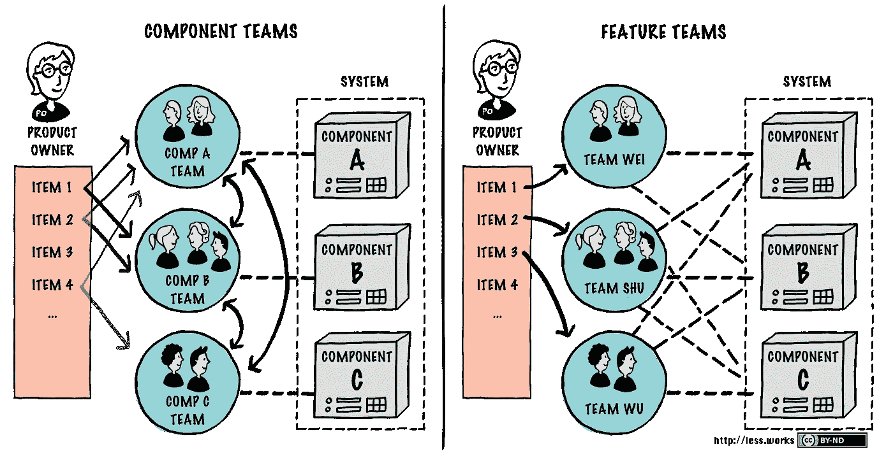

# 功能团队的优势

> 原文：<https://medium.com/swlh/the-benefits-of-feature-teams-efc56f8a365a>

在只有一个团队的小产品中，gile 方法，尤其是 Scrum 看起来非常简单。一旦几个团队在一个产品上工作，工作就必须以某种方式被分开。显而易见，因为众所周知，方法是将产品或多或少地逻辑地、有意义地分解成组件，并将*组件团队*分配给他们。然而，从客户的角度来看，这些组件完全无关紧要。最多，客户没有意识到它们。然而，在大多数情况下，他会这样做，因为通常需要跨越几个组件的边界来实现客户的利益和产品的必要功能。这会导致团队之间的交接和协调，从而中断流程。从客户的角度来看，如果新功能由一个所谓的*功能团队*来实现，那就更好了，不管哪个组件会受到影响。

每个建过或者翻修过房子的人对此都很熟悉。你真的“仅仅”想在窗户上安装防晒装置。不幸的是，这通常不是来自一个单一的来源，而是不仅需要实际安装防晒装置的工匠，还需要铺设电源电缆的电工、涂抹所有东西的瓦工和重新粉刷所有东西的油漆工。从想法到收益的价值流被移交中断了几次，必须或多或少地进行广泛的计划和协调(由客户进行)。从一个工匠那里订购你需要的所有防晒产品将会变得多么容易和快捷！从客户的角度来看，这正是组件团队(拥有各自分包合同的专业工匠)和功能团队(完全处理订单的团队，无论需要什么技能)之间的区别。

由于面向客户是敏捷的一个基本原则，组件团队可能更简单，但对于大型产品的分工来说，这只是第二好的解决方案。无论组件是如何切割的，组件之间仍然有交接和协调，以向客户提供他们的利益。有些削减肯定比其他的要好。软件产品中前端、后端和数据库等*水平*层中经常使用的切片对于各自的专家来说可能相当方便。但是从客户的角度来看，这种设计是非常不令人满意的，因为任何重要的功能都将通过所有层，导致缓慢且容易出错的切换。更好的是将产品分解成逻辑上独立的子产品的*垂直*切片。例如，企业资源规划系统至少包括采购、仓储和销售等部分。然而，仍然会有跨越多个组件的特性，因此需要协调。

> *设计系统的组织[……]被限制生产这些组织的通信结构的复制品。*
> 
> *梅尔文·康威*

不管组件设计如何，组件团队都会导致各自为政，因为每个团队都会觉得只对产品中属于自己的部分负责。康威定律强化了这种效应，根据该定律，“系统的软件界面结构将反映出产生它的组织的社会边界，跨越该边界的交流更加困难”([维基百科](https://en.wikipedia.org/wiki/Conway%27s_law))。组织倾向于以类似于组织和通信结构的方式设计软件系统。如果垂直组件切片遵循这种组织结构，并由各个组织单元的团队来配备人员，这只会巩固已经存在的竖井的墙壁。

功能团队，也就是能够实现客户需求从想法到实际使用的团队，无论在产品的哪个组件中，都是更好的选择。无论如何都要从客户的角度出发，也要从组织的角度出发。因为组件团队只能在他们的组件中工作，所以总是需要大量的计划来确保这些团队总是被最佳地利用，因为不是每个组件的每个需求都有相同的工作量。然而，功能团队需要组织的高度成熟度，因为产品是由每个人共同设计和拥有的。那些习惯于将工作分解成小步骤并强迫人们在定义好的过程中扮演严格角色的组织，首先会遇到很大的困难。遵循 [Shu-Ha-Ri](https://en.wikipedia.org/wiki/Shuhari) 的原则，建议从单个团队的小产品开始，将敏捷的立场和原则内化。然后你可以用垂直组件团队承担更大的产品，让他们逐渐发展成功能团队。

*原载于 2018 年 4 月 13 日*[*fuehrung-erfahren . de*](https://fuehrung-erfahren.de/en/2018/04/the-benefits-of-feature-teams/)*。*

## 这篇文章发表在 [The Startup](https://medium.com/swlh) 上，这是 Medium 最大的创业刊物，有 316，028+人关注。

## 在此订阅接收[我们的头条新闻](http://growthsupply.com/the-startup-newsletter/)。

