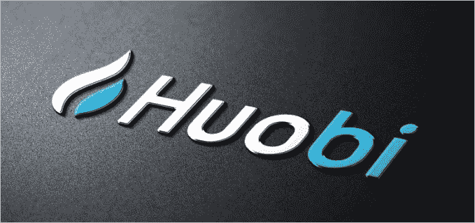
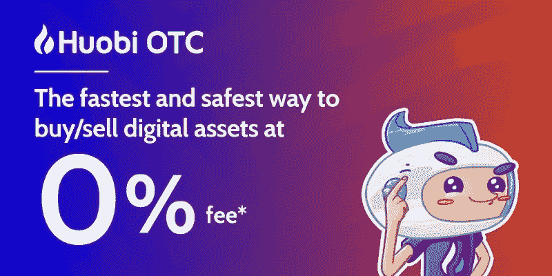

# 火币场外交易的好处

> 原文：<https://medium.com/swlh/the-benefits-of-trading-over-the-counter-on-huobi-otc-2ab0a0b5f6c9>

# **在 Huobi OTC 上进行场外交易的好处**

据[报道](https://www.reuters.com/article/us-crypto-currencies-otc/otc-crypto-market-flourishes-powered-by-skype-idUSKCN1H91P4)，场外交易的比特币数量已经是我们在数字资产交易所看到的 24 小时交易量的数倍。这一消息表明，大型买家正在利用场外经纪商积累比特币。

许多大型场外交易买家，无论是个人投资者还是专业实体，都有自己的经纪人，他们与这些经纪人建立了某种程度上值得信赖的关系。中小型场外交易商有时更难找到值得信赖的场外经纪人来交易比特币或其他加密货币。此外，我们必须记住，买家和卖家都在向经纪人支付高额溢价，以促成他们的场外交易。

随着火币集团的扩张，他们最近宣布已经将[越南市场](https://www.prnewswire.com/news-releases/huobi-otc-marks-foray-into-vietnam-with-zero-transaction-fees-300700130.html)添加到他们的场外交易平台。人们可以使用越南本地法定货币越南盾(VND)进行点对点交易，以兑换比特币、以太坊、系绳或任何其他可用的加密货币。

# **现货上的场外交易**

数字资产服务提供商火币集团在其自有的[火币场外交易平台](https://bit.ly/2C2fgHn)上提供场外交易。在你能够开始买卖场外交易之前，要遵循的步骤相当简单。在你注册账户，或者使用你的 [Huobi Global](https://www.huobi.com/) 用户名和密码登录后，你就可以开始了。如果你发布销售比特币或其他加密货币的广告，你需要将出售的金额存入托管钱包。双方同意后，金额将被释放，任何一方将分别收到他们的代币/法定货币。

火币高度重视客户，为 OTC 客户提供全天候的客户服务。

# **在火币场外交易的好处**

在 Huobi OTC 交易的好处大致分为三类:

-在 Huobi Global、Huobi NEXT 或 Huobi Margin 进行交易的用户也可以使用同一个交易账户在 Huobi OTC 进行交易。因此不再有帐户之间的切换。当你在 Huobi Global 上通过验证后，你将只有一个用户名和密码，你可以在 Huobi Global，Huobi NEXT 和 Huobi OTC 上使用。从注册到能够在所有 Huobi 平台上交易的整个过程最多只需要 10 分钟。其中一个关键好处是，用户可以将代币从 Huobi Global 转移到 Huobi OTC，而无需支付转移费。

-除了不收取转账费用，火币 OTC 在交易本币到比特币、以太坊或系绳时，收取 0%的交易费用。对于所有其他货币交易，Huobi OTC 收取不到 1%的费用。

- Huobi OTC 提供了一个安全的交易平台，因为广告中列出的代币需要实际存在于 exchange wallet 中，以使广告成为最终的。这是为了保护买家和卖家免受诈骗。这是一种安全机制，让火币作为中介，并提供保护，防止恶意用户。

# **个人观点**

如果我要进行加密货币 OTC 交易，我肯定会将火币 OTC 作为我 OTC 交易的首选交易平台。我真的很喜欢火币提供一站式服务，包括他们的 OTC 产品。虽然竞争对手通常收取 1-2%的场外交易费用，但火币网基本上是免费的，为感兴趣的人提供了一种安全的场外交易方式。

如果你还没有火币环球的交易账户，你可以通过[这个链接](https://www.hbg.com/en-us/topic/invited/?invite_code=tfg23)注册。

在火币 OTC 上报名可以使用[这个链接](https://bit.ly/2C2fgHn)。

关于如何在 Huobi OTC 上创建帐户并开始制作广告或购买 OTC 的教程，可在此处找到。

***免责声明*** *:本文无意作为投资建议。只是我个人对火币 OTC 平台的看法。你应该总是做自己的研究#DYOR。火币环球奖励我写这篇文章，并鼓励我表达自己的观点*。

如果你喜欢我的文章并希望了解区块链、加密货币项目和新闻，请订阅我的频道: [Medium](/@cultcrypto) 、 [Twitter](https://twitter.com/CryptoShowdown) 和 [Steemit](https://steemit.com/@cryptoshowdown) 。也可以在 [LinkedIn](https://www.linkedin.com/in/donjohanson/) 上看我的文章。

如果你对这篇文章有任何问题，请在下面的评论区评论。如果你觉得这篇文章有帮助，请不要忘记鼓掌。谢谢大家！

**密码摊牌**

## 这篇文章发表在 [The Startup](https://medium.com/swlh) 上，这是 Medium 最大的创业刊物，有+ 377，643 人关注。

## 在此订阅接收[我们的头条新闻](http://growthsupply.com/the-startup-newsletter/)。

