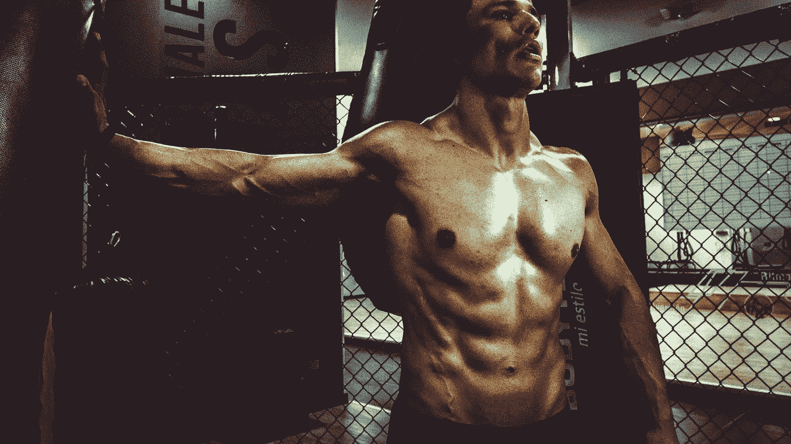
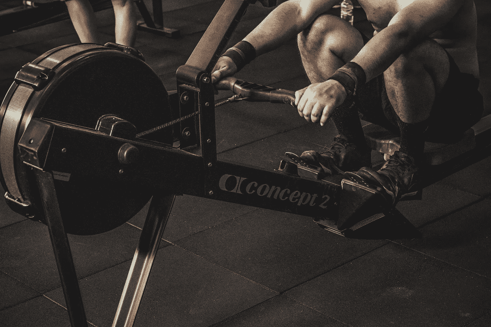
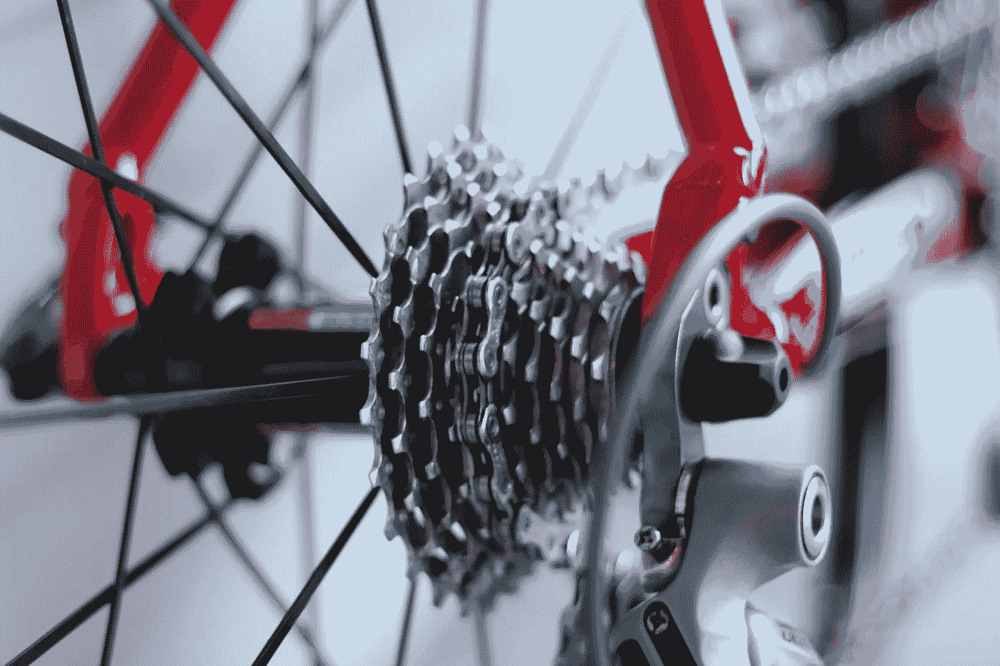
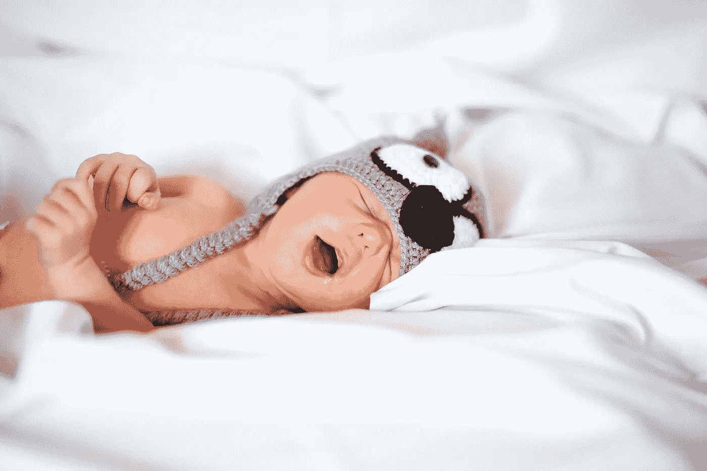

# 健身的好处(不是你想的那样)

> 原文：<https://medium.com/swlh/the-benefits-of-working-out-it-isnt-what-you-think-e0e7e528ace1>

Photo by [Cristian Baron](https://unsplash.com/photos/0-hB59n1m94?utm_source=unsplash&utm_medium=referral&utm_content=creditCopyText) on [Unsplash](https://unsplash.com/search/photos/workout?utm_source=unsplash&utm_medium=referral&utm_content=creditCopyText)

杰夫·贝索斯在担任亚马逊首席执行官期间获得了一些重要的权力。尽管他一周工作 100 个小时，埃隆·马斯克还是坚持每周挤出两次锻炼时间。尼古拉斯·科尔每周锻炼 6 到 7 次，尽管他是 Digital Press 的首席执行官，也是 Quora 的 4 倍顶级作家。

健身成功人士的不成比例的数量表明了健身和成功之间的神奇联系。

自古以来，锻炼就与身体健康联系在一起。是的，我们确实达到了身体健康，但这仅仅是一个有益的副产品。我们通过锻炼获得的最重要的东西是—

# 纪律，学科

Photo by [Victor Freitas](https://unsplash.com/photos/KkYWWpurqbE?utm_source=unsplash&utm_medium=referral&utm_content=creditCopyText) on [Unsplash](https://unsplash.com/search/photos/workout?utm_source=unsplash&utm_medium=referral&utm_content=creditCopyText)

当我们强迫自己懒惰的屁股从床上爬起来，进入健身房，进行一个小时的高强度体育锻炼时，我们正在给自己上一堂重要的纪律课。

一旦学会了纪律，这一课就可以应用到生活的其他领域。例如，我把我在锻炼时学到的纪律运用到我的中级岗位上。由于自律，我的媒介存在正在缓慢但稳定地增加。

# 焦点

Photo by [Paul Skorupskas](https://unsplash.com/photos/7KLa-xLbSXA?utm_source=unsplash&utm_medium=referral&utm_content=creditCopyText) on [Unsplash](https://unsplash.com/search/photos/focus?utm_source=unsplash&utm_medium=referral&utm_content=creditCopyText)

我们周围的一切都是为了分散我们的注意力。从令人惊叹的电视剧《网飞》到诱人的脸书通知。在这一片混乱中，锻炼迫使你关注传说中的—

> 精神-肌肉连接

我们在锻炼中形成的激光般的集中力，将会不可避免地帮助我们在一天的剩余时间里集中注意力。例如，在开始高强度锻炼的日子里，我能够更好地集中精力工作。

# 新陈代谢

Photo by [Wayne Bishop](https://unsplash.com/photos/7YUW7fvIYoQ?utm_source=unsplash&utm_medium=referral&utm_content=creditCopyText) on [Unsplash](https://unsplash.com/search/photos/gears?utm_source=unsplash&utm_medium=referral&utm_content=creditCopyText)

我们大多数人都被困在办公室里。如果你像我一样生活在一个繁忙的城市，你将永远被困在交通堵塞中。无所事事会让我们的新陈代谢降到历史最低点。结果是—

*   我们整天都感到沉重
*   我们很少感到饥饿
*   我们的能量是不存在的

解决新陈代谢问题的最快方法是锻炼。只要一周的高强度锻炼就能改善你的新陈代谢。(为了保持新陈代谢的改善，你需要坚持锻炼。)

# 睡眠

Photo by [Sadık Kuzu](https://unsplash.com/photos/2qayzVVb0hA?utm_source=unsplash&utm_medium=referral&utm_content=creditCopyText) on [Unsplash](https://unsplash.com/search/photos/sleep?utm_source=unsplash&utm_medium=referral&utm_content=creditCopyText)

我们经常倾向于忽视睡眠的重要性，但是我们都需要明白良好的睡眠(在大多数时候)是健康的重要决定因素。因为我们每天只需要花费很少的精力，所以当我们上床睡觉的时候，我们并不真的*累了。接下来的睡眠是没有成就感的，不愉快的，不想要的！*

你曾经疲倦地上床睡觉吗？你能想象你之后的睡眠吗？

一天下来，健身会让你筋疲力尽，接下来的睡眠会是你多年来最好的一次！

# 概括起来

锻炼的好处不仅仅局限于强健的二头肌和健美的腹肌。锻炼会帮助你—

*   **灌输纪律**
*   **培养焦点**
*   **改善你身体的新陈代谢**
*   **睡个好觉**

别再找借口了。穿上运动服，去健身房，改变你的生活。

**感谢阅读！如果你喜欢这篇文章，请尽情鼓掌，关注我的** [**中**](/@BITSianIam) **。请留下回复，告诉我如何改进。**

**联系我—**

[Quora](https://www.quora.com/profile/Abhishek-Rathan-Athreya) | [脸书](https://www.facebook.com/abhishek.athreya) | [LinkedIn](https://www.linkedin.com/in/abhishek-r-athreya-69a64688/)

## 这篇文章发表在 [The Startup](https://medium.com/swlh) 上，这是 Medium 最大的创业刊物，有 309392+人关注。

## 在这里订阅接收[我们的头条新闻](http://growthsupply.com/the-startup-newsletter/)。

