# 2019 年最佳 30 款免费设计资源

> 原文：<https://medium.com/swlh/the-best-30-free-design-resources-for-2019-f146837768e>

我们喜欢新的设计工具，花了太多的时间寻找有助于为我们的设计工作添加新鲜事物的资产。我们搜索了互联网，发现了 2019 年最好的 30 个免费设计资源。想在 2019 年提升自己的设计作品？这是一个开始的好地方。

# 最佳免费图标

## [通知— Adobe XD 图标集](https://www.behance.net/gallery/73119555/Notification-Icons-Adobe-XD-(FREE-DOWNLOAD))

*   Adobe Illustrator
*   Adobe XD

由 Burnt Toast Creative 与 Adobe XD 合作开发的 [12 个通知图标](https://www.behance.net/gallery/73119555/Notification-Icons-Adobe-XD-(FREE-DOWNLOAD))非常简单。在我们生活中常见的可识别的警报和徽章上播放，这些图标将为任何设计项目增添乐趣。

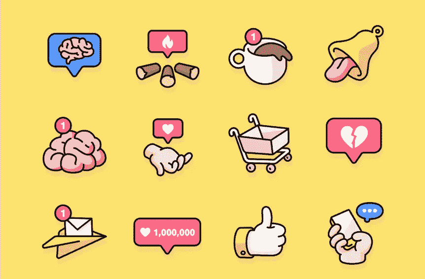

## [平面设计&自由职业图标包](https://www.invisionapp.com/inside-design/design-resources/design-tools-icon-pack/)

*   Adobe Illustrator
*   Adobe Photoshop
*   EPS
*   SVGS
*   PNGS

InVision 的内部设计产生了这个抛光的图形设计和自由职业者图标包。所有 20 个图标都是高度可定制的，并可在所有文件格式。我们是[**vision“内部设计”博客**](https://www.invisionapp.com/inside-design/) **的超级粉丝。**绝对值得书签。

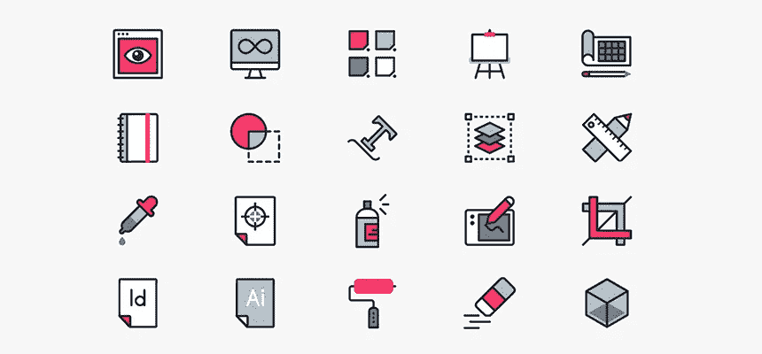

## [办公图标包](https://dribbble.com/shots/5560219-Freebies-Office-Icons-Pack)

*   砖坯黏土
*   素描

由 Syntac 制作，这个光滑的办公图标包包括 9 个不同的图标，如打印机和显示器，有 4 种不同的颜色。

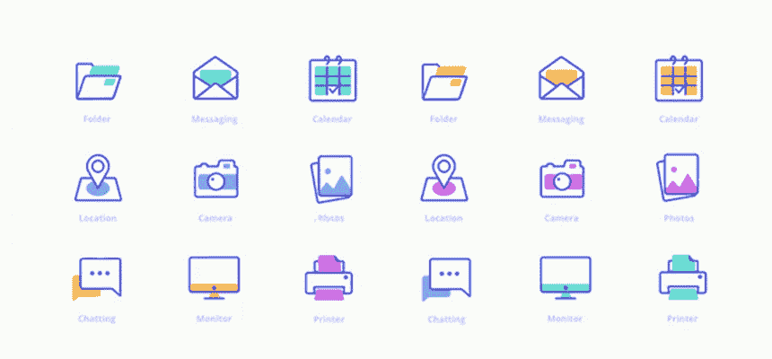

## [星球大战图标包](https://www.behance.net/gallery/49684567/Star-Wars-free-icons)

*   Adobe Illustrator

奥列格·莱文制作精美，这个扁平的图标星球大战包包含 12 个图标，有 BB8，C-3PO 和我们最喜欢的 R2D2。请在 2019 年 12 月《星球大战》最后一集上映时准备好这些照片。

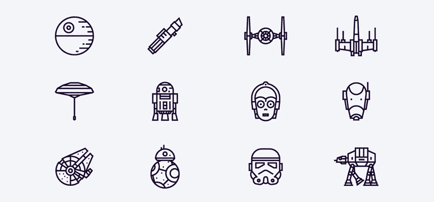

## [Linecons 包](https://designmodo.com/linecons-free/)

*   Adobe Illustrator
*   Adobe Photoshop
*   HTML/CSS
*   便携文档格式
*   PNG
*   SVF

Linecons 包含 48 个完全可缩放的矢量图标，具有专业的外观轮廓样式，所有这些都适用于 web 和移动界面设计。

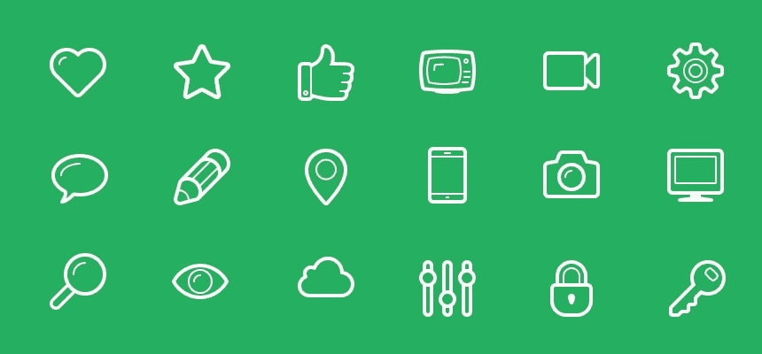

# 最佳免费 UI 套件

## [背包客 UI 套件](https://www.behance.net/gallery/69411833/Backpack-UI-Kit-Free-for-Adobe-XD)

*   住所 XD

Backpackr 是一个免费的 iOS UI 工具包，是一个社交网络和旅行应用的原型。Backpackr 有 50 多个屏幕，完全可定制，适合任何需要干净、现代感的项目。

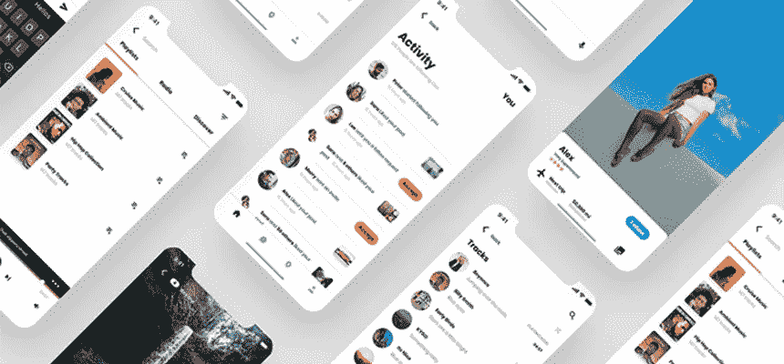

## [邮件 UI 套件](https://www.invisionapp.com/inside-design/design-resources/free-ui-kit-for-sketch-and-photoshop-mail/)

*   Adobe Photoshop
*   素描

Mail 是一个免费的跨平台 UI 套件，包含 26 个类别、320 个 UI 元素和 78 个模板，全部基于数字通信的理念。一个非常圆滑，现代和复杂的设计，邮件将让你一整年的灵感！

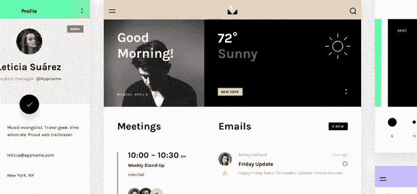

## [阿迪达斯网站重新设计概念](https://craftwork.design/adidas-website-redesign-concept/)

*   素描

这款阿迪达斯网站重新设计概念可在 Craftwork 上获得，它是一个干净简单的模板，包括 4 个产品展示、主页和时事通讯订阅。

## [幻灯片资源](https://designmodo.com/slides/resources/)

*   素描

由 Design Modo 制作，Slides (4)帮助网页设计师制作漂亮的网站和登陆页面。他们庞大的设计资源包包含美观整洁的边栏、面板和页面幻灯片，有助于加快工作流程。

## [赫拉利](https://dribbble.com/shots/5413038-helali-Free-PSD-template-Creative-Digital-Agency)

*   Adobe Photoshop

Helali 是一个面向创意人员和数字机构的 PSD 模板。一个简单的设计，赫拉利模板一定会激发你的灵感

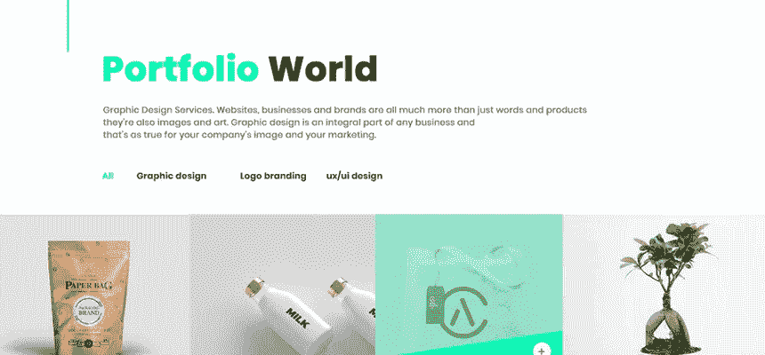

# 设备模型

## [梦者捆绑](https://www.behance.net/gallery/72685831/The-Dreamer-Free-Bundle-Mockups)

*   Adobe Illustrator
*   Adobe Photoshop

梦想家是我们遇到过的最好的样机包之一，我们不只是在谈论免费的！混合在一起的经典 2D 和三维物体，梦想家将把你的样机游戏到下一个水平。

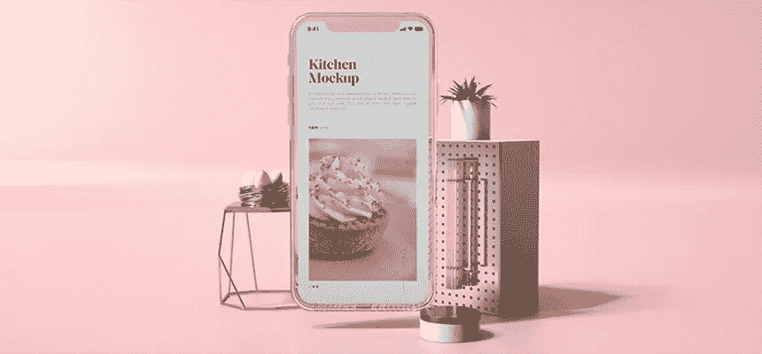

## [MacBook Pro 样机](https://dribbble.com/shots/4965311-Mockup-freebie)

*   Adobe Photoshop

受苹果网站的启发，这款 MacBook Pro 样机更上一层楼！与大多数实体模型不同，这个模型显示了屏幕图像在 Mac 上的反射和高光。

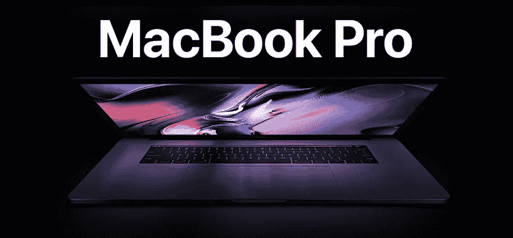

## [iPhone X 长卷轴模型](https://lstore.graphics/iphonex-longscroll/)

*   Adobe Photoshop

这款 iPhone X 样机非常适合长滚动界面和移动登录页面。(大声喊出 [**LStore**](https://lstore.graphics/) **，**他们负责一些目前最好的模型。)

## [一加 6 样机](https://gumroad.com/l/eUNxS)

*   Adobe Illustrator
*   Adobe Photoshop
*   Adobe XD
*   素描

这个平面 OnePlus 6 模型完全可编辑，随时可以使用。

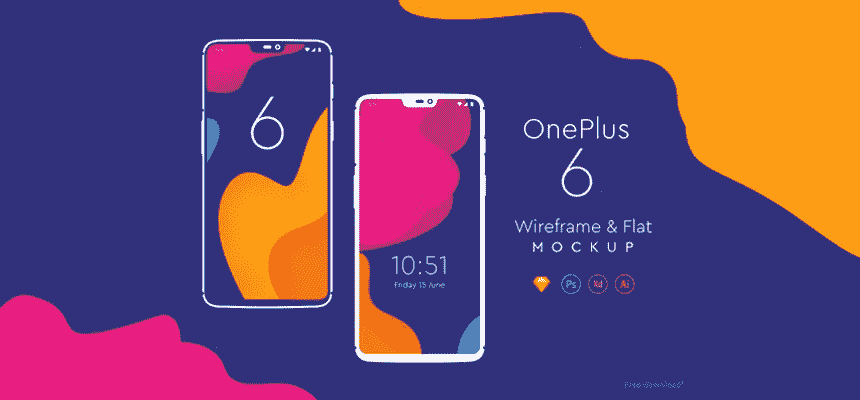

## [等距 iPhone XS 样机第二卷](https://www.pixeden.com/psd-mock-up-templates/psd-iphone-xs-mockup-isometric-vol2)

*   Adobe Photoshop

这个立体模型展示了所有可用颜色的 iPhone XS。与大多数模型一样，由于智能层，你可以轻松地改变 iPhone 屏幕。

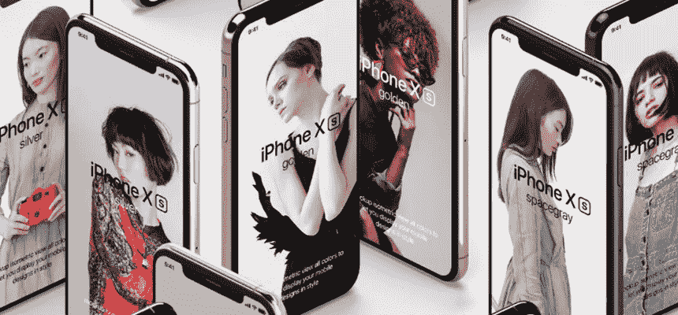

# 最佳免费照片

早在五月份，我们就报道了 15 个最好的图片网站。那是半年多以前的事了，在网络世界里，任何超过一个月以前的事都是很久以前的事了。这里是另外 5 个值得任何“最佳”列表的免费股票网站。

## [泼夏尔](https://www.splitshire.com/)

从汽车、蓝色背景、室内装饰到婚礼，Spilt Shire 是一个高质量的照片(和视频)平台。随着他们收集的令人震惊的免费照片越来越多，到 2019 年底，Spilt Shire 可能会接近 Unsplash。

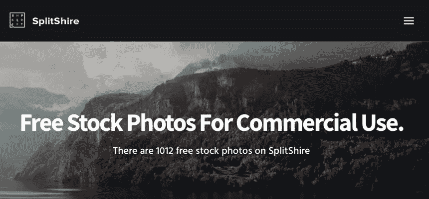

## [重拍](https://www.reshot.com/)

Reshot 提供精选的非标准库存图像，可用于任何项目。从令人垂涎的甜点图像到美丽的大气图片，Reshot 将让您连续几天滚动浏览令人印象深刻的照片。

## [负空格](https://negativespace.co/)

负空间提供美丽的，高分辨率的免费库存图像，供个人或商业使用。相信我们，你会想要使用它们的！

## [风格股票](https://styledstock.co/)

Styled Stock 通常涉及美丽、时尚和花卉相关的物品，是一个带有女性风格的免费图片网站。如果你正在为你的博客、美容、工艺品、设计、时尚或食品项目寻找一张完美的照片，Styled Stock 应该是你的首选！

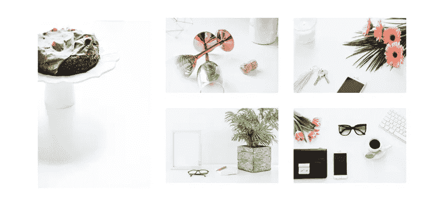

## [斯托克皮克](http://stokpic.com/latest-100/)

Stokpic 为他们的照片提供了独特的活力，在包括抽象、动物、风景、人物和交通工具在内的许多类别下提供免费的库存图像。

# 最佳字体

## [博比·琼斯](https://www.pixelsurplus.com/freebies/bobby-jones-free-quirky-font)

博比·琼斯，一个时髦有趣的汤姆·朝琪的作品，散发着个性，会引起任何人的注意。

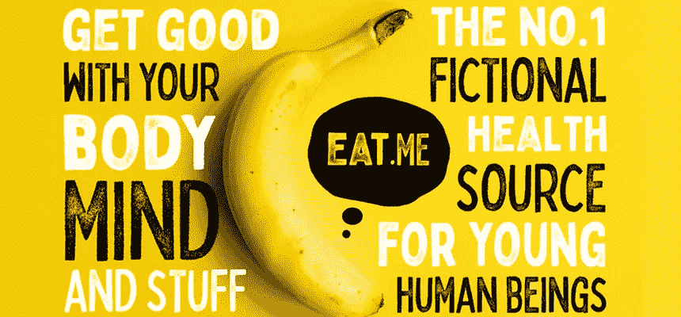

## [周二晚上](https://www.pixelsurplus.com/freebies/tuesday-night-free-signature-script)

由 Font Forestry 开发的“星期二晚上”是一个超级时尚的签名脚本，非常适合从装饰印花到服装、婚礼请柬等等的任何东西！

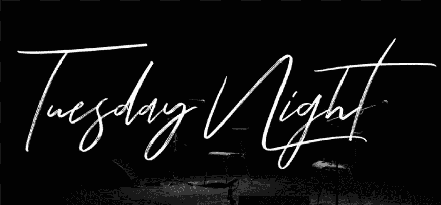

## [Bebas Neue](https://www.1001fonts.com/bebas-neue-font.html)

Bebas Neue 已经存在了十多年，它的字体仍然是许多标题、说明和标题的完美选择。

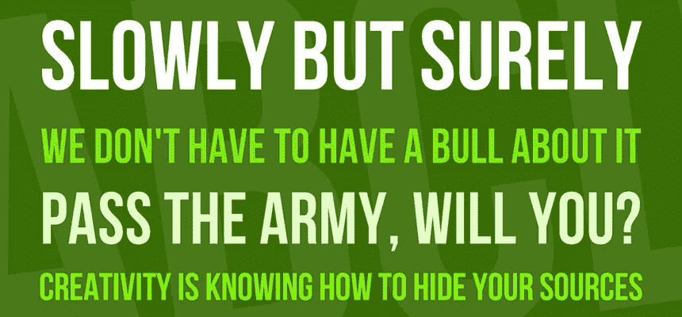

## [阿尔瓦](http://freegoodiesfordesigners.blogspot.com/2016/10/alva-free-font.html)

阿尔瓦是一种超级酷的极简几何字体，非常适合醒目的标题和海报。

## [Awwwards 全集](https://www.awwwards.com/awwwards/collections/free-fonts/)

在过去的几年里，Awwwards 的团队汇集了这些令人惊叹的免费字体。从邦迪到眼镜商到工会，该系列为您的所有数字项目提供了独一无二的东西！

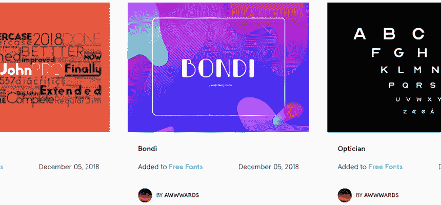

# 多方面的

## [列出设计](http://www.lists.design/)

让我们面对现实吧——在模型中使用 Lorum Ipsum 和 Bob Smith 这样的名字的次数是有限的。列表通过提供准备好并等待填充您的模拟的真实内容，帮助原型进入下一个级别。

## [人类插图](https://www.humaaans.com/)

*   素描

在 2018 年，我们看到插图成为一种主要的网页设计趋势，并将在 2019 年继续增长和发展。Humaaans 是一个出色的插图集，可以混合和匹配，以适应您的设计需求。最重要的是，所有的插图都可以免费用于商业或个人用途。

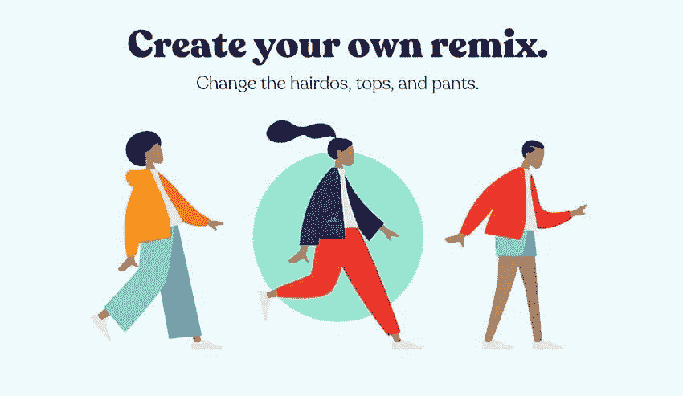

## [代码打开](https://codepen.io/)

CodePen 是一个开源的学习环境，开发者可以在这里展示他们的 HTML、CSS 和 JavaScript 作品。CodePen 不断更新新内容，帮助您在数字设计包中保持领先地位！

## [Huesnap](https://www.huesnap.com/)

HueSnap 提供了数不清的调色板来激励世界各地的人们。我们喜欢 HueSnap，但如果你是一个优柔寡断的人，最好避免使用它——它永远不会结束……

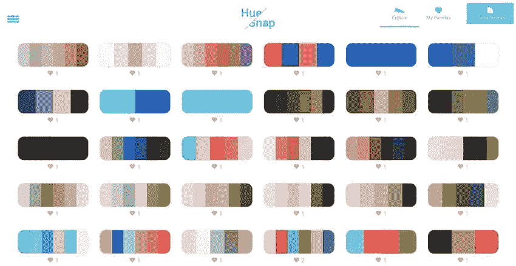

## [内部设计](https://www.invisionapp.com/inside-design/)

InVision 最近重新推出了他们的“内部设计”，其新的见解深刻的博客涵盖了设计资源、流程和灵感等主题。这将使他们成为 2019 年的设计领导者。

所以，这就对了。2019 年启动您的数字设计项目的最佳 30 种免费设计资源。

如果您对数字设计、网页开发或 [**在线营销**](https://startdigital.com.au/our-services/online-marketing-perth/) 有任何疑问，请随时联系 [**Start Digital**](https://startdigital.com.au/) 团队。

## 这篇文章发表在 [The Startup](https://medium.com/swlh) 上，这是 Medium 最大的创业刊物，有+398，714 人关注。

## 在这里订阅接收[我们的头条新闻](http://growthsupply.com/the-startup-newsletter/)。

