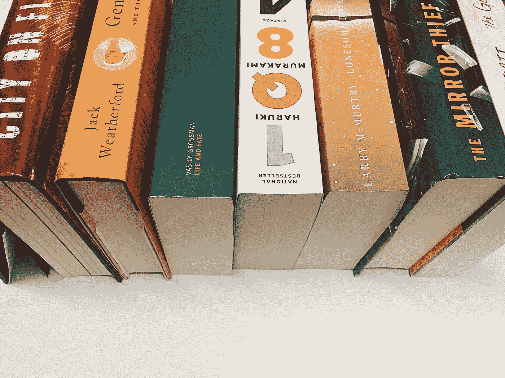

# 你可以打盹的最好的书

> 原文：<https://medium.com/swlh/the-best-books-you-can-nap-to-f01f8b9dae0>

这不是书，这是传统！

随着寒冷的天气，我们迎来了一个古老传统的季节。今天，由于尚未被科学解释的原因，我们用大量的食物把盘子堆得高高的，这些食物花了好几天才准备好。它是令人舒适的食物。美味，咸，碳水化合物，感谢上帝的肉汁舒适的食物。按照传统，饭后，有些人可能会舒适地躺在沙发上看足球，但你有其他的计划。你的书在召唤你。你决心把这餐后时间花在你一路带来的那本大书上，就是为了这个目的。但是，尽管你不愿意承认，你的身体里有那么多色氨酸，你可能会在读完第一章之前打瞌睡。诚然，我们可能对书籍有超人的热爱，但归根结底，我们只是凡人。为了向这种对抗眼睑下垂的巨大努力致敬，我们向你呈现了感恩节打盹的最佳书籍。

[***成吉思汗和对上帝的追求:世界上最伟大的征服者如何给了我们宗教自由***](http://www.strandbooks.com/central-asian/genghis-khan-and-the-quest-for-god-how-the-worlds-greatest-conqueror-gave-us-religious-freedom) **杰克·韦瑟福德**
432 页
大约 8 小时 55 分钟读完

他是出了名的残暴，然而成吉思汗的统治也牢固地建立了一个书写系统，巩固了丝绸之路作为一条贸易路线，并为他统治的东北亚人民提供了宗教自由。人类学家杰克·韦瑟福德在这本新书中利用他 18 年来对蒙古帝国的研究对后者进行了阐述。作为我们名单上最短的一本书，从技术上讲，你可以在一天内完成这本书，但前提是你必须努力对抗碳水化合物昏迷。

[***连续图纸:《纽约客》系列***](http://www.strandbooks.com/product/sequential-drawings-the-new-yorker-series) **作者里查德·麦奎尔**
584 页
1 小时 4 分钟阅读

里查德·麦奎尔为《纽约客》构思了“点画”的概念，该杂志于 2005 年首次推出了第一辑。分散在杂志的正文中，看似简单的插图往往有自己的叙述。与你的晚餐形成鲜明对比的是，这本书很容易理解，而且比与某些家庭成员的谈话要简单得多…

[***城市着火***](http://www.strandbooks.com/fiction/city-on-fire-a-novel) **作者加思·哈伯格**
944 页
19 小时 30 分钟阅读

粗糙和坚韧不拔的 20 世纪 70 年代曼哈顿在这部小说中扮演了自己的角色，因为哈尔伯格熟练地探索了由中央公园枪击事件联系起来的一群充满活力的人。我们被介绍给音乐家、社会主义者、记者、朋克摇滚歌手，当他们在真实和虚假中寻找出路时，他们都同时充满活力而不被夸大。今年出版的最畅销的小说之一，《燃烧的城市》可以在必要时做一个不错的枕头。

[***【镜贼】***](http://www.strandbooks.com/mystery-suspense/the-mirror-thief) **作者:马丁·西伊**
592 页
12 小时 14 分钟阅读

跨越三个不同的目的地和时代，*《偷镜贼》*带读者踏上一段半是奇幻、半是历史、半是动作/冒险的旅程。三个男人在他们各自的故事情节中策划了危险的计划，都试图带着一个比生命更大的秘密逃脱。西伊在这部处女作中熟练地将他的故事编织在一起，这部小说在质量上绝不是“初学者”。

[***寂寞鸽子***](http://www.strandbooks.com/fiction/lonesome-dove-1439195269) **864 页
17 小时 51 分钟读完**

**逃避到过去与这个美丽的寂寞鸽子四重奏写的第三本书。这部史诗般的小说以动荡的美国边境的最后时代为背景，*寂寞的鸽子*就像你的侄子和侄女吃过南瓜派后一样充满戏剧性和野性。加分点:你终于有东西可以和叔叔聊了！**

**[***人生与命运***](http://www.strandbooks.com/fiction/life-and-fate) **瓦西里·格罗斯曼著，罗伯特·钱德勒译**
896 页
18 小时 31 分钟读完**

**这本书对于第二次世界大战就像《战争与和平》对于 1812 年拿破仑的入侵一样。尽管该书最初于 1959 年在苏联发行，但其内容被认为非常危险，因此原稿和打字机色带被国家没收。直到 20 世纪 80 年代才在俄罗斯再次发行。这让关于谁得到火鸡腿的争论看起来没那么有争议了。**

**[***金翅雀***](http://www.strandbooks.com/fiction/the-goldfinch-0316055441) **唐娜·塔特**
784 页
15 小时 56 分钟阅读**

**Theo，一个纽约的小男孩，在他的母亲在一次博物馆爆炸中意外丧生后，被一幅小而神秘的画迷住了。与乔纳森·萨福兰·弗尔的*极其响亮的&难以置信的接近一样，*唐娜·塔特的第三部小说讲述了一个新的小说时代，一个灾难与救赎的时代。当你调查感恩节后的餐厅灾难时，类似的感觉可能会征服你，然后当你想起你有一台洗碗机时，你会感到救赎。在厨房的时间少了，小睡的时间多了……我是说读书。**

**[***IQ84***](http://www.strandbooks.com/matt-c/1q84-vintage-international) **村上春树**
928 页
24 小时 28 分钟阅读**

**1984 年，在反乌托邦的东京，一个名叫青梅的女孩开始质疑她的世界。她的追求揭示了她所了解的世界的差异，通过这些启示，她进入了一个叫做 1Q84 的平行宇宙(“Q”代表问号)。与此同时，天狗的代笔任务让他平时平淡无奇的生活发生了天翻地覆的变化。随着他们的平行世界越来越接近，青梅和天狗的故事在这一年中交织在一起。同样，你可能会发现，在书房里那张非常舒适、垫得很厚的扶手椅上，睡眠和清醒的世界越来越近。**

**荣誉奖**

*****、戴维·福斯特·华莱士**
1104 页
22 小时 48 分钟阅读***

***[***尤利西斯***](http://www.strandbooks.com/strand-80/ulysses-1840226358/) **作者詹姆斯·乔伊斯**
736 页
15 小时 12 分钟阅读***

***[***杰出人物***](http://www.strandbooks.com/fiction/the-luminaries) **作者埃莉诺·卡顿**
848 页
17 小时 51 分阅读***

***[***《能力掮客:罗伯特·摩斯与纽约的陷落》***](http://www.strandbooks.com/product/power-broker-robert-moses-and-the-fall-of-new-york2) **作者罗伯特·a·卡罗**
1344 页
27 小时 46 分钟阅读***

***[***耶路撒冷***](http://www.strandbooks.com/fiction/jerusalem-1631491342) **，阿兰·穆尔**
1280 页
26 小时 27 分钟读完***

***阅读时间基于每分钟 250 字的平均阅读时间。[http://www.readinglength.com/](http://www.readinglength.com/)***

***报名参加[**Strand Insider**](http://eepurl.com/4tqof)**获取更多文章和书籍新闻！*****