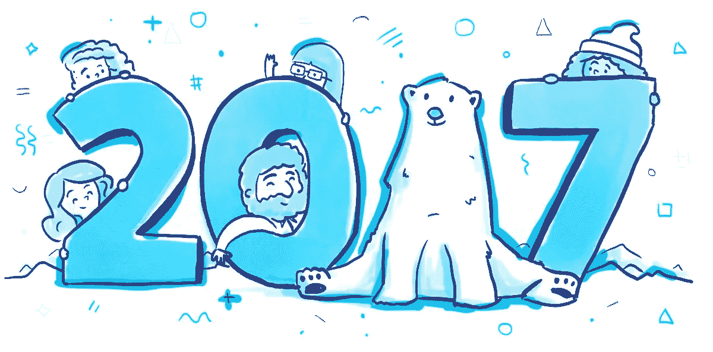
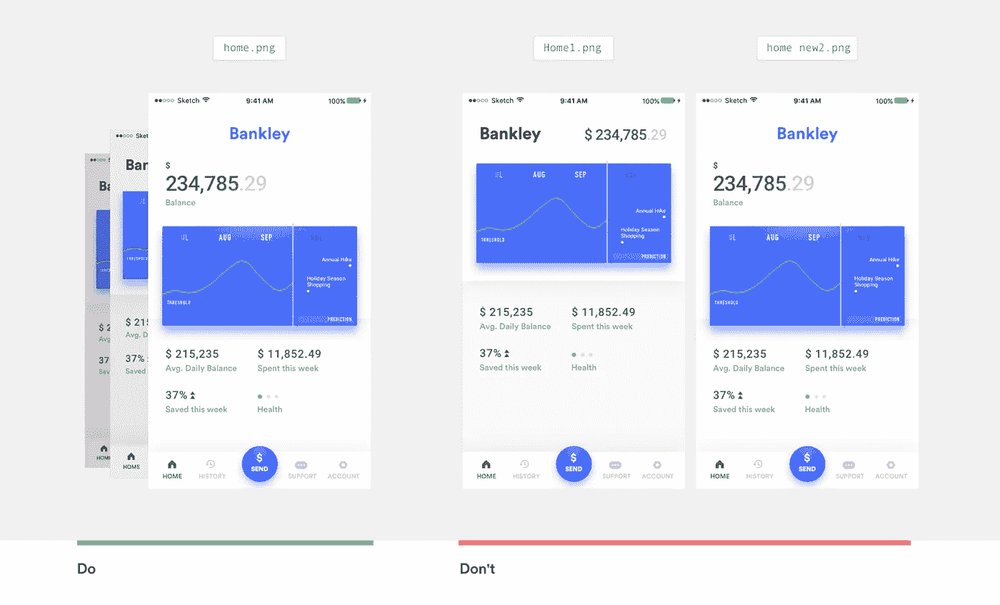

# 2016 年最佳设计文章

> 原文：<https://medium.com/swlh/the-best-design-articles-of-2016-fc2be45f6ef6>

每天有近 200 万篇博文发布。这相当于每年有 7.3 亿篇博客文章。

对你来说幸运的是， [Toptal 设计博客](https://toptal.com/designers/blog)团队在 2016 年阅读了很多。现在，我们分享我们的个人最爱，以帮助您减少噪音，尽可能高效地参与。

无论你是想笑，想得到灵感，还是想学习新的东西，这篇文章都是为你准备的。我相信你没有时间一口气读完每一篇文章，我强烈推荐[把这篇文章收入囊中，以后再看。](https://getpocket.com/)

# 未来/趋势

The [2017 年 UX](https://medium.com/u/8863cbbfbca7#.dlalvpfzu)By[浏览器历史的未来](https://medium.com/u/8863cbbfbca7#.x7sgsjwn0)作者[直观设计与可共享设计](https://medium.com/u/b668b2634046#.p1ujxm1c9)作者[如何假装自己是一名伟大的设计师](https://thedesignteam.io/how-to-pretend-youre-a-great-designer-3625de90d79f#.putpoud2r)作者[设计更好的表格](https://medium.com/u/7f968435c6b9#.9tphzvgde)作者[驱动伟大产品设计背后的心理学的 7 条规则](https://medium.com/u/7012bf7f682b#.9j3z3bsvc)作者 [Muz.li 最搞笑的 gif # 18](https://medium.com/u/8be8d21b7a70#.p3kn9cbyw)作者[创意自信](https://medium.com/u/c6fbb86f1069#.yh3je66nf)作者[设计灵感的大问题](https://medium.com/u/b8a4e5ae7490#.jy2m91jes)

**9 分钟读数**

> ***TLDR*** *:别再在 Dribbble 上找灵感了。你不知道设计背后的背景是什么。很可能你没有和他们一样的问题。*

顶部亮点:

> “要做我们最有影响力的工作，我们应该寻求不被现有的想法所激励，而是更清楚地理解我们和这项工作试图做什么。”

# 工作

# [“我不确定我是否喜欢我在这里做的事情”](https://m.signalvnoise.com/im-not-sure-if-i-like-what-i-did-here-or-not-41d00f518176#.h9jbcxv6p)作者[内容和设计是密不可分的工作伙伴](https://medium.com/u/c030228809f2#.6553umthi)由[聊天机器人:你的终极原型工具](https://medium.com/u/b90ef6212176#.3zk7d23iz)作者 [Pantsuit:希拉里 UI 模式库](https://medium.com/u/86548f7dbecb#.3zk7d23iz)由[设计师不该编码。他们应该学习商业。](https://medium.com/u/86548f7dbecb#.r7e9pe4sc)作者[我作为乐高设计师学到的 5 件事](https://medium.com/u/c6ea80c66737#.66eyqyypp)

**6 分钟读数**

> ***TLDR*** *:这位设计师分享了他在乐高工作的经验，设计了一个秘密的、真实的乐高房子。*

顶部亮点:

> "在每件事物中嵌入小小的惊喜时刻."

# 工作流程

# [窥视脸书设计评论](/facebook-design/peek-inside-a-facebook-design-critique-c4833efda26e#.wabltgp43)作者[如何在设计 UI](https://medium.com/u/e184f9feff12#.fqfy504yj) 时更有条理[如何应用设计思维，HCD、UX 或任何从零开始的创作过程](https://medium.com/u/e29690a4c8ac#.ly4pobr3l)作者[Mohammed Bilal](https://medium.com/u/409333d18adc#.bzgpwupxr)[汤姆·哈曼](https://medium.com/u/1f7e50739095#.sq26qtfdo)[重新设计 Pinterest，由](https://medium.com/u/98b2642f8375#.rp77j9ckh)[Meg robi chaud](https://medium.com/u/221c12574829#.6u2ctaf3s)[如何设计文字](https://medium.com/u/df03fb249bba#.5q2srpwg3)作者[约翰·斋藤](https://medium.com/u/c57a1304a92b#.hzy1km2yt)[用数据设计文字](https://medium.com/u/c57a1304a92b#.5vok4uler)作者[人性化设计](https://medium.com/u/c57a1304a92b#.a1txzt2dn)作者[停止过度使用溢出菜单](https://medium.com/u/e908c3f44253#.2tm9w648e)作者 [WTF 是体验设计？](https://medium.com/u/c6d7332a2978#.1mfbfjoas)作者[停止设计界面，开始设计体验](https://medium.com/u/999fc7f88fff#.khtb61rr3)作者[这是完美的保存图标吗？](https://medium.com/u/de450e432262#.s2vi94715)通过[图马对草图](https://medium.com/u/5889a8464fe7#.slh1zhj1j)由[工具如何塑造设计师的角色](https://medium.com/u/63d03024cad3#.jegp0tf3n)乔纳森·利伯曼[人工智能设计师指南——到 2020 年人工智能将成为 700 亿美元的产业](https://medium.com/u/34a574ee5eb1#.mscuav71h)作者[您的产品已经过时](https://medium.com/u/169d7fb80c3d#part-two)通过[对讲机](https://medium.com/u/7ca8972daf76?source=post_page-----fc2be45f6ef6--------------------------------)

**31 分钟读数**

> ***TLDR*** *:每一个产品最终都会消亡。那么问题就变成了:我们如何生存？*

顶部亮点:

> “没有一种技术是一个系统的中心，而是一群相互影响的主体。”—史蒂夫·辛诺夫斯基

# [通过](https://blog.intercom.com/killer-feature-messaging-no-ones-talking/)[对讲机](https://medium.com/u/7ca8972daf76?source=post_page-----fc2be45f6ef6--------------------------------)发送无人谈论的消息的杀手锏

**9 分钟阅读**

> **:Chat 的线程化用户界面，所有的交流和行为都被置于一个清晰的背景下，即谁、什么和为什么，这是一直存在的杀手级功能，但每个人都忽略了这一点。**

*顶部亮点:*

> *"通过为每一次互动添加更丰富的内容，网络对每个人来说都变得更快、更有效."*

# *在 2017 年保持竞争力。*

*当只有 3%的成年人每天花时间学习的时候，阅读高质量的内容会给你带来竞争优势。*

*我们希望这篇综述能帮助你开始这个学习过程。如果你认为我们错过了一篇特别棒的文章，不要害羞，点击回复，与我们分享你的知识。*

**原载于*[*www.toptal.com*](https://www.toptal.com/designers/ux/article-design-roundup-2016)*。**