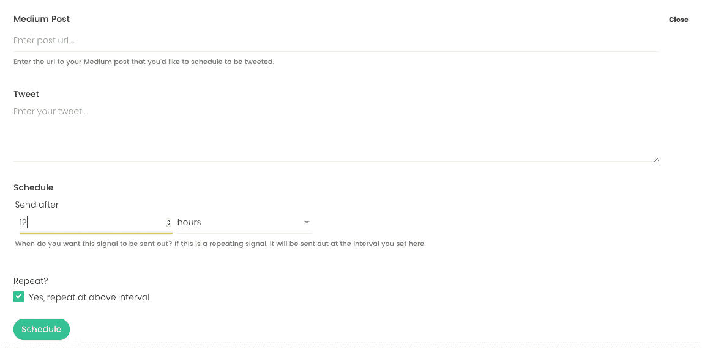

# 似乎没人谈论的最好的媒体工具

> 原文：<https://medium.com/swlh/the-best-medium-tool-that-nobody-seems-to-talk-about-43a7fe6f9320>

我对 Smedian 的爱越来越深。

没错，我甚至不会浪费你的时间去做一个愚蠢的介绍，用 6-7 段来戏弄你。

似乎没人谈论的媒介工具是一个名为 Smedian.com[的网站。](https://www.smedian.com)

> 我不知道为什么更多的出版物和作家不使用它。不知道为什么没有多谈。对于像这样有帮助的东西，每个使用这个平台的作家都应该使用它。

# 我写这些是因为我真的爱斯密提安(和林肯·W·丹尼尔)

坦白说，我是

[我认为任何对媒体认真的人都需要在那里花更多的时间。](https://medium.com/u/1e510272a792#通用频道，供人们交流、提问和互相帮助。
<blockquote class=)

[没有人知道这件事，所以这是一个巨大的机会。](https://medium.com/u/1e510272a792#通用频道，供人们交流、提问和互相帮助。
<blockquote class=)

# [安排你的故事的推文](https://medium.com/u/1e510272a792#通用频道，供人们交流、提问和互相帮助。
<blockquote class=)

[Smedian 现在有点像你的中型文章的 HootSuite(在某种程度上)。](https://medium.com/u/1e510272a792#通用频道，供人们交流、提问和互相帮助。
<blockquote class=)

[有了全新的功能](https://medium.com/u/1e510272a792#通用频道，供人们交流、提问和互相帮助。
<blockquote class=) [Signal](https://writingcooperative.com/introducing-signal-by-smedian-395d998c3ab9) ，你可以插入你的故事的 URL，连接你的 Twitter 账户，并安排这个故事在未来发布。

这太神奇了，而且非常容易做到。

看起来就是这样👆

我会写更多，但这真的很简单。其他的就不细说了！

# 马上上斯米迪安

如果这是你第一次听说 [Smedian](https://www.smedian.com/pubs) ，我会为你感到无比兴奋。

Lincoln 是我的朋友，因为我写了很多关于帮助那些想在媒体上建立受众的人的文章，所以我认为这是写我喜欢称之为 Smedian 2.0 的完美时机。

它可以在这个平台上为你打开一个全新的世界。

> 想在媒体上赚点外快吗？本周我将主持一些免费培训，名为“**如何在 Medium 上每月额外挣 900 美元**”[在此获得免费座位](https://events.genndi.com/register/169105139238473045/da2e6c5a01)！

## 这篇文章发表在[《创业](https://medium.com/swlh)》上，这是 Medium 最大的创业刊物，有+365，945 人关注。

## 在这里订阅接收[我们的头条新闻](http://growthsupply.com/the-startup-newsletter/)。

