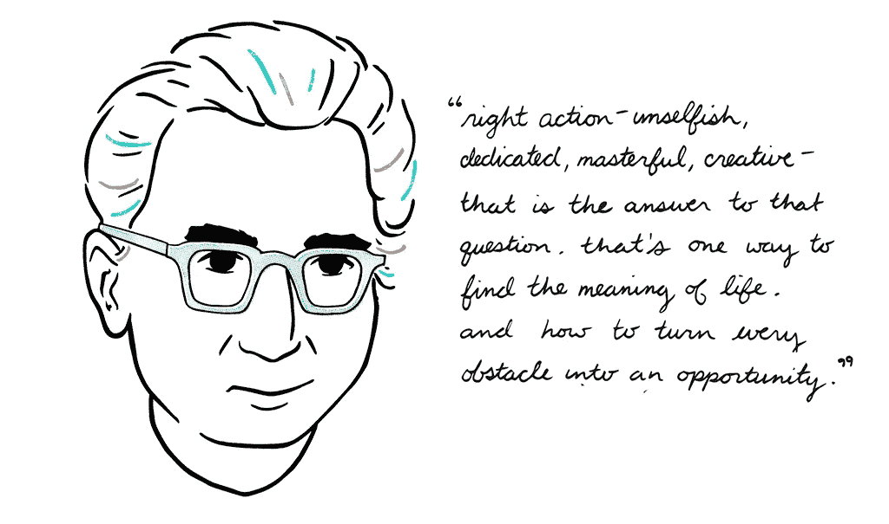

# 最好的时光是慢慢度过的时光——如何慢慢度过每一天

> 原文：<https://medium.com/swlh/the-best-time-spent-is-time-spent-slowly-how-to-spend-time-slowly-every-day-748e5f1f741f>

Art for NuanceNow.com

我的问题是，在未来的几年里，你会有多少最好的部分？你的年龄可能很小，但你比你想象的更接近死亡。”——[T3【本杰明·p·哈迪](https://medium.com/u/5153880ce2ee?source=post_page-----748e5f1f741f--------------------------------) *、博士*

当我花了一上午时间查看电子邮件、网站、我的移动设备、书籍、我的 kindle 以及诸如此类的东西时，我意识到有一场针对我们注意力的正式战争。

新经济是注意力经济，我们的注意力正在被激烈争夺。我们关注的斗士会尽一切努力让我们对他们的网站、应用、产品、工具等着迷。

只要想想你一个人在 FB，谷歌，苹果，亚马逊上花了多少时间。你认为他们不拥有我们？

结果是，慢慢地利用时间变得异常困难*——*选择全神贯注地做一件事，而没有同时做其他事情的冲动，因为没有匆忙感或通知很容易*——去做、回应、完成等等。*

*然而，正是这一点让慢慢地花时间为自己和你所服务的人做卓越的工作变得更有价值。*

*慢慢度过的时间来自于让你的时刻变得有意义的能力——这创造了一种更慢的生活状态。*

# *高度当下的“慢”状态是由你赋予你的时刻的意义所驱动的*

**“时间的压缩不是活动的复合，而是意义的复合。”* [*本杰明·p·哈代*](https://medium.com/u/5153880ce2ee?source=post_page-----748e5f1f741f--------------------------------) *，博士**

*你有多“深入”每一刻？你对时间的消耗有多认真？你对你拥有的每一刻都心怀感激和感激吗？还是你因此而无脑浪费？*

*一个很好的测试就是你每天有多期待醒来。我终于达到了这样一种状态(通过大量的工作),无论今天是什么日子，无论我在做什么，我上床睡觉时都会渴望和兴奋第二天的开始——这是我每天晚上和早上为自己做的选择。*

*拥有控制你的思想、观点、现实、观点、反应、回应、话语的意识，并最终能够控制它们，这难道不令人惊奇吗？*

*现在我已经掌握了这项技能(经过大量的努力)，这是我最期待的简单而“困难”的东西。*

*作为一个奋斗了三年试图获得增长的企业家，经历了一次失败和几次实验，到[最终成功](http://www.traena.io/)，我学会了如何拥抱和欣赏“成功”和“失败”。*

*我现在从简单的东西中获得了如此多的意义。我真的不需要太多别的。我的早晨咖啡被当作一种祈祷仪式——一个表达感激、感受快乐和激发快乐化学物质的机会。*

*你上一次表现出极度的感激、快乐和兴奋是什么时候？是完成一笔大交易、升职还是买车？或者你[让你的上班之路变得美丽](https://themission.co/our-fascination-for-art-says-so-much-about-the-shallow-depth-of-humans-c26edb50e606)。*

*我不是说我对事物没有肾上腺素反应，或者因为我的生存大脑而有恐惧，但我要说的是我可以选择投入工作并有意识地塑造我的现实。*

*你的晨间活动有多深入？是的，我还是比任何人都喜欢美好的东西，但是我现在懂得珍惜了。33 岁学这个晚吗？*

**“与其卖掉我们的未来来获得高质量的东西，我们还不如降低我们东西的质量来提高我们时间的数量和质量。”—* [*本杰明·p·哈迪*](https://medium.com/u/5153880ce2ee?source=post_page-----748e5f1f741f--------------------------------) *博士**

*另一方面，是“硬东西”让我有机会成长和进化为一个有知觉、有意识的存在。情况越艰难，我越知道我拓展了自己的边界，增长了自己的意识，并作为一个人不断进化。*

*因此，我越是渴望不仅能以高昂的热情投入到任务中(洗衣服、交税、付账单等等)。)但是我通过力函数来创造最困难的情况来加速这种增长。*

*生存大脑在接近女人时会害怕吗？如果我没有每天和一个女人说话，我会给我的朋友 200 美元。*

*越努力越好，我越不想去参加会议，做平凡的工作，和女孩聊天或者去机场，我就越投入并拥抱它。*

*在读完维克多·弗兰克尔关于*让*有意义的书后，我完全接受了这样的观点和态度:无论如何，我们都可以选择让每一刻变得糟糕或美好。*

*如果弗兰克尔可以在集中营做到这一点，并创造必要的环境，在恐怖中寻找美好的时刻，并通过有尊严地走出去赢得胜利，你就有能力做到这一点。*

*过了一段时间后，弗兰克尔实际上让集中营的日常生活看起来(他自己主观上认为)没那么糟糕了。那些苹果怎么样？你的“没有激情的工作”或“金钱问题”现在有了更好的背景吗？*

*我不是说这很容易，也不是说试图淡化任何人的问题，我是说形成观点有助于情绪反应，从而减轻压力——这是一种技能。*

**

*Viktor Frankl by Emily May Rose*

*有些无家可归的人比外面的一些亿万富翁生活得更和平、更繁荣、更有自尊。这可能很难理解，但这是真的。*

# *创造意义就是——让它变得有意义*

*慢慢度过的时间是有意义的时间。许多人说并相信“生活是艰难的”——是的，有大量的证据表明，你可以指出并强化这一信念，即生活实际上是艰难的。*

*但是什么是‘生活艰难’呢？不是一个你选择相信的故事吗？你不是选择去看那些证实“生活是艰难的”这一观点的东西吗？那是一个程序，很像一个算法，就在你的大脑里。所以你基于它采取无意识的行动。这和编程中的‘如果这个，那么那个’是一样的。*

*如果我相信这一点，那么我就会以这种方式行事或思考。*

*另一方面，你可以选择看看人类和世界走了多远。随着所有战争的进行，我们像以往一样清醒，暴力实际上已经大大减少了。军队正在减少，各国比以往任何时候都更加为和平与进步而战。当然，有一些渴望权力的混蛋要对付，但达到最低点是重新变得更大和更开明所需要发生的。这就是我认为美国和英国现在正在经历的。*

*重点是，“*生活是艰难的”*是一个想法，你，一个有知觉的、有意识的人类，已经选择认同并有选择的控制权。*

*我们如何应对常见的日常问题，例如没有足够的钱，我知道这是一个巨大的话题，特别是在今天中产阶级人数下降和收入不平等的问题下——这使得这个话题比以往任何时候都更加相关，这仍然是一个选择，我们可以选择如何应对。*

*是的，这很难，需要自律，但如果你知道如何围绕它重新规划你的信念系统，这是可以立即做到的。*

*是你拖欠账单的事实还是你对这个事实的情绪反应？很明显是梯子的问题。*

*当我不得不搬回家住一段时间，同时我的生意开始起步时，我没有工资，债台高筑，花光了我所有的积蓄。这是我一生中压力最大的一段时间。*

*我放弃了一份年薪 30 万美元唾手可得的工作，认为自己可以像前任老板们说的那样轻松地创办一家高增长公司。大错特错。*

*这是大约三年前的事了，老天作证，在过去的三年里我已经进化了三十年，这让我自信地知道，钱对我来说再也不是问题了。*

*不是因为我有制造它的技能，而是因为我知道如何把金钱和事物当作一种理念，如同我把所有的事物当作一种理念，以及相信自己的信心。*

*塑造自己的现实，是为自己思考，对自己的信念有真正的信任的开始。为自己思考的信念是真正的自尊、自爱和力量。*

*活得慢来自深刻的时刻，深刻的时刻来自深刻的意义，而深刻的意义是[的一种选择](https://themission.co/ive-figured-out-the-meaning-of-life-and-it-boils-down-to-one-word-d43361748e44)。接受这是你的责任是必须的。*

*[点击接收我个人用来赢得一天的晨间例行电子表格和愿景板。多年来我一直在改进它，它改变了我的生活。每周日早上你还会收到我的最佳每周文章。](https://betreatedhowyouwanttobetreated.com/optin-main)*

**

## *这篇文章发表在 [The Startup](https://medium.com/swlh) 上，这是 Medium 最大的创业刊物，有+ 381，088 人关注。*

## *订阅接收[我们的头条新闻](http://growthsupply.com/the-startup-newsletter/)。*

**