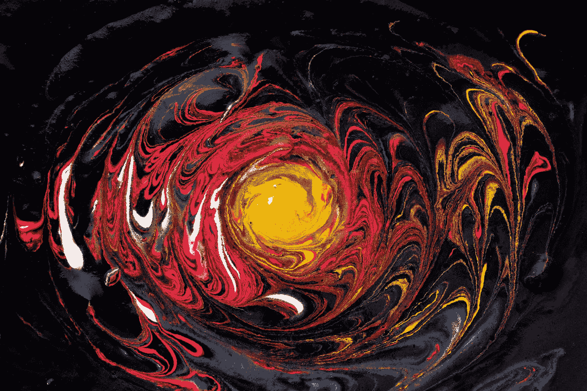
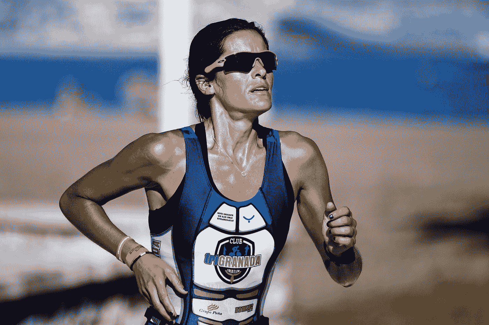

# 提高智力和变得更聪明的最好方法

> 原文：<https://medium.com/swlh/the-best-way-to-improve-your-intelligence-and-get-smarter-45c62bdaa1db>

提高智力的最好方法是在你的头脑中建立心智表征。亿万富翁、伯克希尔·哈撒韦公司副董事长、也被称为沃伦·巴菲特的合伙人查理·芒格(Charlie Munger)称之为 ***心智模型*** 的概念。

> **心理模型是一种方法**,它在心理上把大量但数量有限的基本的、不变的知识归档，形成**工具，这些工具可用于评估现实世界中出现的无限数量的独特场景**。

在 20 世纪 90 年代的一次著名演讲中，芒格解释了他获得实用智慧的方法:

*“嗯，* ***第一条规则*** *是，如果你只是记住孤立的事实，并试图将它们一一反驳，你就无法真正了解任何事情。如果事实不能在一个理论的格子里联系在一起，你就没有可用的形式。*

你的头脑中必须有模型。你必须在这个模型的网格上安排你的间接和直接的体验。你可能已经注意到有些学生只是试图去记忆和死记硬背所记住的东西。他们在学校和生活中都失败了。你必须把经验挂在你头脑中模型的格子上。

*有哪些型号？第一条规则是，你必须有多个模型，因为如果你只有一个或两个正在使用的模型，人类心理学的本质是你会折磨现实，使它符合你的模型，或者至少你会认为它符合。…*

而且模型必须来自多个学科，因为世界上所有的智慧不可能在一个小小的学术部门中找到。这就是为什么诗歌教授总的来说在世俗的意义上是如此的不明智。他们脑子里没有足够的模型。所以你必须有横跨一系列学科的模型。

芒格的系统就像**“头脑的交叉训练”我们不是把自己局限在学校里学过的那些小而有限的领域里，而是学习一套广泛有用的关于世界的知识，这些知识将在生活的各个方面为我们服务。**

> 简而言之，心智模型是一种增强你的认知器官的方式，目的是做出更明智、更具战略性的决策。

**贾斯汀·马斯克(埃隆·马斯克的前妻)**也用不同的话说得很漂亮:

*“选择一件事，成为它的主人。选择第二件事，并成为这方面的大师。* ***当你成为两个世界*** *(比如工程和商业)的主人时，你可以将他们聚集在一起，a)互相介绍热门创意，* ***这样他们就可以有创意，创造出前所未有的创意宝贝****；b)创造竞争优势，因为你可以在两个世界之间移动，说两种语言，联系各个部落，融合各种元素，激发出新鲜的创造性见解，直到你醒来时顿悟，改变你的生活。”*

Photo by [Daniele Levis Pelusi](https://unsplash.com/@yogidan2012?utm_source=medium&utm_medium=referral) on [Unsplash](https://unsplash.com?utm_source=medium&utm_medium=referral)

任何人都会说这是一项艰巨的任务。

是的，它是。但是付出努力的回报难道不值得吗？这就是为什么成功人士能够事半功倍。

正如查理·芒格所说，看看沃伦·巴菲特将心智模型付诸实践所获得的回报。沃伦能够做出最快的决定，即使是价值数百万美元的投资。这就是为什么**他每小时能赚 154 万美元**(你可以根据 Wealth-X 2013 年的报告计算每小时的工资，该报告称沃伦·巴菲特在 2013 年赚了 127 亿美元**)。**

# ****如何将这些知识运用到实践中？****

**我们都同意知识是潜在的力量。但是付诸行动的知识才是真正的力量，一个人必须将这些知识付诸实践。正如 Anders Ericcson 在他的书《新专业科学的秘密》中所说的那样，这种实践需要是一种有意识的实践。安德斯解释了刻意练习是如何为你打开任何可能性之门的关键。用他的话说:**

****

**Photo by [Avrielle Suleiman](https://unsplash.com/@elleirva?utm_source=medium&utm_medium=referral) on [Unsplash](https://unsplash.com?utm_source=medium&utm_medium=referral)**

******将专家与我们其他人区分开来的主要原因是，他们多年的实践改变了他们大脑中的神经回路* ***产生高度专业化的精神表征*** *，这反过来又使难以置信的记忆、模式识别、解决问题和其他各种在其特定专业中脱颖而出所需的高级能力成为可能。你对一个主题研究得越多，你对它的心理描述就变得越详细，你就能更好地吸收新信息。他接着说:“没有理由不追随你的梦想。* ***刻意的练习可以打开一扇通往可能性世界的大门*** *那些你可能已经确信是遥不可及的事情。打开那扇门。”******

# ***希望你喜欢这篇文章！***

***你能给我一两下掌声吗？***

# ***如果你喜欢上面的，你也会想看看我下面的其他文章:***

***[**利用沃伦·巴菲特的 5/25 法则更快实现你最重要的目标**](/@sombathla/apply-this-5-25-formula-to-achieve-goals-that-matter-most-to-you-ccbdfe664a2)***

***[**2 种有效的技巧成为你想要的任何技能的专家**](/datadriveninvestor/2-effective-techniques-to-become-an-expert-in-any-skill-you-want-eb48ea35cd85)***

***[**当风险太高时做出整体决策的 4 步流程！**](https://blog.usejournal.com/the-4-step-process-to-make-holistic-decisions-when-stakes-are-too-high-fc0dc7c96f44)***

# ***想提高你的表现(和结果)吗？***

## ***[点击此处下载免费报告，学习 5 种心态转变，在短短 30 天内提升你的表现](https://sombathla.com/mentalshifts/)***

******

***Photo by [Quino Al](https://unsplash.com/@quinoal?utm_source=medium&utm_medium=referral) on [Unsplash](https://unsplash.com?utm_source=medium&utm_medium=referral)***

## ***[Master 5 心态转变，在短短 30 天内提升你的表现——下载你的免费报告](https://sombathla.com/mentalshifts/)***

******

## ***这篇文章发表在 [The Startup](https://medium.com/swlh) 上，这是 Medium 最大的创业刊物，有 286，184+人关注。***

## ***在这里订阅接收[我们的头条新闻](http://growthsupply.com/the-startup-newsletter/)。***

******