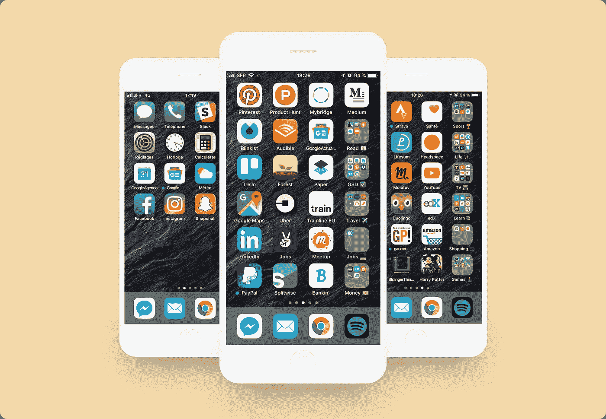
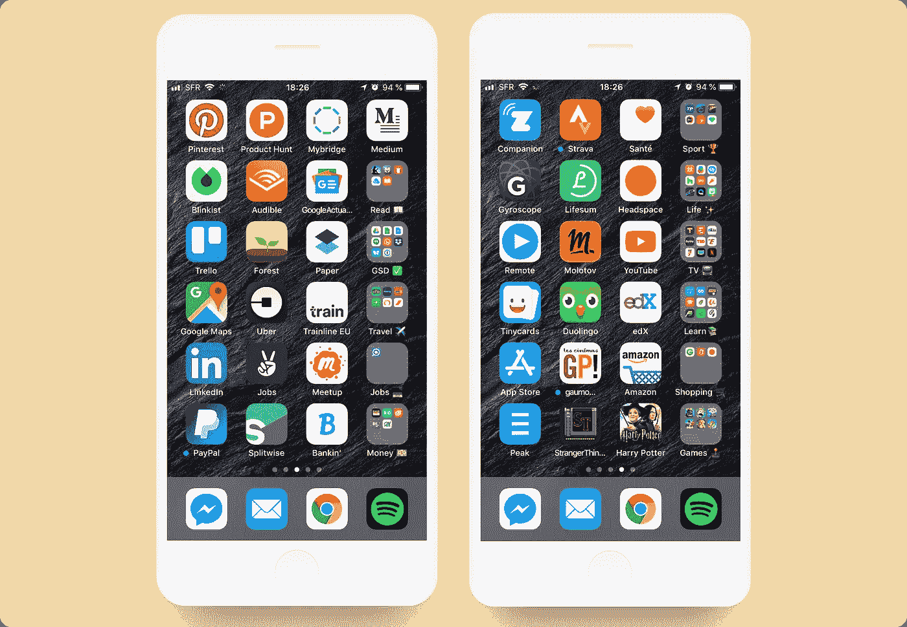
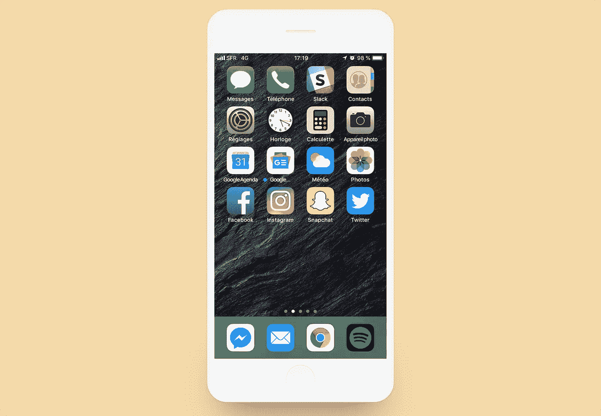

# 整理 iPhone 应用程序的最佳方式

> 原文：<https://medium.com/swlh/the-best-way-to-organize-your-iphone-apps-d87ca4e04a77>

The best apps organization method you’ll find on earth ! 🌎

自从八年前我获得了神奇的 iPhone 4 以来，我一直在使用 iPhone。很长一段时间，我都很沮丧。我从来没有对我的应用程序组织感到满意，我敢打赌，我不是唯一一个曾经与之斗争的人。但是去年，我找到了一个创造性的方法来解决这个问题。自从我的“启示”，我没有更多的问题。

如果你和我一样，想检查以下几点，这个方法适合你。

*   ✅在我需要时快速找到我的应用程序。
*   ✅实现了一种方法，它甚至可以在我上百个应用程序上运行。
*   ✅和我的组织保持着逻辑关系。
*   ✅:每次添加/删除应用程序时，不需要改变一切。

# 该方法

我们到了。这个方法很简单，但却是我发现的最有效的方法。

**原理:**每一行都被分配到一个类别。我注意到，通常，我们可以在我们的应用列表中创建至少四个应用的类别。

你需要做的是，对于每一行，选择你最常用的前三个应用程序，对于第四个槽，创建一个文件夹，名称为类别*(你可以使用表情符号以增加可读性)*。

以第一个屏幕截图的第二行为例。这就是“读📖“类别。我决定推出 iBooks / [Blinkist](http://bit.ly/alex-blinkist) 和 [Audible](https://www.amazon.fr/dp/B01AUIE0CK?tag=AlexLevacher21) 。然后，我用该类别的名称创建了文件夹。

> **主要优势**，就是你只需要扫描屏幕的右边部分，就能快速找到类别，然后找到想要的应用。

此外，如果您想要添加或删除应用程序，此方法不会破坏您的配置。有时人们每个类别都有一个页面，所以当他们有超过 24 个应用程序时，他们就很烦。

就我个人而言，我讨厌在同一行中混合相同类别的应用程序，或者我的应用程序在我的屏幕上如何显示没有逻辑。所以我实施了这个方法，我发现它真的很令人满意。

# 主屏幕

这里没有什么花哨的，这是 iPhone 的默认主屏幕配置和我最常用的应用程序之间的混合。

你会看到接下来的页面遵循一个严格的组织，我不想在我的第一页应用这种方法。

**您需要:**选择您经常使用且需要快速查找的 app，或者以下方法不匹配的 app。

请在评论中告诉我你是否喜欢它，以及你是否打算按照这个方法来整理你的 iPhone。

## 这个故事发表在 [The Startup](https://medium.com/swlh) 上，这是 Medium 最大的创业刊物，拥有 295，232+人关注。

## 在此订阅接收[我们的头条新闻](http://growthsupply.com/the-startup-newsletter/)。

