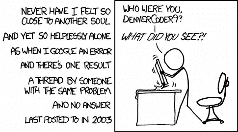

# 关于“技术人员”的大秘密，修理东西和如何控制你的技术

> 原文：<https://medium.com/swlh/the-big-secret-about-tech-people-fixing-things-and-how-to-control-your-technology-247f59c5ca99>

Photo by [Patrick Lindenberg](https://unsplash.com/photos/1iVKwElWrPA?utm_source=unsplash&utm_medium=referral&utm_content=creditCopyText) on [Unsplash](https://unsplash.com/?utm_source=unsplash&utm_medium=referral&utm_content=creditCopyText)

## 提示:这既不困难也不危险

在这篇文章中，我想谈谈“技术鸿沟”以及如何在解决技术问题上变得熟练，即使你以前从未做过。

## 差距

人们处理技术问题的方式存在根本分歧。似乎有些人将电脑、智能手机和其他技术设备视为“黑匣子”，大部分时间都在做他们想做的事情，但有时会出现令人沮丧的错误或干脆停止工作。

其他人(眨着眼睛被称为“技术人员”)将这些设备视为一个由部分组成的系统:硬件、软件和运行在互联网上的东西。虽然错误和失败确实令人讨厌，但它们仅仅是系统某个部分出现故障的症状。**既然是技术，各种部件都可以固定。**

那些群体的区别在于，第一个群体被技术吓倒了——你可能会听到有人说“哦，他(电脑)不喜欢我”，好像这是个人的事情，可以归咎于技术系统。另一组人并不把责任归咎于系统作为一个整体，一个邪恶的实体，而是把它当做一个部分的集合。

属于第一组并不可耻，毕竟，技术教育和系统思维很少被教授，如果你从来没有别人向你介绍过这个话题，你可能永远不会接触到它背后的想法。然而，我鼓励你继续读下去，并发现它很容易理解，并很快转向“技术”方面。

**你为什么要这样做？因为它给你力量和控制你所拥有的东西。一旦你理解了基础知识，你绝对有能力修复软件和硬件问题。每次你成功地解决了某件事，你就会获得自信和经验。另外，这真的很有趣。**

## **一切都只是零件的集合**

正如简介中提到的，每一项技术都是一个精心制作的部件集合，分为硬件和软件。硬件是你随身携带的实际东西，大多数时候是完成某一功能的小电路板或芯片。

两件好事:这些组件在几乎所有系统上都是相似的(我指的是电脑、平板电脑和智能手机)。

它们都有一个处理器单元(进行计算)，一个永久存储器(例如，你所有的照片都在那里)和一个临时存储器(将当前正在使用的文件提供给处理器)。

这三个对于基本功能是绝对必要的。当然，你还有支持其他一切的东西:电池、屏幕、传感器、输入设备(键盘、触控板)、无线芯片和一系列将一切连接在一起的电路板。

第二个好处是，你不需要了解每个组件是如何工作的(甚至系统是如何工作的)，你仍然可以把系统作为一个整体来修复。

在此之上，还有软件:操作系统和运行在该系统上的应用程序。同样，你不需要理解这一切是如何运作的，只要意识到它的存在就行了。

## 你试过关机再开机吗？

这似乎是一个老掉牙的笑话，但却是千真万确的。几乎所有系统中一半以上的错误都可以通过关闭并重新启动系统来“修复”。

这允许系统从一张白纸开始，它重新加载软件并重新开始所有的计算。

这确实是“技术人员”在试图解决问题时首先要做的一件事。关闭所有设备(完全关闭，最好也断开电源)，然后重新打开。你会惊讶地发现有多少错误再也不会出现了！这种技术可以适用于重置和重新安装软件，但是我们将在以后的文章中讨论这一点。

关机。把它打开。修正你的大部分错误。

## 你不能真的打碎东西

我发现大多数时候，人们不想去修理东西，因为他们害怕永久性地损坏那些东西。

另一件好事(这篇文章充满了积极性):只要你不从物理上破坏系统的一部分，你就不能真正破坏什么东西。让你的技术保持干燥和适度清洁是一个好的开始。

你也不太可能把你的软件损坏到无法修复的地步。请放心，几乎总是有办法完全重置一切。这就把我们带到了下一点，然后我们将进入细节。

## 安全存储您的文件

如上所述，您的文件存储在设备的永久存储器(硬盘)中。幸运的是，在过去的十年里，把你所有的文件储存在“云”里变得非常容易，这意味着在互联网的某个地方有一台独立的电脑，由一家公司拥有。

这些服务中最著名的是 Dropbox、iCloud、GoogleDrive 和 OneDrive，它们可靠且被广泛使用，而替代服务可能适合特殊需求。

我不会详细介绍如何选择最佳服务，你可以在谷歌上输入“2018 年最佳云存储提供商”。

重点是:虽然我说过你不能破坏你系统上的任何东西，但如果你不先把它们保存在另一个设备上，你可能会丢失你的文件、程序、设置和成就。

维修时，使用云存储、外部硬盘或其他计算机将重要文档移出系统。

## 事情会变，不管是好是坏，永远不会只有你一个人

你知道这句话:永远不要改变一个正在运行的系统。许多软件开发人员似乎没有注意到这一点，他们在不断更新、改进、迭代和改变。

这些变化大多是良性的，但有时它们会破坏你工作所依赖的东西。它很烦人，耗费精力和时间。

然而，我们都必须接受它，这是我们为加速技术进步所付出的代价。

尽管有无数不同的技术配置、操作系统、智能手机和程序，但很有可能某个地方的某个人已经遇到了同样的问题，并找到了解决方案并与全世界分享。

这就把我们带到了…

## 大秘密

这是一个大的。你期待已久的秘密。“技术人员”实际上是如何解决问题的？

答案当然是一个简单的过程。

**他们用谷歌搜索错误，然后效仿其他人尝试过的任何方法。**

是的，就这些。这就是大多数错误被解决的方式，也是大多数事情被修复的方式，事实上，大多数事情是被学习的方式。

你只需谷歌一下你想做什么，然后花些时间浏览答案。这可能不是对你有帮助的第一个答案，但有可能在前五个答案中的某个地方，会有帮助。

艺术在问题的正确措辞之内。我给你举个例子:最近，我的 3D 软件“Blender”开始显示黑框，而不是通常的界面。它有点烦人，所以我试着修好它。

以下是你如何构建谷歌查询:首先输入程序名，然后添加一个简短的错误描述。例如:“blender 3d 显示黑色用户界面”。以下是谷歌给我的信息:

Click on the first answer.

我直接找到第一个答案，那是一个叫做 stackexchange.com 的网站。这是一个回答很多技术问题的平台/社区，非常值得信赖。看了别人问的问题，我想他们也有同样的问题。看，下面有一个答案。

Turn off nVidia shadowplay, thanks J. Larsen!

我知道 shadowplay 是我显卡的一个程序，所以我把它关了。

**它修复了这个问题，不再有黑匣子。**

如果我不知道如何关闭它，你猜怎么着:我会谷歌一下(“关闭 nvidia shadowplay”)。网上什么都有教程。

这个原则也适用于任何错误消息。

只是不要生气地点击它，看着它，阅读它，如果你不理解它，把确切的词复制到谷歌，结合它来自的软件，例如“windows 10 错误 0x80200056”。它看起来像胡言乱语，我不知道它是什么意思，但其他人知道！

把它放进谷歌，读第一个答案(像认真地，像一个真正好的食谱一样读)，然后照着做。

请记住，你不太可能打破任何东西，所以请按照步骤来做。

然后还有这个案例:

[https://imgs.xkcd.com/comics/wisdom_of_the_ancients.png](https://imgs.xkcd.com/comics/wisdom_of_the_ancients.png)

是的，有可能你的问题是绝对罕见和独特的。这发生在我们每个人身上。我们与之共存。我们重装了整个系统。我们买了一台新电脑。但是我们可以说我们努力了。

下周我可能会更深入地讨论这个问题，但是现在，你已经对你的技术有了一个基本的了解！

你越是修正、尝试和改变，你就会变得越自信。

很快，你就会成为“科技人”中的一员。

欢迎光临。

## 这个故事发表在 [The Startup](https://medium.com/swlh) 上，这是 Medium 最大的企业家出版物，拥有 282，454+人。

## 订阅接收[我们的头条](http://growthsupply.com/the-startup-newsletter/)。

