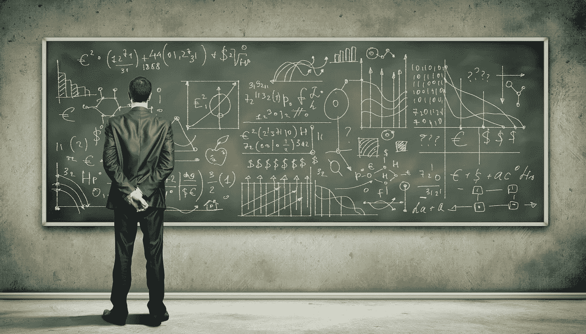

# 21 世纪最大的挑战以及如何应对

> 原文：<https://medium.com/swlh/the-biggest-challenge-of-the-21st-century-and-how-to-master-it-b7da24fe4ca4>

马克斯·卢科明斯基

*不用说，在过去的几十年里，生活节奏加快了，变得前所未有的快。现代世界一贯将标准定得很高，并邀请我们走上快车道。*

随着快速技术进步的到来，人们确实开始感到匆忙、忙碌和不知所措。

这也难怪为什么…

每个人都想在同一时间去任何地方做任何事情。但是，不太可能是一种内在的欲望。这看起来更像是一种外在要求。

事实上，通过参加你的信用卡允许参加的所有在线课程，对世界提供给你的每一个机会说“是”，追求多种职业，并试图同时创办几个企业，最大限度地利用你的时间的愿望，是由担心成为落后于全球竞争的过时落后者引发的。

最终，今天生活的最大挑战很简单:你需要保持相关性。

在越来越快的世界中保持相关性不仅至关重要。这是被倾听的唯一方式。这是现代社会所要求的唯一方式。

拥抱真相。如果你不不断提高自己，总有一天你会变得过时、保守和落伍。考虑到一切事物的发展速度，你今天的知识和技能在几十年甚至几年后将变得毫无价值。

适应和响应变化是至关重要的。这是保持相关性的必要条件。

然而，问题是关联的本质经常被误解。对如何适应当前竞争现实的扭曲理解导致了优先级的缺失和对看似重要的一切的混乱追逐。

此外，社交媒体的巨大世界意味着不让你通过用越来越多“有新闻价值”和“值得信赖”的东西轰炸你的新闻源来逃避这场竞赛…

事实是，相关性并不意味着消费你所能得到的一切。这不是要你去任何你被邀请去的地方。这也不意味着总是说“是”。

相反，它是关于在分配你的时间和努力到新的承诺时要挑剔和合理。

赢得 21 世纪最大挑战的秘诀似乎有悖常理。然而，这是对付早先未知的生命速度的唯一方法:

> 放慢速度以获得更多

像对待马拉松一样对待你的生活。不是短跑。

不要加速太多。不要试图在同一时刻做所有的事情和出现在所有的地方。不要试图让你的生活充满大量的新项目、新技能、人际关系和成长。

相反，学会优先考虑你的承诺，过滤掉那些不完全适合你想成为的人的活动。

同时在几个领域保持相关是不可能的。不要试图证明它是错的。最终，由于自然的时间限制和无限可更新的信息处理和消化量，这是不可行的。

专注于对你来说最重要的事情，把你所有的精力都集中在你所做的事情上。

否则，你很可能会分散你的注意力，从而把你的时间投入到不会增加任何价值的事情上，而只会制造出进步的假象。

要想在 21 世纪有所作为，并不需要你成为一个万事通。不要试图成为一个事事得体的人。渴望在某件特定的事情上做到最好。

> 相关并不意味着没有弱点。这只意味着坚持不懈地提高你的优势。

变得非常清楚你想持续保持相关的领域。明确你需要提高哪些技能，尽你最大的努力在通往终极掌握的道路上变得不可阻挡。

然而，请记住，不可阻挡并不总是意味着快。很多时候，为了获得更多的成长，你需要降低速度，休息一下。你需要休息一下，把所有的点连接起来，让事情在你的脑海里安定下来。

放慢脚步，利用这段休息时间明确你想要实现的目标。想象你走向他们的道路。承认你所犯的错误，并从错误中吸取教训。考虑到你在前进的道路上可能面临的所有障碍。

如果你能成功地做到这一点，你实际上可以为进一步的发展打下更坚实的基础。这样你就可以将你的技能保持在一个长期相关的水平上。

当你觉得需要休息的时候，放慢脚步。在下一次巨大的飞跃之前放慢脚步。放慢速度以获得更多。放慢速度，保持相关性！