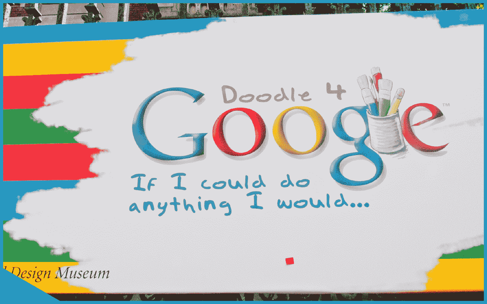

# 你忽略了品牌忠诚度的最大因素

> 原文：<https://medium.com/swlh/the-biggest-factor-in-brand-loyalty-youre-overlooking-7fefa5e3f963>

[Left Photo](https://unsplash.com/photos/7FUonsyKnLc) by Hans Veth via Unsplash [Right Photo](https://www.flickr.com/photos/40748539@N00/2744080747/in/photolist-5bu8B2-nonkxx-bLTADR-nGD6DM-bLTB5x-bLTB4a-bxYV3A-8btDTT-bxYUHW-gAii3e-UWGnfu-6xDbHw-6xz4Pv-8AjwFQ-etkbxa-etpHQA-etrxNP-etuTtW-etosD9-5DMdYp-6xDaBA-4YQ4Na-etpofk-6xz3mB-etupNq-6xDbc5-8AjyrN-8Ajvrb-8bwWw5-noxibG-5byqp5-gAicLJ-nEyGnV-non3Q5-nCZaab-nF1Bds-5byrKC-cRepXJ-5bu9rp-5byrej-non25w-gS1UMD-pUMQ5L-nomX6k-nGPa7Z-8btE6X-nCZ8uN-nEJMJX-nondvQ-nonpmK) by Phil Kalina via Flickr CC

大多数组织通过“品牌指南”来定义他们的品牌虽然这些是朝着正确方向迈出的一步，但它们还不足以创造一个人们喜爱的品牌。只要看看“品牌指南”这个名字就知道了你认为这与团队成员如何在组织内互动有关吗？没有。这个名字真的意味着在你的设计中注入情感吗？不完全是。“品牌”这个词本身就有一种假面、面具的含义。大多数时候，这些指南只是被视为一种营销努力，以确保我们的设计和广告的视觉方面是一致的(我们的颜色十六进制代码是#2196F3，而不是#1E88E5。你能改变文字来匹配那种颜色吗？)这不仅延续了设计只关乎视觉元素的神话，也无助于我们为顾客创造真正难忘的体验。

人们不会因为品牌的配色而爱上它。人们爱上品牌是因为[他们认为品牌是人](https://innovateeverything.io/how-to-build-authentic-products/)。当你遇到一个新的人时，你会对这个人是只是泛泛之交还是一辈子的朋友做出各种判断。但比审美更重要的是他们的**个性。**

个性对于我们如何与他人相处至关重要。为了帮助说明这一点，让我们看几个结构和情节都很相似的故事:*哈姆雷特*和*狮子王*。这两个故事都是关于一个王子，他的父亲，也就是国王，被他们的叔叔为了夺取王位而谋杀了。每个王子的目标都是为他父亲的死报仇。(一路上，他们甚至都被父亲的鬼魂拜访过。)尽管有这些相似之处，但这些故事却有着天壤之别。这主要是因为主角辛巴和哈姆雷特的性格非常不同。辛巴的故事从天真和充满自豪开始，变得无忧无虑，然后，在最后，平静而自信。哈姆雷特的性格要阴暗得多。他是疯狂的，沉思的，狡猾的，富有哲理的，这些品质只会随着故事的继续而加深。这些截然不同的性格最终使故事朝着不同的方向发展。辛巴的故事以他声称自己在王位上的合法地位拯救了他的王国而结束，而哈姆雷特的故事则以几乎所有人，包括他自己，都过早死亡而结束。呀。

在电影和戏剧的背景下，很明显个性对故事有多重要，然而大多数人并没有太多考虑他们组织的个性。《从为什么开始》一书的作者西蒙·西内克认为，“除非员工先爱上一家公司，否则顾客永远不会爱上它。”热爱你的组织首先需要与目标联系起来，然后是拥抱它独特的个性。

# 杰出的人物

让我们来看看掌握了创造人格艺术的四个组织。像 Simba 一样，这些组织都遵循与市场中其他组织相似的模式，本质上为客户的相同需求服务。但是他们的行为方式，他们表达个性的方式却完全不同。结果呢？世界上一些最受欢迎的品牌。

# 星巴克

[Photo](https://unsplash.com/photos/gfLlvYFD7NE) by Hans Vivek via Unsplash

星巴克的个性符合其激励和培养人类精神的宗旨。它们友好、干净、现代、人性化，让每一位游客都感到宾至如归。他们个性的关键还在于一致性。每个位置都唤起相同的感觉，同时仍然忠实于它的邻居的感觉。为了实现这一目标，星巴克在培训上投入了大量资金。事实上，他们花在培训上的钱比花在广告上的钱还多。他们的“绿色围裙书”提醒每个员工他们的五个主要价值观:让它成为你自己的，一切都很重要，惊喜和快乐，拥抱阻力，留下你的印记。他们甚至制作了自己的员工棋盘游戏，学习如何在为顾客提供咖啡时让他们感到融入其中。星巴克甚至[关闭了 8000 家分店，进行了一个下午的种族偏见教育。这种培训转化为许多个人的小细节，让你觉得星巴克是一个属于你的地方。咖啡师在我们的咖啡上写下我们的名字，他们开始了解我们，他们让我们想呆多久就呆多久。](https://www.cnbc.com/2018/04/18/starbucks-is-closing-for-an-afternoon-in-may-and-it-could-cost-them-millions.html)

# 西南航空公司

[Photo](https://unsplash.com/photos/4SfHeE5MpFk) by Kyle Glenn via Unsplash

出于将人们与对他们重要的事物联系起来的目的，西南航空认为这种联系应该是有趣的。这个决定导致了西南航空鲜明的个性。他们试图将乐趣注入到旅行过程的每一个环节，并鼓励每个员工都拥有自己的乐趣，体验自己的旅行。在整个起飞过程中，飞行员和乘务员经常开玩笑，[甚至唱歌。](https://www.youtube.com/watch?v=DYA_ivyj3kE)

毫无疑问，这是为什么在一个以财务困境闻名的行业，他们已经连续 40 年盈利(而且还在继续)的主要原因之一。为了保持这种势头，西南航空公司有意通过四种不同的讲故事技巧在内部推广这种个性。每周，他们的首席执行官加里·凯利都会花时间向那些在客户服务方面表现出色的会员大声疾呼。其次，他们的月刊《西南*精神*》刊登了一篇文章，重点介绍了一名团队成员和他们令人难以置信的客户服务。第三，他们有各种各样的奖励计划。最后，他们制作了美丽的视频，记录了真实的人在西南航空飞行的故事。

# 苹果

[Photo](https://unsplash.com/photos/NXP7wGyUDeY) by Carles Rabada via Unsplash

苹果的个性是他们将技术个人化的目的的自然延伸。为了做到这一点，他们需要将以前只有大学实验室和大公司才能获得的产品转变为每个消费者都想要的东西，因此他们将计算机(以及他们的个性)变得既酷又时尚。这种对设计的专注成为了苹果的代名词，主导了他们的个性。他们痴迷于确保每一个小细节都设计有这些个性特征。众所周知，史蒂夫·乔布斯想确保即使是电脑的内部也设计得很漂亮。他甚至将这一理念延伸到包装本身、它们所在的商店以及它们发布的活动中。然而，这种对创造最精美设计产品的痴迷导致了另一种个性特征:保密。苹果专注于在每一次产品发布时创造一个“惊艳”的时刻，这造就了其保密和控制的个性。

# 谷歌

[Photo](https://www.flickr.com/photos/karenhorton/4657669777/in/photolist-86zLXk-9RSkNj-9uMQgu-7H8Yq-8Qs8xx-4oT5mJ-5TJJZg-dhfcCb-9iATqR-p87MRm-6DTwvX-6TCXAZ-7BREok-6izonC-9iATrB-8QveE1-bqJ57L-dCV3mq-btuHFt-dhfc7p-dhfgpg-dhf88d-dhffWN-9Whdf8-dhfbC5-dhfeMw-dhf8yY-dhf5dD-dhf6Br-dhfd4v-dhfa33-gapmKH-fFhtbL-dhfdBz-f2YQAm-aayiSx-ajoPZu-eVmTT9-5tDvzy-eVavLx-pudgzg-8Qs9tZ-9iATra-8QvfhJ-edV8je-75LVd7-eVavP6-6MeQ3Y-5VcHZe-8Xnxz1) by Karen Horton via Flickr CC

谷歌已经接受了鼓励谷歌每个人把自己当成创始人的想法。这种心态导致了两种性格特征——独立和个人主义。我们在他们的团队和设计中都看到了这些特征。谷歌甚至创造了自己的词来描述这些特质——“谷歌性”。谷歌性就是挑战现状，独一无二。这是关于拥有你自己的惊人的品质并展示出来。这是关于拥抱让你成为你的东西，以创造出令人惊叹的设计。以谷歌涂鸦为例。大多数时候，谷歌的主页会把普通的谷歌标志变成一个独特的插图/动画/互动游戏，与历史上今天的重要事件相关。这种有趣的标志转换反映了他们的谷歌性，但也通过强调每个人都应该知道的关于今天的信息推进了谷歌的目的。

就像*狮子王*和*哈姆雷特*的故事一样，谷歌和苹果表面上看起来非常相似，但让这些故事不同的是它们不同的目的和个性。苹果的保密和控制个性与谷歌的透明个性相去甚远。他们努力在自己所做的一切事情中体现这一特点——从为互动而设计的开放式办公室，到谷歌的任何人都可以向创始人提问的周五会议，再到让其他组织免费使用他们的安卓软件的决定。
这些超大人物的影响呢？星巴克是最大的连锁咖啡店，有超过 27，000 家分店。西南航空公司是历史上最持续盈利的航空公司。苹果和谷歌是世界上最有价值的公司。

# 定义您组织的个性

那么，如何为你的品牌创造一个成功的个性呢？因为你的个性是让你独一无二的，没人能告诉你你的个性特征应该是什么。然而，可以肯定地说，你的个性需要直接支持你的[目的](https://innovateeverything.io/how-4-industry-leaders-use-the-power-of-purpose-to-innovate/)。如果你的个性与你的目标相冲突，你将很难有所创新。

组织可能被诱惑去创造多重人格，一个内在的，一个外在的。然而，这是非常危险的。人类已经进化到能够辨别模式的不同。内外性格不同导致客户质疑你的真实性。当组织害怕将个性注入到他们的设计中时，内部和外部之间的这种分歧经常发生。但是如果没有情感，你的产品或服务将会很无聊，或者更糟，不真实，你的组织也不会脱颖而出。

与其只是定义品牌指导方针然后就此收工，不如遵循这六个改编自艾伦·沃尔特[的*带着感情设计*](https://abookapart.com/products/designing-for-emotion) 的步骤来全面定义你的组织的个性。

**性格特征**

让每个人描述你的组织。整合所有这些。选择你想强调的 5 个最重要的特征。确保这些真的与你的独特目的相关。

**个性形象**

找一堆形象地代表你的每一个特点的图片。那就缩小范围。最后，从零开始，创造你自己的形象，从你选择的例子中得到启发，来说明你的组织的个性。

**你的视觉词典**

从颜色到图像到重复出现的视觉主题，为你所有的审美创造规则。如今，大多数品牌指南都会关注这一步。还是那句话，品牌指导方针是好的，只是不够深入。

**你的声音**

描述一下你说话的方式。实际上在这里给例子，你的设计和你的成员说话的方式。关键是要确保你的设计有一种语言，这种语言在不同的设计之间是一致的，并且与你的组织成员的语言一致。例如，如果你试图拥有一个专业的声音，但你的成员大多是悠闲的，那么你的客户就不会真正感受到它。

**你的仪式**

这些是你在办公室经常从事的活动，你的实践和内部笑话，你选择与客户互动的类型。

一旦你定义了组织个性的五个方面，你需要不断地与组织成员交流。找出展示你的组织个性的工作实例，祝贺你的队友做得很好。另一方面，当你发现工作没有反映出你的组织的个性时，与你的团队分享反馈，这样他们可以做得更好。

# 个性

你的组织是辛巴还是哈姆雷特？(Buzzfeed，请随意把它变成你的下一个病毒性人格测验。)事实是，现在可能什么都不是。大多数组织不会主动尝试定义他们的个性。但是角色无趣的故事就是无趣的故事。如果你想创建一个引人注目的组织和人们喜爱的体验，个性是必不可少的。

*最初发表于*[*innovate everything . io*](https://innovateeverything.io/the-biggest-factor-in-brand-loyalty-youre-overlooking/)*。*

## 这个故事发表在 [The Startup](https://medium.com/swlh) 上，这是 Medium 最大的创业刊物，拥有 324，834+人关注。

## 在此订阅接收[我们的头条新闻](http://growthsupply.com/the-startup-newsletter/)。

