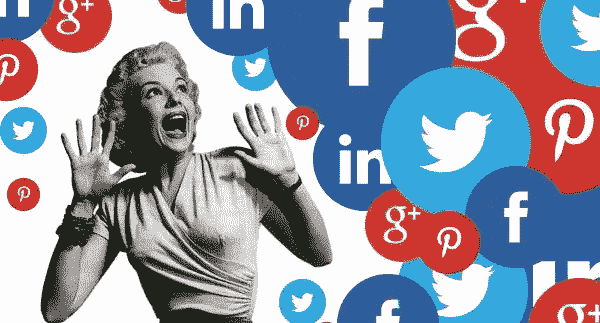

# 2017 年最大的社交媒体“趋势”

> 原文：<https://medium.com/swlh/the-biggest-social-media-trend-of-2017-9057a3b5e453>

## 游戏现在掌握在人民手中

2016 年 11 月，我开始了我的第一份工作，担任社交媒体经理/营销顾问。现在已经 13 个月了，我相信我已经比开始的时候进步了很多。

在这一过程中，我学到了很多关于受众、行为心理学、分析以及所有其他技术术语的知识。

在这段时间里，我设法注意到不同平台和行业在社交媒体和营销方面的一些趋势。尽管有些平台根本不同，但有一样东西到处都在出现。

值得注意的是，我进入这个行业的时间很短，这可能意味着我没有全面的了解，这是一个更大趋势的一部分，但尽管如此，我还是想与你分享。

在开始之前，我想指出“权力”已经转移到人民手中。考虑到当今世界的互联程度，个人用户可以极大地影响品牌。

过去，品牌几乎可以完全控制他们在渠道中的存在和公众认知。现在，他们只能试图暗示和讲述他们的故事，但用户通过 Instagram Stories、脸书帖子和引用推文等平台不断表达自己的观点，从而控制了这种感觉。

所有这些都增加了讨论，有时甚至给它一个新的方向，当复合时，创建一个品牌的在线存在。现在，用户有了发言权，你可以肯定，如果他们不喜欢某样东西，或者他们没有得到应有的待遇，他们会指责。

这就是为什么，我们不能贬低社交媒体的重要性或试图抓住过去不放，而是必须接受这一现实，并尽可能适应。

好吧！考虑到这一点，我们走吧！

# 给予价值

就这么简单。这才是最重要的。我相信在社交媒体上给予价值的想法，免费的**，只是最近才出现。**

**[加里·维纳查克](https://medium.com/u/c4ec9163657c?source=post_page-----9057a3b5e453--------------------------------)是这一理念的大力推广者。基本上，你需要给予价值，无论是通过锻炼和健身人士的饮食建议*(如加里自己的教练乔丹·斯亚特，在实施加里的建议后，他的 Instagram 账户大幅增长)*、励志视频*(目标演员)*、教育 *(Vox)* 还是喜剧*(有史以来所有的 dank meme Instagram 账户)*。**

**不要只是报告你正在做的事情，好像这是一个无聊的例行公事，试着让它变得有趣。教育你的观众。逗他们笑。让他们思考。让他们与内容联系起来，让内容对他们有价值。正如我上面提到的，在社交媒体中，权力属于人民。你的观众是那些能创造或破坏你品牌的人，这取决于你如何对待他们。通过给予价值和教育他们，你给了他们回来并成为忠实追随者的理由。**

**我也一直在和我的客户尝试这种方法，结果令人惊讶。我们的一个 how-to 视频获得了比平均水平高 5 倍的有机接触，是迄今为止我们获得的最好的有机接触之一。**

**请记住，这并不意味着改变你的品牌声音或做一些通常不符合你品牌的事情，只是为了吸引用户。这就像一个试图融入“酷孩子”的高中生迷失了自己。保持你的风格、个性和声音，但是在这个过程中要找到一种方法来赋予你的听众价值并教育他们。**

***感谢您的阅读！我希望你喜欢这个故事，它给你带来了价值，让你有所思考……***

**如果你需要关于社交媒体或我在这里讨论的任何其他话题的任何帮助/建议，请给我发电子邮件到 clirim.sheremeti@gmail.com，或打电话到我的任何社交账户。**

***最后，如果你喜欢这个故事，给它一些掌声👏👏所以可能会有更多人看到！***

****

## **这篇文章发表在 [The Startup](https://medium.com/swlh) 上，这是 Medium 最大的创业刊物，有 273，707+人关注。**

## **订阅接收[我们的头条新闻](http://growthsupply.com/the-startup-newsletter/)。**

****