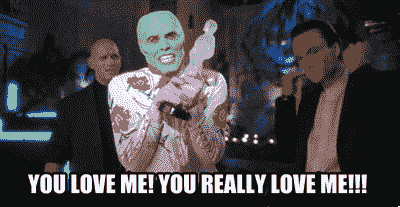

# 你爱上同样的“在线人气竞赛”的明显迹象我爱上了内容写作

> 原文：<https://medium.com/swlh/the-blatant-signs-youre-falling-for-the-same-online-popularity-contest-i-fell-for-with-content-51a84032c90f>

Photo by [Kea Mowat](https://unsplash.com/photos/omJt3Sft-ks?utm_source=unsplash&utm_medium=referral&utm_content=creditCopyText) on [Unsplash](https://unsplash.com/search/photos/credit-card?utm_source=unsplash&utm_medium=referral&utm_content=creditCopyText)

我已经做了一年多的在线内容作者。

在这 365 天的时间里，我相信我已经达到了一些值得称赞的里程碑:

*   我已经将我的内容分享给了全世界超过 250 万的 T2 观众。
*   我已经建立并培养了一个超过 1100 人的电子邮件列表。
*   我与全球其他强大的内容作者和影响者建立了宝贵的联系。
*   我甚至通过卖我的教育电子书《T5》赚了一些 T4 的钱，这本书强调了我为实现上述里程碑所采取的步骤。

我想我已经在“眨眼”时间跨度内取得了相当大的进步。

我写了数百篇文章。

我学到了很多关于自己的新特点和新能力。

我已经了解了营销在线内容的来龙去脉，并利用所有这些来为我自己和我的受众谋利。

> 我也学会了在这个游戏中，一个人是多么容易迷失在我喜欢称之为“在线人气竞赛”的繁琐的追逐中。

当我坐在这里写这篇文章时，我思考着这一切是如何开始的。

我被一股迫使我写作的浪潮所唾弃(你可以在这里找到引发我转变成在线内容作者的决定性时刻)。

我的生活一夜之间改变了，现在我有机会成为自己生活的建筑师。

当然，这将是一个漫长而艰难的过程。见鬼，没有人能保证我会“成功”，或者我甚至能够沿着正确的道路走得足够远——别误会，我甚至还没有“成功”。

Photo by [rawpixel](https://unsplash.com/photos/FFfTNa6tQT0?utm_source=unsplash&utm_medium=referral&utm_content=creditCopyText) on [Unsplash](https://unsplash.com/search/photos/credit-card?utm_source=unsplash&utm_medium=referral&utm_content=creditCopyText)

当我开始在自己的博客上写作并与世界分享时，我变得渴望越来越快的成功。

*   **我希望更多的暴露量能够以指数方式获得。**
*   **我想和我的观众进行更多的对话。**
*   **我想在一夜之间建立一个天文数字的电子邮件列表。**
*   **我想创造一台自动收入机器，让我进入“作家的殿堂”，辞去我的日常工作。**

我敢肯定，在上述欲望中，我并不孤独。

那么，为了实现这些目标，我做了什么？

因为没有更好的词，我发疯了。

在 6 个月或更短的时间内，我:

*   每天在 Quora 上写 2-3 篇文章
*   我虔诚地研究了什么文章结构行得通，什么行不通。
*   我科学地衡量了哪些标题吸引了更多的观众，哪些没有。
*   为了从我的内容的读者那里获得电子邮件，我在我的页面上提供了华丽和惊人的报价。
*   当我和我的女朋友出去吃饭的时候，我神经质地检查我的收视率，而我本应该在我们在一起的宝贵时间里。
*   当我应该关注我的健康的时候，我却为了在一天中的第三篇或第四篇文章而不吃饭。
*   我在午夜和清晨的第一件事就是查看我的手机，在此之前，我甚至还不能对我的生活有一个最初的想法。

> 综上所述，我迷失在网络人气竞赛的痛苦中。

我写作只是为了被人所知，而不是为读者提供有意识的价值。

[https://bit.ly/1Ye1g33](https://bit.ly/1Ye1g33)

当你以一种机械的方式写给大众时，你就极大地牺牲了诚实、完整的价值。

我知道写病毒式内容的“剧本”。我知道列表会有助于获得浏览。我知道一张性感的照片也有助于这条曲线。我知道在我的观点中应该抛出哪些“热点”。

我的电子邮件列表迅速增长。人们渴望听到我的声音。**像我一样的人看到了我所做的事情的价值，却不知道在那个时候，我可以不在乎他们。**

> **一切都是为了我。**

你知道那种感觉吗？当你在找你的帽子或车钥匙时，你找了又找，却发现你的帽子一直在你的头上，钥匙一直在你的手里？

这就是我在写作的魔咒中所经历的。

我在所有错误的地方寻找所有的答案，而所有答案中最真实的就在我面前。

> 如果你想成为一名成功的内容作家和博客作者，这与你无关。是关于读者的。

我只是关心我的数字，而我本应该关心我为自己和给我机会的人创造的价值。

很搞笑…

在过去的一个月左右，人们对我写作的态度发生了 180 度的大转变。

几个月来，我一直在写“流行内容”我是在反刍对这个空间的典范起作用的东西，并把它变成我自己的。

**当然，我获得了浏览量，但我没有建立任何联系。**

见鬼，如果你已经在我的邮件列表中，你可能已经看到了我最近发给你的邮件(希望你已经看到了)。

几个月来，我会发出电子邮件，希望我的观众会阅读并点击它，这样他们就可以进一步提高我的收视率。没有提供任何值(保留文章中的值)。

现在，我正在彻底改变这个频道(你如此慷慨地奖励给我)的目的。

Photo by [Sunyu](https://unsplash.com/photos/TDqIxABJe_c?utm_source=unsplash&utm_medium=referral&utm_content=creditCopyText) on [Unsplash](https://unsplash.com/search/photos/surprised?utm_source=unsplash&utm_medium=referral&utm_content=creditCopyText)

这是为了成长——对我和你都是如此(但主要是对你)。

我不得不回到我一年前创建的网站，查看“关于我”的页面。

我的任务是什么？

> 你好！我是乔恩
> 
> 我来这里有一个任务:
> 
> **帮助你停止满足于平庸的生活和职业，帮助你开始为你的梦想行动**
> 
> 以下是您可以从 TL 中获得的信息:
> 
> 如何获得建立自己职业生涯的动力、灵感和方向？
> 
> 实现你的潜力*而不必生活在“脚本化”生活的复杂环境中。*
> 
> 有用的想法踢你的屁股在齿轮。
> 
> 有益的秘密、技巧和窍门，拓展你的思维，增加你的知识，完成你的创造性追求。
> 
> 我使用的方法不仅对我自己有效，对我的忠实追随者也有效。我研究、实践并采用这些方法，并在每周的简讯中传达给你。

以上内容直接取自我的网站，写于一年前。

我忽略了这个任务。

为此，我很抱歉。

但是就像任何故事一样——我想我需要进入洞穴取出宝藏，以便亲眼看到它(当然不要太夸张)。

因此，在沉思了一会儿这篇文章后，我意识到它的目的是双重的。

*   首先，它提醒我要坚持我很久以前就开始的使命。它是我头脑中的“便利贴”,是我如何到达我想去的地方的剧本。
*   **这也是对*你*的一个提醒。我的任务是建立一个社区——这个社区包括你。见鬼，那个社区就是你。我希望你正在写作和埋头苦干。我希望你正在建立一个社区。我希望你更接近于辞掉你讨厌的工作，开始你独当一面的生活。**

但是不要忘记你为什么要这么做。

不要陷入令人垂涎但无止境的数字游戏。

数字永远不会结束。你永远不会到达终点。

与读者的对话是关键。

你建立的社区就是一切。

> 人们会抓住你的机会，你有责任向他们提供只有你能提供的价值。我想这也是我在这里的原因。

虽然它是关于你提供的礼物，但它不仅仅是关于你，而是关于你的读者。

## 记住这一点。

# 准备好接受刺激了吗？

## 我提供给你一个经过测试和验证的 6 部分指南，它包含了强大的概念，可以帮助你识别、规划、成长和完成你的创造性追求。

# [> > >在这里获得免费指南< < <](https://www.tribeloyal.com/free-6-step-course)

## 学到了什么？按住👏说“谢谢！”并帮助他人找到这篇文章。

## 还评论！你喜欢什么？你讨厌什么？你在做什么？

## 这篇文章发表在《初创企业》杂志上，这是 Medium 最大的创业刊物，有 333，253 人关注。

## 订阅接收[我们的头条](http://growthsupply.com/the-startup-newsletter/)。

