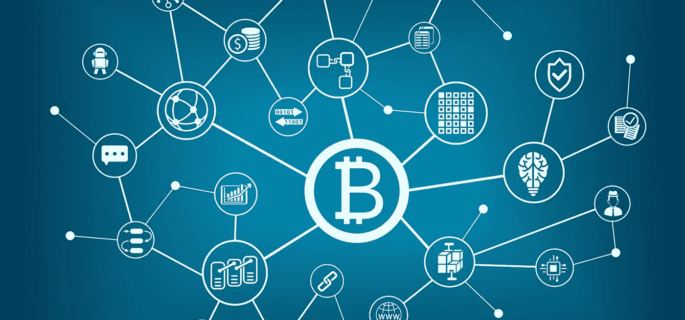
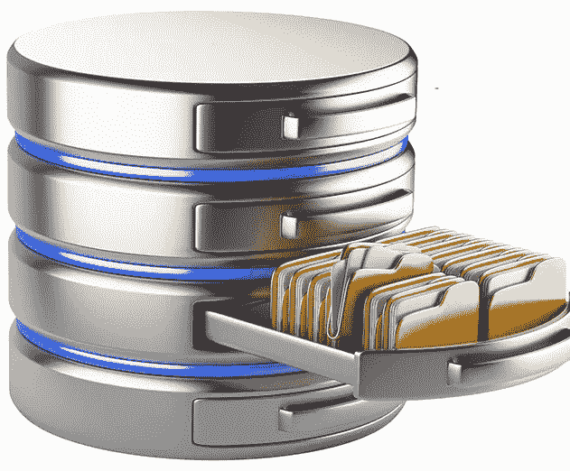
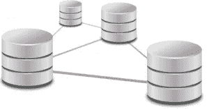
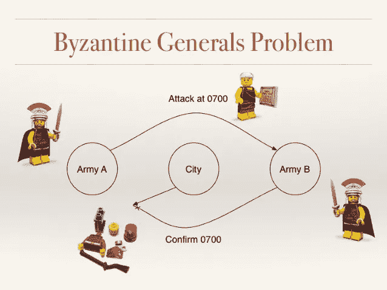
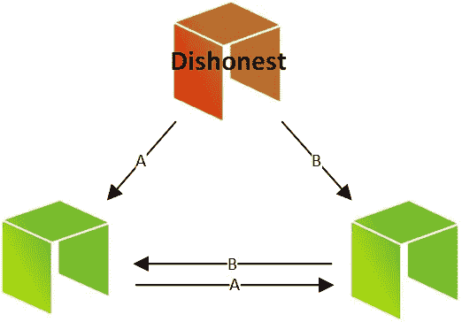

# 虚拟区块链指南—第 1 部分

> 原文：<https://medium.com/swlh/the-blockchain-for-dummies-guide-part-1-b5ef8c085913>

Testing The Microphone — $9,000…$10,000…$100,000\. Okay, let’s talk some Bitcoin & Blockchain!

当你说“[区块链](http://www.kaizentek.io)”或“比特币”时，这两个词都意味着各种反应，从流口水到翻白眼。

**每个人都在谈论它，但大多数人不太了解比特币或区块链。有什么大不了的？这只是另一个泡沫吗？**

> 为什么人们会对比特币失去理智？

我想花些时间做一个关于区块链和比特币的**权威初学者指南*，从 10，000 英尺的角度看底层技术，为什么它很重要，它有什么好处，以及它没有什么好处。*

*毕竟，并不是所有的事情都需要区块链，所以一个显而易见的问题是:什么是区块链，哪里需要它？*

> *比特币的底层技术区块链只是工程师工具箱中的又一个工具。那么对于这种锤子，我们用它的钉子在哪里呢？*

*在我们回答这个问题之前，我们需要看一下当前形式的数据库。*

# *数据库—数据存在的地方*

**

*Databases — where your digital life resides*

*数据库实际上是我们数字生活的锚点。它们是存放世界上所有数据的桶:能够被检索、查看、操作和存储以备将来使用。*

*事实上，数据库是如此重要，以至于许多公司从数据库中的数据中获得了很大一部分转售价值。*

# *远非完美*

*但是像 MySQL、Postgres、MongoDB 和其他许多数据库并不完美。事实上，他们远非如此。*

*数据库容易出现各种各样的问题，从数据损坏，到*最终一致性*(当一个值被更新然后立即被检索时，旧值可能被返回)，到磁盘损坏和其他硬件故障。*

*如果数据库存储的是诸如博客帖子或天气数据之类的琐碎数据，这些都不是大问题。*

*但是，如果一个数据库保存着某项资产的所有者和购买价格的记录，那么这些信息的损坏将是灾难性的。*

**

*When a database goes bad, it can cause a lot of headaches and damage.*

# *容错拯救*

*所以幸运的是，随着技术的进步，一些非常聪明的人已经意识到，在任务关键的情况下，只依赖一个数据库作为唯一的事实来源可能是一个坏主意。*

*因此，为了防止此类故障，他们制定了各种解决方案，从读取副本到分布式容错体系结构，以确保数据一致性。*

**

*Distributed database? Solves some problems, but creates others.*

*但是，即使这些解决方案也不能解决数据库固有的所有问题。事实上，在*分发*一个数据库(创建多个具有相同数据的数据库并并行更新它们)的情况下，它实际上产生了另一个问题，这是区块链作为一个潜在解决方案进入的问题。*

*这个问题在技术圈被比喻为**拜占庭将军问题**(或者简称为 **BGP** )。*

# *永远不要相信拜占庭将军*

*BGP*的一个简短概要是两个将军和他们的军队在一个城市外扎营。如果他们都进攻，那么他们就能拿下这座城市。如果只有一个将军进攻，而不是另一个，进攻的军队就会灭亡。如果他们都不攻击，那么他们都活着，以争取另一天。*

*为了决定他们要做什么，他们需要用信使互相交流。*

**

*Byzantine Generals Problem — As explained with Legos*

*但问题是，如果一个将军向另一个将军发送消息，他如何知道消息已经到达？也许信使一路上出了什么事。*

*另一个将军需要发回确认消息，但是*那个*将军也需要确认他们的消息已经收到，以此类推。*

*本质上，这个过程会一直持续下去，直到一个将军决定“好了，没有更多的消息了，我要进攻了！”*

*问题变得更加复杂，因为每个将军心里都有自己的利益，而不是其他将军的利益。那么每个将军如何知道如果另一个将军发出“我正在进攻！”他们真的会做他们说过要做的事吗？*

*BGP 本质上是我们在计算机的公共分布式体系结构中面临的相同问题，在这种体系结构中，我们不能保证收到消息，也不能保证发送这些消息的代理的可信度。*

**

*When NEO nodes go back, its a BGP problem.*

*因此，如果我们将消息发送到一个公共分布的数据库来存储信息，而我们不能保证这些消息将被传递或准确，我们如何保证存储在数据库中的数据是最新的和准确的呢？*

> *回答？我们不能。*

*至少不是传统的数据库和分布式架构，我们需要一些不同的东西来保证整个网络的一致性。*

# *进入区块链…*

**在* [***第二部分***](/@jradosta/the-blockchain-for-dummies-guide-part-2-2d0d821b5148) *中，我们将深入了解区块链数据库的结构，它如何解决这个拜占庭将军式的问题，以及拥有这个新工具对于解决每年耗费企业数十亿美元的现实世界问题意味着什么…**

# *如果你喜欢这篇文章，给我 10 个掌声和一个关注！*

****

## *这篇文章发表在《初创企业》杂志上，这是 Medium 最大的创业刊物，有 322，555 人关注。*

## *订阅接收[我们的头条](http://growthsupply.com/the-startup-newsletter/)。*

**