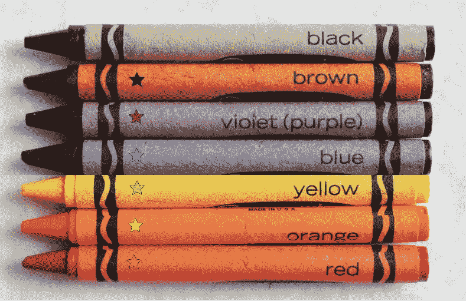
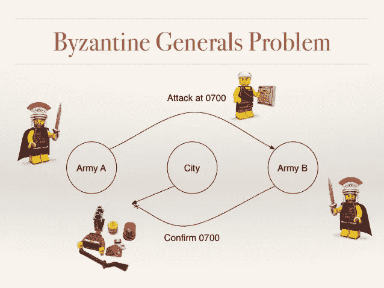
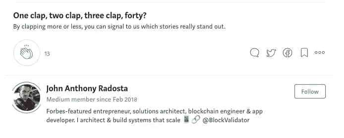

# 虚拟区块链指南—第二部分

> 原文：<https://medium.com/swlh/the-blockchain-for-dummies-guide-part-2-2d0d821b5148>

*回顾:在* [***第 1 部分***](/@jradosta/the-blockchain-for-dummies-guide-part-1-b5ef8c085913) *中，我们讨论了当前形式的数据库以及它们在保持健康和准确性方面存在的一些固有问题。我们还讨论了拜占庭将军的问题，即我们不知道发送到分布式数据库的消息是否被接收和准确。*

所以现在，看起来我们在这些问题上运气很差，除非我们能找到不同的解决方案。

# 进入区块链

现在我们知道了数据库对我们的数字生活有多么重要，我们也了解了困扰它们的一些问题，什么是区块链，它与常规数据库有什么不同？

首先，重要的是要澄清区块链***是一个数据库*** ，它只是一个特殊类型的数据库。

那么，是什么让它如此特别，为什么比特币这样的系统需要它来跟踪数字资产的移动，就像数字货币一样？

实际上，比特币可以被分成更小的组成部分，可以这样想:

> 比特币=一种数字资产+区块链+密码学

但在我们谈论数字资产和加密技术之前，让我们先关注一下区块链，因为它是其他两者交互的基础。

假设我有一盒八支数字蜡笔。在这个盒子里，我们有标准的颜色设置，你会记得你童年时在克雷奥拉蜡笔盒里的颜色:

Standard Set of Crayons In A 8-Pack of Crayola

现在，如果你回忆起你的童年，这些蜡笔在盒子里总是以一定的顺序出现:黑色紧挨着棕色，棕色紧挨着紫色，等等。

现在，如果有人对我们说“这是蜡笔盒中蜡笔的逻辑顺序”，我们会从自己的经验中知道这是真的。但是，如果我们想保证向从未见过克雷奥拉蜡笔盒的其他人订购，会怎么样呢？我们可以通过创造蜡笔区块链来做到这一点:

A Crayon Blockchain

同一套蜡笔，但有一个关键的区别:每支蜡笔上都有一个星星，代表它前面的蜡笔的颜色。

> 注:黑色是一种特殊的蜡笔，被称为**创世纪。因为这是第一支蜡笔，它没有前面的蜡笔，因此什么也没有。**

这就是区块链的全部！你现在是区块链专家了。那不是很容易吗？

区块链可以变得更加复杂，但其核心是比特币等复杂协议中发生的一切。

> 区块链只是一个数据库，数据集中的每个条目都引用前一个条目。

区块链不同于普通数据库的原因是它为我们提供了数据顺序的保证。

因此，在分布式区块链数据库的情况下，我们可以查看数据库的每个副本，并知道数据是否正确，因为数据是链接在一起的。

在我们的蜡笔示例中，如果一只蜡笔丢失了，下一只蜡笔仍会*引用丢失的蜡笔，因此我们会立即知道有问题。*

Uh — Something is wrong here…

在上面的例子中，我们可以看到绿色蜡笔已经从我们的**蜡笔数据集**中消失了，但是我们可以立即看到这一点，因为黄色蜡笔引用了不再存在的东西。

这就是区块链的全部！我们已经准备好开始使用这个很酷的新东西了，对吗？

还没有，我们还没有解决我们在第一部分中谈到的拜占庭将军的问题。我们如何向网络中的其他人传达蜡笔的正确顺序，网络**如何同意**哪个顺序是正确的？

在我们的将军问题中，假设将军们同意攻击**当且仅当**他们能就我们蜡笔组的正确顺序达成一致。将军们是如何:

1.  同意蜡笔的正确顺序？
2.  知道他们之间已经达成协议了吗？
3.  知道他们在第一或第二点上没有错？

这就把我们带入了区块链解决的另一个问题，处理 ***网络共识*** 的问题。

# 我们怎么知道？我们怎么知道我们知道？我们怎么知道我们没有错？

*在* [***第三部分***](/@jradosta/the-blockchain-for-dummies-guide-part-3-e5aba942041) *中，我们将深入探讨区块链协议如何通过在网络中达成共识来解决问题，以及我们的将军们如何就是否攻城达成一致。*

# 寻找区块链开发或 ICO 支持？请通过 [KaizenTek](http://www.kaizentek.io) 联系我们。

# 如果你喜欢这篇文章，给我 10 个掌声和一个关注！

Claps & A Follow

## 这篇文章发表在 [The Startup](https://medium.com/swlh) 上，这是 Medium 最大的创业刊物，有 323，238+人关注。

## 在这里订阅接收[我们的头条新闻](http://growthsupply.com/the-startup-newsletter/)。

