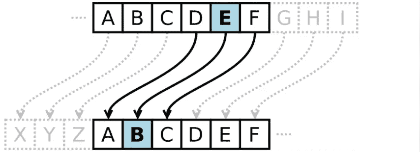

# 虚拟区块链指南—第 3 部分

> 原文：<https://medium.com/swlh/the-blockchain-for-dummies-guide-part-3-e5aba942041>

*回顾:在* [***第二部分***](/@jradosta/the-blockchain-for-dummies-guide-part-2-2d0d821b5148) *中，我们谈到了区块链是如何使用蜡笔的，以及区块链的数据是如何按照输入顺序链接在一起的，但我们仍然不知道网络中的参与者是如何就数据的正确顺序达成一致的。*

所以我们现在遇到了一个问题，我们有一个伟大的新数据库，叫做区块链，它允许我们以特定的顺序将数据链接在一起。

这使我们能够快速确定数据是否已经损坏或有人试图操纵我们的数据库，但我们仍然不知道网络如何首先就数据的正确顺序达成一致。

作为一个例子，如果你想说数据集中的下一个蜡笔是“粉红色”，但同时我说下一个颜色应该是“青色”，网络如何决定哪一个蜡笔应该先出现？

这就是所谓的**共识问题**，这是一个大问题。毕竟，如果我们可以将数据库中的数据链接在一起，但没有人能就正确的顺序达成一致，这是一个非常无用的功能。

我们需要有一种机制或*协议*，所有的网络参与者都必须遵守它，以保证我们在区块链中的有序性。

正如我们在第 2 部分中所讨论的，为了使协议有效，它需要帮助我们的将军们回答三个基本问题:

1.  我们如何就蜡笔的正确顺序达成一致？
2.  我们怎么知道我们在订单上达成了一致？
3.  我们怎么知道我们没有弄错#1 或#2 呢？

# 我们怎么知道？

有许多方法可以回答第一个问题。

一种方法是，我们可以走一个中央权威机构或一组*代表*来决定蜡笔的正确顺序(这就是区块链喜欢 EOS 和 Hyperledger 的功能)。

基本上，在这样的系统中，排序的工作方式是相对直接的:当新的蜡笔被添加到集合中时，中央权威或代表告诉网络正确的顺序应该是什么。简单。

但是如果我们不想相信一个中央权威或一群代表呢？如果这个区块链被那些并不真正信任任何一个参与者或团体的人公开使用，那该怎么办？

幸运的是，我们有很多方法可以分散共识过程，其中最受欢迎的方法之一是所谓的**工作证明**，它涉及*采矿*。

采矿涉及网络中的某些代理人，他们充当区块链的维护者。

在区块链工作证明中，矿工被激励相互竞争，努力确定进入区块链的下一个条目或交易的正确顺序。为此，矿工们得到了经济上的回报。

挖掘要比这复杂得多，但保持这种高水平，本质上就是它的工作方式:这是一场以准确性和速度为回报的终点赛跑。

所以在基于委托的系统中，委托人选择排序。在一个基于工作证明的系统中，最快的矿工决定排序，这两者都为我们的将军解决了第一个问题。

# 我们怎么知道我们知道？

但是第二个问题呢，将军们如何知道什么时候达成了协议？

这就是区块链加密技术发挥作用的地方。我们可以专门用一整篇文章来讨论密码学，但是为了保持尽可能高的层次，我们将只讨论需要什么。

密码学是一门对信息进行加密或打乱的科学，这种加密或打乱的方式可以为我们提供安全性或证据。加密技术的一个容易理解的例子是凯撒密码，朱利叶斯·凯撒自己用它来发送有关军事行动的信息。

Caesar Cipher Illustration

在凯撒密码中，信息是通过将字母向下移动一定的次数来加密的。因此，如果我们想要加密“hello”并且我们的 shift 是向后 1 个字母(我们称之为**“shift-1”**)，我们将发送的加密消息是“gdkkn”。这种加密的信息被称为**密码文本**，只要将这些字母再向前移动一步，就可以被解密。

凯撒密码被认为是一种**密码算法**，并且有很多这样的算法。有的是**双向**像凯撒密码(可以加密解密回去)，有的是**单向**(可以加密，不能解密)。

好的密码算法为我们提供了一个独特的功能属性，称为**陷阱门**。

> 密码术中的活板门意味着在一个方向做某件事很容易，但在另一个方向做很难。

在我们的凯撒密码示例中，我们的陷阱门是这样一个事实，即阅读加密消息的人首先需要知道要移动多少步才能解密消息(很容易做到)，否则他们需要移动-1、移动-2、移动-3、移动-4… *直到他们最终找到一个实际上有意义的消息。那就难多了。*

回到问题 2，网络如何知道协议已经达成？本质上，代表或矿工广播一个密码证明 ***，该密码证明对于他们选择在下一个*** 输入到区块链中的数据是唯一的。

作为一个例子，以我们的凯撒密码“hello”为例，当加密算法为 shift-1 时，“hello”变成了“gdkkn”。

> 这个证明是独一无二的，因为当我们使用的算法是 shift-1 时，英语中除了“hello”之外没有其他单词可以变成“gdkkn”。

我们也有一个像样的陷阱门，因为如果我们已经知道协议是 shift-1，就很容易验证，但如果我们不知道，就很难破解。

因此，本质上，如果我们有一个区块链协议，要求我们的代表或矿工获取下一个数据，然后“移位-1”它，矿工或代表可以向网络广播“hello:gdkkn”作为区块链中的下一个链路，网络将立即知道它是有效的下一个条目，因为网络先前已经同意使用“移位-1”协议。

当大多数网络已经确认“hello:gdkkn”是进入区块链的有效下一张唱片时，我们知道我们已经达成了适当的共识。

# 我们怎么知道我们永远不会错？

这个现在实际上很简单。坚持我们的凯撒密码“hello”的例子，我们可以很容易地显示“shift-1”永远不会出错，因为“gdkkn”是公开可验证的证据，并且已经被网络的大多数确认为有效。

所以在我们选择的共识过程和我们的加密算法之间:

1.  我们有一个共识流程，每个人都可以就添加到区块链的元素的正确顺序达成一致。
2.  我们知道什么时候达成了协议，因为我们得到了可公开证实的证据和多数人的确认。
3.  我们知道这是对的，因为我们都承诺遵守协议。任何不使用协议的人，我们都可以忽略。

哇，我们飞过这些东西了！到目前为止，我们已经讨论了数据库的常见问题，我们知道区块链是如何工作的，我们甚至学习了一些加密技术，以及它们如何与区块链结合来保证我们的有序性。

所有这些东西都很棒，但是我们能用区块链做些什么呢？这是我们以前用常规数据库做不到的。

*在* [***第四部分***](/@jradosta/the-blockchain-for-dummies-guide-part-4-e91cfd915849) *中，我们将谈论一些独特的事情，区块链使我们能够做一些我们以前用传统数据库做不到的事情。像跟踪资产、货币或任何有真实世界价值的东西。*

# 寻找区块链开发或 ICO 支持？请致电 [KaizenTek](http://www.kaizentek.io) 联系我们。

# 如果你喜欢这篇文章，给我 10 个掌声和一个关注！

## 这个故事发表在 [The Startup](https://medium.com/swlh) 上，这是 Medium 最大的创业刊物，拥有 323，238+人关注。

## 在此订阅接收[我们的头条新闻](http://growthsupply.com/the-startup-newsletter/)。

