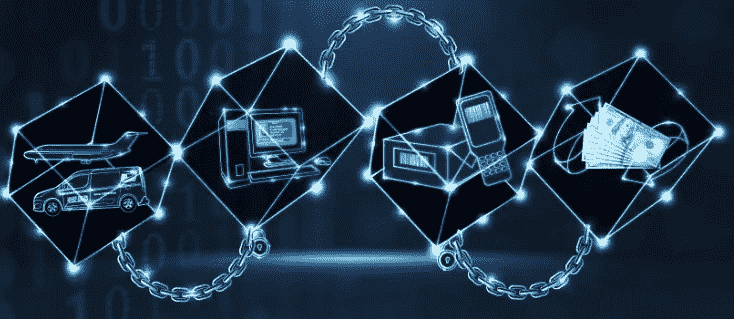
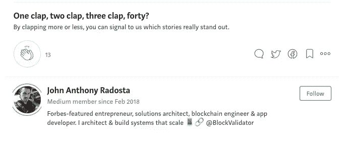

# 虚拟区块链指南—第 4 部分

> 原文：<https://medium.com/swlh/the-blockchain-for-dummies-guide-part-4-e91cfd915849>

*回顾:在* [***第 3 部分***](/@jradosta/the-blockchain-for-dummies-guide-part-3-e5aba942041) *中，我们深入探讨了一些密码学基础知识，以及密码学如何与区块链相结合，为我们提供了一些关于区块链账本状态的保证。一切都很好，但它有什么用呢？我们能用区块链做些什么，而常规数据库做不到的呢？*

Blockchain can be used to secure the identity and ownership of real world assets

所以回到我们的将军的问题，我们现在有一种方法，我们的将军可以达成协议，他们可以告诉他们已经达成协议，他们可以确定这两个事实。当我们在分布式系统中拥有这个黄金三位一体时，它被称为**拜占庭容错(BFT)。**

> 注意:我在 Legos 中使用的图形只显示了两个将军，只是因为缺少更好的图像，但是为了使系统具有真正的拜占庭容错能力，它至少需要有三个将军或节点，这样才能达成网络共识。只有两个将军，一个系统可以证明不能[达成明确的共识](https://en.wikipedia.org/wiki/Two_Generals%27_Problem#Proof)，只是澄清一下。

这就把我们带入了一个关于拜占庭容错的重要观点，即只有网络中 2/3 的人诚实行事，没有故障(每个将军的消息实际上都通过了)，我们才能保证拜占庭容错。

在超过 1/3 的网络是恶意的或有缺陷的情况下，我们完全失去了达成共识的能力。因此，BFT 系统中的节点(将军)越多，腐败就越难。

好的，我们正在讨论一些非常先进的概念，比如拜占庭容错，我们已经有了加密技术和一个将所有数据链接在一起的数据库，但是一个明显的问题仍然存在:

> 谁在乎呢。我们可以用这些做什么？

# 区块链的真正力量

因此，将所有这些东西放在一起，区块链为我们提供了一些非常独特的优势，这是常规数据库无法实现的。有了区块链，我们得到了**真实性**、**不可否认性**和**不变性—** ，当这三个优势结合在一起时，我们可以跟踪*真实事物*的移动，比如财产、货币和其他资产。

> 说什么？

让我们把这些分解一下。

# 真实性

首先，区块链让我们能够追踪数据的真实性。在我们的凯撒密码示例和我们的 **shift-1** 算法中(记住“hello:gdkkn”)，如果我们的加密技术更有创意一点(使用所谓的 [**非对称加密技术**](https://www.igvita.com/2014/05/05/minimum-viable-block-chain/#pki) )，我们就能够清楚地跟踪消息*。*

*换句话说，如果其他人后来向我们的区块链发送了完全相同的消息“hello:gdkkn ”,我们就有办法从第二条消息中唯一地识别出第一条消息，即使消息内容是相同的。我们甚至可以说出每一封都是谁发的。*

*这变得很重要，因为如果我们使用区块链来跟踪具有真实世界价值的东西的转移，比如说一种数字货币，我们有一种方法来确定正在转移的是哪个“硬币”、**从谁那里转移以及从**转移到**谁。***

> *因为记录在区块链中是链接在一起的，所以我们有完整的审计线索来跟踪发送者是否有权发送该数字硬币，因为我们可以验证他们是否是最后一个收到它的人。*

> *哇！这是巨大的！*

# *不可否认性*

*不可否认性本质上意味着当消息被发送出去时，它的存在是不可否认的。将加密技术与我们的分布式分类帐(审计跟踪)结合使用，我们有了一种客观地确定每封邮件的来源和存在的方法。*

*这也是我们传统数据库的一大进步，因为使用我们的数字硬币例子，没有人能否认我是它的所有者，因为审计跟踪显示我是最后的接收者。*

*因为数字硬币本身是用非对称加密技术加密识别和保护的，所以它不能被所有者复制或“双重花费”。*

# *不变*

*我们还获得了优势，因为区块链中的所有数据都是链接在一起的(还记得我们的蜡笔以及它们如何引用之前的蜡笔吗？)，我们有办法保证我们的区块链是不可改变的或者是不可变的。*

*如果有人试图用修改过的蜡笔区块链冒充我们为之投稿的区块链，即使其中一支蜡笔被修改过，引用也不会匹配。本质上，整个链条都分崩离析了。*

*这为我们提供了保证，我们可以安全地跟踪真实世界价值的资产，而不用担心所有权被破坏，因为我们对该资产的合法所有者有完整的审计跟踪。*

# *使用区块链进行支付*

*因此，事实证明，我们从区块链身上获得的真实性、不可否认性和不变性这三大优势为我们做一些非常酷的事情奠定了基础，比如创造一种全新的付款方式。*

**在* [***第 5 部分***](/@jradosta/the-blockchain-for-dummies-guide-part-5-4250b5ab5267) *中，我们将探讨数字货币、货币历史，以及区块链如何在没有银行或支付处理器等中介的情况下为有效的支付系统的繁荣提供基础。**

# *寻找区块链开发或 ICO 支持？通过 [KaizenTek](http://www.kaizentek.io) 与我们联系。*

# *如果你喜欢这个帖子，给我 10 下掌声和一个跟贴！*

****

## *这个故事发表在《创业》(Startup)杂志上，这是 Medium 最大的创业刊物，有超过 323，238 人关注。*

## *在此订阅接收[我们的头条新闻。](http://growthsupply.com/the-startup-newsletter/)*

**