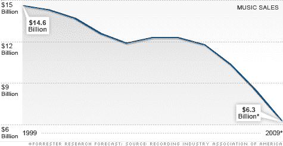

# 虚拟区块链指南—第 5 部分

> 原文：<https://medium.com/swlh/the-blockchain-for-dummies-guide-part-5-4250b5ab5267>

*回顾:在* [***第 4 部分***](/@jradosta/the-blockchain-for-dummies-guide-part-4-e91cfd915849) *中，我们总结了我们之前了解到的关于区块链的一切，我们看到了它如何为我们提供了超越普通数据库的真实性、不可否认性和不变性的优势。我们了解到，这些元素结合在一起，为能够跟踪具有真实世界价值的事物奠定了基础。但是什么样的事情呢？金钱本身能在区块链上被追踪吗？*

在本帖中，我们将谈论区块链如何为数字支付系统奠定完美的基础。

我们还将简要讨论传统货币，它是如何产生的，是什么赋予了它价值，以及创建数字货币所需的最低要求。

正如我们在第 4 部分中讨论的，区块链为我们提供了一些独特的优势，让我们可以跟踪和审计特定数据的历史。我们可以进一步追踪这些数据的来源和所有权，直到具有真实世界价值的真实事物，如汽车、财产或所有权。

> 但是提醒我..为什么我们现在不能用常规数据库来做这件事呢？

因为数字信息的本质。如果我给你发一张图片(。jpg)的照片，我不会把我的照片准确无误地发送给你*…我的电脑会把那个文件复制一份，然后把副本发送给你，这样你就可以拥有照片，而我不会丢失它。*

*你可以进一步将它发送给其他人，然后再发送给其他人，每次都要复制一份。所以我们已经从有一个。jpg 文件要有*几个*。*

*对于我假期的照片，这种复制是好的。但是，如果我给你一个数字美元，只是不断地像这样增加，通货膨胀率将是天文数字，它最终将变得一文不值。*

> *什么东西有价值的关键因素是它的稀缺性。*

# *数字世界中的稀缺*

*有了数字信息，稀缺永远不是问题。制作某些东西的数字拷贝非常容易，这就是为什么在 21 世纪初，Napster 和 Kazaa 等服务的免费音乐共享对音乐行业是如此有害。*

*音乐产业失去了对数字媒体发行的控制，因此在接下来的十年里，实体音乐专辑的销量下降了一半。*

**

*Music’s Lost Decade — Sales Cut In Half ([Source](http://money.cnn.com/2010/02/02/news/companies/napster_music_industry/))*

*就现实世界而言，某物从一个人转移到另一个人意味着一个人得到该物，而另一个人失去*该物。**

*如果我给你一张 1 美元的钞票，你是*加*1 美元，我是*减*1 美元。几千年来，这一直是所有商业、贸易和交易的基础。这正是任何事物有感知价值的原因。*

*回想一下，区块链为我们提供了一种跟踪特定的*数据及其完整审计跟踪的方法。如果我给你发了一张我度假的照片，我们同意以此作为一种支付方式，区块链为我们提供了关键要素，以确保世界其他人知道你是那张特定照片的*加*，而我是那张特定照片的*减*。**

**因此，我们现在有了控制数字信息膨胀的机制，我们有了支付系统运行的轨道，但我们还需要更多东西来使它成为一种有效的支付手段。**

**我们需要一种货币，但无论如何，我们需要什么才能成为一种有效的货币呢？**

# **什么造就了一种货币**

**几千年来，货币一直是各方之间表示可转移价值的一种方式。如果你是养鸡的农民，我是种土豆的农民，安娜是发型师，我们都要用鸡、土豆和理发来交换，我们需要不断地计算出多少土豆相当于一次理发，每一个土豆在鸡身上值多少钱，所有这些都是基于供求关系。**

**与其对正常经济中的每一种商品和服务都这样做，更有意义的是以货币的形式建立一个共同的流动性池，这样每一种商品和服务都可以用一种货币进行交易。**

**但是什么是货币呢？我们绝对需要什么来确保贸易顺利进行而不损害任何人的价值。**

****

**Currency comes in many forms. What are the qualities of an effective currency?**

**事实证明，我们需要五种品质才能拥有一种有效的货币。为了拥有一种有效的货币，我们需要一些稀缺的、可替代的、可分割的、可持续的、可转让的东西。**

****稀缺性**不言自明。我们的货币需要以固定的数量发行，或者至少(像大多数主权货币一样)以一个受控制的数量发行。**

**可互换的意味着所有形式的货币都可以互换。在一张 1 美元钞票的情况下，如果我有一张全新的 1 美元钞票和一张旧的 1 美元钞票，这没关系，它们都仍然值 1 美元。**

****可分**表示我必须有细分货币的能力。这使我们能够在交易中做出改变。**

**不言而喻，我的货币必须有持久力。水果不是有效的货币形式的原因是因为它会腐烂和分解。**

**最后，它需要易于**转移**。人们不使用金条交易的原因是因为它们很重，很难携带(更不用说很难分割)。**

# **加密货币**

**因此，事实证明，一种货币的*形式*不如这种货币包含这五种特殊品质这一事实重要。无论它是由金属、纸张、布料还是数字散列制成的——如果符合以上五个标准，货币就是有效货币，而**加密货币**确实符合这些标准。**

***在* [***第六部分***](/@jradosta/the-blockchain-for-dummies-guide-part-6-8032c542fb7b) *中，我们会谈到什么是加密货币，它们是如何工作的，以及它们如何与区块链相结合，以构成一个可工作且有效的支付系统。***

# **寻找区块链开发或 ICO 支持？请通过 [KaizenTek](http://www.kaizentek.io) 联系我们。**

# **如果你喜欢这篇文章，给我 10 个掌声和一个关注！**

********

## **这个故事发表在 [The Startup](https://medium.com/swlh) 上，这是 Medium 最大的创业刊物，拥有 323，238+人关注。**

## **在这里订阅接收[我们的头条新闻](http://growthsupply.com/the-startup-newsletter/)。**

****