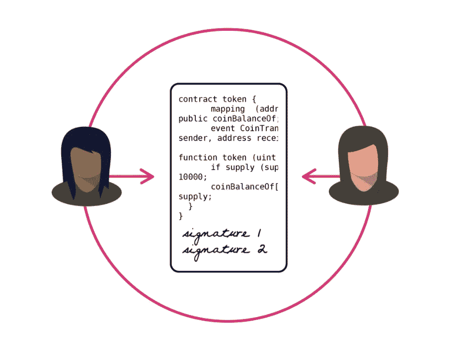
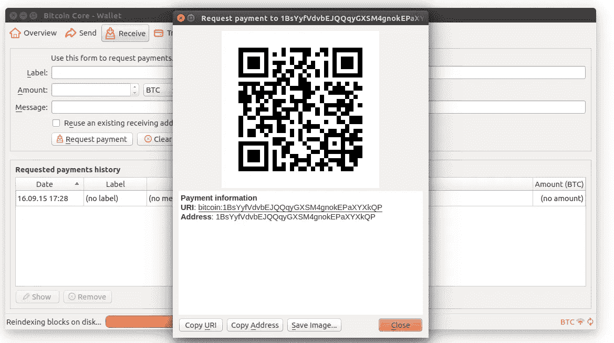

# 虚拟区块链指南—第六部分

> 原文：<https://medium.com/swlh/the-blockchain-for-dummies-guide-part-6-8032c542fb7b>

*回顾:在* [***第五部分***](/@jradosta/the-blockchain-for-dummies-guide-part-5-4250b5ab5267) *中，我们谈到了货币，它们是如何产生的，以及有效货币需要什么。我们还简要讨论了区块链如何成为控制数字数据“膨胀”的有效平台。*

Cryptocurrencies meet all the necessary requirements to be valid currencies, just like fiat currency.

在本帖中，我们将讨论如何利用区块链和一些创造性的架构，我们拥有了创建有效的数字货币的所有必要元素。

我们还将探索加密货币如何工作，它们的一些潜在用例，以及它们相对于传统法定货币的一些固有优势。

# 加密货币的工作原理

加密货币的独特之处在于，它们提供了一种实现数字现金的方式。如果你还记得我们以前的文章，一种货币能够保值的方式是它的生产或总供给必须被控制或限制。

对于加密货币等**加密经济** **资产**，货币的供应不受中央银行控制，而是由区块链上运行的脚本层(就比特币而言)或智能合约**监管。**

**智能合约**本质上是公共代码库，为加密货币建立规则，如转移、供应、许可和治理功能。

这种货币本质上是由智能合约的代码预先编程和管理的，而不是由中央机构来管理加密货币的移动。所有用户的钱包在发起或接收交易时都会与智能合约进行交互。

Smart contracts control the debiting/crediting of each user’s wallet balance on a blockchain.

在脚本层或智能合约中，可以指定货币的所有关键特征，例如用于整除的小数位数。

> 注意:虽然法定货币通常有两位小数，但区块链的标准硬币，如以太坊，通常可分割到 18 位小数。

货币可以储存在一个叫做**钱包**的软件应用程序中，每种货币通常都有自己的钱包软件。一些货币甚至兼容看起来像 u 盘的实体硬件钱包。

当有人想要使用加密货币进行支付时，他们打开钱包软件，输入他们想要将支付发送到的接收钱包的加密地址。

这个地址看起来像一个随机的字符串和数字，但它代表了一个收件人钱包地址的唯一标识符。

Wallet’s contain unique cryptographic addresses which can usually be easily scanned using a QR Code.

当这个人发起转账时，区块链验证者或矿工检查发起的钱包是否有权发送这些资金，确保发送者确实拥有要发送的硬币，并且这些硬币没有从以前的交易中被重复花费。

如果交易被确定为有效，它被添加到区块链，接收地址被更新为这些特定硬币的新所有者。

# 相对于法定货币的优势

加密货币相对于法定货币的一个主要优势是，它们被加密保护到拥有它们的钱包地址。这提供了极大的安全性。

例如，如果你把你平常的钱包从桥上扔下去，里面的现金就永远消失了。

相反，如果您将笔记本电脑或加密货币硬件钱包从桥上扔下，其中包含的加密货币仍然归您所有，并且您可以取回，因为它们仍然在区块链上被跟踪。

你可以简单地获得另一个硬件钱包或重新下载每个加密货币的钱包软件，为每个钱包输入你的私钥(称为**种子**)，你的钱包将从区块链重新同步你所有的加密货币。

> 与日常现金相比，这是一个巨大的进步！

当然，这也有一个缺点:**你需要安全地保存你的种子。如果它们丢失或被其他人得到，你所有的加密现金可能会永远丢失。**

# 结算时间

另一个优势是加密货币的结算速度比法定货币快得多。如果您曾经不得不向海外汇款，您会意识到所涉及的滞后时间，有时需要长达 ***5 天*** 资金才能通过 SWIFT 系统收到。

> 不幸的是，通过目前的银行系统，向海外汇款的最快方式是把钱放进公文包，登上飞机，飞到那里。

对于加密货币，结算时间仅限于基础区块链的交易时间，平均从几秒钟到 15 分钟不等。

使用加密货币还有许多其他优势，这些优势因具体的加密货币而异。像交易匿名、投票权和其他很酷的特性……*我们将在下一篇文章中探讨！*

*在* [***第 7 部分***](/@jradosta/the-blockchain-for-dummies-guide-part-7-8e4116b1e8d8) *中，我们将探索当今最流行的几种加密货币，它们是如何工作的，以及它们在未来的潜在个别用例是什么。*

# 寻找区块链开发或 ICO 支持？请通过 [KaizenTek](http://www.kaizentek.io) 联系我们。

# 如果你喜欢这篇文章，给我 10 个掌声和一个关注！

## 这个故事发表在[的创业](https://medium.com/swlh)上，这是 Medium 最大的创业刊物，有 323，238+人关注。

## 订阅接收[我们的头条新闻](http://growthsupply.com/the-startup-newsletter/)。

