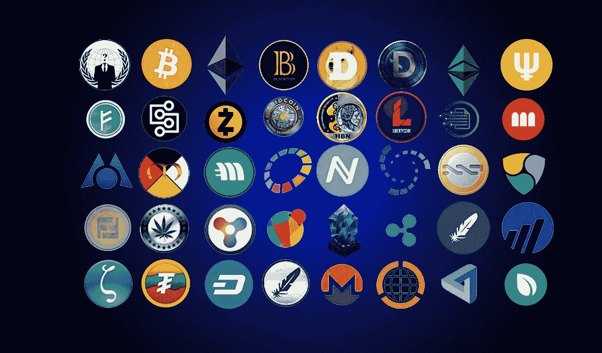
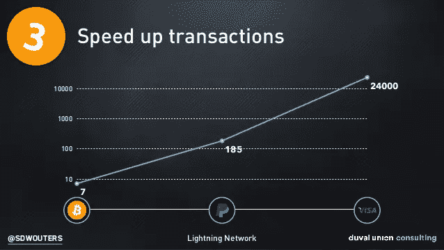
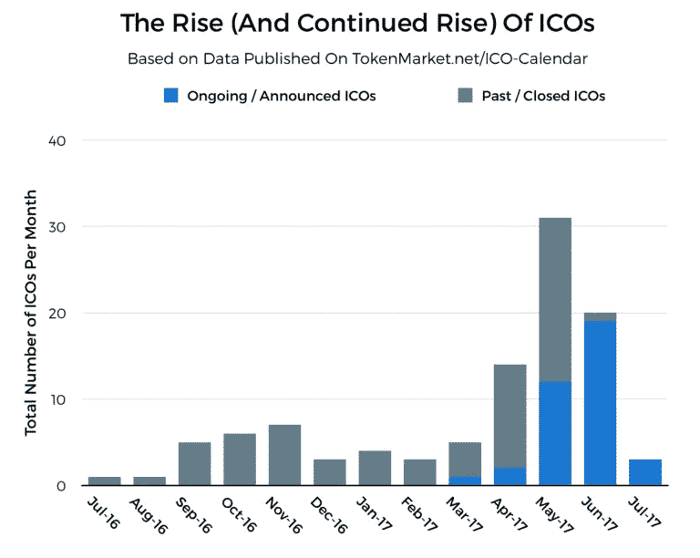
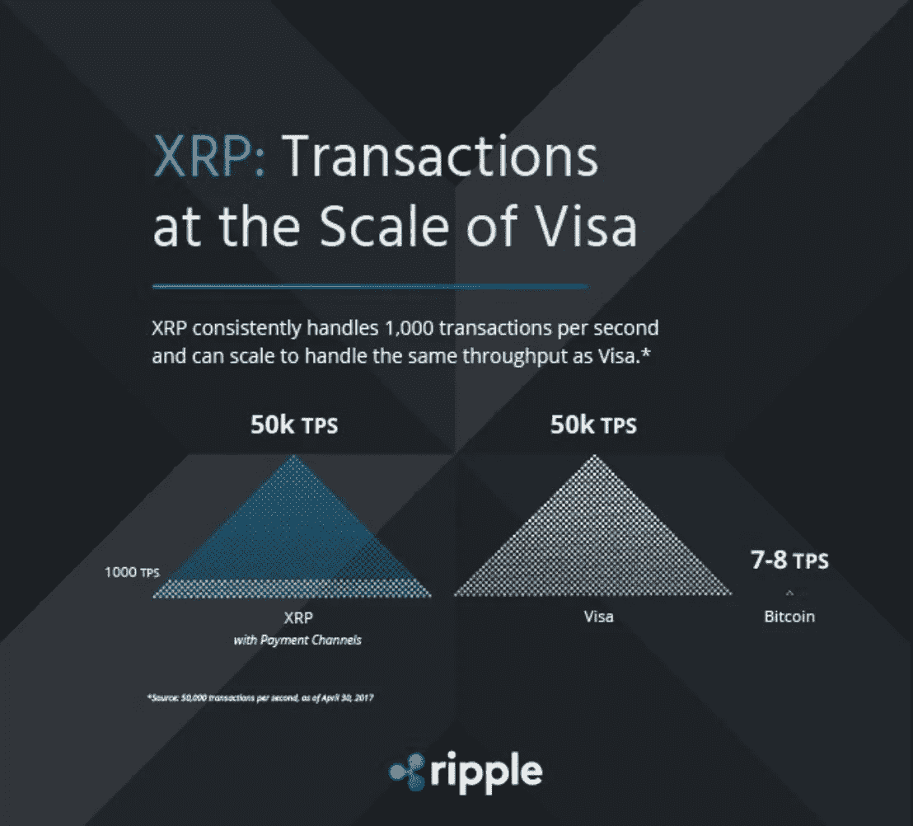
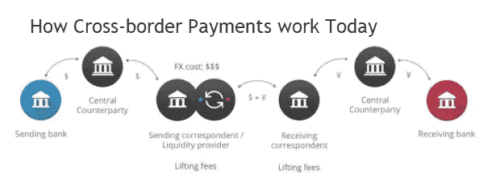

# 虚拟区块链指南—第 7 部分

> 原文：<https://medium.com/swlh/the-blockchain-for-dummies-guide-part-7-8e4116b1e8d8>

*回顾:在* [***第六部分***](/@jradosta/the-blockchain-for-dummies-guide-part-6-8032c542fb7b) *中，我们讨论了什么是加密货币，它们如何工作，以及它们相对于法定货币的一些优势。在本帖中，我们将深入探讨一些当今最流行的加密货币，以及它们未来的一些拟议用例。*

Cryptocurrencies galore! Oh my!

# 比特币

你不能在不谈论所有加密货币之母比特币的情况下讨论加密货币。

比特币是一个名叫中本聪的匿名人或团体的创意。比特币的起源可以追溯到 21 世纪初，当时一个名为**密码朋克**的团体做出了各种尝试来创造数字现金。

每次尝试的问题似乎总是回到我们在以前的帖子中提到的**重复消费**问题(还记得用户不应该多次消费同一个数字硬币吗？).

直到 2008 年 10 月，中本聪才向 Cypherpunks 邮件列表[提交了他的宣言“比特币:一个点对点的电子现金系统](https://bitcoin.org/bitcoin.pdf)”，其中提出了一个解决重复消费问题的方法。到 2009 年 1 月，第一块比特币区块链被开采出来，区块链时代和可行的加密货币正式开始。

由于比特币的影响力和受欢迎程度，比特币或多或少成为了加密货币市场的道琼斯指数。比特币价格的变动会对其他加密货币的价格产生显著影响，但这种情况可能会在未来发生变化。

比特币最初是作为一种点对点支付系统设计的，然而它的流行导致了协议中的各种技术问题，特别是与交易时间有关的问题。

目前，比特币每秒只能处理大约七(7)笔交易，与 Visa 或 Mastercard 每秒 23，000-24，000 笔交易的水平相比微不足道。因此，作为一种支付系统，比特币远远不能满足全球商业的需求，不能被视为一种可行的日常购物支付系统。

然而，由于比特币是开源软件，比特币社区一直致力于第二层实现，以帮助将一些交易从区块链转移到具有[闪电网络](https://lightning.network/)的支付渠道。其理论是，通过将交易从链外转移到支付通道，它将释放区块链上的带宽。作为一名工程师，我对 Lightning Network 以可行的方式解决扩展问题的能力有点怀疑，但我会将这一点留到以后的帖子中。

2nd Layer solutions will help solve Bitcoin’s scaling issue, but the question is by how much?

不管比特币社区是否成功地将加密货币扩展成一个可用的日常支付系统，毫无疑问，比特币作为一种数字资产将有一个相关的未来。

比特币经常被称为“电子黄金”，我认为这将是一个准确的绰号，因为它模仿了黄金的许多固有属性:巨大的价值储存手段，但却是一种糟糕的交易媒介。

# 以太坊

以太坊是由 Vitalik Buterin 领导的一群开发人员的想法，Vitalik buter in 是一个狂热的比特币爱好者，他认为有必要扩展比特币区块链的脚本层，以允许软件开发。

以太坊是比特币的一个 T2 分支。编程中的分叉意味着获取开源软件的初始代码库，并将其作为构建的起点。

以太坊利用一个叫做*可靠性*的脚本层和编程语言，允许开发者创建**智能契约**(我们在[第 6 部分](https://medium.com/p/20fcc4827b22/edit)中讨论过)。如果您还记得上一篇文章，智能合约允许创建、控制和铸造加密货币或代币，开发者可以将它们用于各种目的。

本质上，以太坊允许开发者创建自己的加密货币，而不必担心构建全新的区块链协议。相反，他们可以使用以太坊区块链来处理交易数据和共识，而智能合同层处理令牌经济学。

Initial Coin Offerings (ICO’s) have exploded in 2017 on Ethereum by new blockchain-based companies.

因为以太坊是比特币的一个分支，它目前受到比特币一样的缩放问题的困扰。已经有各种各样的提议来解决缩放问题，从改变共识机制到区块链数据库的 [*分片*](https://www.coindesk.com/vitalik-releases-partial-proof-concept-ethereum-sharding-tech/) ，然而到目前为止什么也没有发布。

目前，以太坊只能处理大约 15 TPS 以上的速度，所以它离成为一个可行的支付协议还有很长的路要走。以太坊更令人担忧的是，由于智能合约是公开可见的代码，编程不当的智能合约会带来巨大的安全风险，这些风险总计会导致被黑客攻击的智能合约造成数百万美元的损失。

不管以太坊的规模和安全问题，该协议拥有一批忠实的追随者，其中包括一些世界上最聪明的人。它也是目前最受企业家和新区块链公司欢迎的构建应用程序的协议。

# 涟漪

在我看来，Ripple 是最独特的加密货币之一，特别是因为它的最终目标是成为一个可行的全球支付系统。

Ripple 最初是 Jed McCaleb(现在是 Stellar 的创始人)和 Chris Larsen(Ripple 的代理主席)之间的一个想法，然而协议本身是前 NSA 密码学家 David Schwartz 的心血结晶。McCaleb 联系了 Schwartz，讨论如何以一种不同于比特币的更具可扩展性的方式来解决重复消费问题，结果产生了 Ripple。

Ripple 解决双重消费问题的方式与比特币不同，但它并不太专业。Ripple 没有利用矿工消耗计算能力来达成交易共识，而是利用一种被称为 Ripple Consensus Protocol (RCP)的超级多数共识过程。

RCP 使用雪崩机制，这意味着当网络上的验证器同意事务集的有效性时，其他验证器开始以更快的速度同意事务集，直到达到超级多数，这将事务集添加到分类帐。

最终结果是，Ripple 能够实现高达 50，000 TPS 的交易速度，几乎是 Visa 或 Mastercard 处理速度的两倍。这意味着，到目前为止，Ripple 确实是唯一一种分布式账本技术，它作为一种可行的支付系统具有直接的潜力。

Ripple at scale with Visa or Mastercard transaction speeds.

虽然日常支付系统可能更适合 Ripple，但 Ripple 的直接用例是跨境转移。目前，银行业使用 SWIFT 系统，这是一个将资金转移到最终目的地的互联银行网络。

Currently, the SWIFT system is used to make cross-border transfers via intermediary banks.

SWIFT 系统已经存在多年了——它陈旧、缓慢，而且国际转账费用很高。因此，Ripple 在颠覆金融机构进行跨境支付的方式方面处于非常有利的地位，它通过提供几乎实时的资金结算，而不是通过 SWIFT 支付高昂的费用和 5 天的运输时间。

此外，Ripple 的本币 XRP 可以通过提供即时流动性池，为金融机构提供货币兑换的实时流动性，而不必持有各种目的地和货币的外国账户。这降低了银行的外汇敞口，并减少了它们在外国账户中的休眠资本。

# 新兴加密货币

除了上述货币，还有各种其他新兴货币用于不同的用例，从匿名交易到特定应用程序的使用。

对冲基金和其他基于替代资产的基金也在寻求加密货币，将其作为一种将基金令牌化的方式，为投资者在非流动性头寸中提供即时流动性。

*在* [***第 8 部分***](/@jradosta/the-blockchain-for-dummies-guide-part-8-6d7f450e651) *中，我们将通过讨论区块链和加密货币的一些其他用例来结束我们的系列，从虚拟化真实世界的资产，到联合个人身份，通过验证数字文档来防止伪造和不可否认性。*

# 寻找区块链开发或 ICO 支持？请致电 [KaizenTek](http://www.kaizentek.io) 联系我们。

# 如果你喜欢这篇文章，给我 10 个掌声和一个关注！

## 这个故事发表在 [The Startup](https://medium.com/swlh) 上，这是 Medium 最大的创业刊物，拥有 323，238+人关注。

## 在此订阅接收[我们的头条新闻](http://growthsupply.com/the-startup-newsletter/)。

