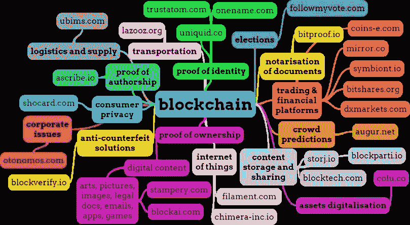
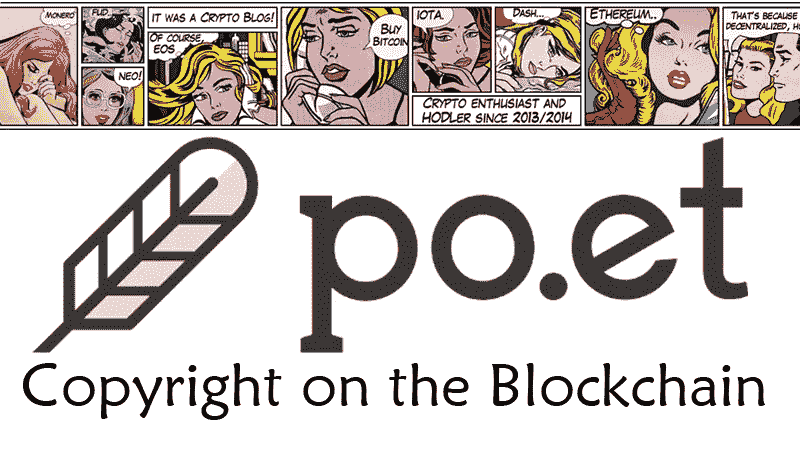
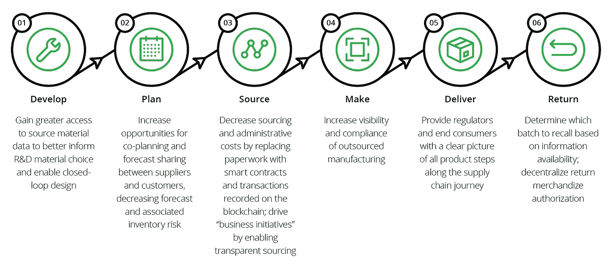

# 虚拟区块链指南—第八部分

> 原文：<https://medium.com/swlh/the-blockchain-for-dummies-guide-part-8-6d7f450e651>

*回顾:在* [***第 7 部分***](/@jradosta/the-blockchain-for-dummies-guide-part-7-8e4116b1e8d8) *中，我们深入探讨了一些当今最流行的加密货币及其未来的一些潜在用例。虽然加密货币与区块链技术结合得非常好，但在我们系列的最后一部分，我们将探索区块链技术的其他一些潜在用例。*

Blockchain — Oh the places you will go!

因此，虽然区块链的第一个用例是通过比特币的加密货币来实现的，但这种新技术还有其他非常有价值的用例。区块链有无限的应用，其中一些甚至还没有构思出来，但在我们的最后一部分，我们将深入一些迄今为止最明显和最有前途的应用。

# 数字版权管理

[我们之前在第 5 部分](/@jradosta/the-blockchain-for-dummies-guide-part-5-7230bce29642)中讨论过，早在 1999 年，Napster 和 Kazaa 等音乐共享服务是如何真正给音乐行业的收入引擎带来冲击的。人们能够以点对点(p2p)的方式复制、共享和下载音乐文件，而没有任何影响，也不需要付费。

虽然由于音乐行业的诉讼恐吓策略和通过 Apple Music 出现的基于软件的数字版权管理，未经授权的文件共享不像 21 世纪初那样猖獗，但它仍然是创作艺术中的一个主要问题。

随着 Tor 和 Bit Torrent 等文件共享服务的出现，文件共享变得更加难以跟踪，因为文件内容不再像 Napster 那样从单个对等点下载。

取而代之的是，文件被分割成更小的片段，并从 Tor 网络上的各种对等点下载，只有在所有组件都被下载后，最终文件才在本地组装。这使得很难确切地看到对等体正在共享什么，因为单独的数据包在分析时是没有意义的。

区块链能够通过加密验证数字媒体的有效性来进一步清理文件共享问题。例如，iTunes、Windows Media Player 等媒体播放器，甚至 Pandora 或 Spotify 等流媒体服务都可以要求通过其媒体播放器播放的任何歌曲在发行商的区块链上具有加密验证的身份。如果文件在发行商的区块链中没有作为有效和合法发行的记录，则歌曲的回放可能被禁用。

这只是区块链如何用于数字媒体的一个例子，但区块链在这一领域的应用可以扩展到库存照片、版权、专利、电子书和任何其他类型的数字媒体。

New blockchain-based companies such as Po.et hope to use blockchain technology as a means for tracking copyright and digital rights management for artists and publishers.

# 供应链

区块链在公司制造业务中的应用实际上已经开始了。

在最近由 [CoinDesk](https://www.coindesk.com/bmw-ford-gm-worlds-largest-automakers-form-blockchain-coalition/) 撰写的一篇文章中，宣布宝马、福特和通用汽车等汽车制造商已经组成了一个区块链联盟，以探索区块链技术在其制造供应链中的使用案例。

在你不太熟悉产品制造和供应链如何工作的情况下，我会给出一个简要的概要(更深入的，你可以查看[本指南](/self-driving-cars/the-automotive-supply-chain-explained-d4e74250106f))。

说到你在日常生活中可能用到的任何产品，无论是你的汽车、手机，还是任何其他东西……该产品的原材料来自不同的供应商。例如，在福特制造的典型汽车中，螺栓、金属、发动机部件和塑料等原材料来自 1000 多家不同的供应商。

最终产品，即汽车，只有在所有的原材料都被接收和检验后，才能由福特最终制造出来，但这一过程本身就可能非常复杂，因为常见的事件从货物丢失到处理有缺陷的部件。

例如，如果某个组件出现故障，就有必要追溯创建该组件的供应商，以及创建该组件的批次号。生产批次和运输可以安全地保存在汽车制造商和他们的供应商之间共享的区块链中，以便于跟踪。

如果发现缺陷，其他汽车公司将能够对照共享的区块链进行检查，以查看他们的哪些车型受到缺陷的影响，从而提供确凿无疑的验证。

Blockchain can be used to track raw materials from suppliers throughout the manufacturing lifecycle.

区块链在供应链管理中的另一个使用案例可能是将其与传感器设备相结合，这些设备可以跟踪装运到制造设施的出发和到达，而不会引入运输中间商，因此不会产生额外的成本摩擦。

区块链技术在供应链管理中的应用已经展开，从我们的汽车制造商的例子，到跟踪海运集装箱和提单，如[马士基](https://www.maersk.com/press/press-release-archive/maersk-and-ibm-to-form-joint-venture)等大型航运公司正在探索。

在每一种情况下，人们都希望区块链将有助于消除中间商造成的摩擦成本，并分散供应链流程，以在整个制造生命周期中提供更高的可靠性和问责制。

# 艺术出处

仅在艺术品领域，每年就有大约 80 亿美元因艺术品欺诈而损失。然而，除了复制的艺术品之外，很大一部分欺诈来自于**艺术品出处、**或者证明一件艺术品是某个特定艺术家原创的书面证据。

不幸的是，验证艺术品来源的过程非常复杂、深入，需要很多中间人来验证。

验证艺术品的真实性可能涉及到所有的事情，从记录所有权的历史，到检查作品，到证实证明艺术品来源的支持文件。

这个过程，除了高度主观和不完美之外，还*非常*昂贵。当验证艺术品的真实性时，该过程可能涉及前所有者、艺术品经销商、拍卖行、艺术家，甚至法医专家，每一个都增加了验证过程的成本。

虽然清理艺术品鉴定过程本身需要一些时间，但区块链通过将所有出处文件转移到数字形式并将其保存到共享的区块链的可能性，为这一领域做出了贡献。

通过使用区块链，拍卖行、收藏家和艺术品经销商可以在承诺购买之前核实艺术品的来源、所有权历史和其他相关信息，同时消除了许多中间商。

此外，对艺术品的来源和所有权进行清晰的审计跟踪，不仅可以减少该行业每年发生的欺诈行为，还可以在被盗艺术品被追回后帮助识别被盗艺术品。

# 身份管理

如果把数字媒体、供应链或艺术品放在区块链对你来说还不够疯狂，那么把真人放在区块链怎么样？

> 是的，你没看错。

> 事实证明——区块链是一个用密码识别任何东西的伟大工具，我们可以用它来联合个人身份。

我设计了一个这样的框架来联合个人身份，我在名为 Moniker ( [你可以在这里阅读](https://s3.amazonaws.com/kaizentek.io/MONIKER.pdf))的白皮书中写道。但是为了给出如何使用区块链来联合个人身份的概要，下面是像 Moniker 这样的系统将如何做的快速总结。

因此，事实证明，加密货币本身可以代表任何东西…一种货币交换手段，一家公司的所有权比例，甚至是一个真实的人的身份。

Moniker 框架的工作方式是，每个人的生物特征都可以通过人工验证器进行验证、确认和保护。提供照片识别、个人信息、指纹扫描和面部映射等功能可以与智能合同和加密货币结合使用，以代表一个人的安全身份。

本质上，人们将通过一系列类似于 Tinder 的移动应用程序进行身份验证来确认网络(如果此人提供的照片看起来不像他们政府发放的护照照片，则向左滑动，如果像，则向右滑动)。通过以诚实的方式向网络验证人们的身份，验证者将通过协议货币获得经济上的回报。

一旦一个人的身份通过所有必要的身份证明(生物特征、照片、个人证明等)在他们的网络中得到验证，从那时起，这个人的身份就可以由智能合同控制的令牌来表示，在智能合同中，只有他们控制私钥。

这样，如果我想向您确认我是约翰·安东尼·拉多斯塔，我只需向您提供“约翰·安东尼·拉多斯塔”智能合约的公开地址，并向您发送一个令牌。

> 通过向您发送令牌以及该 ID 的智能合约的公共地址，您会立即知道我是该智能合约的所有者，并且我确实是 John Anthony Radosta，因为 John Anthony Radosta 是唯一能够发送该智能合约令牌的人。

白皮书深入探讨了更多内容，如潜在的攻击媒介以及提议的共识流程，但这只是一个基于区块链的个人身份框架如何工作的要点。

通过使用区块链来保护个人身份，我们将有一种验证身份的方法，这种方法将比我们当前孤立的身份联合系统(如社会安全号码、脸书档案或驾驶执照)提供更多的安全性和可靠性。

# 包扎

所以你有它！你现在正式成为区块链专家了，看你走了！

我们在这里已经涉及了相当多的领域，你肯定已经对区块链有了足够的了解，可以被认为是这方面的真正权威。我们已经讨论了从密码学到区块链用例以及加密货币的一切，所以为你新获得的知识感到高兴吧。

在整个指南中，也许你会提出我没有回答的问题，或者你和你的公司在探索这种新技术在你自己的行业中的应用时有一些线索。在分散数字信任方面，区块链的可能性真的是无穷无尽，所以前途无量！

如果您有任何问题，或者正在寻找一些区块链发展或企业咨询，请随时通过评论或通过我们主页上的 [KaizenTek 联系表](http://www.kaizentek.io/)联系我们。

从使用 Hyperledger、Ethereum 和 Stellar 进行区块链开发，到为价值数十亿美元的公司开发大型移动应用程序，我们都做过。

> 在 KaizenTek，我们很想知道如何在您的任何数字化努力中为您提供帮助，从区块链到其他地方，所以给我们写信吧！

当然还有…

# 寻找区块链开发或 ICO 支持？请通过 [KaizenTek](http://www.kaizentek.io) 联系我们。

# 如果你喜欢这篇文章，给我 10 个掌声和一个关注！

## 这篇文章发表在《T4》杂志《创业》(The Startup)上，这是 Medium 最大的创业刊物，有 323，238 人关注。

## 在这里订阅接收[我们的头条新闻](http://growthsupply.com/the-startup-newsletter/)。

