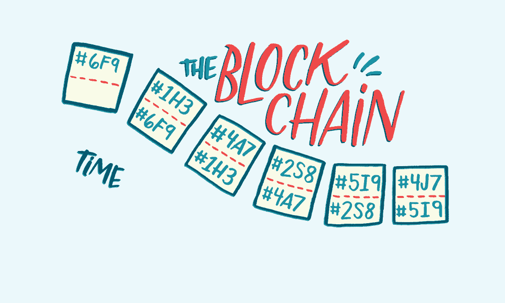
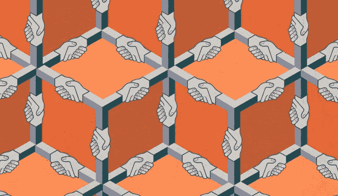

# 区块链 UX

> 原文：<https://medium.com/swlh/the-blockchain-ux-b3fed7d0223>

# **什么是区块链？**

> *“区块链可以作为一个开放的、分布式的分类账，以一种可验证的、永久的方式有效地记录双方之间的交易。为了用作分布式分类帐，区块链通常由共同遵守用于验证新块的协议的对等网络来管理。
> 从专注于金融应用开始，区块链技术正在扩展到包括分散应用和协作组织在内的活动，从而消除了中间人。”*T5—[维基](https://en.wikipedia.org/wiki/Blockchain)

credit: realdolmen.com

区块链技术将改变我们跨系统交易的方式，无论是银行、数字身份、智能合同、数字投票还是更多。正如我们所说的，利用区块链去中心化特性的新应用正在开发中。这些应用被称为 [Dapps](https://www.stateofthedapps.com/) ，是‘去中心化应用’的简称。

一些已经存在的应用程序

[EthNotary](https://www.stateofthedapps.com/dapps/ethnotary) (进入链接)
允许多方私下签署文件的公证服务。

[审计狗](https://www.stateofthedapps.com/dapps/auditdog)(输入链接)
一个不可变的软件安全审计库

# **这项技术与 UX 设计师有什么关系？**

区块链的一个关键特征是对用户完全透明。有一种方法可以让我们向用户展示这种额外的透明元素。难道我们不欢迎数字身份完全安全的想法吗？难道我们不希望我们的政府和投票过程更加透明吗？
当我们试图在区块链的背景下回答这些问题时，有机会通过强调后端区块链流程确保数据安全的各个接触点来吸引用户。为了将这些后端接触点呈现给普通用户，设计师需要了解幕后发生了什么。如果设计人员与开发人员使用相同的语言，并且在粒度级别上成为围绕区块链的对话的一部分，那么它有助于创建普通用户所需的抽象层。

Illustration by Dan Page

你如何向用户提供他们需要的所有信息？如何提取他们不需要的信息？同时仍然保持无缝的直观体验？

普通用户不会理解底层的区块链协议，就像他们在网上理解 HTTP(超文本传输协议)一样。

目的是不让人们理解底层技术。相反，让人们信任一种不依赖于信任的技术。用户需要能够理解基于区块链的应用程序与他们习惯使用的应用程序的不同之处。

# **用户是谁？**

随着区块链应用达到临界质量并被广泛采用，设计师需要考虑用户的过渡阶段。任何技术的早期采用者都是更喜欢“在引擎盖下修补”的技术用户，显式技术的新来者通常是日常普通用户，他们将受益于粒度技术细节的抽象、入门、简单的提示和提示，以及很少的可能让他们感到迷失的 UX 流选项。

# **信任！信任！信任！**

当设计让用户感觉舒适和信任系统时，一些最佳实践包括当用户采取任何行动时的一致性和持续的反馈。清晰的图标，利用过去的经验标准，没有行话的术语，不会混淆信息，简单直接地与用户沟通。这些方面可以帮助用户感到轻松，并增加区块链技术的采用和学习。
动作动画有助于给用户一种上下文感，帮助他们理解与他们的输入相关的正在发生的事情。呈现给用户的屏幕最好包含一个、两个或所有可操作的、建立信任的或教育的元素。为用户提供大量的反馈要比哪怕是一点点的不足要好。用户期望并要求总是知道现在正在发生什么，刚刚发生了什么以及接下来会发生什么。

# **区块链≠加载器**

区块链交易的平均时间比普通用户习惯的时间要长得多。在一个分散的区块链上的交易比在一个集中的网络上花费更长的时间。在此期间，用户需要有关其事务状态和进度的反馈。从几毫秒到几秒甚至几分钟的加载时间似乎不是一个进步。有机会提出更强大和更有吸引力的反馈循环，利用区块链的透明度向用户展示正在发生的事情，并通过正确的抽象级别保持其相关性和趣味性。

# **单程票(不变性)**

区块链交易的不可逆转性是用户需要习惯的，我们习惯了撤销按钮是一个标准功能。区块链不允许撤销交易。设计师需要在用户将要做出不可逆转的动作的地方制造摩擦。

# **忘记密码(钥匙)**

区块链系统为每个用户分配一个私钥以及一个用户名和公钥。这些功能协同工作，允许用户访问他们在区块链上的帐户。如果用户忘记或放错了他/她的私钥，则没有生成新的私钥来访问帐户的选项。这打破了 UX 模式，因为用户习惯于点击“忘记密码？”按钮，以恢复忘记或丢失的密码，几乎银行在这个功能。需要向用户展示教育入门流程，让用户体验这种新的 UX 模式。这也是一个与用户建立信任的机会，以确保方向清晰，建议有助于确保用户采取适当的行动，以确保他/她始终可以访问帐户。

# **区块链 UX 的未来**

这些想法触及了区块链带来的帮助普通用户从这项新技术中受益的 UX 原则的表面。
通过无缝和直观的 UX，我们需要给用户足够的理由不使用集中的互联网，而是在一个透明的分散网络上数字化，保护每个人的数字资产、交易和身份。

## 这个故事发表在 [The Startup](https://medium.com/swlh) 上，这是 Medium 最大的创业刊物，拥有 286，184+人关注。

## 在此订阅接收[我们的头条新闻](http://growthsupply.com/the-startup-newsletter/)。

