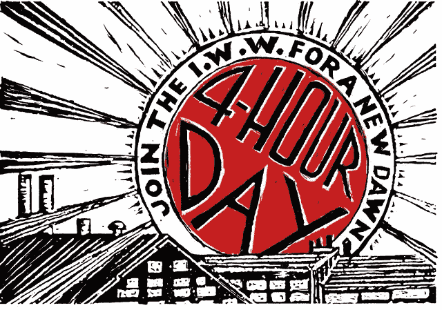
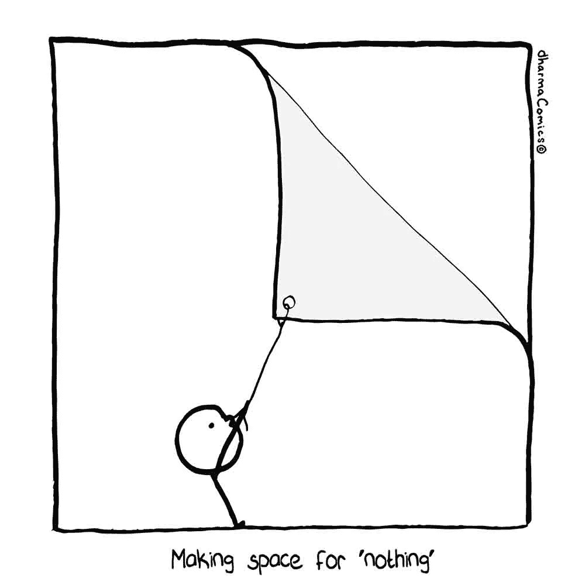
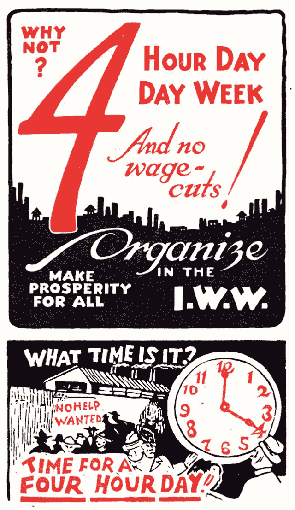

# 四小时工作制的真实商业案例

> 原文：<https://medium.com/swlh/the-bona-fide-business-case-for-the-four-hour-work-day-92ae7b1a0dd3>

> 四小时工作日的理由被严重误解了。

人们经常把它与蒂姆·费里斯的每周四小时工作制相混淆:只要把一些 bizarro 电子产品运到你时髦的 Shopify 商店，瞧！你可以穿着内衣休息一周。

但这根本不是四小时工作日的目的。四小时工作日是关于硬科学和我们认知的极限。即使对于最有成就的专家来说，任何形式的刻意练习最好限制在每天四小时。更短的工作日让知识工作者有更多的精力(是的，时间)去做真正重要的事情。它也为更多的人提供了更好的工作。

# 认知超载

让大脑为创造力做好准备可能是一件[棘手的事情](https://www.youtube.com/watch?v=Ey8FzGECjFA)。但是激发你创造性产出的关键是“[空闲时间](https://www.jstor.org/stable/26270137?seq=3#metadata_info_tab_contents)”。一项针对精英科学家的研究表明，他们认为放松是他们工作表现不可或缺的一部分。正是在这些奇妙的空隙中，你可以让你的头脑游荡，让你的潜意识有机会变得肮脏。那个一直困扰你的问题可能很快就会觉得它开始自己解决了。

所以，除非你正在[微量服用](https://www.thecut.com/2018/05/microdosing-guide-and-explainer.html)(即使那样)——否则你很可能无法在一天内挤出超过四个小时的深度工作。这是一种让你的大脑得到伸展的工作，大约一个小时后，一个思维模糊的人会告诉你该停下来了。工作日的其余时间需要专注的一小部分，实际上只是填充，也就是电子邮件。强迫自己连续几个小时坐在屏幕前不仅对大脑有害，对未来来说也不是一个可持续的策略。

为你的最佳工作创造合适的条件需要有计划的爆发和有计划的休息。这似乎违背了“时间就是金钱”的禁令，但正是“休息时间”给了你向前飞跃的突破。

换句话说，多工作很少是提高生产力的答案。这正是著名哲学家伯特兰·罗素(Bertrand Russell)在 1932 年[为*哈珀的*](https://harpers.org/archive/1932/10/in-praise-of-idleness/)*——*撰写的一篇文章中提倡四小时工作日的原因。

# 能源维护

我们变得如此迷恋生产力，以至于忘记了如何放慢节奏。我们已经把忙碌变成了吹牛的权利，把“我没有时间”变成了我们的集体口头禅。那些有多余时间的可怜人——他们一定是没有足够的事情可做！但是，一个更加深思熟虑的工作日的目标，伴随着一阵阵的深度专注，而不是无休止的挣扎，都是关于管理你的能量。

我们不应该看我们如何度过时间，我们应该意识到我们如何集中我们的工作精神。创业企业家、编码马拉松运动员、工作狂、[奋斗色情作家](https://www.nateliason.com/blog/struggle-porn)，许多人可能会对此呆呆。他们骄傲地佩戴着“永远在线”的徽章。但是问问你自己:你希望你的护士在 12 小时轮班结束时还是在 4 小时轮班开始时照顾你吗？(你的答案是为什么[一家领先的荷兰医疗保健公司](/@Harri_Kaloudis/a-systematic-overview-of-the-literature-in-english-on-buurtzorg-nederland-part-b-the-buurtzorg-189a7e4704b0)实际上提供 4 小时轮班。)

最终，我们的生活是由我们关注的事物来衡量的。如果你想做到最好——无论是在办公室还是与朋友和家人在一起——日以继夜地工作并不是答案。从研磨中吸取一些能量，并把它送给所爱的人，在内心深处我们知道这是正确的选择。

# 分散工作

围绕四天工作周的喧嚣并不是要在一天中挤出更多的工作，所以你可以在周五离开。它是关于给工人控制权，让他们在自己的时间里以自己的方式做他们需要做的工作。它用笨重的工业外套换来了发光的信息斗篷。如果我们迅速行动起来，这些变化可能意味着一个好工作和更好生活方式的新时代。

人工智能可能是我们实现更短工作周的可取之处。人工智能的[预测能力](https://dzone.com/articles/using-ai-to-improve-your-predictive-capabilities)将帮助我们做出更快更好的决定。我们提供给个人生产力伙伴的数据集越丰富，他们就能更好地建议我们以最佳方式消耗我们的精力。随着低级和令人麻木的任务的自动化，理想情况下，我们可以解放出来专注于我们的深层工作会话。

当然，一切都可能变得不可收拾。说到明智地花费时间，我们确实有一个相当糟糕的记录(电子邮件、电视、视频游戏和色情只是我们最喜欢的一些东西)。我们可能会发现，我们没有更聪明地工作，而是浪费了新发现的时间。可以肯定的是，人工智能将揭露我们每天都在做的过多的[废话](https://jacobinmag.com/2018/06/bullshit-jobs-david-graeber-work-service)。这一点很重要，因为将这些毫无意义的任务自动化不会突然让它们变得有价值。这将迫使我们不仅要考虑我们工作了多少，还要重新思考我们如何从中找到意义。

纽西兰、瑞典和英国都是缩短工作周的拥护者[。“我相信在这个世纪，我们可以赢得一周工作四天，每个人都有体面的工资，”英格兰工会大会主席弗朗西斯·奥格雷迪最近评论道。这个国家同意这个观点——61%的英国工人认为一周工作四天会让他们更有效率。在美国，软件公司 Basecamp 十多年来一直在尝试缩短每周工作时间。犹他州也是如此。](https://www.nytimes.com/2018/09/10/business/britain-four-day-workweek.html)

好处不再有争议:更少的病假，节省成本，更好的工作/生活融合。随着幸福感和[自尊](https://www.nytimes.com/2015/08/30/opinion/sunday/rethinking-work.html)的增强，员工们往往更[有创造力](https://books.google.ca/books?id=VRNWBQAAQBAJ&pg=PA85&lpg=PA85&dq=worker+well+being+leads+to+creativity&source=bl&ots=YPST2KdEqg&sig=sYSYY79sqT7IgbSJMtA82Uh-4gA&hl=en&sa=X&redir_esc=y#v=onepage&q=worker%20well%20being%20leads%20to%20creativity&f=false)、[有生产力、更投入](https://www.clomedia.com/2016/08/31/a-four-day-workweek-more-productive/)和更具协作性。缩短工作周可以让公司节省工资，并将这些资源再投资于员工的培训和发展。这对失业者来说也意味着更多的工作。

不必要地长时间工作的做法迟早会停止。有一天，我们甚至会珍视我们所做的所有没有报酬的工作。这种修正后的工作观将着眼于质量，而不是数量，并最终杜绝在办公桌前吃午饭的坏习惯。

*乔纳斯·奥特曼写工作。点击**[***此处***](https://www.jonasaltman.com/newsletter) ，加入千千万万个关于未来工作的每月文摘*

*如果您喜欢这个故事，请点击👏按钮并分享，帮助其他人找到它！欢迎在下方留言评论。*

**

## *这篇文章发表在 [The Startup](https://medium.com/swlh) 上，这是 Medium 最大的创业刊物，拥有+397，714 名读者。*

## *在这里订阅接收[我们的头条新闻](http://growthsupply.com/the-startup-newsletter/)。*

**