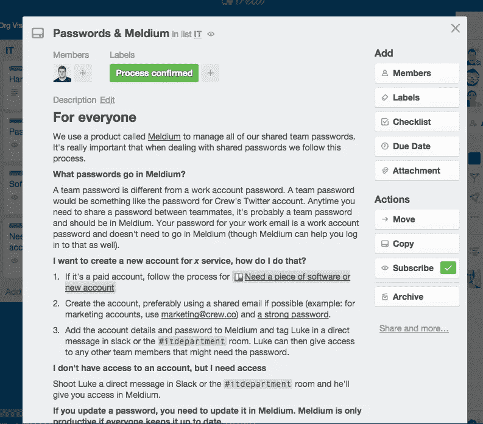

# 总线测试🏃🚌

> 原文：<https://medium.com/swlh/the-bus-test-8c5e2a2d7507>

## 一个简单的测试，测试您的企业如何抵御灾难

Image by Mike Wilson on Unsplash — [https://unsplash.com/@mkwlsn](https://unsplash.com/@mkwlsn)

一天，剧组首席技术官[安格斯·伍德曼](https://medium.com/u/43d34295401?source=post_page-----8c5e2a2d7507--------------------------------)和我走在回家的路上(是的，我们有时一起走回家)，深入地谈论着[剧组的一些重要的、改变世界的特征](http://crew.co)，当我们走下人行道时，一辆公共汽车飞驰而过，与安格斯只差几英寸。

如果没有安格斯，是的，公司的平均年龄会低得多(我说你老，安格斯)。是的，该公司的懈怠信息在政治上应该更正确一点。但是谁会编写所有的后端代码来保持 Crew 平稳运行呢？

谁会处理这些部署？

谁会撕毁我们的 Github 拉取请求呢？

谁会把 Github 的优先标签命名为*优先弱酱*和*优先辣酱*？

好吧，所以公交车的事情从来没有发生过(虽然我们有时会一起走回家——那又怎样？)，但我们确实，在某个时候因为某种原因，思考过让知识只存在于一个队友脑袋里的问题。

如果那个人出了什么事(比如说，他们被公共汽车撞了)，我们如何继续前进？

我们将这一原理命名为*总线测试*，因为它听起来比*某人休假/离开工作人员测试*更令人兴奋，尽管略显恐怖。

# 如何运行总线测试

*总线测试*是一个简单的原理:

> *“知识应该在多个团队成员之间复制。”*

知识不仅仅意味着事实和历史，它还意味着过程、发展和对账户的访问，等等。

随着你的成长，事情会变得越来越复杂，在过去的一年里，我们做了很大的努力来复制、记录和组织船员的知识。其中一些我们仍在努力，但这里有一点幕后看看我们如何试图在队友之间传播知识。

# 账户共享

有一段黑暗时期，我们通过以下方式共享账户:

1.  使用相同的电子邮件/密码组合(是的，这是一件事😳)
2.  分享老派的方式(*)“嘿，斯蒂芬，再问一下 Skype 的登录名是什么？”*)

它很慢，不安全，最重要的是，它没有通过公交车测试。

一个人走了，噗再也没有登录。

[Meldium](https://meldium.com/) (不，不是 [Medium](/) )是我们开始用来在队友之间安全共享密码的工具。它有很多有用的功能，但最重要的是团队中的每个人都可以访问与团队相关的账户(比如 Twitter、分析、开发工具等)。

当我们注册某项服务的新账户时，我们会将其添加到 Meldium。

如果密码需要重置，我们会在 Meldium 中更新。

一旦我们更新了帐户或密码，Meldium 会确保自动与团队的其他成员共享。

它很快，很容易，并且通过了总线测试。✅ 🏃🚌

# 处理

“流程”听起来像是你在创业时尽量避免使用的词汇之一——它们是为缓慢、无聊的老年人准备的，对吗？或者至少，你试着最小化它们(我一直是这么想的)。

然而，几个月前，我们*确实有流程。我们只是从来没有记录下来。*

它们没有被形式化，也不容易被发现。它们相当于“*嘿，斯蒂芬，Skype 的登录名是什么来着？*“问题，但是规模大得多。

我们在浪费时间，让新队友很难通过***4AM 测试*** (哦对了，那是我们以后会谈到的另一个测试)。最糟糕的是，他们没有通过公共汽车考试。

[Stephanie Liverani](https://medium.com/u/58e7e108a566?source=post_page-----8c5e2a2d7507--------------------------------) 和 [Mikael Cho](https://medium.com/u/300c728e7d24?source=post_page-----8c5e2a2d7507--------------------------------) 是第一批发现我们需要适当地记录我们如何做每一件事的人，从写博客到创造一个新产品，所以我们把所有的信息都放在了 [Trello](https://trello.com/) 上一个名副其实的“流程”板上。

董事会的前提很简单:任何可重复的行动(又名:一个过程)都应该被记录并被分配一个领导。

领导负责在流程发生变化时更新流程，并回答有关流程的任何问题。

从新队友入职到 IT 问题，再到报销费用，一切都记录在白板上。当你不知道如何做某事时，这是你第一个看的地方，当你在周六晚上寻找有趣的事情做时，这是你最后一个看的地方。

Trello process card for Meldium and passwords (so meta)

最重要的是，它把一个人头脑中的知识拿出来，与团队的其他成员分享。总线测试通过。✅ 🏃🚌

# 发展

开发最难的是理解产品背景(让我们开始一场激烈的战争[黑客新闻](https://news.ycombinator.com/))。理解一个特性是如何工作的是相当容易的，但是理解*为什么*会这样工作以及选择背后的思考过程是产品开发中最难也是最重要的部分。

我给你举个简单的例子(不过，你可以跳过它):

在 [Unsplash](https://unsplash.com/) 上，一张照片有两种标签[:建议标签和权威标签。建议标签由社区创建，权威标签由我们的团队创建。有三种类型的建议标签:自动标签(由算法创建)、社区生成的标签和照片摄影师创建的标签。有两种类型的权威标签:主标签(例如，这个*是*一头牛的图片)和次标签(这个图片*包含*一头牛，但它不是*只是*一头牛)。](http://backstagewp.wpengine.com/unsplash-search/)

不简单吧？

对于任何没有参与创建该系统的开发人员来说，这是令人困惑的、复杂的，当你阅读代码时，你*得到了它*，但是你不理解*为什么*这样做(我发誓，这是有原因的)。

当涉及到修复 bug、在未来改进特性以及不认为你的队友是十足的白痴时，交流这些知识是至关重要的。如果这种知识只存在于最初的开发者的头脑中，那么，当那个人不在的时候，我们其他人就很不幸了。

我们仍在寻找交流知识的最佳方式(应该在维基中，在代码本身中，在 Trello 中，还是在 Github 中？).

目前，我们正在使用多种工具来实现这一目标，但这种情况可能会在未来发生变化。

主要结果是知识需要写在某个地方。Github pull-requests 是一个好地方，Slack 上的 dev 频道是另一个，codebase 可能是最好的。

与其他领域不同，我们*算是*通过了开发总线测试，但这是我们肯定要弄清楚的事情(无论谁是 Trello 卡流程的负责人，他们都将度过愉快的一年)。❔ 🏃🚌

所以是的，这就是巴士测试。如果你没有通过，你可能应该通过，因为，嗯..你永远不知道。

*嘿，我是* [*卢克*](https://twitter.com/lukechesser) *。我目前正在构建*[*Unsplash*](https://unsplash.com/)*。我是 Twitter 上的*[*@ Luke chesser*](https://twitter.com/lukechesser)*，很想听听你对公交测试、替代方案以及你用来实现它的任何工具的想法。*

# 找到最好的队友(不会在你面前消失的人)。

## 看看 Crew 吧，这是一个人才市场，在这里你可以见到最好的设计师和开发人员，并与他们一起工作。超过 1000 万人使用了剧组生产的[产品。超过 300 万人阅读了我们的博客。在这里加入他们](http://crew.co/?utm_source=Medium&utm_medium=CTA&utm_campaign=MediumCTAs)。