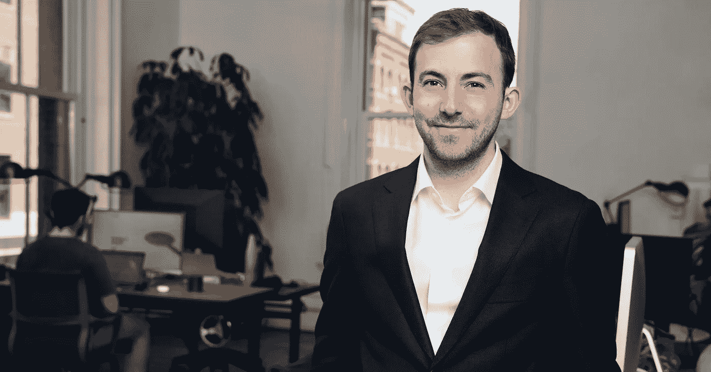
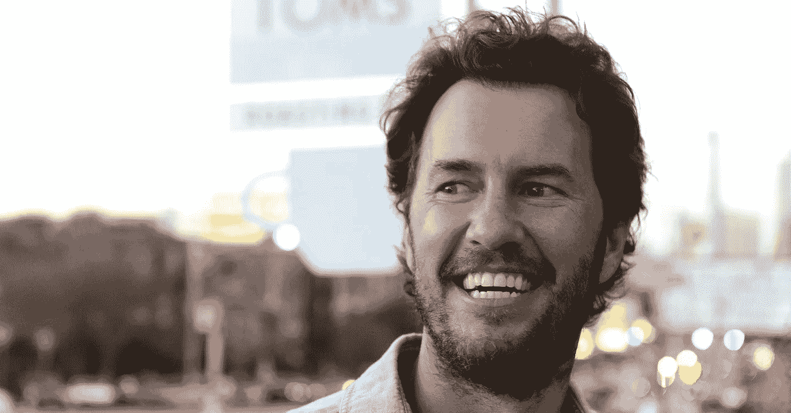

# 做好事:如何赢得幻想破灭的千禧一代的钱包

> 原文：<https://medium.com/swlh/the-business-of-doing-good-how-to-win-the-wallets-of-disillusioned-millennials-32f24e9a1edf>

# 两个词:意识资本主义

一个由*全食*的联合创始人约翰·麦基和*意识资本主义公司*的联合创始人拉吉·西索迪亚在《[意识资本主义:解放商业的英雄精神》一书中推广的术语。](https://www.amazon.ca/gp/product/1422144208/ref=as_li_qf_sp_asin_il_tl?ie=UTF8&tag=jennifertaylo-20&camp=15121&creative=330641&linkCode=as2&creativeASIN=1422144208&linkId=6467c1aaa2e4598f6b596e4b383271fc)

意识资本主义的核心是一种商业模式，试图不仅为顾客和员工创造价值，也为更大的社区创造价值。这是一种模式，而不是仅仅关注利润最大化来取悦股东，灌输利他主义的思想。

令人惊讶的是，这个概念已经存在了几十年。

这种商业模式的起源可以追溯到爱德华·弗里曼(R. Edward Freeman)和他 1984 年的著作《战略管理:利益相关者方法》(Strategic Management:A Stakeholder Approach)在他的书中，Freeman 建议企业围绕与所有利益相关者的关系制定战略，这些利益相关者包括员工、管理层、利益相关者、客户、当地社区等等。

但是在 21 世纪，麦基是它最热情的拥护者。在被亚马逊收购后，这种商业模式使全食超市的估值达到了 137 亿美元。让我们看看这是怎么发生的。

# 1.全食超市:有机食品连锁店寻求彻底改变食品工业

*CREDIT: Matthew Mahon/Redux //*

全食超市不仅仅是一家昂贵的连锁超市。全食超市通过鼓励真正的、有机的食品、可持续的种植实践等等，以彻底改变食品工业的理念来推销自己。

## 总结一下:价值观很重要。

顾客在全食超市购买食品杂货时会得到什么？

滋养你身体的高品质食物*参加一场进步运动，让世界变得更美好。*

*虚高的价格？这只是改变世界的代价。*

> *但是，那些没钱支付昂贵价格的千禧一代怎么办？*
> 
> *“没问题，”麦基说。*

*2016 年 5 月，全食超市在时尚的银湖社区开设了第一家“365”商店，旨在以低价吸引千禧一代。“365”的意图不是试图降低全食品牌的标准，而是抓住赞助贸易商 Joes 的千禧一代。*

*然而，全食超市并不是唯一一家发现千禧一代购买力的公司。*

# *2.财富简单:一个有意识的机器人顾问*

**

*Credit: WealthSimple //*

> *“这是加拿大金融服务公司首次明确瞄准千禧一代投资者。”*
> 
> *—迈克尔·凯臣*

*在线投资管理服务 WealthSimple 于 2014 年由迈克尔·凯臣(Michael Katchen)在多伦多创立。*

*自三年前出现以来，机器人顾问的口号“为人类投资”一直是[积极瞄准千禧一代](http://www.bnn.ca/no-reason-for-me-to-care-wealthsimple-s-strategy-targeting-millennials-gets-mixed-reviews-1.918293)。*

*从各种年轻人谈论他们与金钱的关系的 30 秒宣传短片到知名名人在公司网站上写自己的个人故事等营销策略， [WealthSimple 一直热切地瞄准年轻专业人士和首次投资者](http://business.financialpost.com/personal-finance/family-finance/millennial-money/investing-company-targets-millennials-and-their-not-so-lofty-bank-accounts)。*

*凯臣本人是千禧一代，知道什么管用。*

*2015 年，Katchen 声称他们 85%的投资者年龄在 25-45 岁之间。*

*去年，WealthSimple 加大了赌注:引入一个对社会负责的投资组合。根据他们的网站，*

> *“社会责任投资意味着投资那些达到一定社会责任标准的公司。SRI 考虑了环境影响以及社会和治理问题。”*

*投资组合包括碳排放量较低的全球股票，以及基于人权和低腐败等标准的发达经济体和新兴经济体。*

*截至 2017 年 5 月 1 日，WealthSimple 的资产已达 10 亿美元，并获得了该公司 5000 万美元的新投资。*

# *3.汤姆斯鞋业:用“一对一”策略重新定义零售*

**

*Credit: Vivien Killilea, Getty Images //*

> *“我们的成本结构中包含了为客户提供巨大利益的意图，因为他们觉得自己不仅仅是交易的一部分。”*
> 
> *—布莱克·麦可思基*

*2006 年，布雷克·麦可斯基创立了 TOMS 公司，一家销售鞋子、眼镜等商品的零售公司。*

*但是，与其他零售公司不同的是，每购买一双 TOMS 鞋，就会有另一双鞋捐给贫困儿童。*

*这种“一对一”的模式现在已经被许多其他公司所采用，包括[沃比·帕克](https://ca.warbyparker.com/buy-a-pair-give-a-pair)，他还为每购买一副眼镜的人捐赠一副眼镜。*

*TOMS 怎么样了？*

*根据 2017 年品牌世界价值指数，TOMS 在世界总价值方面排名第 50 位，2016 年汤姆斯在千禧年人口统计中超过耐克。*这令人震惊，因为 TOMS 的收入与耐克相比微不足道。**

# *如何赢得千禧一代的钱包*

*千禧一代对资本主义不再抱有幻想。*

*根据 2016 年哈佛调查显示，只有 42%的参与者支持资本主义。此外，51%的人不支持资本主义，33%的人支持社会主义。*

*怎么回事？*

*嗯，作为一名千禧一代，我相信我对我的 Y 世代同伴对当前经济状况的感受有所了解。随着学生债务、不稳定的就业和过度消费主义的增加，千禧一代渴望赞助那些真实可信、有社会意识、最重要的是意识到千禧一代面临的独特挑战的企业。*

*千禧一代可能无法创办一家非营利组织，但他们更愿意资助那些向员工支付 15 美元最低工资的餐馆、出售无虐待产品的服装店，以及由住在自己社区的一个家庭拥有的当地食品市场。*

*随着婴儿潮一代步入退休，千禧一代现在掌握着主要的购买力，奖励那些与他们的价值观更加一致的企业。而大多数千禧一代看重的是什么？好吧，看看他们关心什么。*

**我们看到千禧一代站在争取增加工人权利、提高最低工资以及最终支持那些表明他们将人放在利润之上的企业的斗争的前线。千禧一代不想成为问题的一部分。他们希望有机会成为解决方案的一部分。**

## *争夺千禧一代的心和钱包的战斗才刚刚开始。如果你想抓住这些观众，你必须专注于开发一个让千禧一代感到兴奋的利他使命——真正改善他们自己以及他们周围人的环境的东西。*

*如果你喜欢这篇文章，点击“鼓掌”按钮，这样它就可以传播给其他志同道合的读者。点击 [*这里*](http://eepurl.com/c6wA3T) *进行注册，这样你就可以直接在你的收件箱里收到我的最新文章(没有垃圾邮件)。**

**

## *这篇文章发表在 [The Startup](https://medium.com/swlh) 上，这是 Medium 最大的创业刊物，拥有 289，682+人关注。*

## *在这里订阅接收[我们的头条新闻](http://growthsupply.com/the-startup-newsletter/)。*

**