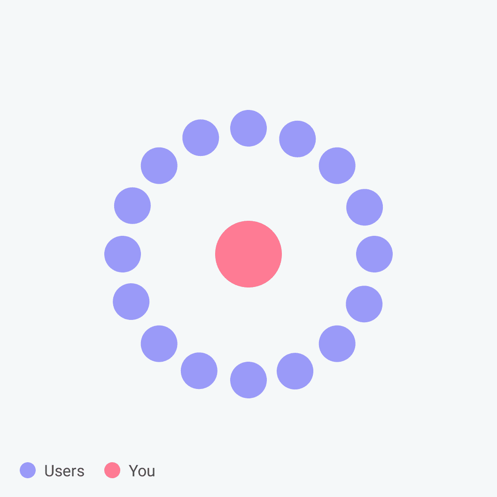
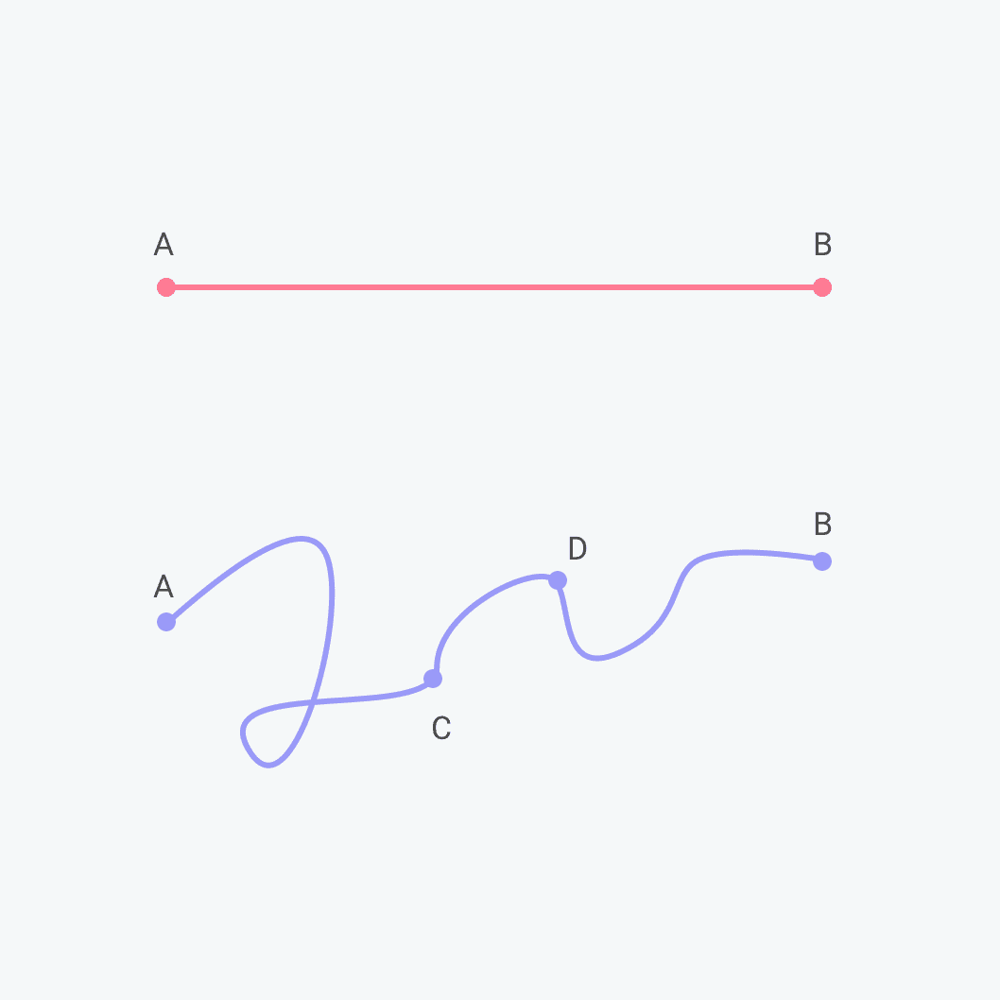
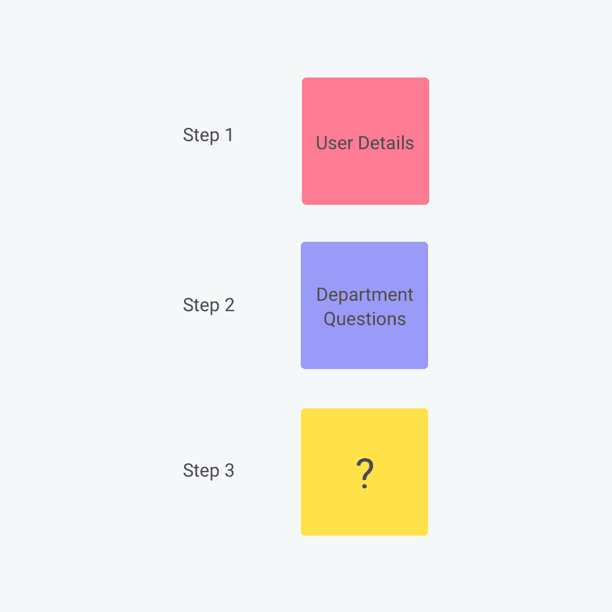

# 蝴蝶效应:微小的变化如何产生巨大的差异

> 原文：<https://medium.com/swlh/the-butterfly-effect-how-small-changes-make-a-huge-difference-ca3b476e1f99>

## 业务类型和在线表单设计一致性

Originally published on [**JOTFORM.COM**](http://jotform.com)

> “你不可能把一粒沙子从它的位置上移走，而不会……改变这个不可估量的整体的所有部分。”
> 
> —费希特,《人类的使命》( 1800 年)

蝴蝶很迷人。

他们甚至有一种现象以他们的名字命名:**蝴蝶效应**。它描述了这样一个事实:微小的、几乎察觉不到的变化会对一个复杂的系统产生巨大的、非线性的影响。

从理论上讲，蝴蝶翅膀的颤动可以引发某种运动，最终导致台风。

这让我想到了表格。因为对于像我这样的产品设计师(以及我在 JotForm 的合作者)，在线表单是非常复杂的系统。

这些系统表现出类似于蝴蝶效应的东西，因为小的决定，或微小的改变可能会产生比我们想象的更大的影响。

就像生活中的许多其他领域一样，我们做出的每一个选择，无论看起来多么微小，都是一个更大系统中的一颗移动的齿轮。

在我在 [JotForm](https://www.jotform.com/) 的工作中，我几乎每天都要筛选用户创建的表单，我亲眼看到一个小小的决定可以带来多大的不同。

举例来说，我经常被微小的疏忽如何导致转化率显著下降而震惊。

在构建表单时有很多需要注意的地方。这就是为什么我把这个指南放在一起:让人们注意到小的决定和变化会产生大的影响。希望你会觉得有用。

# 高转换形式的组织:迷你指南

让我们从大局出发。

# 1)目的和背景

你的表单需要有一个**目的**。这是你需要明确的第一件事，因为它将影响你如何构建表单。所以要明确你的目标。写下来。

表格是交流的工具，这意味着填写的每一张表格都涉及到双方。

是的，你想通过表格找到什么很重要；但是你也要记住你的回答者的目的是什么。他们为什么要不厌其烦地填写表格呢？

目的是嵌入在上下文中的，你能使这个上下文(在你的心目中)变得越具体，它就变得越有意义。试着想象你的回答者在哪里填写表格。

> 他们在办公室还是在家？
> 
> 他们是在周末做还是在上班的路上做？
> 
> 他们使用的是平板电脑、台式机、笔记本电脑还是手机？

这些事情中的任何一个都会对你如何构建一个表单产生影响。

语境不仅仅指环境。这也是为了让参与者全面了解你为什么要求他们填写表格，他们提供的信息或反馈可能会带来什么变化，以及这对你和他们有什么影响。

你的回答者(以及他们的目的和背景)需要从一开始就成为你的表单框架的一部分。

# 2)你在和谁说话？

你的表单需要吸引正确的受众的注意力，但是他们是谁呢？

想到一群人很难让你集中注意力。这就是为什么“买家角色”是一个如此有用的概念。**它指的是一个虚构的“理想顾客”,有个性、希望和梦想。**

这是你写表格时应该瞄准的人。一个人。为什么？因为一个人会比一大群模糊的人告诉你更多。

让你理想的回答者成为焦点。

> 他们是谁？
> 
> 是什么激励了他们？
> 
> 他们重视谁的意见？
> 
> 哪些障碍阻碍了他们？
> 
> 他们想解决哪些问题？
> 
> 他们与你的业务有什么联系？

通过弄清楚什么对你的客户有意义，你将能够收集有意义的数据。

# 3)如何提问

想象一下，与某人共进晚餐，他开始用夹杂着行话和困惑的晦涩难懂的方言轰炸你——等等，什么？你可能想马上离开。

一个表单也没什么不同。这是一次谈话。你要确保填写表格的人(你的对话伙伴)不会开始感到紧张、不知所措或怨恨。

这就是为什么你需要保持清晰和一致。

# 简单地说

我们都更喜欢[平实的语言](https://www.nngroup.com/articles/plain-language-experts/)——甚至连专家都同意。我们都知道。那么，为什么这么多的网上聊天听起来像是通过同义词库？

有些人把简单和愚蠢混为一谈。并非如此。要简单(清晰)地表达一件事，你得很好地理解它。或者如爱因斯坦的名言:

> “如果你不能简单地解释它，你就不够了解它。”

说到语言，简单就是简单的英语。简明英语为你的听众创造了最大的清晰度，同时也使你的努力最小化。这就是你的目标。

所以写下你想说的最简短、最直截了当的版本。没有行话，没有不寻常的词，没有复杂的句子。只是淡淡的，简单的，自然的语言，你和朋友说话的方式——而不是机器人。

就当是边喝咖啡边轻松交谈吧。

检查你的写作是否达到这个目的的一个好方法是大声朗读你的文章。你的耳朵会听到你的眼睛可能看不到的东西:你的文字变得生硬或难以理解的地方。

> “复杂性是你的敌人。任何傻瓜都能把事情变得复杂。很难让事情变得简单。”
> 
> —理查德·布兰森

简单也意味着尽可能的短。说到在线交流，用户[不怎么看](https://www.nngroup.com/articles/how-little-do-users-read/)。上网的人既忙又容易分心。

实际上，你可以预期你的话中大约有 20%会得到充分的关注。确保这些单词突出，并且你的表单不会被它们分散注意力。

如果你不确定一个问题是否相关，那就把它扔掉。在这次谈话中，做一个好的倾听者比一个好的谈话者重要得多。更少的问题意味着更好的答案，因为每增加一个句子或部分都会降低表格的转化率。

最后但同样重要的是，简洁也适用于视觉效果。是的，作为人类，我们欣赏美。但是美丽的设计往往是简单的，永远不会过分。不必要的图片或花哨的字体会分散注意力，而不是吸引人。

你对颜色的使用可能至少在某种程度上取决于你公司的视觉形象。除此之外，简单意味着遵循一些显而易见的规则。不要把紫色放在黄色旁边。不要在白色背景上用橙色书写，或者在黑色背景上用白色书写。

# 保持一致

如果不会因为不可预测而出错，回答者更有可能坚持使用一种形式。一致性支持顺利通读。

保持一致性的一个重要方面是语气——这种语气反映了你的[公司的‘角色’](https://www.jotform.com/blog/successful-form-structure/)。你公司的角色听起来像什么？这不仅是风格问题，也是价值观问题。哪些短语和词语代表了**贵公司的精神？**是否充满活力、新潮、未来感？这件事值得集思广益。

在 [JotForm](https://www.jotform.com/) ，我们专注于包容、友好和脚踏实地——我们使用的语言反映了这一点。

一旦你确定了基调，确保它贯穿于你的所有表格。您的客户希望在整个旅程中与同一个友好的人交谈。

视觉一致性同样重要。采用一种视觉标识和风格，在整个表单(以及将来创建的其他表单)中保留这种标识和风格。

# 如何提出你的问题

记住在你的表格的对话中有两个伙伴。您希望确保从表单中获得所需的信息。您的回答者希望尽可能快速、轻松地完成表格的结尾。当你决定在表格中加入哪些问题，以及把它们放在哪里时，请记住这两点。

## 让它流动

你的问题的内容当然很重要，但它们的排序方式也很重要。每个问题都应该推动你的回答者进入下一个问题。大跳跃会让你的回答者感到困惑，让他们开始快速浏览表格的其余部分，或者干脆关闭。

保持流畅的一个方法是从简单的问题开始，然后向更难的问题推进，让你的回答者放松下来。除非他们一直躲在岩石下，否则大多数人都习惯于识别某些自然的流动——例如，你不会在别人的名字前询问他们的信用卡信息。

对问题进行排序也意味着要注意如何对它们进行分组。例如，将个人信息组合在一起，引入单独支付，等等。

## 伸出援手

当您发出表格或调查时，您希望回答者能尽快参与进来。所以给他们扔个垒球。从一个简单的是/否、简单、不容错过的问题开始，帮助他们克服起步摩擦，让他们继续前进。

使用预定义的选项将允许回答者选择他们的答案，而不必键入。另一种使用户生活更容易的方法是使用占位符文本，这样他们可以快速浏览页面并理解所需的答案，而不必阅读整个问题。使用是/否问题也会帮助他们不费力地前进。

根据您需要的数据，有许多不同的问题类型。在你记下你的笔记后，用细齿梳仔细检查一下，去掉任何不必要的东西。

如果问题是必要的，但只针对特定的受众，那么使用条件逻辑来实现它们，以一种不会激怒那些不适用它的人的方式。如果你被设定为“最好拥有”，比如“你会向朋友推荐我们公司吗？”，使它们在表单完成后成为可选的。与原始形式相比，这种方式可能会获得更高比例的答案。

就当是第一次约会吧。你从闲聊开始。容易回答的简单明了的问题，例如:

> 你不到 40 岁吗？
> 
> 你有生意吗？
> 
> 你会滑雪吗？

(稍后会讨论你的婚姻是如何结束的)。

先让你的回答者感到舒服，取得他们的信任。随之而来的是一些棘手的问题。

## 最后的想法

当谈到构建有效的表单时，重要的是小事情。关注细节将会产生深远的影响——不关注细节也会产生深远的影响。一个简单的问题，放在它应该在的地方，可能会决定一次旅行是否结束。

在这方面，它和蝴蝶翅膀的颤动没有太大的不同。

## 感谢阅读。如果你喜欢这篇文章，请随意点击那个按钮👏帮助其他人找到它。

*最初发表于*[*【www.jotform.com】*](https://www.jotform.com/blog/the-butterfly-effect/)*。*