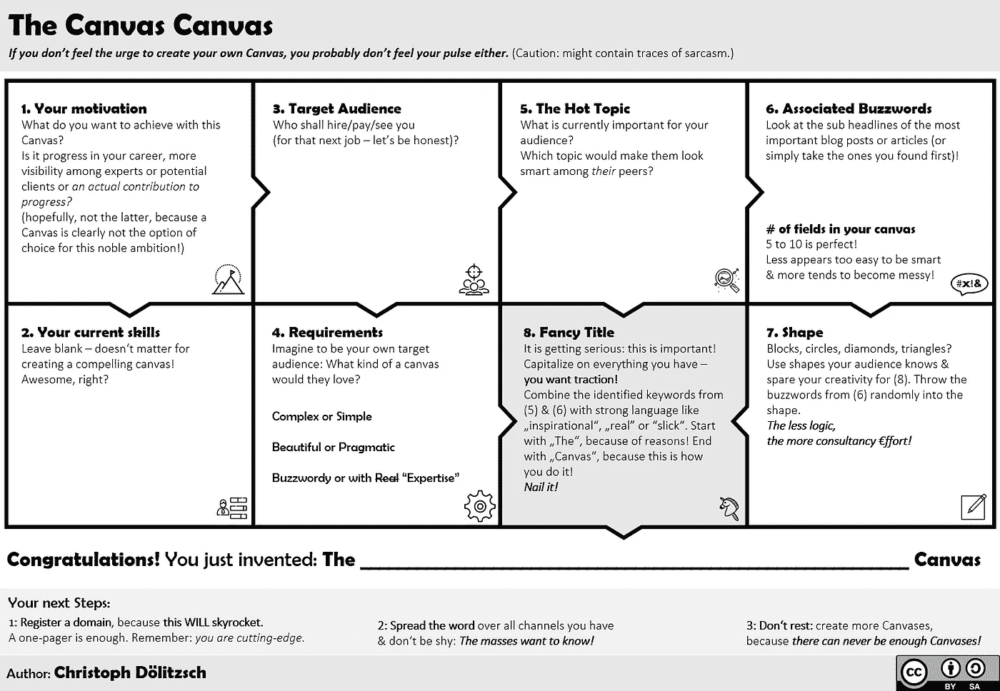

# 画布将帮助你统治世界。很明显。

> 原文：<https://medium.com/swlh/the-canvas-canvas-6fd0fd888cd3>

## 使用画布画布创建您自己的画布。现在的人都这样！

**免责声明:** 我不会说，这可能包含讽刺的痕迹，因为它是主要成分。

**我们生活在一个画布时代，我们热爱这个时代。**
几乎每个题目都有画布。你可以用
“…Canvas”搜索任何话题，然后你会发现一些伟大的人会称之为*模板*的东西。

画布画布是你需要的最后一块画布:
用它来创造你自己的画布，用它们征服世界。

> 如果你感觉不到创造自己画布的压力，你可能也感觉不到你的脉搏。

## 感觉有点革命性:

全球企业的高管们低头看着同样的模板，就像即将成为创始人的人一样(*他们可能连一个车库都没有！*)。

> “跳出框框思考”，他们说，“并为此使用框框！”

你可能想加入并为运动做贡献:创造你自己的画布。现在每个人都这么做。

**画布 Canvas 将帮助你为自己最大的抱负创作一幅画布:**

*   在你的同行、潜在客户或所有人中间看起来更前沿！
*   更前沿(这一点不能保证)
*   用你的新锐征服世界

画布将帮助你做到这一点。

# 画布帆布

当然，和其他画布一样，Canvas Canvas 是为了帮助你解决一个问题而开发的，你还不知道你需要一个画布。

***这听起来可能有些奇怪，但是 Canvas Canvas 就是用来开发 Canvas 画布的。*** 脱离自身！听说过分形吗？它们令人兴奋不已——画布也是如此。

## 画布 Canvas 怎么用？

像使用其他画布一样使用画布:

1.  把它画在 A0 里，用它覆盖一面墙，
2.  释放便利贴的力量，
3.  感受精神！

***从方框****【1】开始。你的动机"* ***"让画布引导你经历一次顿悟之旅&。***

它不仅帮助你创建你的画布，而且指导你完成最重要的第一步。

Use it as every other Canvas out there: plot it in A0 and use tons of sticky notes to **feel the spirit.**

# 开始创建您自己的画布

祝你好运，用你自己的画布征服世界！别忘了寄一张明信片——或者只是一个你域名的链接。🚀

喜欢并随时与同样喜欢画布的人分享。

干杯，克里斯托夫

期待您的评论，
或者在 [LinkedIn](http://www.linkedin.com/in/christoph-doelitzsch) 上给我留言。

## ***关于作者&为什么:***

Christoph 现在在柏林生活了 9 年多，是一名商业设计师，Idea Engine &尽力为创新做出贡献。如今，他是 Dalia Research 的常驻企业家，开发 21 世纪的信息产品:快速询问全球受众进行市场意见调查。
有一天，他注意到有一块(几乎)可以容纳一切的画布！试试看，谷歌一下下面的内容:“**随机商业流行语** 画布”。你不会失望的！

## 这个故事发表在 [The Startup](https://medium.com/swlh) 上，这是 Medium 最大的创业刊物，有 318，983+人关注。

## 在这里订阅接收[我们的头条新闻](http://growthsupply.com/the-startup-newsletter/)。

