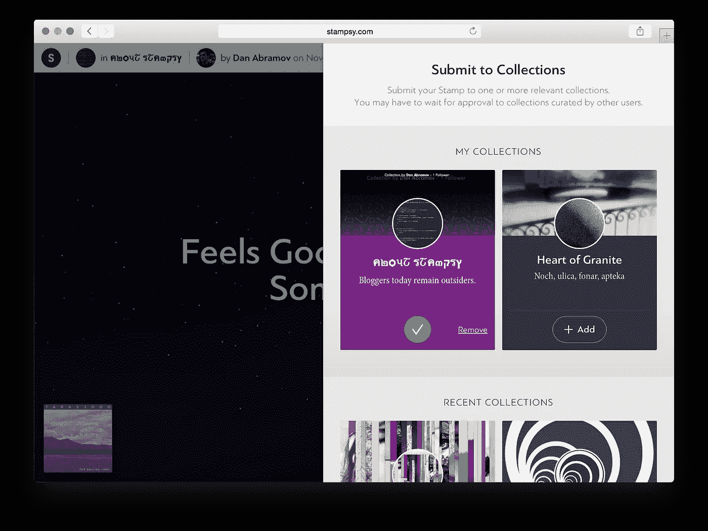
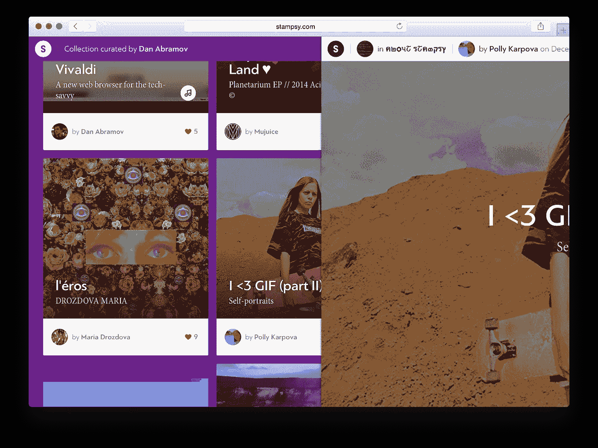
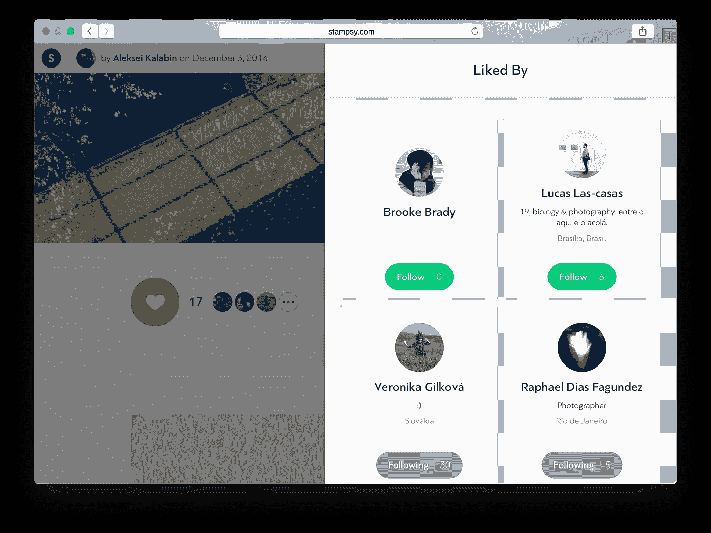
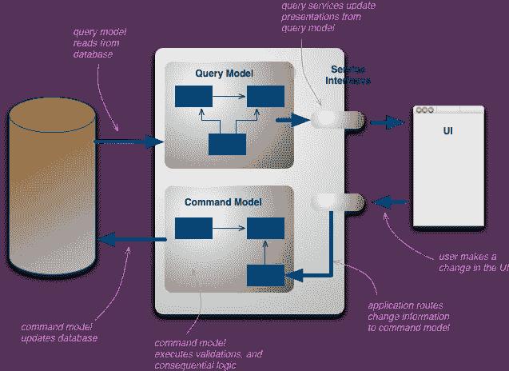
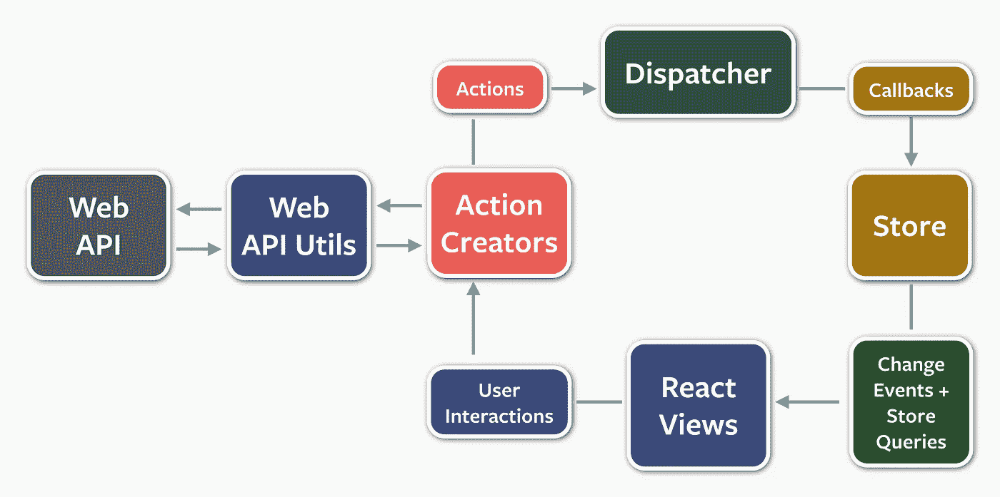

# 通量的情况

> 原文：<https://medium.com/swlh/the-case-for-flux-379b7d1982c6>

在过去的几个月里，Flux 变得流行起来，你已经看到每个人和他们的狗都推出了自己的实现。围绕这种模式的动力是如此难以忽视，以至于如果你是 React 初学者，**你可能会认为 Flux 是编写 React 应用的*和*方式，但是你很沮丧没有理解这一点。**

这是一个问题。不断质疑教条是 React 的精神，我们必须小心不要引入我们自己的教条。作为一个社区，我们需要教初学者睁大眼睛，这样当有比 Flux 更好的东西出现时，他们就能识别出来。

朋友不要让朋友盲目挑一个设计模式。

如果你在 00 年代使用微软的 stack，你会记得占主导地位的 NIM 思想:不是微软发明的。没有人会使用 ORM，除非它来自幸运的供应商。

整个网络社区与这种想法相去甚远，但是我们仍然必须保持警惕，因为没有教条是从教条开始的。

当没有足够的原始背景的解决方案被提出时，教条就诞生了，新来者感到有压力将关键决策委托给权威。

起初这可能会让人感到安心，但是你无法逃避这个选择可能是错误的这种挥之不去的怀疑。这种怀疑会促使你要么提出问题(净赢)，在不了解解决方案何时适用的情况下放弃解决方案(对你来说是损失)，要么脱离上下文传播教条(或公开反对它)(净损失)。

随着时间的流逝，背景被遗忘，教条留了下来。信徒们形成一个气泡来保护自己，避免害怕他们过去没有学到的东西，对他们现在所做的选择的评价，以及对他们未来教条的不相关。多浪费大家时间的方式啊！

放心，你不傻。有时我们不擅长解释，你有权要求更好的解释。作为一个行业，我们必须更加努力地做到[包容](https://twitter.com/dan_abramov/status/568096813917585408)，**包容意味着少一些** [**自我**](https://twitter.com/garybernhardt/status/480503932507004928) **，** [**小家子气的阵营**](http://jlongster.com/Modularity) **和口号，多一些师徒、** [**偷取好点子**](http://victorsavkin.com/post/110170125256/change-detection-in-angular-2) **和知识的升华。**

如果今天的好想法被遗忘，并在 30 年后再次被发现，这是我们这一代人的错，因为没有人让它们变得容易理解。

假设你是一个初学者，你选择 React 作为你的第一个 web 应用。您可能甚至不知道构建 webapp 的挑战，更不用说解决方案了！这一点，加上 Flux 在小项目中的冗长和可感知的复杂性，可能会让你发疯。

如果你以前没有尝试过自己解决问题，理解 Flux 应该解决什么问题是很棘手的。我见过有人因为不理解权衡而接受最差的而放弃最好的，甚至因为不稳定而放弃 React。哎哟！

> 问题是，人类确实有一种选择那些对他们来说最糟糕的东西的本领。
> 
> 阿不思·邓布利多

如果你是某项技术的铁杆粉丝，那对你来说就不是音乐了，但是如果人们不能理解你的玩具，他们很少会说出来。更多时候，他们只会觉得愚蠢和失望，后悔浪费了时间，然后默默地继续前进。

Drink responsibly!

当我第一次读到 Flux 的时候，我知道我们必须尽快将 Stampsy 迁移到它上面，即使要付出一个多月没有新特性的代价。这就是我们所做的，它在维护和以后添加新功能的便利性方面获得了回报。

我很幸运。我们中等复杂程度的主干应用程序正在用 Flux 试图解决的同样的问题折磨我，所以它背后的动机很快就吸引了我。如果我没有那么努力地与骨气抗争，我可能会错过它。

下面我概述了一些症状，当你的应用程序展示时，证明 Flux 增加的样板文件和学习曲线是正确的。

如果你的应用程序没有这些症状，并且在不久的将来也不会出现这些症状，那就继续使用对你有用的东西。

相反，如果这个哑谜看起来很熟悉，你可能会有一个关于流动的案例。

我将使用 Backbone 作为一个非流动数据处理方法的例子，但是我的观点同样适用于任何具有模型和集合的传统 MVC 框架。

# 你可能需要助焊剂…

# …如果您的数据随着时间而变化

Flux 可以用于任何类型的应用程序，但是如果你只是渲染静态数据，它就没有多大意义了。流动只会让人感觉不自然和复杂。记住，Flux 的关键是让*数据变化*变得容易推理。(如果更改需要在某个地方持久化，例如在您的服务器上，这是加分的。)

我想强调的另一个要点是**如果你不在乎立即反映用户界面的变化，你就不需要 Flux。**如果你不介意数据在下次刷新前不同步，那就继续使用你已经知道并喜欢的工具和模式。

When I press “Remove” on a collection in the sidebar, I want “in …” label in the upper left corner to disappear.

# …如果您想在内存中缓存数据，但缓存时数据可能会发生变化

一旦您获取了数据，您可能希望将它保存在身边。例如，如果您显示一个项目列表，并且用户可以打开每个项目的详细信息页，那么您希望缓存该列表，以便在用户按 Back 时保留滚动位置。

这已经变得很棘手了，因为您不能只缓存服务器响应并重用它。**如果用户在详细页面上更改了一个项目，然后又返回去了，那该怎么办？**您想要显示缓存列表，*但是*用新数据更新。例如，一篇文章的标题可能已经改变。

这需要一个全局实体缓存，并缓存页面上项目的 id，而不是来自服务器的实际 JSON。如果您正在使用主干集合，此时您必须跳过疯狂的陷阱，因为它们将尝试为每个服务器响应创建模型对象，但是您希望它们重用(并可能更新)缓存中的对象。这是可行的，但很快就会变得丑陋。

我们可能还想在页面加载时从服务器提供的 JSON 中填充缓存，这样页面就不会用 spinner 加载。

When I go back, I want both the data and the scroll position preserved, no matter how many times I pressed “Load More” on the previous page

# …如果您的数据是关系型的，并且模型包含并依赖于彼此

假设我们正在写一个有点像 Medium 的东西，每个帖子都有一个作者。每个作者在他们的个人资料页面上都有一个已发布的帖子计数器。当一篇新文章发表时，计数器必须递增。这对于普通的 MVC 来说是微不足道的，哪里需要 Flux 呢？

假设用户可以互相关注，当关注成功时，我们需要更新一个用户的“关注者”计数器和另一个用户的“关注”计数器，以及“正在关注”和“是关注者”布尔字段，以重新呈现按钮状态。

**我们希望乐观地做到这一点，而不需要等待服务器响应。这意味着我们首先递增计数器并更新布尔标志，然后向服务器发送请求，如果请求失败，我们回滚计数器和标志。简单吧？**

我们可以将它实现为模型上的一个方法，但这意味着其中一个将由另一个管理，如 user.followUser(otherUser)。这种间接性使得错误更难跟踪，如果不同类型的实体需要一起更新和回滚，情况只会变得更糟。

如前所述，不要忘记我们也需要缓存。如果我们已经缓存了用户的“following”页面，这样他们就可以返回而不用重新设置 scroll 了，该怎么办？**如果他们“追随”其他人，这个缓存就会变得陈旧**。我们需要找到一种方法来更新/无效缓存。同样的道理也适用于那个人的“关注”列表。

解决这个问题的一个方法是使这个缓存无效，这样在用户按下 Back 和滚动位置恢复后，它会立即被重新获取。解决这个问题的另一种方法是避免另一个网络请求，并抢先将新模型插入到缓存列表中，因为我们已经知道发生了什么。**不管怎样，在这一点上，你的日常工作完全是与骨气作战**。

但是等等，还有更多。这些列表都是分页的。(骨干集合自己做不到，但是有插件。)如果你想在另一个方向添加分页，比如 Twitter 的“有 3 条新推文”功能，该怎么办？如果您的模型框架还不支持这种开箱即用，您将需要不遗余力地实现这一点。

Even though I paginate on the bottom, I want to be able to merge new items on the top when invalidating. I shouldn’t be fighting with a framework to do this.

# …如果相同的数据来自不同的来源，并且可以在整个用户界面的多个位置呈现

比方说，一篇文章能被人喜欢(那种情况会发生)。您将希望在文章的页脚显示前几个赞，并在与文章本身相同的 JSON 响应中获取它们，以便立即显示它们。好吧，这是你的前三个赞。

但是你也希望有一个“更多”按钮，打开一个侧边栏，列出所有喜欢过你文章的用户。它将使用不同的 API 端点，并且将被分页。

如果你点击“喜欢”，你会想要更新 UI 中的“前几个喜欢”列表，以及“侧边栏中所有分页的喜欢”列表。

如果这两个列表对应于同一个模型集合就好了，但是这意味着同一个模型集合需要来自两个不同的 API 响应。事实证明，API 响应和模型对象之间的 1:1 对应是不可伸缩的！你觉得这个怎么样，骨气？

All buttons and controls rendering the same data must work in unison.

# 流动的解决方案:没有胖模型，写作和阅读分开，因为它变得更加复杂

这些问题有一个简单的解决方法:**不要用胖模特。让它们成为简单的对象，不要试图把数据读取和聚合硬塞进去。**

另一个重要的教训是**来自服务器的数据不是你的模型。它充当另一个输入，但它不能成为主要模型，就像很难用 ORM 生成的类来表达复杂的领域级逻辑一样。**

Flux 将所有数据突变隔离到应用程序中的一个特定层，并建立一种完全可预测的方式来获取和获取数据。

这不是什么新鲜事，它叫做[命令查询责任分离](http://martinfowler.com/bliki/CQRS.html):

Views express mutation intent with commands, read from database.

你认出伪装的[通量概述](http://facebook.github.io/flux/docs/overview.html)图了吗？

Components express mutation intent with actions, read from stores.

当模型是简单的对象并且不试图管理彼此复杂的更新时，缓存、失效、乐观更新、聚合、分页和许多其他事情变得容易得多。

如果你真的想处理数据，那么所有数据都必须有一个真实的来源。UI 或其他模型都不能改变数据。

事实上，商店是**整个应用程序中唯一有权改变数据的地方。It 没有设置器，只响应组件发出的动作。API 响应也是动作，因为它们用作存储的输入。只有商店可以决定如何更新数据。**

当数据出错时，您可以准确地跟踪损坏发生的位置，因为您 100%知道它发生在商店中。

这是 Flux 帮助解决的问题的概述。

Flux 要求您编写更多的样板代码，但反过来，它使推理复杂的数据变化变得容易，并开辟了许多经典 MVC 无法实现的可能性，例如只通过重新调度序列化的动作来记录和重放 UI 状态。

Flux 还使您摆脱了特定 MVC 实现的限制，因为您管理自己的数据。

如果你的应用没有复杂的数据更改和缓存，就不要用。如果是这样，我强烈建议你试试 Flux。

[在 Twitter 上关注丹·阿布拉莫夫](http://twitter.com/dan_abramov)

⚛

发表于*[**【SWLH】**](https://medium.com/swlh)**(***创业、流浪、生活黑客)**

******