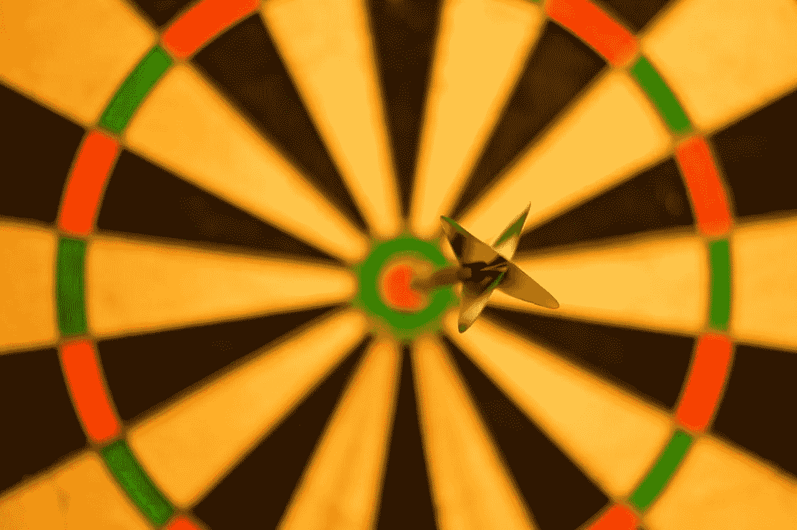

# 保持单一焦点的理由

> 原文：<https://medium.com/swlh/the-case-for-maintaining-a-singular-focus-8344ed9d09e>

Focus on the target… (Credit: skitterphoto.com)

> **“最主要的是保持最主要的东西”**

斯蒂芬·R·科维引用了这句话，强调了对生活中最重要的事情保持高度关注的重要性。通常在我自己的生活中，当我不知所措和挣扎的时候，那是因为我太关心让所有的盘子旋转。我担心更大的…