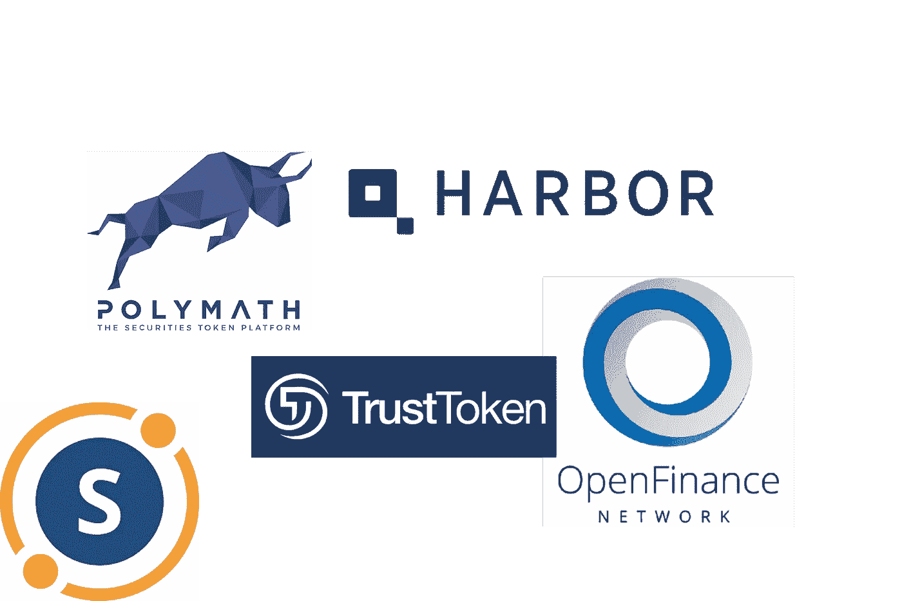
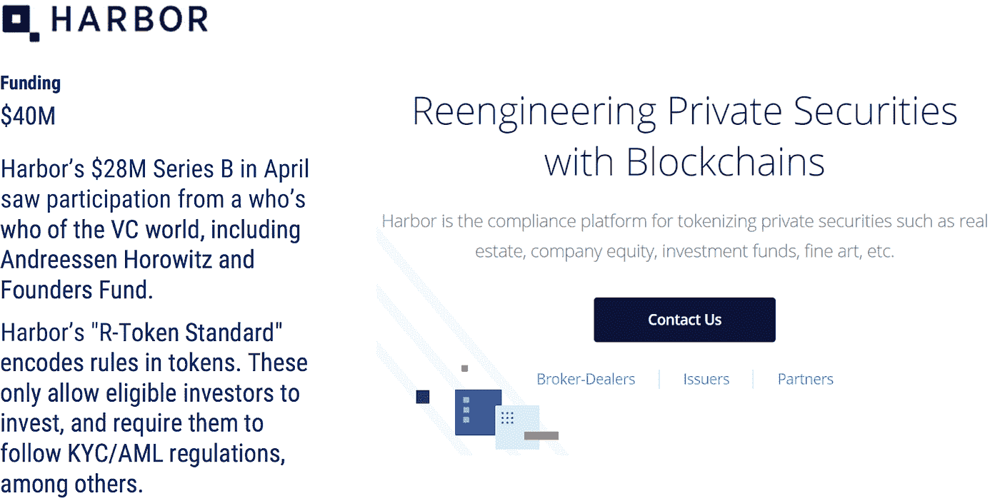
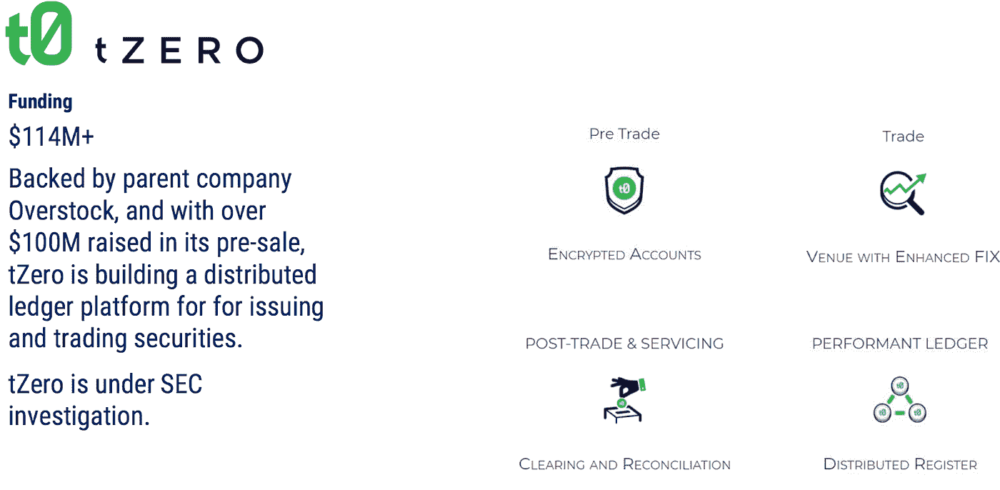
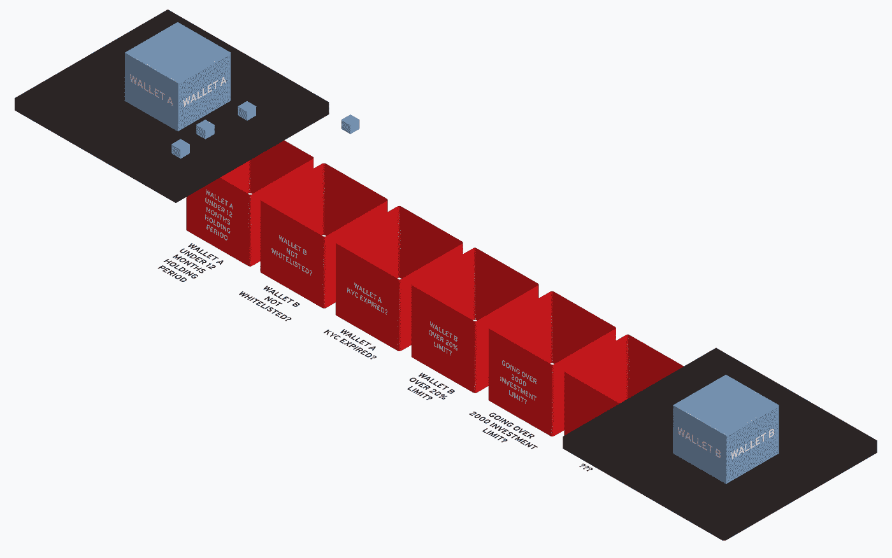

# 安全令牌的案例

> 原文：<https://medium.com/swlh/the-case-for-security-tokens-acfff909f540>

## 区块链筹款界正在转向安全代币——在“为什么”、“什么”和“如何”下面找出答案。

Source: [https://hackernoon.com/the-blocks-of-a-security-token-platform-cd8aada4af43?gi=4593c82e09ae](https://hackernoon.com/the-blocks-of-a-security-token-platform-cd8aada4af43?gi=4593c82e09ae)

安全令牌讨论最终转向亚洲——围绕安全令牌的会议，如在香港举行的[安全令牌期货](https://futuresto.com/#rec66354035)活动，已经开始吸引观众，并激发了围绕设计安全令牌发行平台和寻找区块链技术在实物资产证券化方面的首次使用案例的有趣讨论。

从全球来看，区块链领域的玩家一直在积极为区块链的下一波融资做准备。早在今年 6 月，比特币基地，现在是一家价值 80 亿美元的公司，[收购了 Venovate Marketplace 的 ATS 许可证](https://blog.coinbase.com/our-path-to-listing-sec-regulated-crypto-securities-a1724e13bb5a)，该许可证是令牌化证券上市和二级交易的要求。不到一个月， [Sharepost](https://u.today/sharespost-receives-ats-license-to-trade-tokenized-securities) 紧随其后，宣布美国证券交易委员会批准其 ATS 牌照。

Source: CB Insights

除此之外，还有机构投资者对 STO 相关项目的投资 - TZero 从私募股权公司 GSR 和其他机构投资者那里获得了 1 . 14 亿多美元，而 Harbor 从 Andreessen Horowitz 和 Founders' Fund 那里筹集了 2800 万美元的 B 轮融资。

介绍新成员- **安全令牌产品(STO)。**

# **安全令牌**

在 2017 年，围绕安全令牌的大多数讨论仍然关注加密资产是否是实用令牌(*如果它不是实用令牌，那么它就是安全令牌* )-这个过程在很大程度上由 [Howey 测试](https://consumer.findlaw.com/securities-law/what-is-the-howey-test.html)的通过/失败来控制。

随着趋势的发展，安全令牌变得不仅仅是“*而不是效用令牌*，而是其基础资产**的*可编程所有权*的一个版本，放在区块链**上。代币现在可以是一家公司的股份/部分股份、基金或信托的有限合伙人权益或有限责任公司的成员股份，您对证券股份的所有权和交易对许可方可见。

# **围绕安全令牌的愿景**

像大多数区块链项目一样，安全令牌的愿景和用例围绕着去除中间人来代理安全**。在私人市场领域，这一点尤其重要。在私人市场中，未上市公司的证券可能非常缺乏流动性，中间商仅在二级私人市场上撮合买家和卖家就收取巨额流动性溢价。**

**证券的发行/处理**也可能成为自主流程。随着智能合约的出现，证券发行者可以在代币本身中嵌入证券的特征，例如股息支付甚至投票权。在代币生成活动中也可能会进行资格检查(无论是否为合格投资者)。

*KYC checks ‘baked’ into token transfers… and many more.* Source: [The Security Token Standard Organization](https://thesecuritytokenstandard.org/).

将证券转移到区块链平台也意味着**接近即时结算的可能性**。在当前的结算基础设施中，股票和证券转移需要花费 [T+2](https://www.hkex.com.hk/Services/Settlement-and-Depository/Settlement?sc_lang=en) 的时间，但是一旦更新了区块链分类账，就可以在区块链上进行结算，这取决于安全令牌所基于的协议的吞吐量。

最终的愿景甚至可能是证券化资产的互操作性——在证券化资产之间创造代币市场。如果能够建成，这将开启一个价值互联网，在这个价值互联网中，资产(例如，来自 IP 的收入)可以通过代币与私人房地产 REIT 的 LP 权益进行交易，从而带来额外的流动性渠道。

不过话说回来，这些都是 STO 的宏伟愿景，可能还需要很多年才能变成现实。以下是一些潜在的障碍:

# **围绕安全令牌的直接障碍**

首先，取消中间商的承诺将导致构建此类证券的责任转移到卖方身上。如果发行安全代币的目的是通过削弱你的中间人，以更便宜的方式向合格投资者以外的人推销你的产品，你可能需要暂时重新考虑这样做——今年早些时候进行安全代币发行的一些早期尝试导致了[相当负面的反馈](https://www.bloomberg.com/opinion/articles/2018-03-08/crypto-offerings-slowly-grow-up)。

说到底，投资银行界不仅为账簿管理，也为交易承销证明了他们的收费是合理的，确保监管合规，并与律师合作提交痛苦的 S-1 文件(或其他司法管辖区的同等文件)，以便上述错误不会发生。在安全令牌成为主流之前，安全令牌的销售者需要**积累必要的专业知识来正确构建安全产品**，因为智能合同本质上是不可逆转的，在此基础上的安全构建需要正确完成，尤其是在一开始。

*Undercutting all bankers? Not so fast…* Source: [New York Post](https://nypost.com/2017/10/30/wall-street-bankers-are-getting-bigger-bonuses-again/)

**其次，安全令牌的价值需要模仿基础“真实世界”资产的价值**。想象一下，在亚洲，将一栋住宅建筑的部分所有权进行标记——如果在其 1000 套有人居住的公寓中，有一套公寓的所有者因自杀未遂而去世，这将降低该套公寓的价值，因为亚洲人通常不喜欢住在有人去世的公寓中，因此也降低了该建筑的价值。

虽然这一事件通常会成为当地新闻，但外国投资者(例如阿拉斯加的代币投资者)不会听到这一消息，仍然会对住宅建筑进行估价，而不会对这一事件进行贴现，从而产生信息套利- **因此，证券代币需要确保** [**代币资产的价值与其实物资产的价值**](https://www.nasdaq.com/article/how-tokenization-is-putting-real-world-assets-on-blockchains-cm767952)**保持一致，这一点在私人市场中尤其难以实现。**

****第三，将法规遵从性编程到令牌中很难**。每个安全令牌都需要在一级发行和二级交易期间对所有参与的加密钱包进行 KYC/反洗钱检查，并且不同的管辖区有不同的证券法，如果项目真正以全球流动性为目标，则需要在令牌生成级别考虑这些法律。到目前为止，安全令牌生成标准的项目才刚刚开始出现，功能性安全令牌在全球范围内无缝运行可能还需要几年时间。**

****

## **这篇文章发表在[《创业](https://medium.com/swlh)》上，这是 Medium 最大的创业刊物，有+383，719 人关注。**

## **订阅接收[我们的头条新闻](http://growthsupply.com/the-startup-newsletter/)。**

****