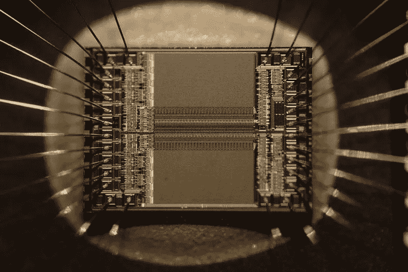

# 空间的案例

> 原文：<https://medium.com/swlh/the-case-for-space-a91792174d8e>

Stars Being Born. Photo Credit: NASA, ESA, and the Hubble Heritage Team

机器人来了！机器人来了！至少我们是这么被告知的。自动化将取代各行各业的许多工作，这已迅速成为公认的智慧，我们都必须适应机器人和机器智能进步带来的新世界。然而，有一个行业被严肃的观点认为会抵制自动化。它涉及沿着直线轨迹将东西从 A 点移动到 B 点，使用需要按照完全相同的规格制造的机器，这些机器目前由高度精通技术的工作人员制造，他们希望尽可能多地自动化这一过程。

好吧，实际上没有人说火箭技术不会自动化。他们所说的是太空旅行仍然不切实际而且昂贵，这是一回事。因为钱从来不会埋在矿井或田地里，而是总会支付给某个人，所以所有东西的成本在某种程度上都是劳动成本。然而，航天发射的成本主要是劳动力成本，比大多数成本更直接。与从焊接到软件将一堆金属、氧气和煤油变成能够将有效载荷送入太空的火箭的熟练而艰苦的精确劳动相比，一堆金属、氧气和煤油的成本几乎不算什么。与其他一些行业不同，太空中的劳动力有理由希望自动化:准备一架飞机进行飞行比准备一枚火箭进行发射需要更少的工时，然而飞机雇用的人数比火箭多得多，因为较低的机票价格意味着人们会更多地使用飞机。

那么，为什么发射火箭的过程没有变得更加自动化，发射成本没有大幅下降呢？部分原因是因为一些所需的技术只是最近才被发明出来，比如 3d 打印火箭发动机部件，以及能够回收和尽可能多地重复使用火箭。然而更重要的是，推动这一进程并不是任何人的工作，也不符合任何人的利益。在 20 世纪 60 年代，目标是尽可能快地击败苏联登上月球，而不是尽可能高效地到达那里。后来，政治考虑鼓励将项目分包出去，让尽可能多的国会选区参与进来，承包商签订成本加成合同，向他们支付所有成本，然后收取一定比例的利润。两者都强烈反对整合和优化流程。然而，这个行业正在发生变化。更多的参与者正在进入市场，包括更多的国家和私营公司，加剧了竞争，促使各方，甚至是传统的美国国防承包商，削减成本和提高效率。所有其他的交通方式都开始变得昂贵和不切实际，并成为常规。无论我们的决策者做出什么决定，太空旅行都不会有任何不同。空间会打开。所有的政策制定者将决定是否是美国人在做这件事。

问太空倡导者为什么他们想探索太空通常有点像问父母为什么他们想要孩子。对于它没有为什么*；它*就是*这个为什么。对于太空倡导者来说，想要突破极限和推动前沿，探索未知，解开宇宙之谜并不是达到目的的手段，而是他们是谁的一个基本方面。这并不适合所有人。如果你不惊奇地仰望夜空，并渴望揭开它的秘密，特别是如果在太阳系的其他地方有生命，我写的任何东西都不能让你感受到它。但是，就像你不需要让孩子们自己看到一个强大的公共教育系统对下一代的好处一样，你也不需要思考宇宙的奥秘来理解为什么美国投资成为第一个使太空旅行实用化和常规化的国家是至关重要的。*

它物有所值的第一个原因是钱会花在什么地方。这笔钱将用于聚集一批工程和技术学科的聪明人，让他们知道如何将技术推向前沿:设计和制造比以前任何可能的机器都更快、更强大、更高效、更耐用、更可靠的机器。这个过程将推动地球和太空的技术进步。以前也发生过。美国上一次在太空进行重大投资是在 20 世纪 50 年代和 60 年代的太空竞赛期间，杰克·基尔比刚刚推出了集成电路，但对能够在比以前更轻、更小的空间内进行计算的东西没有太多需求。另一方面，火箭需要以尽可能紧凑的形式提供尽可能多的处理能力，美国航天和导弹计划成为推动微处理器升级和改进的主要客户，信息革命随之而来。微处理器远非独一无二；其中，太阳能电池的第一个应用是通信卫星。即使在目前的衰落状态下，太空计划仍在继续推动创新。

Integrated Circuit. Photo Credit: Zephyris — Own work, CC BY-SA 3.0, [https://commons.wikimedia.org/w/index.php?curid=17139158](https://commons.wikimedia.org/w/index.php?curid=17139158)

有些人可能会认为技术进步是伟大的，但为什么不直接投资于这些具体的突破呢？只要打开我们想要的具体突破的大门，而不是通过火箭的大门。问题是我们不知道哪扇门通向哪里。这就是科学进步的方式。我们做事情，我们发现事情，这降低了我们没有预料到的领域的可能性。没有人预料到光的本质会通过玩弄磁铁而被揭示出来，也没有人预料到治愈如此多疾病的诀窍是观察面包霉菌释放出一种叫做青霉素的物质。另一个论点可能是，我们应该增加对传统科学研究的资助；给小的、专门的团队拨款做各种实验。这是真的，我们应该这样做，但它不能代替空间。你从让一群专门的聪明人做实验中学到了不同的东西，而不是让一群不同的聪明人去思考如何建造东西。当然，如果在任何地方建造，技术都会进步，但是如果在美国建造，那么如果一个人想雇佣最优秀、最熟练的工人来制造什么东西，或者雇佣受过最优秀训练的工人，那就意味着他们必须雇佣和制造美国人。

美国制造业的受益并不仅限于工人和技术。另一个巨大的好处是可以进入微重力环境。在地球上，重力是工业过程的一个基本限制。我们从油和水知道某些物质不能混合；我们从延加那里知道，有些结构是站不住脚的。同样的规则适用于较小的规模，在太空中推进制造过程的能力将允许美国制造制造出在地球上不可能的混合物和结构。当然，考虑到进入太空的机会是多么有限、不可靠和昂贵，没有一个头脑清醒的美国制造商会考虑现在就在太空中迈出他们的一步。然而，如果有可能用 10 倍于驾驶飞机的工时驾驶火箭进行另一次飞行，计算结果将会大不相同。在合适的价格点上，获得工业上有价值的原材料也是有意义的，比如在地球表面和太空中储量丰富的铂族金属。利用微重力和空间资源的潜在产品包括一些我们想象过的东西，比如新的药物、处理器不再受过热和电池消耗限制的手机和笔记本电脑、能够轻松储存可再生能源的燃料电池和电解电池，以及毫无疑问更多尚未想象到的东西。

然而，关注未来太空的前景和潜力可能是多余的；太空现在对我们的国家利益至关重要。当我们在谷歌地图上使用 GPS 或查看天气预报时，我们可能不会想到卫星，但它们就在那里。社会中有一部分人特别依赖他们:美国军方。美国军队使用通信卫星进行协调，使用间谍卫星找到他们的对手，并使用由 GPS 卫星信号引导的精确武器打击他们。假设一个对手比美国更容易进入太空，这样他们就可以维护自己的卫星并摧毁我们的卫星。对于美国的地面和空中部队来说，他们的对手拥有卫星情报和通信，加上精确武器，而他们没有的一天是艰难的一天。对于海军来说，问题在另一个层面。美国海军被组织成航母战斗群，围绕有史以来最强大的战舰——美国的核动力航母建造。或者更确切地说，除了一个方面之外，它在所有方面都是最强大的:与过去的护卫舰或战列舰不同，航空母舰不必被击沉。如果对手在飞行甲板上打出一个足够大的洞，飞机无法起飞或降落，航母战斗群就没用了，必须撤退进行维修。此外，现代反舰导弹体积小，速度快，而且没有任何防御措施可以阻挡它们。美国海军是建立在一个没有明说，但迄今为止合理的假设基础上的，即它能在敌人发现他们之前发现敌人的舰队。如果我们的卫星不工作，那就不再是真的了。没有海军，美国也不能在海外使用地面或空中力量。如果美国在太空中不领先，美国在任何地方都不会领先。

A Model of Ming Treasue Ship. Photo Credit: User Vmenkov (Own work) CC BY-SA 3.0 via Wikimedia Commons

1400 年，明朝是世界上最繁荣、最强大、科技最发达的国家。它的舰队由比哥伦布在近一个世纪后发现新大陆时更大更强大的船只组成。在郑和的指挥下，中国舰队开始了伟大的航行，在那里他们与海盗作战，建立贸易关系，收集贡品，传播明朝的影响。然而，中国法院最终裁定，这支船队不值这么多钱。巨轮腐烂了，新船没有建造，海洋被欧洲人控制了。是他们，而不是中国，发现了美洲，而来自新大陆的新作物，如马铃薯，被引入中国时已经太晚了，以至于明朝没有在饥荒和叛乱中灭亡。明朝的后继者发现自己不是欧洲人现代战舰的对手，中国进入了殖民时代。当他们离开时，中国已经从世界上最富有的国家之一变成了最贫穷的国家。然而，近几十年来，它们又重新找回了自己。感觉他们会犯两次同样的错误？

## 这个故事发表在 [The Startup](https://medium.com/swlh) 上，这是 Medium 最大的创业刊物，有 292，582+人关注。

## 订阅接收[我们的头条新闻](http://growthsupply.com/the-startup-newsletter/)。

