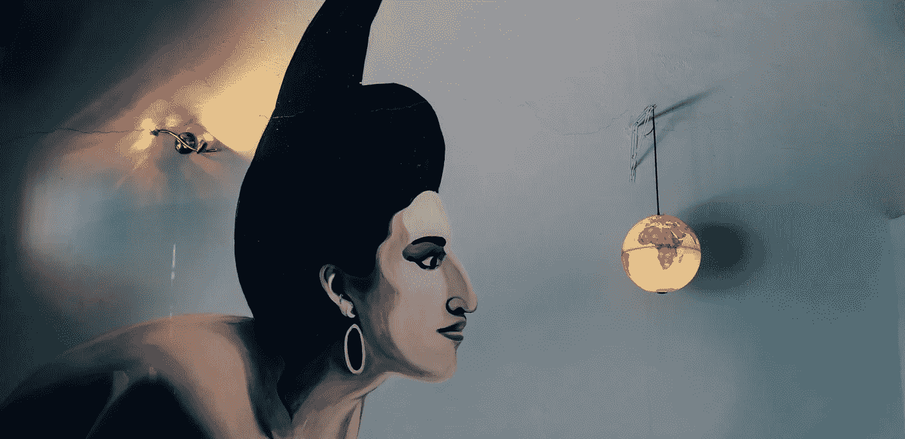
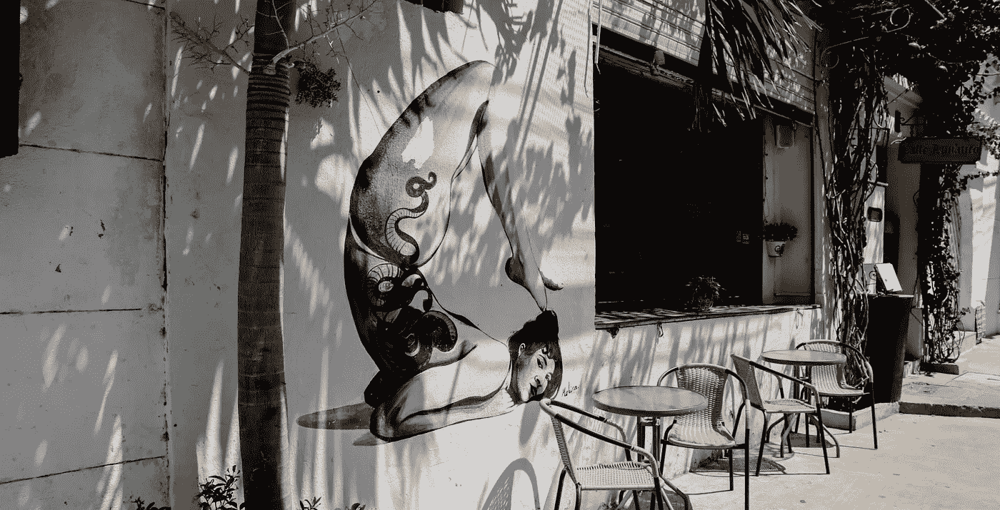

# 你人生的挑战将是坚持自己

> 原文：<https://medium.com/swlh/the-challenge-of-your-life-will-be-to-hold-on-to-yourself-2896746f8c6e>

## 我花了一生去寻找自我。也许问题是我一直在失去我找到的东西。

## 我是来给你做准备的。你生活中的挑战不是发现你自己，而是坚持你自己。

你会多次发现自己——在一本书或一首歌的歌词里，在一张照片里，在水面的倒影里，在你爱人微笑的角落里，在你自己的寂静里，在你的呼吸里。你会在异国他乡找到你自己的一部分，用你的舌头无法掌握的语言和味道。

***相信我，你会的。***

但是你能抓住这些碎片吗？你能把它们组合成一幅在黑暗中也能看清的画吗？你能撑得住吗？或者，你会一次抓住一个碎片吗？

## 你人生的挑战将是坚持自己。

不是你过去的样子。不是你能成为的每个版本。但最真实，最原始，最脆弱的你。让你的爱超越恐惧的版本。

会非常非常艰难。因为有那么多版本的你，你可以是。就像帽子一样，你会把它们都戴上，而且你会戴几顶太久。这个世界充满了规则和制度来压制你，带走你的一部分。但最终，需要被抓住的你会哭着走出来，乞求在你的怀里有一个位置。

## 你必须抓住这个你，因为它抓住了你的全部。

你们所有人，你们的潜力，你们最大的成功机会。这就是为什么坚持自己如此可怕。如果你坚持自己却失败了呢？你做自己失败过吗？你辜负了你的命运吗？

**把你最好的灵魂奉献给这个世界，并希望这个世界接受它，还有什么比这更脆弱的呢？**一个都没有，真的。你可能会伤痕累累。但是你必须这么做。你的灵魂、血液、皮肤和骨骼将会一直战斗到你离开。

而且，在一天结束的时候，没有什么比你自己更有价值了。没有比这更好的礼物了，你可以给自己和这个世界。

***(还有，剧透提醒:做自己不能失败)***

## 我认为生活不仅仅是寻找或创造自己。

我认为这是两者之间微妙的空间。在这个空间里，你可以找到你可能已经埋葬或丢失的自我，给它成长所需的空间和爱。如果你能生活在这个空间里，你将会享受到那种永远是你自己梦想的生活所带来的快乐。但是，你必须坚持住自己，放下你的恐惧。

# 这是我希望几年前读过的信。

你看，我一次又一次地在这些话中找到了自己。当我闭上眼睛，它们就在我脑海中闪过。给你。

在这里，[我找到了自己](/ladies-storm-hackathons/not-all-who-are-lost-wander-540e994d1199)而你在其中支持了我。
在这里，我[分享我自己](/swlh/we-should-all-be-weird-as-fuck-c751cf31d765)的“怪异”部分，你也和我一起变得怪异。你抓住了我和我的话，并给了我你的心作为回报。

但是，说实话，我的手臂充满了恐惧，无法抓住你们无畏地给我的心。我只剩下重量，我躲在它下面。在放开你们的心时，我不再坚持自己。

今年，我迷失了。漂浮在不同版本的自己之间。用眼角瞥见自己，但从不坚持。在过去的几个月里，我坐下来面对保持自我的挑战。而你，在不知情的情况下，帮助了我。我回到这里，读了我自己的话，读了你的回复，并在敞开心扉中找到了平静。我相信我可以靠分享这些话语谋生，而且还有人，美丽的人——就像你一样，会倾听并和我一起庆祝这些话语。

## 当我向 2019 年问好时，我的决心是坚持住自己。

通过让这些词语流动。我将在四月份自助出版一本书。我也会分享和腾出空间来抓住你们无畏的心。

# 👏👏👏如果这些话引起了你的共鸣

# ❤如果你想和我在一起:

❤ [在 Instagram 上关注我的旅程和我的书的预览](https://www.instagram.com/reneepadgham/)
❤与你认为值得保留的人分享这篇文章。

## 这篇文章发表在 [The Startup](https://medium.com/swlh) 上，这是 Medium 最大的创业刊物，拥有+405，714 名读者。

## 在此订阅接收[我们的头条新闻](http://growthsupply.com/the-startup-newsletter/)。

