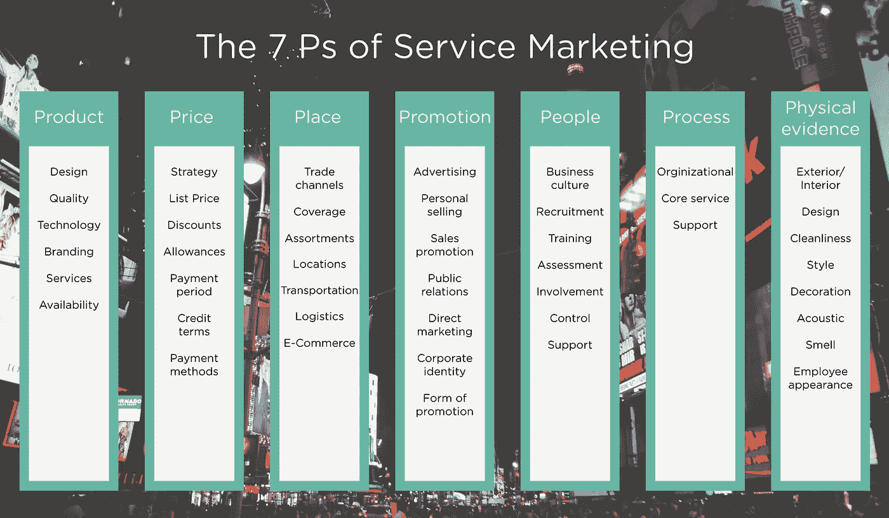
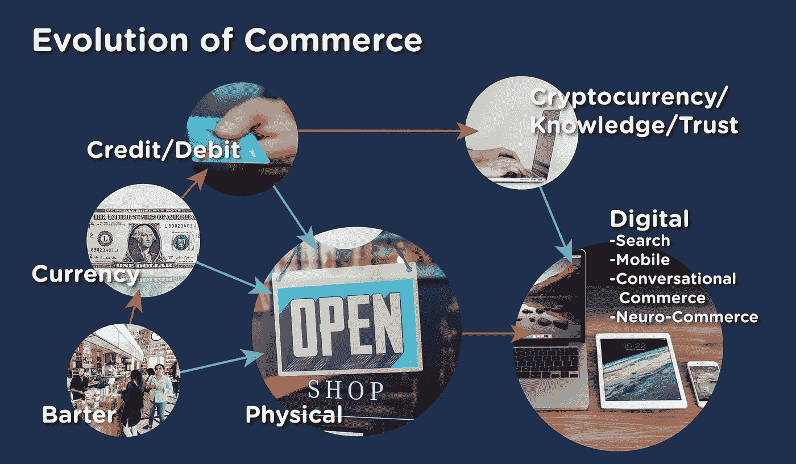

# 4 Ps 的灰姑娘

> 原文：<https://medium.com/swlh/the-cinderella-of-the-4-ps-905b2a364651>

曾几何时，菲尔·科特勒成为了“现代营销之父”。当彼得·德鲁克(Peter Drucker)如此敏锐地断言，“因为商业的目的是创造客户，所以商业企业有两个——而且只有两个——基本功能:营销和创新”时，他将自己在该学科谱系中的位置标记为现代营销之父。也许你知道；但是你知道吗，尼尔·波顿是“营销组合”这个术语的创始人，这个术语在 1953 年实际上由 12 个元素组成。接着理查德·克莱维特出生于 1964 年，是 4Ps 的合法父亲。但是等等！你知道 4p 几乎就是 3p 吗？克莱维特师从杰罗姆·麦卡锡，他称框架的四个要素为产品、价格、促销和分销；但是是 Clewett 把“分配”变成了“位置”,瞧，我们得到了 4p！即使在他们的晚年，有人可能会说 4p 仍然是营销组合框架的不可辩驳的原则。它在近 20 年没有修改的情况下，很好地服务于一个喧嚣的营销时代；并且仍然是所有营销中最常用的参考框架。在一个服务驱动的世界里，当然还有其他有效和聪明的工作来发展 4p；下面举一个例子。

在这个结构中，4p 家族已经发展到 7p，在服务营销框架中增加了“人”、“过程”和“实物证据”。

Booms 和 Bitner，1981 年(AMA 会议记录)

但是 4P 仍然是销售林中的红杉。其中，有一个“P”是大多数营销人员必须承认的继子“P”，“Place”，它是*分销*的代理。其他 Ps 享受了邪恶的分步营销的善良，爱和关注，而发行往往辛苦地清理他们之后，作为事后的想法。

> 午夜的钟声来了又去，分配的力量还在

我们文化的数字化，包括现代公司，创造了一个基于网络的世界，一个永远在线的实时商务世界。数字化是一位英俊的王子，他将邪恶的分步营销者扔到一边，穿上了现在是 4Ps…分销的灰姑娘的水晶鞋。分销一直是营销组合中最不受重视的元素，但那些关注智能分销策略所能产生的比较优势的人是赢家。他们掌握了上游供应链管理和下游客户联系，即消费者想知道什么，他们想做什么，他们想去哪里，他们想买什么。这些营销人员知道，你可以通过掌握渠道管理、产品组合管理、物流和无摩擦的电子商务战略来取得胜利，从而产生比有效的广告宣传更持久的竞争优势。是的，供应链跨越了所有的 4p，但是供应链中与分销相关的方面包括公司组装产品或销售产品的地方；并且通常取决于距供应源的距离，因为缩短距离将降低成本并使价格更具竞争力。此外，在当今的全渠道世界中，优化供应链还必须与客户位置的“地点”考虑合作完成。

座机电话是这个故事中隐喻的南瓜，已经转化为客户精致的金色马车；手机。现在，75%的内容通过移动设备流出，但真正打开的闸门是访问、即时性、接近性，我认为这比个性化更重要… *contex* t。现在，消费者可以通过自动驾驶的 18 轮车在几天内、通过无人机在几小时内、通过 3D 打印在几分钟内、或在他们的位置即时现场感受、搜索、查找、比较、选择、支付他们自己的童话般的突发奇想。除此之外，物联网和“智能*一切*，旧的线性分配概念已经被打破。互联设备和最新的支持移动的技术提出了一个概念，即移动可能是所有四个“p”的连接点国际数据公司(IDC)题为[的半年度全球物联网支出指南](https://www.idc.com/getdoc.jsp?containerId=IDC_P29475)的预测显示，2017 年全球物联网支出将同比增长 16.7%，达到 8000 多亿美元。到 2021 年，全球物联网支出总额将接近 1.4 万亿美元。这个互联世界中的数字工具包括信标、AI、“点击连接”、位置服务，如近场通信(NFC)、移动应用、射频识别(RFID)、360°视频、虚拟现实，甚至虚拟展厅，所有这些都是依赖于分发或分发协同效应的！

> 那些关注智能分销策略所能产生的比较优势的人是赢家

最后，消费者行为和分销的交集是购物者营销出现的基础。所有这些创新都与分销有着千丝万缕的联系，你能说这个几乎从未出现过的“P”现在是最重要的“P”吗？如果在一个虚构的市场营销组合卡梅洛特的游戏世界中，Ps 之间爆发了一场剑战，我会立即伸手去拿“Place”剑。预备！

还有比这更疯狂的吗？好吧，一个“P”，即*价格、*可能会被完全征服，如果和/或当横向商业、点对点交易和加密货币的世界抹杀了我们当前对金钱的理解，转而支持信任。你说童话？那是另一个博客。

午夜的钟声来了又去，分配的力量还在。如果营销人员更密切地关注这个“P ”,他们可能不会在今天的企业中失去对它的许多功能的管理控制。邪恶的后市场营销者很快就要消失了，他们坚持他们关于这个“P”的陈旧观点，支持一个和平的王国，在那里所有的 4p 都被平等对待；愿我们永远幸福地生活在一起。好吧，也许不是那么“价格”

## 这个故事发表在 [The Startup](https://medium.com/swlh) 上，这是 Medium 最大的创业刊物，有 290，182+人关注。

## 订阅接收[我们的头条](http://growthsupply.com/the-startup-newsletter/)。

