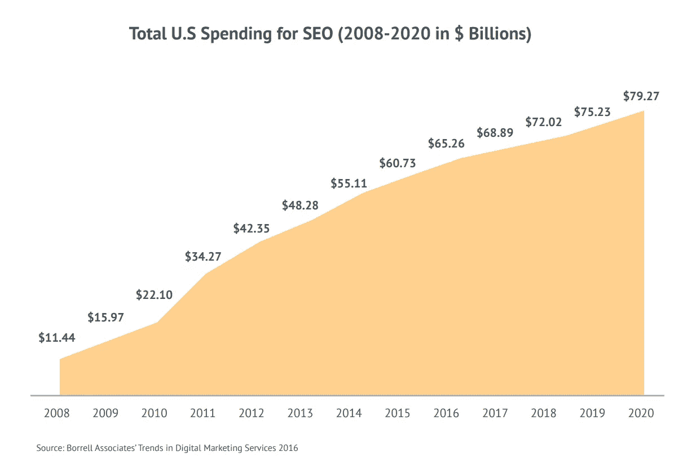

# 搜索引擎优化技术买家指南:2018 版

> 原文：<https://medium.com/swlh/the-clickz-buyers-guide-to-seo-technologies-2018-edition-410d87982e03>

## 帮助您选择合适的技术合作伙伴。

在过去的五年里，SEO 已经发展成为一种全新的事物，但是仍然保留了其公认的核心，即技术和创造技能的结合。

它的回报不容易获得，但它们是为那些愿意并有能力投资资源的人准备的。

因此，到 2020 年，品牌预计每年在有机搜索服务和技术上花费 792.7 亿美元也就不足为奇了。

**您可以通过下面的幻灯片查看对其中 6 项市场领先技术的深入评论:**

## 这个故事发表在[的创业](https://medium.com/swlh)上，这是 Medium 最大的创业刊物，有 333，253+人关注。

## 订阅接收[我们的头条新闻](http://growthsupply.com/the-startup-newsletter/)。

