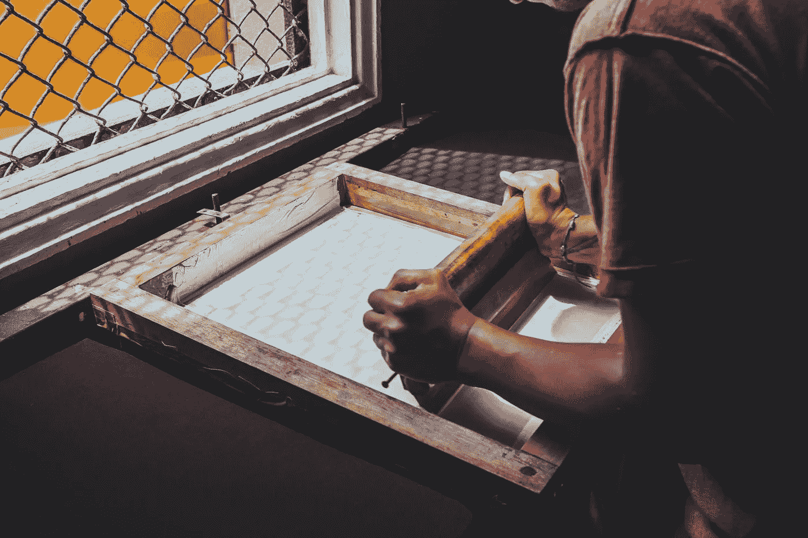

# 我们在现实生活中最接近超能力的东西

> 原文：<https://medium.com/swlh/the-closest-thing-we-have-to-a-real-life-superpower-97260da93cc7>

Originally published on [**JOTFORM.COM**](http://jotform.com)

> "在任何人类努力中，成功的秘诀是全神贯注."—库尔特·冯内古特

我们不能从眼睛里射出激光。

我们不可能跑得比光速还快。

我们不能变成巨大的绿色版本的自己，打碎我们不喜欢的东西。