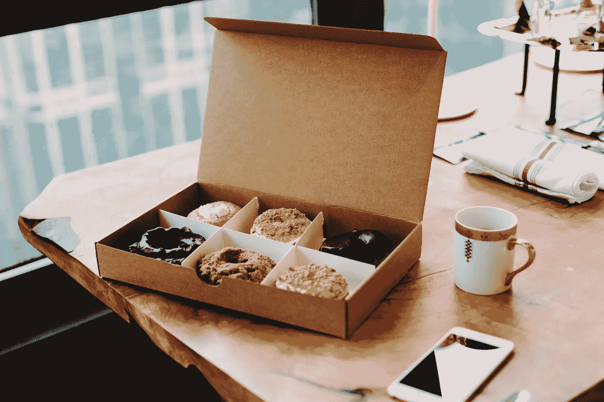
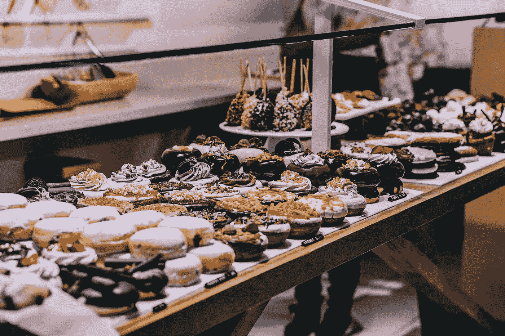

# 咖啡+甜甜圈法

> 原文：<https://medium.com/swlh/the-coffee-donuts-method-4237486ed467>

## 什么配对可以教你你的小企业战略。

Photo by [Zach Miles](https://unsplash.com/photos/BE9AifuJfD4?utm_source=unsplash&utm_medium=referral&utm_content=creditCopyText) on [Unsplash](https://unsplash.com/?utm_source=unsplash&utm_medium=referral&utm_content=creditCopyText)

这周我了解到 Dunkin' Donuts 卖的咖啡比它卖的甜甜圈多。我并不感到震惊——我每天都喝咖啡，但是油炸圈饼呢？也许一个月最多几次。甜甜圈很诱人，咖啡是一种生活方式。这个数据让我思考……有多少其他企业处于类似的情况？

比如[麦当劳其实是房地产商](https://qz.com/965779/mcdonalds-isnt-really-a-fast-food-chain-its-a-brilliant-30-billion-real-estate-company/)？

[AWS 和硬件会铺平亚马逊的盈利之路](https://qz.com/965779/mcdonalds-isnt-really-a-fast-food-chain-its-a-brilliant-30-billion-real-estate-company/)？

> "做一个开门者。"——拉尔夫·瓦尔多·爱默生

Photo by [Samuel Zeller](https://unsplash.com/photos/nSrY5fJ4B60?utm_source=unsplash&utm_medium=referral&utm_content=creditCopyText) on [Unsplash](https://unsplash.com/?utm_source=unsplash&utm_medium=referral&utm_content=creditCopyText)

## 油炸圈饼、汉堡包和快速运输是容易通过的“门”。一旦你找到了理想的客户，你会把他们的体验和什么联系起来？

大品牌无时无刻不在考虑“配对”。但是小企业和个体企业家呢？没有那么多。进入咖啡+甜甜圈法。

# 咖啡+甜甜圈方法是一种战略性的商业决策，在这种方法中，你将一种完全不同的产品与你的核心产品搭配起来，以便 a)使你的品牌与众不同，b)加深消费者对你的品牌的体验，以及 c)让客户不断回来。

为了利用这种方法，你的企业必须具备三样东西:

1.  一扇“门”
2.  你出名的事情
3.  配对

例如:

# 星巴克

**门:**咖啡

**以:**便捷+优质著称

**配对:**手机 app

# CorePower 瑜伽

**门:**瑜伽

**以:**独特而一致的观点而闻名

**结对:**教师培训

# 红牛

**门:**能量饮料

**因**奇遇而闻名

**配对:**红牛电视

Photo by [Igor Ovsyannykov](https://unsplash.com/photos/MkFTAO4lROs?utm_source=unsplash&utm_medium=referral&utm_content=creditCopyText) on [Unsplash](https://unsplash.com/?utm_source=unsplash&utm_medium=referral&utm_content=creditCopyText)

## 如何将咖啡+甜甜圈的方法应用到你的小企业中？

当我不在工作时，我的朋友和有小生意的家人不可避免地向我寻求在线营销建议。有时候营销是他们的问题，但大多数时候他们定位自己的方式才是问题所在。

让我们玩出一个简单的例子。假设你卖全天然美容产品。

如果我们是朋友，最终你会在酒后承认你对网上营销感到沮丧。你发誓这些产品是惊人的。你最近一直在发布关于销售的帖子，但没有人喜欢你的帖子，更不用说购买了。

我会听着，然后喝一大口我的酒，告诉你你实际上不是在做美容产品的生意。

这是因为你的客户寻求的不是产品。他们正在寻求一种 T2 的生活方式。他们希望生活中减少毒性。他们想要一个更快的早晨惯例。他们相信有意识的生活，但不知道从哪里开始。他们想站出来反对那些危害我们和我们孩子健康的不受管制的化学物质。他们想要更自信的一天，更少的决策疲劳和更多的自我照顾。他们想变得更像金·K，让他们自己的美容专家提供个性化的建议。他们想要一个能帮助他们掌握更好的应用技术的老师。他们想克服不安全感。他们希望他们的朋友和伴侣说“哇，你看起来棒极了！”他们想属于一个信仰相同的部落。

当你这样看待自然美容产品行业时，你会意识到你所提供的*实际上是一种**服务**而不是一种产品。你是教练也是专家。*

这种定位的转变会是什么样的呢？嗯，你会花更多的时间提供个人美容服务，而不是产品和折扣。比如化妆课，彩妆收藏评价，化妆应用服务。你可以提供在线课程，发布免费美容咨询广告，举办为期 7 天的挑战，在博客和活动中担任常驻美容专家...这样的例子不胜枚举。

在你每天累死累活地“做甜甜圈”之前，一定要找到让你的品牌与众不同的完美搭配，加深顾客的体验，让顾客再次光顾。

***你是一个以服务为基础的企业家吗？今年，你想对你的网络营销项目进行彻底的改造吗？如果有，加入我的*** [***营销康复***](https://www.facebook.com/groups/MarketingRehab/) ***脸书集团。没有销售废话，产品或教练购买，只是社区和建议。***

## 这个故事发表在 [The Startup](https://medium.com/swlh) 上，这是 Medium 最大的企业家出版物，拥有 276，798+人。

## 在这里订阅接收[我们的头条新闻](http://growthsupply.com/the-startup-newsletter/)。

