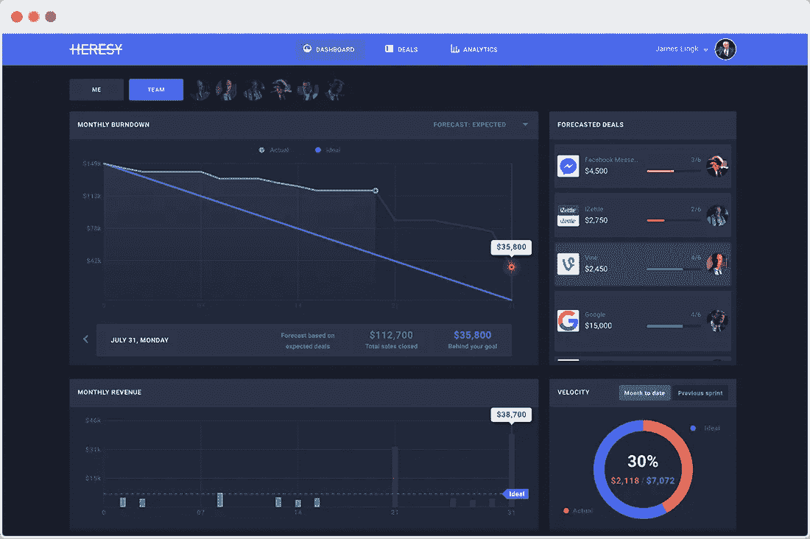
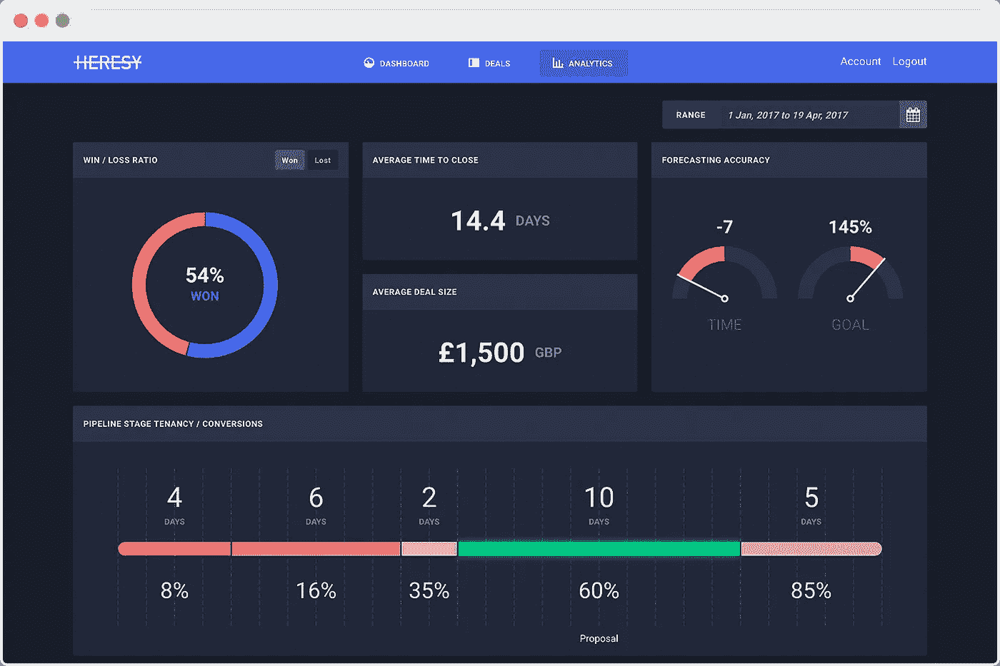

# 电话不通了

> 原文：<https://medium.com/swlh/the-cold-call-is-dead-81e2987e51a1>

Photo Credit: Photo by [Wendy Scofield](https://unsplash.com/photos/fnlNwb5sB5Y?utm_source=unsplash&utm_medium=referral&utm_content=creditCopyText) on [Unsplash](https://unsplash.com/search/photos/telephone?utm_source=unsplash&utm_medium=referral&utm_content=creditCopyText)

> “你为什么不多打电话？!"

在全国各地的售楼处都可以听到这样的喊声。你为什么不给更多的人打电话？你为什么不给更多的人发邮件？你为什么不安排更多的会议？

对于一些销售领导来说，每个销售问题的答案都是“更多”对于一些销售领导来说，这也是事情进展顺利时的答案。*“如果你给我们打电话的人数增加一倍，我们的收入就会增加一倍。”*

但是更多并不等于更好。更多的活动却没有更多的收入，这与你的销售团队所需要的正好相反。重要的是成交，而不是达到活动配额。没有凯迪拉克 Eldorado 或一套牛排刀给打电话最多的人。

目标是更多的收入。结果比让你达到目的的活动更重要。然而，几乎每个销售分析平台都会让你产生不同的想法。

# 跟踪呼叫量是一个弱指标

你有两个销售人员。代表 A 每天给 20 个人打电话。代表 B 每天给 50 个人打电话。哪个是比较好的销售人员？

你不可能回答那个问题。你没有正确的数据。尤其是，您缺少:

*   **背景** —销售代表是新来的吗？他们在这些电话上花了多少时间？他们通过这些电话联系到人了吗？他们接触到的人的素质如何？
*   结果——这些电话会导致会面吗？这些电话会带来交易吗？到目前为止，每个销售代表本月的产量是多少？

指标本身是没有意义的。活动度量本身是危险的，原因有二。首先，**被衡量的得到管理**。

在《测量的电气单位》第一卷中，物理学家和工程师威廉·汤普森，更为人所知的开尔文勋爵，[写道:](http://blog.patientslikeme.com/2010/11/23/%E2%80%9Cto-measure-is-to-know%E2%80%9D/)

> 当你能衡量你所说的东西，并用数字表达出来时，你就对它有所了解

他认为这是一件好事。当你衡量某样东西时，你开始理解它，通过这种理解，你可以开始影响它。

多年来，这已经被扭曲成一个更精炼的说法，即什么被衡量，什么被管理。如果你衡量活动，那就是将被管理的。如果您跟踪通话量，这将开始对您的销售代表产生影响。这导致了第二个问题:**活动指标很容易被利用**。为了达到拨号配额，我可以打电话给不合格的销售线索(我们选择的是陌生电话，但这对于任何活动指标都是一样的)。我可以给那些已经告诉我他们还没有准备好的潜在客户回电。我甚至可以一遍又一遍地给同一个人打电话，或者打随机号码，这取决于销售组织管理得有多好。

如果根据销售代表的活动来衡量他们，那么活动对他们来说才是最重要的。他们想做得更好，你告诉他们拿起电话打给别人就是“做得更好”。但是更多的活动不是你想从你的团队得到的。

# 无活动分析

销售活动度量类似于工程团队跟踪开发人员编写的代码行，然后将其作为有效的产出度量。没有人会在意一个开发人员每天写 2000 行代码，任何负责计算代码行数的工程主管很快就会叛变。

相反，开发团队根据最终目标来衡量他们的产出。最大的目标可能是发布一个新功能。该目标中较小的成就是完成构成该特性的组件——UX 框架、API 和设计资产。

[销售团队](https://blog.heresy.io/team-of-teams-what-an-agile-sales-team-looks-like/)也应该如此。每个销售团队都有一个最终目标:完成月末目标。最终的产出是所有较小成就的总和——每个[团队成员](https://blog.heresy.io/anatomy-of-an-agile-sales-team-the-three-must-have-roles/)在整个月内完成交易。

如果你衡量产出，那就是将被管理的东西。这是每个销售代表都有的异端仪表板:

这是每个经理都会得到的异端分析:

两者都缺少一样东西？活动。我们不会跟踪拨打的电话、发送的电子邮件或安排的会议。跟踪人们在做什么不会帮助你知道人们在做什么。我们正在追踪这项活动的结果:收入。

这对销售人员和销售经理来说都是最重要的。将活动指标添加到他们的仪表板只会使他们的视图混乱，并增加他们的[销售认知负荷](https://blog.heresy.io/why-heresy-is-designed-like-the-space-shuttle/)。

仪表板上有其他指标，但没有活动指标。它们都是活动的结果:

*   交易规模—销售代表是否在追逐足够大的潜在客户以达到他们的目标？
*   成功/失败比率—销售代表是否赢得了足够多的交易？
*   完成交易的平均时间—销售代表在渠道中移动项目的速度够快吗？
*   促成交易—销售代表目前正在处理哪些交易？
*   销售速度—达成交易的总体速度是否足以达到月末目标？

任何查看该控制面板的代表(或经理)都知道两件事:

*   **他们的发挥状态。他们知道自己在这个月处于什么位置，是完成足够大的交易，还是需要加快速度来实现目标。**
*   **要紧的事。**他们知道自己被赋予了一项任务，那就是在月底之前将燃尽图归零。重要的是收入，而不是他们打了多少电话。

接下来是他们如何到达那里。

让燃尽图在月底归零需要大量的工作。一个销售代表必须发送电子邮件，必须准备演示，是的，可能还得给几个人打电话。如果他们错过了配额，他们如何在不关注活动的情况下提高？

他们确实关注活动，**只是不在度量的背景下**。每周在他们的[销售展示会](https://blog.heresy.io/the-meaningful-sales-standup/)期间，或者每天在他们工作的自然过程中，他们都会与其他代表、领导和经理讨论如何做得更好。如果他们在准备演示时遇到困难，他们会与经理讨论如何更好地解释价值主张。如果有人不接电话，他们会与同事讨论如何更好地确认销售线索。

几乎在所有情况下，活动的问题不在于数量，而在于质量。大多数情况下，数字越小越好。一个开发人员写五行代码去做另一个开发人员花 100 行代码去做的事情会做得更好。它们效率更高，产生的代码质量也更高。正因为如此，他们可以完成更多的目标。

Close.io 的首席执行官兼联合创始人 Steli Efti 在他的 SaaSFest 2017 演讲中，阐述了他的 [AQC 框架](https://www.profitwell.com/blog/steli-efti-sales-funnels-efficiency):活动、质量、转化。我们可以转换一下，进行转化→质量→活动:

*   你完成了多少交易？
*   如果太少，你做的工作质量如何？
*   如果高，那么是时候增加活动量了。

这可以用一个简单的销售漏斗来描述。假设销售代表每打 100 个电话就能达成 5 笔交易:100 个电话→ 20 次对话→ 10 次演示→ 5 笔交易。

他们需要做些什么来使成交率翻倍？理论上，他们可以将通话次数增加一倍。这就是一个基于活动度量的系统将会推动你实现的目标。但这只是隐藏了问题。要达成 10 笔交易，你必须打 200 个电话，而且成交率仍为 5%。

更好的答案是沿着漏斗向上走:

*   他们如何才能结束更多的演示？他们可以改进演示技巧，完善对异议的回答。
*   他们如何让更多的对话出现在演示中？他们可以改进他们最初的销售技巧和推销。
*   他们怎样才能得到更多的电话交谈？他们可以改进他们的资格认证过程。

每一个都是关于做更好的工作，而不是更多的工作。另一个额外的好处是，随着时间的推移，他们正在成为一名更好的销售人员，所以这些都变得更容易，在未来花费的时间更少。如果他们能够将这些步骤中的每一步提高两倍，他们不仅会将成交率提高一倍，还会提高四倍。

通过从结果而不是活动的角度来看待这个世界，它让你把这些活动看作是达到目的的一种手段。

# 被测量的被管理

数据驱动是好的。但是当数据成为焦点的时候，它已经把你逼得太远了。这就是销售活动指标所发生的情况。他们已经成为销售团队努力的目标。更多的电话，更多的邮件，更多的会议。

但这是浪费你的钱和他们的时间。通过首先关注分析的结果，你可以展示收入的重要性。结案很重要。这可以让你的[销售团队](https://blog.heresy.io/team-of-teams-what-an-agile-sales-team-looks-like/)深入探究如何实现这一目标。这使得[销售团队能够掌控自己的命运，同时还能洞察重要的数字。](https://blog.heresy.io/taking-back-control-of-sales/)

========================================

为了帮助你的销售团队夺回控制权，请访问[异端网站](https://heresy.io/)，注册你的(免费)账户。

*原载于 2018 年 4 月 10 日* [*blog .异端. io*](https://blog.heresy.io/the-cold-call-is-dead/) *。*

## 这个故事发表在 [The Startup](https://medium.com/swlh) 上，这是 Medium 最大的企业家出版物，拥有 314，785+人。

## 在这里订阅接收[我们的头条新闻](http://growthsupply.com/the-startup-newsletter/)。

