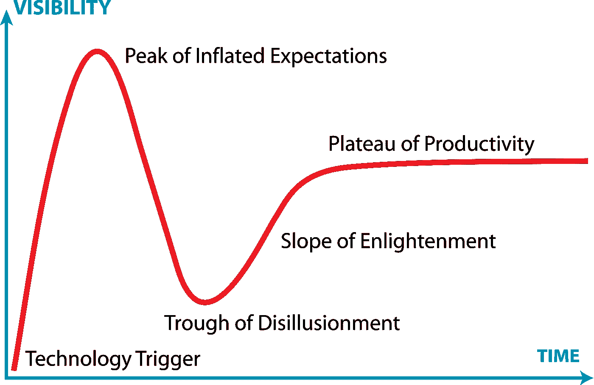
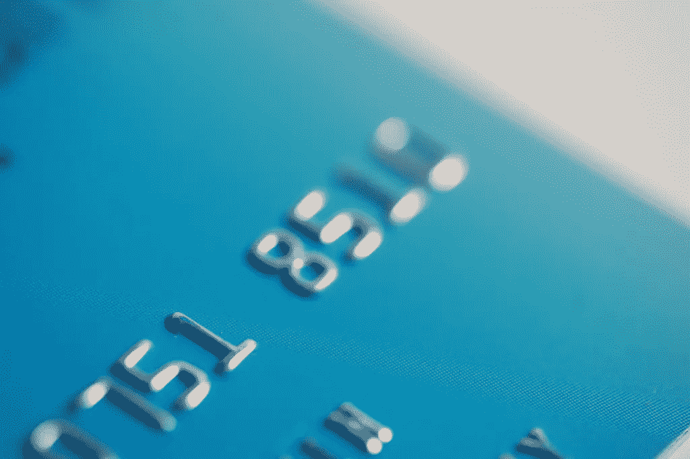
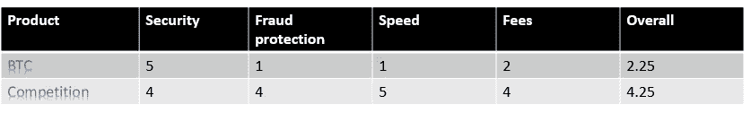
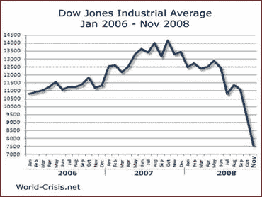
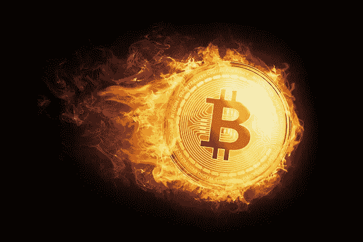

# 比特币即将崩盘是不可避免的

> 原文：<https://medium.com/swlh/the-coming-crash-of-bitcoin-is-inevitable-c8f55388fdbf>

Are you BTC bull or a bear ?

所以在你 BTC 提倡跳跃之前，让我先说一句听起来可能矛盾的话(但实际上不是)，区块链可能是过去 100 年中最重要的技术。

我们似乎正处于一个巨大的比特币/加密货币/区块链狂热中，有些人可能会说是有史以来最大的狂热，我一直在我周围听到比特币(从未想到它会走得那么远，那么快)，我看到越来越多的人在这个问题上挣扎:它是真的吗？所以我决定写这篇文章，并不是说任何人都可以预测躁狂症的方向和数量，但至少能够就似乎非常模糊的技术展开讨论。

我第一次了解比特币是在彼得·希夫(Peter Schiff)的展览上，BTC 价值是 10c。如果我没记错的话，我去看了白皮书，对这个概念非常着迷，于是我参与了开源的 BTC 钱包，并发布了第一个以色列 BTC 钱包，回到了在手机上存储整个区块链有意义的日子。我还编写了一个 BTC 调试器来深入学习底层技术，我(过去)的巅峰技术路径是当我试图(不成功地)在英特尔内部推动 ComputeCoin 时，这是一种实际上使用加密货币所需的计算来生成硬币的硬币。就个人而言，我非常熟悉法定货币概念、通胀操纵、债务问题、货币战争和未来增长影响。我陈述这些事情是因为我不希望你把讨论带进技术问题或愿景，我对这两者都非常熟悉，这些与本文的其余部分无关，我们在这里讨论的是商业，区块链的商业。

那么，为什么 BTC 会崩溃呢？它始于一般技术的本质，技术炒作，然后崩溃，直到我们(作为社会)学会如何产生和捕捉它提供的价值，最著名的例子是网络泡沫，网络泡沫中的大多数概念实际上是伟大的商业案例，没有人会认为互联网改变了世界，它只花了 20 年，而泡沫膨胀了 5 年。Gartner 的著名炒作周期正是关于这一点:

期望值很难衡量，因此很难说我们在图表上处于什么位置，但有一点我很确定，BTC 的幻灭将会到来。从这一点来看，任何事情都是对原因和时间的胡乱猜测，不要用它来决定是进去还是出来，如果这是你想要的，你还不如抛硬币来决定。

这些天来，我花了相当多的时间思考成本、价值和定价，这些问题是任何初创公司或新企业的一部分，也是决定你是否有一个坚实的商业模式的核心，所以我喜欢对我周围的许多事情这样做，并试图将结果反映在我的公司上。那么比特币的价值是多少呢？

如果你想衡量价值，有两个主要的常见途径，自上而下或自下而上。自下而上:你的成本和期望利润是多少？自上而下:客户愿意支付什么，是否给你留下了适当的利润，最终两者应该满足，他们不能矛盾。

那么什么是比特币价值，我们能回答什么是比特币成本并从那里得到它吗？

BTC 的支柱之一是，它是一个安全的价值储存手段，政府不能将其贬值(不正确)，它是一种数字黄金(也具有误导性)。但摆在桌面上的最大问题仍然是，BTC 的价值是什么？我 5 岁的儿子正在玩绘画商店(值得另一个帖子，我从他那里学到了很多)，试图出售他的画，就像他的父亲一样，他在这个问题上挣扎:“价格是多少？”我一贯的回答是“有人愿意付你多少钱”，很难估计价值，但价格的另一面就容易多了，生产成本是多少？这是每个技术开发人员每天都在努力解决的问题，我们(有点)知道如何计算我们的成本，但是我们收取多少费用呢？完全不同的球赛，我们需要收费，我们可以(竞争进入这里)希望获得良好的(优秀的)利润。那么比特币的价值是多少呢？我们能从成本+利润上推动它吗？

比特币的成本很容易计算，产生比特币的费用大约是电力，直接和间接的(计算和冷却)，在任何给定的时刻，比特币都有明确的生产成本，这种成本来自于赢得 BTC 或赢得一个街区所需的计算量。但有一个技巧，随着时间的推移，成本在变化，通常当 BTC 值上升时，更多的矿工加入，网络调整。换句话说，生成比特币的成本随着其价格而上升，这是一种非常奇怪的现象，不是吗？

现在，让我们试着把它从上到下。市场愿意出多少钱？这听起来像是我们刚刚到达起点，因为市场愿意支付我们无法验证的金额。不完全是，在这一点上我们需要问一下产品和竞争，比特币提供的产品是什么？

One of the most famous manias. Brueghel the Younger, Satire on Tulip Mania

不像黄金有内在价值(你可以用它制作珠宝、电子产品和其他东西)，比特币没有，我曾经听到有人说比特币里面有一个美丽的数字，虽然我同意 SHA 的说法，里面有一堆零很酷，我个人认为馅饼更漂亮，你可以免费得到它，所以在它里面有美丽的数字在我看来不是一个强有力的价值主张，绝对不是一个证明我们看到的狂热的理由。那么产品是什么呢？在我看来，持有比特币的人有权在比特币网络上与其他人进行交易，就像是在购买通信网络的带宽。这种“带宽”的价值是什么，这取决于你使用/需要网络做什么，任何需要对政府隐藏交易的人都可以很快看到这种价值，但大多数 BTC 买家这些天并不因为这些原因而进入。比特币提供了进行金融交易的能力，对于我们大多数人来说，它可以很快成为贝宝、维萨或万事达卡。所以我们有了我们的竞争对手和市场，这是我们开始自上而下分析的好时机。

Is the online transaction market is for BTC ?

在你们这些 BTC 爱好者跳下去之前，我选择了 BTC 能拦截的最容易的市场，我非常熟悉区块链供应链管理、智能合同、能源市场承诺和 BTC 能用于的许多其他东西，但此时我们在“销售和营销”办公室，“愿景和战略”在大厅的左边。因此，如果有人认为 BTC 可以在未来一两年内迅速抓住另一个重要市场，我也很乐意参与进来。

那么比特币在交易市场上能提供什么呢？该产品在该市场中的价值主要集中在以下几个方面:

*   交易安全
*   欺诈保护。
*   交易速度。
*   交易价格(费用)

## 安全性

比特币交易是安全的，至少在目前，如果这些人继续玩叉子，它可能会爆炸，但目前比特币唯一的弱点是 [51%攻击](https://bitcoin.stackexchange.com/questions/10936/is-it-a-51-attack-or-a-50-attack)，这种攻击实际上随着网络变大，风险会降低。我肯定有政府在玩隐藏分叉的主意，但是在目前的网络增长和速度下，这将变得更加困难，不会说不可能，但是非常困难。

另一方面，保护你已经拥有的 BTC 硬币是相当困难的，任何持有你钥匙的人都拥有你 BTC。所以你必须非常小心，对你的信用卡更加小心。

## 欺诈保护

如果你的 BTC 被偷了，那就是拜拜的时候了，网络是分散的，没有人负责，即使你能证明有人偷了你的 BTC，你能采取的最好的行动是请他们回来。

另一方面，信用卡提供了大量的欺诈保护，从实时购买分析，在盗窃和保险损失的情况下取消。

## 交易速度

比特币很慢，非常慢。单次确认需要 10 分钟，对于大宗交易，您应该进行 4-6 次确认。所以买一杯咖啡和 BTC 一起喝很难。

与 BTC 的 **7** **相比，我们的常规支付方式几乎是零时间，VISA 每秒可以处理数千个请求(47K 是峰值)[。](https://en.wikipedia.org/wiki/Bitcoin_scalability_problem)**

VISA(不包括其他部分)拥有大约 7000 倍于 BTC 的网络容量，这意味着如果 BTC 想要达到这一使用水平，那么它还有大量的开发工作要做。

## 交易费用

目前 BTC 交易的费用如下(大约每 3 个月翻一番)

*   **下一个区块费用:**在下一个区块(10 分钟)挖掘您的交易的费用。 **$19.98**
*   **三个街区费用:**在三个街区(30 分钟)内完成交易的费用。 **$19.98**
*   **6 个街区费用:**在 6 个街区(1 小时)内完成交易的费用。 **$19.03**

这就是竞赛费[看起来的样子](https://www.valuepenguin.com/what-credit-card-processing-fees-costs):

*   万事达卡 1.55% — 2.6%
*   Visa1.43% — 2.4%
*   发现率 1.56% — 2.3%
*   美国运通 2.5% — 3.5%

以 2%作为市场基准，这使得任何低于 950 美元的 BTC 交易都比竞争对手更昂贵，真正令人失望的是，随着 BTC 价值的上升，这个数字也在上升。

让我们评分并总结:

Feel free to play with the numbers as you see fit, Result is pretty significant.

因此，对于任何小于 1K 美元的交易，竞争对手都会扼杀该产品，按照这个速度，这个数字将保持每 3 个月翻一番。

因此，比特币只适用于大宗交易，在这种情况下，你可以留出时间，并希望获得有吸引力的费用。

信用卡交易的平均规模小于 250 美元

这让 BTC 处境艰难，它只为一小部分市场提供价值。

这一针指出了 BTC 网络的主要问题，它不能快速廉价地处理大量交易，随着硬币价格的上涨，它的市场逐渐缩小。

## 这里没有消息

比特币社区如此努力地与这种痛苦作斗争，以至于它实际上分叉了网络，并不断地辩论解决方案，我希望他们能够在网络变得无用或由于自愿加入即将到来的变化而倒下之前找到一个解决方案。修理它需要多长时间？很难说，但十年对我来说并不算太离谱，这是在那个规模上稳定技术的合理时间。

The birth of Bitcoin

提取和获取区块链价值需要时间，通往这一目标的道路将是政府倒台、金融机构破产和货币崩溃，这不是末日预言，这是 2008 年危机后 BTC 从诞生之初就被设计好的。如此快速地采用 BTC 不仅有技术障碍，还有社会障碍。

## 但是等等…

那么 [swift](https://en.wikipedia.org/wiki/Society_for_Worldwide_Interbank_Financial_Telecommunication) 等大型交易机制呢？这里分两部分回答:

A.这些市场还不够大， [Swift 去年赚了大约 5000 万美元](https://www.swift.com/about-us/financials)，以小市场在这一点上为 BTC 动针。

B.你真的想让所有的银行都同意并立即采用 BTC 吗？

## 但是等等#2…

我们进入以太网，Litcoin，

如果有人认为 BTC 会崩溃，而其他人会保持快乐，我会建议检查加密货币与 BTC 的相关性，羊群在上涨时不是理性的，在下跌时也可能不是理性的。

# 希望

BTC 诞生于 2008 年的危机，它的诞生是为了制衡那些证明他们自己做不到的人，它将会做到这一点。

我相信这一切都是好的，这种变化绝不是小的，但不要指望它会没有痛苦，革命从来都不是。

不管有没有 BTC，区块链都会改变世界，我们只需要耐心。

# 摘要

就目前的地位而言，BTC 没有什么价值，肯定不足以支撑目前的贸易量。它主要是由金字塔效应(而不是金字塔骗局)驱动的，它可能会在短期内上升(我的猜测是不到 12 个月，比你的猜测好不了多少)，我不认为该协议跟上的速度足以证明长期的交易量。

我可以想象一个人们拼命寻找 BTC 来购买商品的世界，我希望我们不会到达那里。

我大胆或愚蠢地估算了一下比特币的现状，并以我在过去几年里告诉许多人的一句话作为结束:

**“当你明白 BTC 价格毫无意义的时候，你就明白了它的力量”。**

## 这篇文章发表在 [The Startup](https://medium.com/swlh) 上，这是 Medium 最大的创业刊物，拥有 275，057+读者。

## 在这里订阅接收[我们的头条新闻](http://growthsupply.com/the-startup-newsletter/)。

