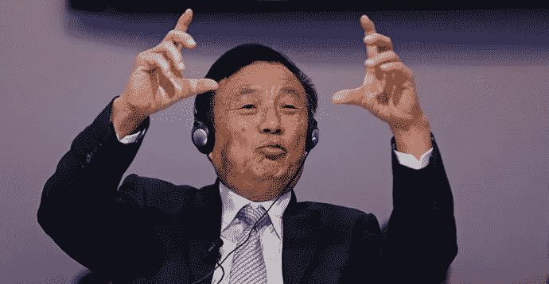
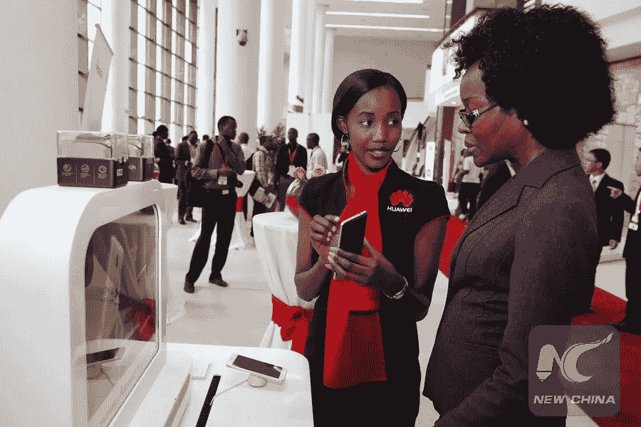
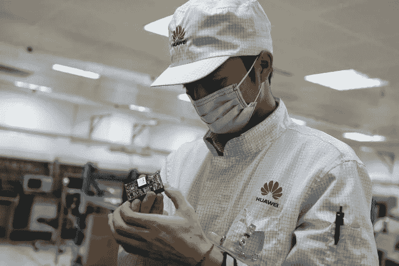
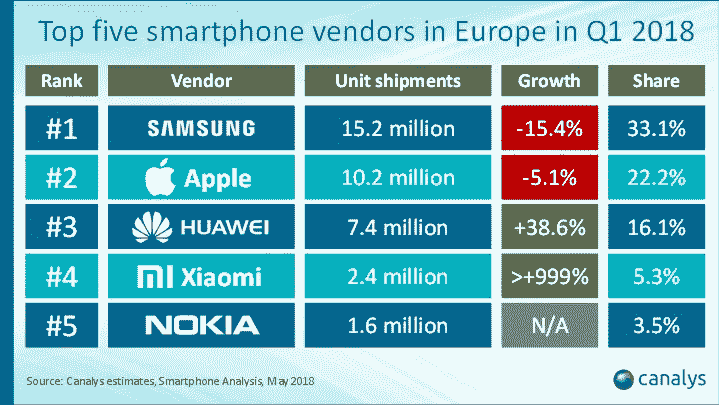
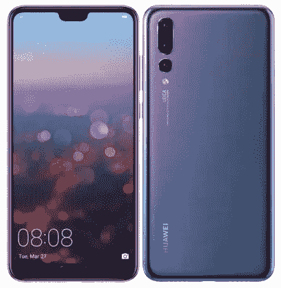
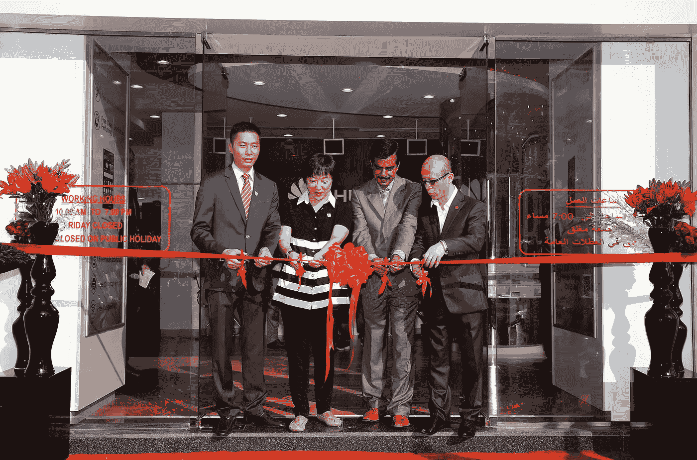
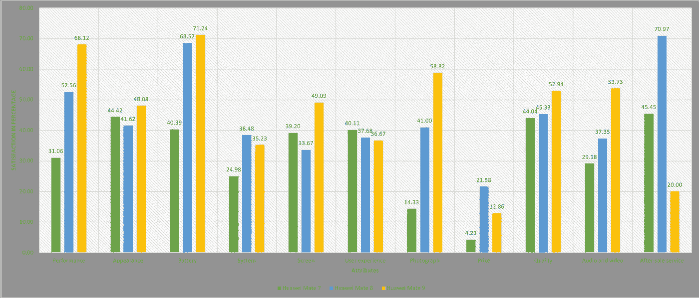

# 苹果害怕的公司:华为

> 原文：<https://medium.com/swlh/the-company-that-apple-is-frightened-by-huawei-e897ec1bc564>

## 华为是如何在无人察觉的情况下超越苹果的？企业能从中学到什么？

Image from Huawei.com

中国电信跨国公司华为已经正式超越苹果，成为仅次于三星的全球第二大智能手机制造商。

实现这一壮举并不容易，因为这是*七年来第一次有一名竞争者设法分裂出前两名。该公司的高级管理层认为，到 2019 年，它可能会成为第一。*

*那么，华为是如何超越苹果的呢？我们可以从这一历史性的壮举中学到什么呢？*

# *卑微的起源*

*让我们从头说起。华为的 genesis 相当谦虚。与许多现代成功故事类似，他的创始人任在其人生的最低谷创立了华为。他曾是一名工程师，被中国人民解放军开除，就在他 41 岁从离婚中恢复时，被一名顾客骗走 200 万 CNY。*

**

*Zen Zhengfei, founder of Hauwei. Image from Yicai Global.*

*你可以想象，在他的生活中没有任何积极的事情发生。通常在我们最黑暗的时候，我们会鼓起勇气去冒险，因为我们已经没有什么可失去的了。正是有了这种精神，任正非下定决心，和几个同事一起创办了一家名为华为的公司。*

*华为并没有开始制造电信设备。当时它的唯一目的是从任何可以出售的东西中赚钱，甚至冒险进入减肥药行业。*

*任的好奇心、商业头脑和良好的运气使他进入了不断增长和繁荣的中国电信市场，这个市场发展异常迅速，但也缺乏以客户为中心的企业。*

***因此，我们必须问自己的问题应该是:***

1.  *是什么给这家让苹果和三星闻风丧胆的公司带来了成功？*
2.  *是什么让这家几年前还默默无闻的公司成为全球电信巨头？*

*华为是如何变得如此繁荣的。*

# *对他的员工的一种特殊的爱*

*没有人，组织什么都不是。在我们生活的这个竞争激烈的世界中，占科技行业 99.9%的知识型公司理解员工带来的价值。*

*创新源于积极、好奇和优秀的员工，他们感觉自己是所在公司的整体。华为在成为硅谷人力资源的主导神学之前就明白这个概念。上世纪 90 年代，华为设计了一个员工持股计划，根据该计划，员工的收入基于三个要素:工资、绩效和股票分红。*

**

*Huawei Staff introducing Huawei products at a Cloud Conference in Tanzania in 2015\. Image from Xinhuanet.*

*通过采用这种薪酬方法， ***华为希望部署一种被称为“知识主义”*** 的原则，这种原则的基础是让和鼓励员工将自己视为受益于公司整体成功的所有者，而不是贡献最小化的可替代员工。*

*通过将华为转变为一家员工所有的公司，使该公司能够招募并留住顶尖人才，远离竞争对手。*

> ***有趣的事实:** Zen 只持有公司 1.4%的股份，而超过 82，000 名员工持有其余股份。*

# *注重学习*

*任深知 R&D 作为华为竞争战略一部分的重要性。为此，他向高层管理者灌输了危机感和紧迫感。这意味着，前几年让华为成功的东西都被自动假定为过时了，因此，创新必须成为一种持续的努力。*

**

*Huawei R&D employee. Image from Romania-Insider.*

*因此，自公司成立之初，该公司就从未失败过在研发上的再投资，至少是收入的 10%。这比苹果公司多 5 %,比三星公司多 2.5%。*

## *R&D:全球事件*

*华为不是在中国国内扩大其 R&D 部门，而是特意走出国门，在全球建立 R&D 实验室。事实上，在 2002—2010 年间，该巨头在美国、瑞典、德国、俄罗斯、瑞典、加拿大和英国开设了 57 家公司所有的创新中心和基于地区专长的联合创新中心。*

*例如，由于欧洲是 3G 技术的发源地，华为在瑞典斯德哥尔摩开设了一个研究所。*

*为了培养和加强其射频识别能力，它在俄罗斯莫斯科开设了另一个以创新为重点的研究所，因为它是这一特定领域的当前领导者。*

*虽然硅谷的专长是云计算、编码和数据通信，但它不仅在那里，还在达拉斯开设了研究所。*

**

*Huawei employees cheering at the new R&D center in Bangalore. Image from India Tech Online.*

*截至 2015 年 8 月底，华为已经建立了 255 个 ICT 联合实验室、研究所和开发中心，进一步拓展云计算领域。通过这样做，它扩大了 R&D 部门，总共雇佣了 30，000 名新员工。在它的 180，000 名员工中，80，000 人从事研发工作，约占其劳动力的 45%。*

*通过将其创新中心扩展到世界各地，华为能够进入成熟的市场，这些市场充满了多元化、有才华、受过良好教育的工程师，他们致力于解决复杂的问题并开发高质量的技术。*

*此外，华为的创新机构之间高度联系，因为它们同步运作，以确保知识共享。*

*毫无疑问，华为是 2017 年全球第六大研发投资者[，超过了苹果。](https://www.lightreading.com/artificial-intelligence-machine-learning/huawei-dwarfs-ericsson-nokia-on-randd-spend-in-2017/d/d-id/741944)*

> ***有趣的事实:**华为一度拥有超过 35，773 项专利，并在 2008 年被公认为全球最杰出的专利申请公司。到 2015 年，华为提交的国际专利申请数量达到了创纪录的 [218 万](https://consumer.huawei.com/en/press/news/2016/hw-u-017502/)。*

# *利用未开发的市场*

*苹果的品牌专注于富人；那些可以匆忙花 1000 美元买一部全新智能手机的人。另一方面，华为对其手机的定价是为了迎合新兴市场日益增长的中产阶级，而苹果未能瞄准和服务这些群体。*

**

*Panelists at Huawei AfricaCom 2017 in South African. Image from Huawei.com*

*事实上，正是华为激进的定价策略确保了其在印度、印度尼西亚、中国、俄罗斯、南非、尼日利亚、印度尼西亚和巴基斯坦等国家不断增长的市场份额。*

*对非必需商品的旺盛需求，加上对网络基础设施不断增长的投资，以及已经建立的品牌认知度，华为发现自己正走在统治世界的正确道路上。*

**

*华为在欧洲也取得了巨大的成功。在过去几年中，该公司通过发起众多高调的足球赞助，将其大部分营销预算转移到欧洲市场。因此，华为在西欧的智能手机零售量份额经历了前所未有的增长。显然，在 2018 年第一季度，[与去年同期相比，华为智能手机的销量增长了 38.6%](https://venturebeat.com/2018/05/09/huawei-smartphone-sales-surge-in-europe-as-apple-and-samsung-stumble/)。*

# *华为的战略合作伙伴关系*

*除了积极的营销努力，华为还与徕卡相机公司(Leica Camera AG)、谷歌(Google)和保时捷设计(Porsche Design)等受人尊敬的全球品牌建立了稳定的合作伙伴关系，以进入苹果目前服务的更高中产阶级市场。迄今为止，这些伙伴关系只产生了积极的结果。*

**

*Huawei Pro Pro Dual Sim. Image from Okay.CZ.*

*华为开发的人工智能驱动的摄影能力与徕卡相机品牌认知度相结合，成为一种成功的战略。毫不奇怪，专注于技术的在线出版物 TechRadar 将华为 P20 评为最佳拍照手机，紧随三星 Galaxy S9 之后。华为 P20 因其三个镜头而被称为三摄像头智能手机。*

# *客户驱动的创新*

*在过去的二十年里，华为经历了一次彻底的转变——它从一家专注于技术的公司转变为一家以客户为导向的组织。以至于有报道称，多年来，任反复告诉他的员工，他们必须“眼睛看着客户，背对着老板”。*

**

*The inauguration of the first flagship customer service center in Dubai. Image from Multivu.com.*

*该公司结构的主要特点是在其三个业务部门内以客户为导向:运营、企业和终端。考虑到这一点，所有业务部门都以跨学科的技术方式为客户服务。这种战略的结果是，华为在全球建立了 22 个地区分支总部，尽可能多地从客户那里获取创新。*

*此外，杭州电子科技大学的一组研究人员发表的一项研究表明，华为在客户的客观评价和创新能力方面的接受能力。*

*他们分析了一个在线评论网站，在该网站上，成千上万的客户评论了连续三代的华为智能手机型号:华为 Mate 7、华为 Mate 8 和华为 Mate 9。*

*他们分析了满意度水平——即正面评价的数量超过对七个产品属性的评价数量:性能、外观、电池、系统、屏幕、用户体验、摄影、价格、质量、音频和视频以及售后服务。*

*最突出的是，华为 Mate 7 上满意度极低的属性，如性能、电池、摄影，在华为 Mate 9 出现时大幅增加。下表证明了这种成功。*

**

*As this graph demonstrates, over the succeeding generations of Huawei Mate 8, the performance, appearance, battery, screen, photograph, quality and audio and video features have improved, suggesting that Huawei is carefully listening to its customers.*

*考虑到阻止华为渗透美国市场计划的协同努力，中国电信巨头笑到了最后。苹果多年来没有遇到对手，除了三星，它仍然是头号手机供应商。尽管如此，今天肯定是不同的一天。智能手机游戏场可不是闹着玩的，苹果有充分的理由感到苦恼，这是理所当然的。*

*简单回顾一下，华为的成功源于以下特征:*

1.  *强大而积极的员工队伍*
2.  *R&D 专注*
3.  *利用未开发的新兴市场*
4.  *与世界领先的产品和服务提供商建立战略合作伙伴关系*
5.  *关注客户的需求和对产品的看法*

*基于在线评论数据挖掘的产品创新——以华为手机为例*

*欧睿国际*

**

## *这个故事发表在[的创业](https://medium.com/swlh)上，这是 Medium 最大的创业刊物，有 356，974+人关注。*

## *订阅接收[我们的头条新闻](http://growthsupply.com/the-startup-newsletter/)。*

**